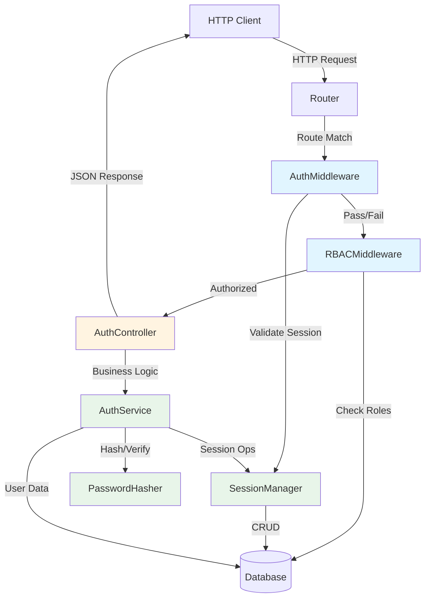
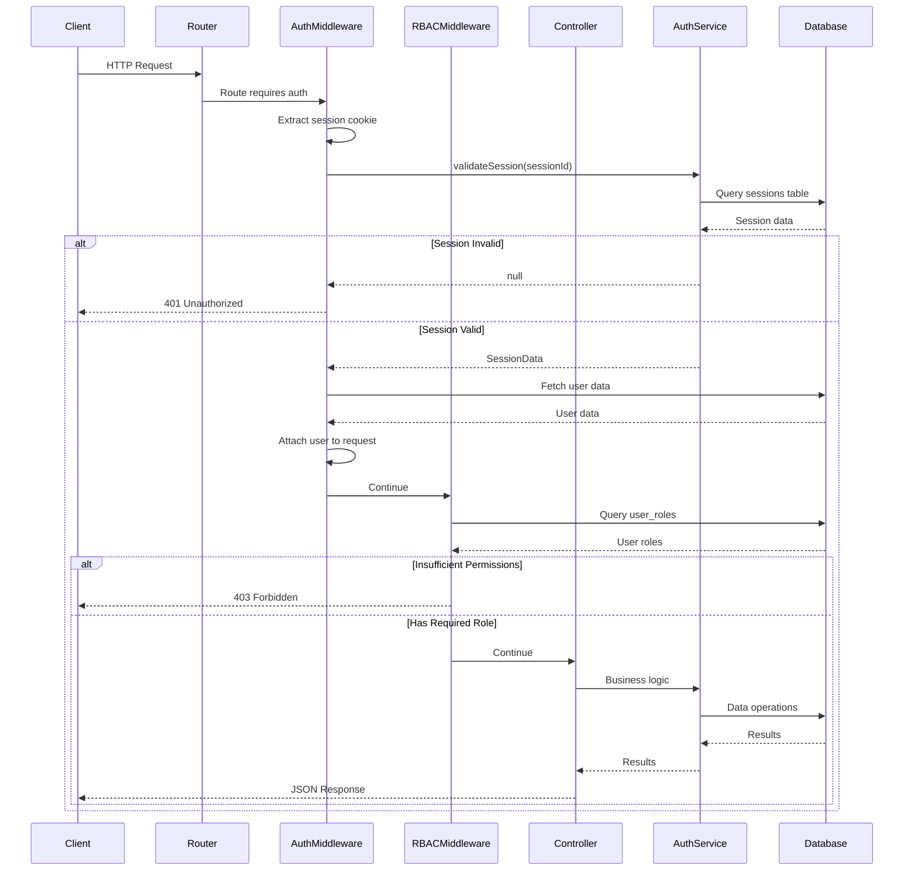
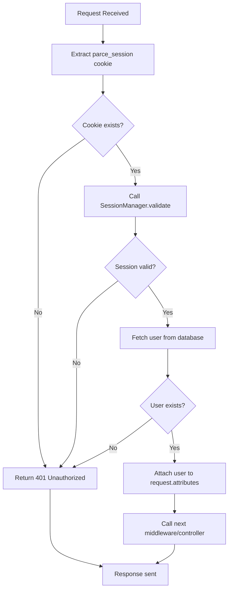
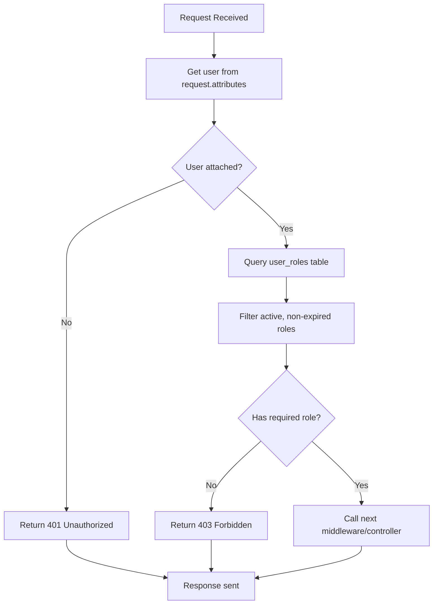
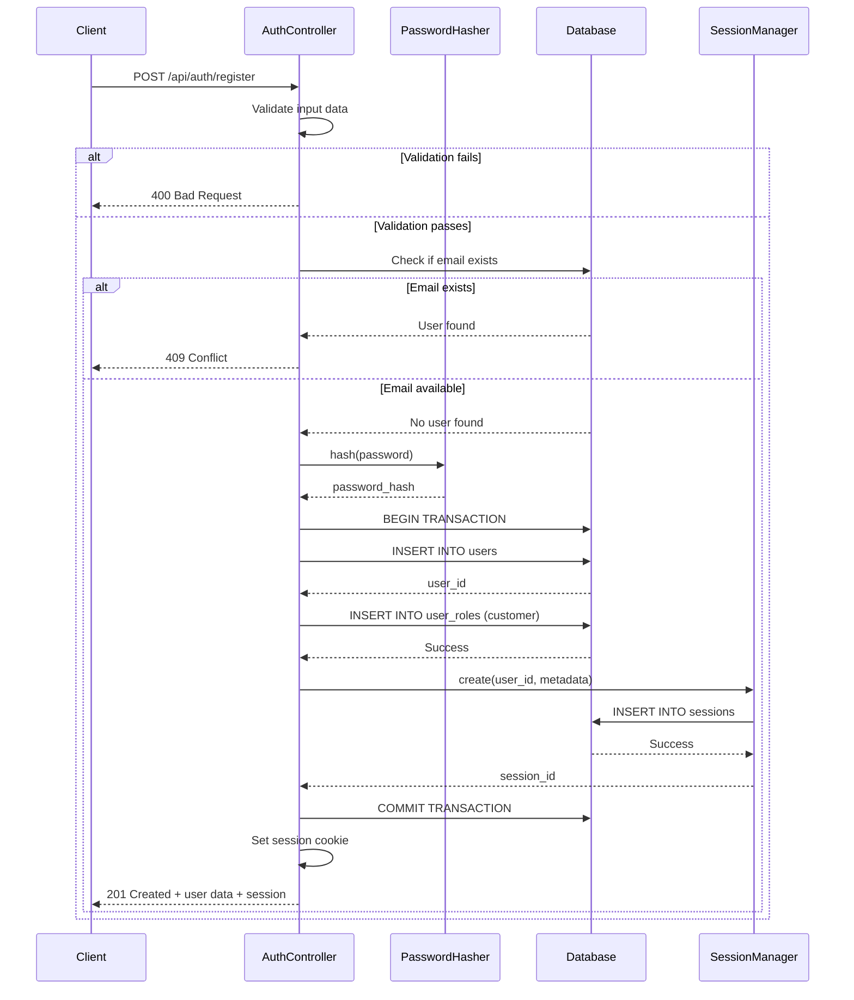
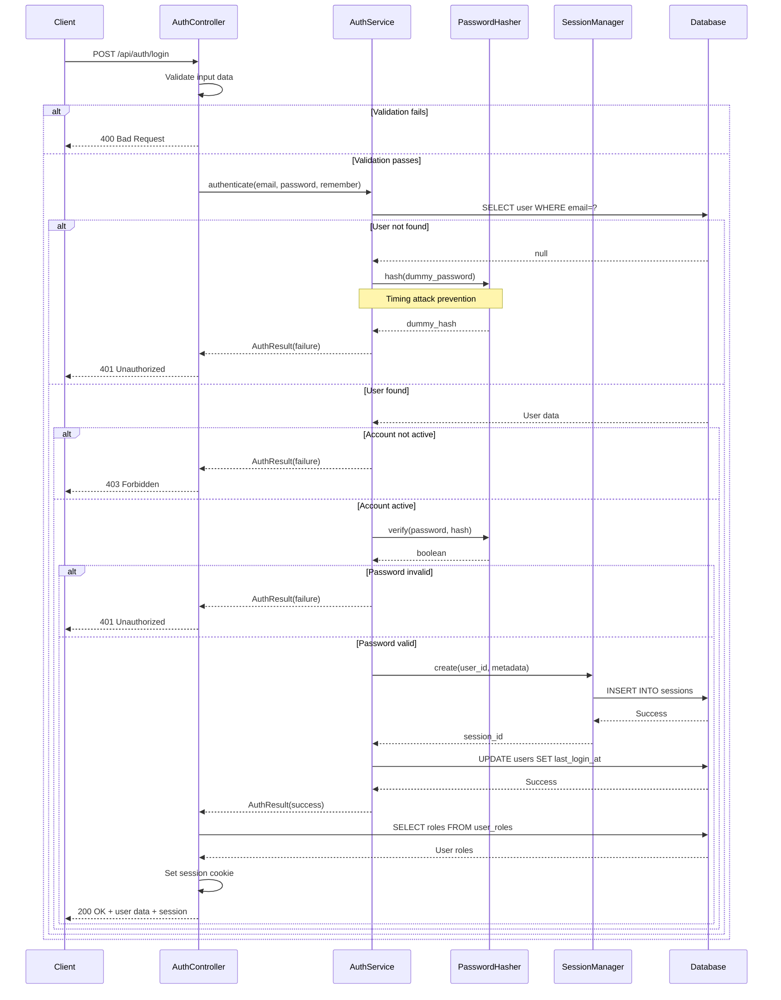
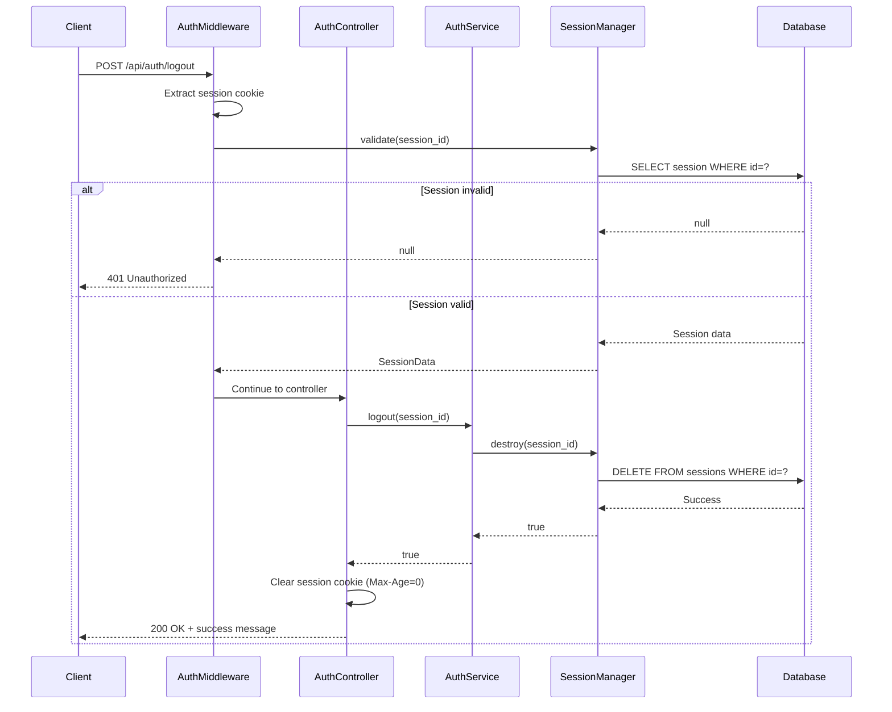
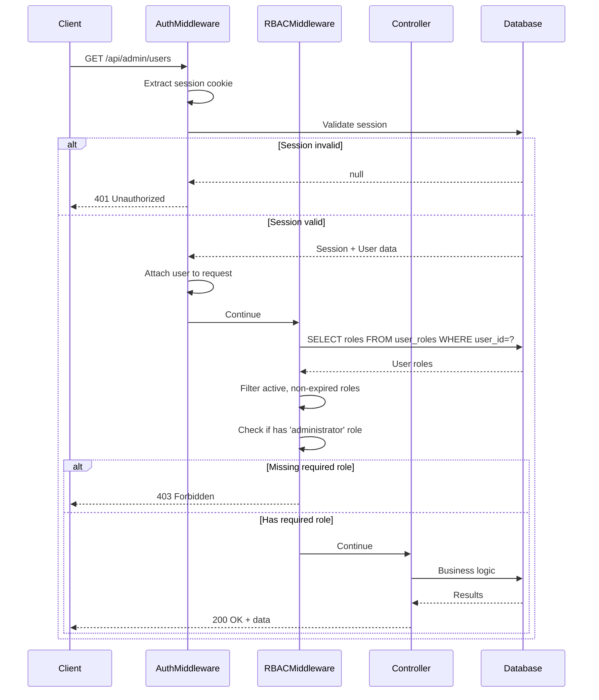
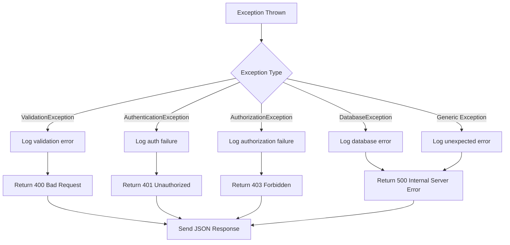

# Design Document: Authentication API Layer

## Overview

The Authentication API Layer provides a secure, RESTful HTTP interface for user authentication and authorization operations. It builds on top of the existing authentication infrastructure (PasswordHasher, SessionManager, AuthService) to expose registration, login, logout, and session management capabilities through JSON API endpoints. The design implements defense-in-depth security principles including session fixation prevention, user enumeration protection, secure cookie handling, and role-based access control (RBAC) middleware for protecting routes.

This layer follows strict MVC separation with controllers in `app/Controllers/Auth/`, middleware in `app/Middleware/`, and maintains compatibility with the existing RBAC database schema (users, roles, user_roles tables). All responses follow a consistent JSON structure, and security measures prevent common vulnerabilities including timing attacks, session hijacking, and privilege escalation.

## Architecture

### System Architecture Overview



### Layer Responsibilities

**API Layer (New)**:
- HTTP request/response handling
- Input validation and sanitization
- Session cookie management
- Authentication middleware
- RBAC middleware
- JSON response formatting
- Error handling and logging

**Infrastructure Layer (Existing)**:
- Password hashing (Argon2id)
- Session lifecycle management
- Core authentication logic
- Database operations
- Security primitives

## Components and Interfaces

### Component 1: AuthController

**Purpose**: Handles HTTP requests for authentication operations (register, login, logout, current user)

**Location**: `app/Controllers/Auth/AuthController.php`

**Interface**:
```php
namespace App\Controllers\Auth;

use App\Core\Controller;
use App\Core\Request;
use App\Core\Response;

class AuthController extends Controller
{
    public function register(Request $request): Response;
    public function login(Request $request): Response;
    public function logout(Request $request): Response;
    public function me(Request $request): Response;
}
```

**Responsibilities**:
- Validate incoming request data (email format, password strength, required fields)
- Delegate authentication logic to AuthService
- Set secure session cookies using CookieConfig
- Return structured JSON responses
- Handle authentication errors gracefully
- Prevent user enumeration through generic error messages
- Log security events (failed login attempts, registrations)

**Dependencies**:
- AuthService (Infrastructure layer)
- SessionManager (Infrastructure layer)
- PasswordHasher (Infrastructure layer)
- Database (Core layer)
- Request/Response (Core layer)

### Component 2: AuthMiddleware

**Purpose**: Validates session authentication for protected routes

**Location**: `app/Middleware/AuthMiddleware.php`

**Interface**:
```php
namespace App\Middleware;

use App\Core\Request;
use App\Core\Response;

class AuthMiddleware
{
    public function handle(Request $request, callable $next): Response;
}
```

**Responsibilities**:
- Extract session ID from cookie (`parce_session`)
- Validate session using SessionManager
- Fetch authenticated user data
- Attach user data to request attributes
- Return 401 Unauthorized if session invalid
- Allow request to proceed if authenticated


### Component 3: RBACMiddleware

**Purpose**: Enforces role-based access control for protected routes

**Location**: `app/Middleware/RBACMiddleware.php`

**Interface**:
```php
namespace App\Middleware;

use App\Core\Request;
use App\Core\Response;

class RBACMiddleware
{
    public function __construct(array $allowedRoles);
    public function handle(Request $request, callable $next): Response;
}
```

**Responsibilities**:
- Retrieve authenticated user from request attributes (set by AuthMiddleware)
- Query user_roles table to fetch user's active roles
- Check if user has at least one of the required roles
- Return 403 Forbidden if user lacks required role
- Allow request to proceed if user has required role
- Support role slug matching (e.g., 'administrator', 'mechanic', 'customer')

**Dependencies**:
- Database (Core layer)
- AuthMiddleware (must run before RBAC)

### Component 4: RoleValidator Helper

**Purpose**: Utility class for role validation and checking

**Location**: `app/Infrastructure/Auth/Services/RoleValidator.php`

**Interface**:
```php
namespace App\Infrastructure\Auth\Services;

class RoleValidator
{
    public function getUserRoles(int $userId): array;
    public function hasRole(int $userId, string $roleSlug): bool;
    public function hasAnyRole(int $userId, array $roleSlugs): bool;
    public function hasAllRoles(int $userId, array $roleSlugs): bool;
}
```


**Responsibilities**:
- Query user_roles and roles tables
- Check role expiration (expires_at field)
- Check role active status (is_active field)
- Cache role lookups for performance
- Provide reusable role checking logic

## Data Models

### API Request Models

#### RegisterRequest
```php
{
    "email": "user@example.com",           // Required, valid email format
    "password": "SecurePass123!",          // Required, min 8 characters
    "password_confirmation": "SecurePass123!", // Required, must match password
    "first_name": "John",                  // Required, max 100 characters
    "last_name": "Doe",                    // Required, max 100 characters
    "phone": "+1234567890"                 // Optional, max 20 characters
}
```

**Validation Rules**:
- `email`: Required, valid email format, unique in database
- `password`: Required, minimum 8 characters, must match confirmation
- `password_confirmation`: Required, must match password
- `first_name`: Required, max 100 characters, non-empty
- `last_name`: Required, max 100 characters, non-empty
- `phone`: Optional, max 20 characters, valid phone format

#### LoginRequest
```php
{
    "email": "user@example.com",    // Required, valid email format
    "password": "SecurePass123!",   // Required, min 8 characters
    "remember": false               // Optional, boolean (default: false)
}
```

**Validation Rules**:
- `email`: Required, valid email format
- `password`: Required, minimum 8 characters
- `remember`: Optional, boolean (enables 30-day session)


### API Response Models

#### Success Response (Registration/Login)
```php
{
    "success": true,
    "message": "Registration successful" | "Login successful",
    "data": {
        "user": {
            "id": 1,
            "email": "user@example.com",
            "first_name": "John",
            "last_name": "Doe",
            "account_status": "active",
            "roles": ["customer"]  // Array of role slugs
        },
        "session": {
            "id": "a1b2c3d4e5f6...",  // 40-character session ID
            "expires_at": 1735689600    // Unix timestamp
        }
    }
}
```

#### Success Response (Current User - /api/auth/me)
```php
{
    "success": true,
    "message": "User retrieved successfully",
    "data": {
        "id": 1,
        "email": "user@example.com",
        "first_name": "John",
        "last_name": "Doe",
        "account_status": "active",
        "last_login_at": "2024-01-15 10:30:00",
        "roles": ["customer", "mechanic"]  // Array of role slugs
    }
}
```

#### Success Response (Logout)
```php
{
    "success": true,
    "message": "Logout successful",
    "data": null
}
```

#### Error Response (Validation Failure)
```php
{
    "success": false,
    "message": "Validation failed",
    "errors": {
        "email": "The email field is required.",
        "password": "The password must be at least 8 characters."
    }
}
```


#### Error Response (Authentication Failure)
```php
{
    "success": false,
    "message": "Invalid credentials",  // Generic message (no user enumeration)
    "errors": null
}
```

#### Error Response (Unauthorized - 401)
```php
{
    "success": false,
    "message": "Unauthenticated. Please log in.",
    "errors": null
}
```

#### Error Response (Forbidden - 403)
```php
{
    "success": false,
    "message": "Forbidden. Insufficient permissions.",
    "errors": {
        "required_roles": ["administrator"],
        "user_roles": ["customer"]
    }
}
```

### Database Models (Existing Schema)

#### users table
- `id`: BIGINT UNSIGNED (Primary Key)
- `email`: VARCHAR(255) UNIQUE
- `password_hash`: VARCHAR(255)
- `first_name`: VARCHAR(100)
- `last_name`: VARCHAR(100)
- `phone`: VARCHAR(20) NULL
- `account_status`: ENUM('active', 'suspended', 'deactivated', 'pending_verification')
- `last_login_at`: TIMESTAMP NULL
- `last_login_ip`: VARCHAR(45) NULL
- `created_at`: TIMESTAMP
- `updated_at`: TIMESTAMP
- `deleted_at`: TIMESTAMP NULL (soft delete)

#### roles table
- `id`: INT UNSIGNED (Primary Key)
- `name`: VARCHAR(50) UNIQUE
- `slug`: VARCHAR(50) UNIQUE
- `description`: TEXT
- `is_system_role`: BOOLEAN
- `is_active`: BOOLEAN


#### user_roles table
- `id`: BIGINT UNSIGNED (Primary Key)
- `user_id`: BIGINT UNSIGNED (Foreign Key → users.id)
- `role_id`: INT UNSIGNED (Foreign Key → roles.id)
- `assigned_by`: BIGINT UNSIGNED NULL (Foreign Key → users.id)
- `assigned_at`: TIMESTAMP
- `expires_at`: TIMESTAMP NULL
- `is_active`: BOOLEAN

#### sessions table (Existing)
- `id`: VARCHAR(40) (Primary Key - session ID)
- `user_id`: BIGINT UNSIGNED (Foreign Key → users.id)
- `ip_address`: VARCHAR(45)
- `user_agent`: TEXT
- `payload`: JSON
- `last_activity`: INT (Unix timestamp)
- `created_at`: TIMESTAMP

## API Endpoints Specification

### 1. Register User

**Endpoint**: `POST /api/auth/register`

**Authentication**: None (public endpoint)

**Request Headers**:
```
Content-Type: application/json
```

**Request Body**:
```json
{
    "email": "user@example.com",
    "password": "SecurePass123!",
    "password_confirmation": "SecurePass123!",
    "first_name": "John",
    "last_name": "Doe",
    "phone": "+1234567890"
}
```

**Success Response** (201 Created):
```json
{
    "success": true,
    "message": "Registration successful",
    "data": {
        "user": {
            "id": 1,
            "email": "user@example.com",
            "first_name": "John",
            "last_name": "Doe",
            "account_status": "pending_verification",
            "roles": ["customer"]
        },
        "session": {
            "id": "a1b2c3d4e5f6...",
            "expires_at": 1735689600
        }
    }
}
```


**Response Cookies**:
```
Set-Cookie: parce_session=a1b2c3d4e5f6...; Path=/; HttpOnly; Secure; SameSite=Lax; Max-Age=7200
```

**Error Responses**:
- `400 Bad Request`: Validation failure (missing fields, invalid email, password mismatch)
- `409 Conflict`: Email already exists
- `500 Internal Server Error`: Database error

**Validation Rules**:
- Email must be valid format and unique
- Password minimum 8 characters
- Password and confirmation must match
- First name and last name required
- Phone optional but must be valid format if provided

**Business Logic**:
1. Validate request data
2. Check if email already exists (return 409 if exists)
3. Hash password using PasswordHasher
4. Insert user into database with account_status='pending_verification'
5. Assign default 'customer' role to new user
6. Create session using SessionManager
7. Set secure session cookie
8. Return user data and session info

### 2. Login User

**Endpoint**: `POST /api/auth/login`

**Authentication**: None (public endpoint)

**Request Headers**:
```
Content-Type: application/json
```

**Request Body**:
```json
{
    "email": "user@example.com",
    "password": "SecurePass123!",
    "remember": false
}
```

**Success Response** (200 OK):
```json
{
    "success": true,
    "message": "Login successful",
    "data": {
        "user": {
            "id": 1,
            "email": "user@example.com",
            "first_name": "John",
            "last_name": "Doe",
            "account_status": "active",
            "roles": ["customer", "mechanic"]
        },
        "session": {
            "id": "a1b2c3d4e5f6...",
            "expires_at": 1735689600
        }
    }
}
```


**Response Cookies**:
```
Set-Cookie: parce_session=a1b2c3d4e5f6...; Path=/; HttpOnly; Secure; SameSite=Lax; Max-Age=7200
```
(If remember=true, Max-Age=2592000 for 30 days)

**Error Responses**:
- `400 Bad Request`: Validation failure (missing fields, invalid email format)
- `401 Unauthorized`: Invalid credentials (generic message to prevent user enumeration)
- `403 Forbidden`: Account not active (suspended, deactivated, or pending verification)
- `500 Internal Server Error`: Database error

**Business Logic**:
1. Validate request data (email format, password not empty)
2. Call AuthService.authenticate(email, password, remember)
3. If authentication fails, return 401 with generic "Invalid credentials" message
4. If account not active, return 403 with "Account is not active" message
5. Fetch user's active roles from user_roles table
6. Set secure session cookie with appropriate expiration
7. Return user data with roles and session info

**Security Features**:
- Generic error messages prevent user enumeration
- Timing-safe password verification (handled by PasswordHasher)
- Session regeneration on login (prevents session fixation)
- Secure cookie flags (HttpOnly, Secure, SameSite)

### 3. Logout User

**Endpoint**: `POST /api/auth/logout`

**Authentication**: Required (AuthMiddleware)

**Request Headers**:
```
Cookie: parce_session=a1b2c3d4e5f6...
```

**Request Body**: None

**Success Response** (200 OK):
```json
{
    "success": true,
    "message": "Logout successful",
    "data": null
}
```

**Response Cookies**:
```
Set-Cookie: parce_session=; Path=/; HttpOnly; Secure; SameSite=Lax; Max-Age=0
```
(Cookie deleted by setting Max-Age=0)

**Error Responses**:
- `401 Unauthorized`: No valid session (session expired or invalid)
- `500 Internal Server Error`: Database error


**Business Logic**:
1. Extract session ID from cookie
2. Call AuthService.logout(sessionId)
3. Delete session from database
4. Clear session cookie (set Max-Age=0)
5. Return success response

### 4. Get Current User

**Endpoint**: `GET /api/auth/me`

**Authentication**: Required (AuthMiddleware)

**Request Headers**:
```
Cookie: parce_session=a1b2c3d4e5f6...
```

**Success Response** (200 OK):
```json
{
    "success": true,
    "message": "User retrieved successfully",
    "data": {
        "id": 1,
        "email": "user@example.com",
        "first_name": "John",
        "last_name": "Doe",
        "account_status": "active",
        "last_login_at": "2024-01-15 10:30:00",
        "roles": ["customer", "mechanic"]
    }
}
```

**Error Responses**:
- `401 Unauthorized`: No valid session (session expired or invalid)
- `500 Internal Server Error`: Database error

**Business Logic**:
1. AuthMiddleware validates session and attaches user to request
2. Fetch user's active roles from user_roles table
3. Return user data with roles

## Middleware Architecture and Flow

### Middleware Pipeline




### AuthMiddleware Flow



### RBACMiddleware Flow



## Session Cookie Configuration

### Cookie Parameters

```php
[
    'name' => 'parce_session',
    'lifetime' => 7200,           // 2 hours (default)
    'lifetime_remember' => 2592000, // 30 days (remember me)
    'path' => '/',
    'domain' => '',               // Empty for current domain
    'secure' => true,             // HTTPS only
    'httpOnly' => true,           // Prevent JavaScript access
    'sameSite' => 'Lax'          // CSRF protection
]
```


### Cookie Security Features

**HttpOnly Flag**:
- Prevents JavaScript access to cookie
- Mitigates XSS attacks
- Cookie only accessible via HTTP(S) requests

**Secure Flag**:
- Cookie only sent over HTTPS connections
- Prevents man-in-the-middle attacks
- Required for production environments

**SameSite=Lax**:
- Prevents CSRF attacks
- Cookie sent with top-level navigation (GET requests)
- Cookie NOT sent with cross-site POST requests
- Balances security and usability

**Session Expiration**:
- Default: 2 hours (7200 seconds)
- Remember me: 30 days (2592000 seconds)
- Idle timeout: 30 minutes (1800 seconds)
- Absolute timeout enforced by SessionManager

## Data Flow Diagrams

### Registration Flow




### Login Flow




### Logout Flow



### Protected Route Access Flow




## RBAC Integration Approach

### Role Assignment Strategy

**Default Role Assignment**:
- New users automatically assigned 'customer' role on registration
- Role assigned via user_roles table with is_active=true
- No expiration date (expires_at=null) for default roles

**Role Hierarchy** (from database):
1. **Customer** (slug: `customer`): Standard user with service request capabilities
2. **Mechanic** (slug: `mechanic`): Service execution and vehicle management
3. **Support Staff** (slug: `support`): Read-only customer support access
4. **Administrator** (slug: `administrator`): Platform management and user administration
5. **Super Administrator** (slug: `super_admin`): Full system access and configuration

### Role Validation Logic

**Active Role Criteria**:
```sql
SELECT r.slug
FROM user_roles ur
JOIN roles r ON ur.role_id = r.id
WHERE ur.user_id = ?
  AND ur.is_active = TRUE
  AND r.is_active = TRUE
  AND (ur.expires_at IS NULL OR ur.expires_at > NOW())
  AND r.deleted_at IS NULL
```

**Role Checking Methods**:
- `hasRole(userId, roleSlug)`: Check if user has specific role
- `hasAnyRole(userId, [roleSlugs])`: Check if user has at least one role
- `hasAllRoles(userId, [roleSlugs])`: Check if user has all specified roles

### Middleware Configuration Examples

**Public Route** (no middleware):
```php
$router->post('/api/auth/register', [AuthController::class, 'register']);
$router->post('/api/auth/login', [AuthController::class, 'login']);
```

**Authenticated Route** (AuthMiddleware only):
```php
$router->post('/api/auth/logout', [AuthController::class, 'logout'])
    ->middleware([AuthMiddleware::class]);

$router->get('/api/auth/me', [AuthController::class, 'me'])
    ->middleware([AuthMiddleware::class]);
```

**Role-Protected Route** (AuthMiddleware + RBACMiddleware):
```php
$router->get('/api/admin/users', [AdminController::class, 'listUsers'])
    ->middleware([
        AuthMiddleware::class,
        new RBACMiddleware(['administrator', 'super_admin'])
    ]);

$router->get('/api/mechanic/jobs', [MechanicController::class, 'listJobs'])
    ->middleware([
        AuthMiddleware::class,
        new RBACMiddleware(['mechanic', 'administrator'])
    ]);
```


### Route Group Configuration

```php
// Public authentication routes
$router->group(['prefix' => '/api/auth'], function($router) {
    $router->post('/register', [AuthController::class, 'register']);
    $router->post('/login', [AuthController::class, 'login']);
});

// Authenticated routes
$router->group([
    'prefix' => '/api/auth',
    'middleware' => [AuthMiddleware::class]
], function($router) {
    $router->post('/logout', [AuthController::class, 'logout']);
    $router->get('/me', [AuthController::class, 'me']);
});

// Admin-only routes
$router->group([
    'prefix' => '/api/admin',
    'middleware' => [
        AuthMiddleware::class,
        new RBACMiddleware(['administrator', 'super_admin'])
    ]
], function($router) {
    $router->get('/users', [AdminController::class, 'listUsers']);
    $router->post('/users/{id}/roles', [AdminController::class, 'assignRole']);
});
```

## Error Handling Strategy

### Error Response Structure

All error responses follow a consistent JSON structure:

```php
{
    "success": false,
    "message": "Human-readable error message",
    "errors": null | object | array  // Optional detailed errors
}
```

### HTTP Status Codes

| Status Code | Meaning | Use Case |
|-------------|---------|----------|
| 200 OK | Success | Successful login, logout, user retrieval |
| 201 Created | Resource created | Successful registration |
| 400 Bad Request | Validation failure | Missing fields, invalid format |
| 401 Unauthorized | Authentication required | No session, invalid session, invalid credentials |
| 403 Forbidden | Insufficient permissions | Account not active, missing required role |
| 409 Conflict | Resource conflict | Email already exists |
| 500 Internal Server Error | Server error | Database error, unexpected exception |

### Error Categories

**Validation Errors** (400):
```php
{
    "success": false,
    "message": "Validation failed",
    "errors": {
        "email": "The email field is required.",
        "password": "The password must be at least 8 characters.",
        "password_confirmation": "The password confirmation does not match."
    }
}
```


**Authentication Errors** (401):
```php
{
    "success": false,
    "message": "Invalid credentials",  // Generic message
    "errors": null
}
```

**Authorization Errors** (403):
```php
{
    "success": false,
    "message": "Forbidden. Insufficient permissions.",
    "errors": {
        "required_roles": ["administrator"],
        "user_roles": ["customer"]
    }
}
```

**Conflict Errors** (409):
```php
{
    "success": false,
    "message": "Email already exists",
    "errors": {
        "email": "A user with this email address already exists."
    }
}
```

**Server Errors** (500):
```php
{
    "success": false,
    "message": "An unexpected error occurred. Please try again later.",
    "errors": null
}
```

### Exception Handling Flow




### Error Logging Strategy

**Log Levels**:
- **ERROR**: Authentication failures, authorization failures, database errors
- **WARNING**: Validation failures, account status issues
- **INFO**: Successful login, logout, registration

**Log Format**:
```
[2024-01-15 10:30:45] ERROR: Authentication failed for email user@example.com: Invalid credentials
[2024-01-15 10:31:12] WARNING: Registration attempt with existing email: user@example.com
[2024-01-15 10:32:00] INFO: User 123 logged in successfully from IP 192.168.1.100
[2024-01-15 10:35:30] ERROR: Database connection failed during login attempt
```

**Log Location**: `storage/logs/auth-{date}.log`

**Sensitive Data Handling**:
- NEVER log passwords (plain text or hashed)
- NEVER log session IDs in full (log first 8 characters only)
- NEVER log full credit card numbers or sensitive PII
- Log email addresses for audit trail (acceptable for authentication logs)

## Security Considerations

### 1. Session Fixation Prevention

**Threat**: Attacker sets a known session ID before user logs in

**Mitigation**:
- SessionManager regenerates session ID on login
- Old session ID is destroyed
- New session ID is cryptographically random (40 characters)
- Session cookie is set with new ID

**Implementation**:
```php
// In AuthService.authenticate()
$sessionId = $this->sessionManager->create($userId, $metadata);
// SessionManager generates new random session ID
// Old session (if any) is not reused
```

### 2. User Enumeration Prevention

**Threat**: Attacker determines which email addresses are registered

**Mitigation**:
- Generic error messages for login failures
- "Invalid credentials" for both non-existent users and wrong passwords
- Timing-safe password verification (constant-time comparison)
- Dummy password hash for non-existent users (prevents timing attacks)

**Implementation**:
```php
// In AuthService.authenticate()
if ($user === null) {
    // Perform dummy hash to prevent timing attacks
    $this->passwordHasher->hash('dummy_password_' . bin2hex(random_bytes(8)));
    return AuthResult::failure('Invalid credentials');  // Generic message
}
```


### 3. Session Hijacking Prevention

**Threat**: Attacker steals session cookie and impersonates user

**Mitigation**:
- HttpOnly flag prevents JavaScript access to cookie
- Secure flag ensures cookie only sent over HTTPS
- SameSite=Lax prevents CSRF attacks
- Session validation checks IP address and user agent (optional)
- Session expiration (idle timeout and absolute timeout)

**Implementation**:
```php
// Cookie configuration
$response->setCookie(
    name: 'parce_session',
    value: $sessionId,
    expires: time() + 7200,  // 2 hours
    path: '/',
    domain: '',
    secure: true,      // HTTPS only
    httpOnly: true     // No JavaScript access
);
```

### 4. SQL Injection Prevention

**Threat**: Attacker injects malicious SQL code through input fields

**Mitigation**:
- Prepared statements with parameterized queries (PDO)
- Input validation and sanitization
- Database class enforces prepared statements
- No string concatenation in SQL queries

**Implementation**:
```php
// All database queries use prepared statements
Database::fetchOne(
    'SELECT * FROM users WHERE email = ?',
    [$email]  // Parameter binding prevents SQL injection
);
```

### 5. XSS Prevention

**Threat**: Attacker injects malicious JavaScript into responses

**Mitigation**:
- JSON API responses (not HTML rendering)
- Content-Type: application/json header
- No user input directly rendered in HTML
- HttpOnly cookies prevent JavaScript access

**Implementation**:
```php
// All API responses are JSON
$response->json([
    'success' => true,
    'data' => $data  // Data is JSON-encoded, not HTML-rendered
]);
```


### 6. CSRF Prevention

**Threat**: Attacker tricks user into performing unwanted actions

**Mitigation**:
- SameSite=Lax cookie attribute
- Cookie not sent with cross-site POST requests
- JSON API (not form-based)
- Content-Type: application/json requirement

**Implementation**:
```php
// SameSite=Lax prevents CSRF
$response->setCookie(
    name: 'parce_session',
    value: $sessionId,
    // ... other params
    sameSite: 'Lax'  // CSRF protection
);
```

### 7. Password Security

**Threat**: Weak passwords or password compromise

**Mitigation**:
- Minimum 8 characters password requirement
- Argon2id hashing algorithm (memory-hard, GPU-resistant)
- Unique salt per password (automatic with password_hash)
- Password confirmation on registration
- Automatic hash upgrade (if algorithm parameters change)

**Implementation**:
```php
// PasswordHasher uses Argon2id
$hash = password_hash($password, PASSWORD_ARGON2ID);

// Automatic rehashing if needed
if ($this->passwordHasher->needsRehash($hash)) {
    $newHash = $this->passwordHasher->hash($password);
    // Update database with new hash
}
```

### 8. Rate Limiting (Future Enhancement)

**Threat**: Brute force attacks on login endpoint

**Mitigation** (to be implemented):
- Rate limit login attempts per IP address
- Rate limit login attempts per email address
- Exponential backoff after failed attempts
- Account lockout after N failed attempts
- CAPTCHA after M failed attempts

**Recommended Implementation**:
```php
// Future: RateLimitMiddleware
$router->post('/api/auth/login', [AuthController::class, 'login'])
    ->middleware([
        new RateLimitMiddleware(maxAttempts: 5, decayMinutes: 15)
    ]);
```


### 9. Privilege Escalation Prevention

**Threat**: User gains unauthorized access to higher privilege roles

**Mitigation**:
- Role assignment requires administrator privileges
- RBAC middleware validates roles on every request
- Role expiration support (expires_at field)
- Role active status check (is_active field)
- Audit trail (assigned_by, assigned_at fields)

**Implementation**:
```php
// RBACMiddleware checks roles on every request
$roles = Database::fetchAll(
    'SELECT r.slug FROM user_roles ur
     JOIN roles r ON ur.role_id = r.id
     WHERE ur.user_id = ? 
       AND ur.is_active = TRUE
       AND r.is_active = TRUE
       AND (ur.expires_at IS NULL OR ur.expires_at > NOW())',
    [$userId]
);
```

### 10. Account Enumeration Prevention

**Threat**: Attacker determines which accounts exist

**Mitigation**:
- Generic error messages ("Invalid credentials")
- Same response time for existing and non-existing users
- Dummy password hash for non-existing users
- No "email not found" vs "wrong password" distinction

**Implementation**:
```php
// Same error message for all authentication failures
return AuthResult::failure('Invalid credentials');

// Timing attack prevention
if ($user === null) {
    $this->passwordHasher->hash('dummy_password_' . bin2hex(random_bytes(8)));
}
```

## Testing Strategy

### Unit Testing Approach

**Test Coverage Goals**:
- Controllers: 90%+ coverage
- Middleware: 95%+ coverage
- RoleValidator: 95%+ coverage
- Integration with AuthService: 85%+ coverage

**Key Test Cases**:

**AuthController Tests**:
- `testRegisterWithValidData()`: Successful registration
- `testRegisterWithExistingEmail()`: 409 Conflict response
- `testRegisterWithInvalidEmail()`: 400 Bad Request
- `testRegisterWithWeakPassword()`: 400 Bad Request
- `testRegisterWithPasswordMismatch()`: 400 Bad Request
- `testLoginWithValidCredentials()`: Successful login
- `testLoginWithInvalidCredentials()`: 401 Unauthorized
- `testLoginWithInactiveAccount()`: 403 Forbidden
- `testLoginWithRememberMe()`: 30-day session cookie
- `testLogoutWithValidSession()`: Successful logout
- `testLogoutWithInvalidSession()`: 401 Unauthorized
- `testGetCurrentUserAuthenticated()`: Returns user data
- `testGetCurrentUserUnauthenticated()`: 401 Unauthorized


**AuthMiddleware Tests**:
- `testAuthenticatedRequest()`: Allows request to proceed
- `testUnauthenticatedRequest()`: Returns 401
- `testExpiredSession()`: Returns 401
- `testInvalidSessionId()`: Returns 401
- `testMissingSessionCookie()`: Returns 401
- `testUserAttachedToRequest()`: User data in request attributes

**RBACMiddleware Tests**:
- `testUserWithRequiredRole()`: Allows request to proceed
- `testUserWithoutRequiredRole()`: Returns 403
- `testUserWithExpiredRole()`: Returns 403
- `testUserWithInactiveRole()`: Returns 403
- `testUserWithMultipleRoles()`: Checks any role match
- `testUnauthenticatedUser()`: Returns 401

**RoleValidator Tests**:
- `testGetUserRoles()`: Returns active roles
- `testHasRole()`: Returns true for assigned role
- `testHasRoleExpired()`: Returns false for expired role
- `testHasAnyRole()`: Returns true if user has any role
- `testHasAllRoles()`: Returns true if user has all roles

### Integration Testing Approach

**Test Scenarios**:

**End-to-End Registration Flow**:
1. POST /api/auth/register with valid data
2. Verify user created in database
3. Verify default 'customer' role assigned
4. Verify session created in database
5. Verify session cookie set in response
6. Verify password hashed with Argon2id

**End-to-End Login Flow**:
1. Create test user in database
2. POST /api/auth/login with valid credentials
3. Verify session created in database
4. Verify last_login_at updated
5. Verify session cookie set in response
6. Verify user roles returned in response

**End-to-End Protected Route Flow**:
1. Create test user with 'administrator' role
2. POST /api/auth/login to get session
3. GET /api/admin/users with session cookie
4. Verify AuthMiddleware validates session
5. Verify RBACMiddleware checks role
6. Verify request reaches controller
7. Verify response returned successfully

**Session Expiration Flow**:
1. Create test user and login
2. Manually expire session in database
3. GET /api/auth/me with expired session
4. Verify 401 Unauthorized response
5. Verify session deleted from database


### Property-Based Testing Approach

**Property Test Library**: PHPUnit with Eris (property-based testing for PHP)

**Properties to Test**:

**Property 1: Session Cookie Security**
```php
// For all valid session IDs, the cookie must have secure flags
∀ sessionId ∈ ValidSessionIds:
    cookie = setCookie(sessionId)
    ⟹ cookie.httpOnly = true
    ∧ cookie.secure = true
    ∧ cookie.sameSite = 'Lax'
```

**Property 2: Password Hashing Uniqueness**
```php
// For all passwords, each hash must be unique (due to unique salt)
∀ password ∈ ValidPasswords:
    hash1 = PasswordHasher.hash(password)
    hash2 = PasswordHasher.hash(password)
    ⟹ hash1 ≠ hash2
```

**Property 3: Authentication Idempotency**
```php
// For all valid credentials, multiple authentication attempts return same user
∀ (email, password) ∈ ValidCredentials:
    result1 = AuthService.authenticate(email, password)
    result2 = AuthService.authenticate(email, password)
    ⟹ result1.userId = result2.userId
    ∧ result1.success = result2.success
```

**Property 4: Role Validation Consistency**
```php
// For all users with role R, hasRole(R) must return true
∀ userId ∈ Users, roleSlug ∈ AssignedRoles(userId):
    ⟹ RoleValidator.hasRole(userId, roleSlug) = true
```

**Property 5: Session Expiration Enforcement**
```php
// For all expired sessions, validation must return null
∀ sessionId ∈ ExpiredSessions:
    ⟹ SessionManager.validate(sessionId) = null
```

**Property 6: RBAC Middleware Authorization**
```php
// For all users without required role, middleware must return 403
∀ userId ∈ Users, requiredRole ∈ Roles:
    ¬hasRole(userId, requiredRole)
    ⟹ RBACMiddleware.handle(request) = 403 Forbidden
```


## Performance Considerations

### Database Query Optimization

**Indexed Columns**:
- `users.email`: Unique index for fast email lookup
- `users.account_status`: Index for filtering active users
- `sessions.id`: Primary key index for session validation
- `sessions.user_id`: Index for user session queries
- `user_roles.user_id`: Index for role lookups
- `user_roles.role_id`: Index for role queries
- `roles.slug`: Unique index for role slug matching

**Query Optimization Strategies**:
- Use prepared statements (cached query plans)
- Fetch only required columns (avoid SELECT *)
- Use JOIN instead of multiple queries
- Implement query result caching for role lookups
- Use connection pooling (PDO persistent connections)

**Example Optimized Query**:
```sql
-- Fetch user with roles in single query
SELECT 
    u.id, u.email, u.first_name, u.last_name, u.account_status,
    GROUP_CONCAT(r.slug) as roles
FROM users u
LEFT JOIN user_roles ur ON u.id = ur.user_id AND ur.is_active = TRUE
LEFT JOIN roles r ON ur.role_id = r.id AND r.is_active = TRUE
WHERE u.id = ? AND u.deleted_at IS NULL
GROUP BY u.id
```

### Session Validation Performance

**Optimization Strategies**:
- Cache session data in memory (Redis/Memcached - future)
- Reduce database queries per request
- Use database connection pooling
- Implement session data caching in request lifecycle

**Current Performance**:
- Session validation: 1 database query
- User data fetch: 1 database query
- Role validation: 1 database query
- **Total: 3 queries per authenticated request**

**Future Optimization**:
- Cache session data in Redis (reduce to 0-1 queries)
- Cache user roles in Redis (reduce to 0-1 queries)
- **Target: 0-2 queries per authenticated request**

### Response Time Targets

| Endpoint | Target Response Time | Max Response Time |
|----------|---------------------|-------------------|
| POST /api/auth/register | < 200ms | < 500ms |
| POST /api/auth/login | < 150ms | < 400ms |
| POST /api/auth/logout | < 50ms | < 200ms |
| GET /api/auth/me | < 50ms | < 200ms |
| Protected routes (with RBAC) | < 100ms | < 300ms |

**Performance Monitoring**:
- Log response times for all authentication endpoints
- Alert if response time exceeds max threshold
- Track database query execution time
- Monitor session validation performance


## Dependencies

### External Dependencies

**PHP Extensions**:
- `ext-pdo`: Database connectivity (required)
- `ext-pdo_mysql`: MySQL driver (required)
- `ext-json`: JSON encoding/decoding (required)
- `ext-mbstring`: Multibyte string handling (required)
- `ext-sodium`: Cryptographic operations (required for Argon2id)

**Composer Packages** (existing):
- None required (using native PHP functions)

**Future Dependencies** (optional enhancements):
- `phpunit/phpunit`: Unit testing framework
- `vimeo/psalm`: Static analysis
- `phpstan/phpstan`: Static analysis
- `predis/predis`: Redis client for session caching

### Internal Dependencies

**Core Layer**:
- `App\Core\Database`: Database operations
- `App\Core\Router`: Route registration and dispatching
- `App\Core\Request`: HTTP request handling
- `App\Core\Response`: HTTP response handling
- `App\Core\Controller`: Base controller class

**Infrastructure Layer**:
- `App\Infrastructure\Auth\Services\AuthService`: Core authentication logic
- `App\Infrastructure\Auth\Services\SessionManager`: Session lifecycle management
- `App\Infrastructure\Auth\Services\PasswordHasher`: Password hashing and verification
- `App\Infrastructure\Auth\DTO\AuthResult`: Authentication result DTO
- `App\Infrastructure\Auth\DTO\SessionData`: Session data DTO
- `App\Infrastructure\Auth\DTO\CookieConfig`: Cookie configuration DTO
- `App\Infrastructure\Auth\Exceptions\AuthenticationException`: Authentication exceptions

### Database Dependencies

**Required Tables**:
- `users`: User account information
- `roles`: System roles for RBAC
- `user_roles`: User-role assignments
- `sessions`: Session storage

**Required Migrations**:
- `2024_01_01_000001_create_users_and_roles_tables.php`
- `2024_01_01_000002_create_sessions_table.php`

### Configuration Dependencies

**Environment Variables** (.env):
```
DB_DRIVER=mysql
DB_HOST=127.0.0.1
DB_PORT=3306
DB_DATABASE=parce
DB_USERNAME=root
DB_PASSWORD=

APP_ENV=production
APP_DEBUG=false
APP_URL=https://example.com

SESSION_LIFETIME=7200
SESSION_SECURE=true
SESSION_HTTP_ONLY=true
SESSION_SAME_SITE=Lax
```

**PHP Configuration** (php.ini):
```
session.cookie_httponly = 1
session.cookie_secure = 1
session.cookie_samesite = Lax
session.use_strict_mode = 1
```


## Implementation Roadmap

### Phase 1: Core API Endpoints (Priority 1)

**Components**:
1. AuthController with register, login, logout, me methods
2. Route registration in config/routes.php
3. Input validation and error handling
4. Session cookie management
5. JSON response formatting

**Deliverables**:
- `app/Controllers/Auth/AuthController.php`
- Updated `config/routes.php`
- Manual testing with Postman/curl

**Estimated Effort**: 4-6 hours

### Phase 2: Authentication Middleware (Priority 2)

**Components**:
1. AuthMiddleware for session validation
2. Middleware integration with Router
3. Request attribute management
4. Error responses for unauthenticated requests

**Deliverables**:
- `app/Middleware/AuthMiddleware.php`
- Updated Router to support middleware pipeline
- Protected route examples

**Estimated Effort**: 3-4 hours

### Phase 3: RBAC Middleware (Priority 3)

**Components**:
1. RBACMiddleware for role-based access control
2. RoleValidator helper class
3. Role query optimization
4. Authorization error responses

**Deliverables**:
- `app/Middleware/RBACMiddleware.php`
- `app/Infrastructure/Auth/Services/RoleValidator.php`
- Role-protected route examples

**Estimated Effort**: 4-5 hours

### Phase 4: Testing (Priority 4)

**Components**:
1. Unit tests for AuthController
2. Unit tests for middleware
3. Integration tests for end-to-end flows
4. Property-based tests for security properties

**Deliverables**:
- `tests/Unit/Controllers/Auth/AuthControllerTest.php`
- `tests/Unit/Middleware/AuthMiddlewareTest.php`
- `tests/Unit/Middleware/RBACMiddlewareTest.php`
- `tests/Integration/AuthenticationFlowTest.php`

**Estimated Effort**: 6-8 hours

### Phase 5: Documentation and Deployment (Priority 5)

**Components**:
1. API documentation (OpenAPI/Swagger)
2. Deployment guide
3. Security checklist
4. Performance monitoring setup

**Deliverables**:
- API documentation
- Deployment guide
- Security audit checklist

**Estimated Effort**: 3-4 hours

**Total Estimated Effort**: 20-27 hours
