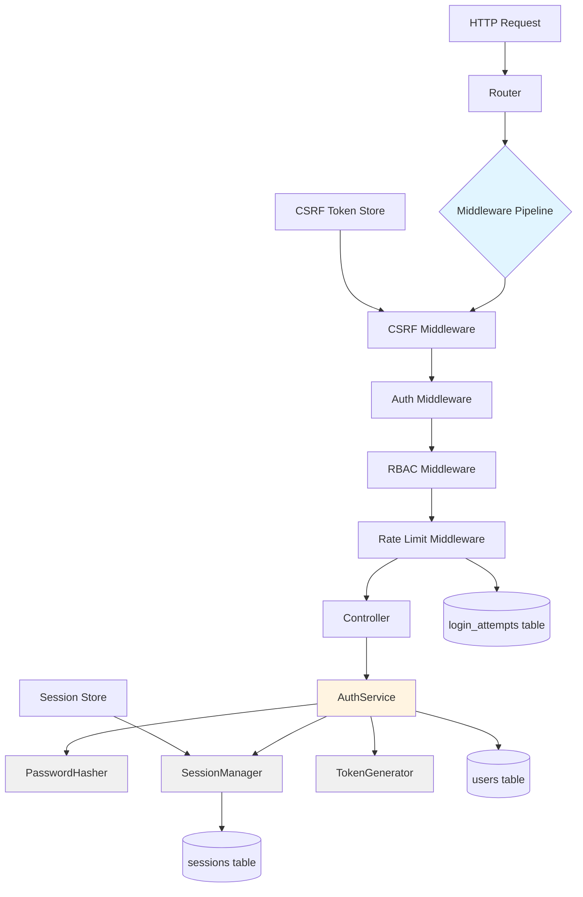
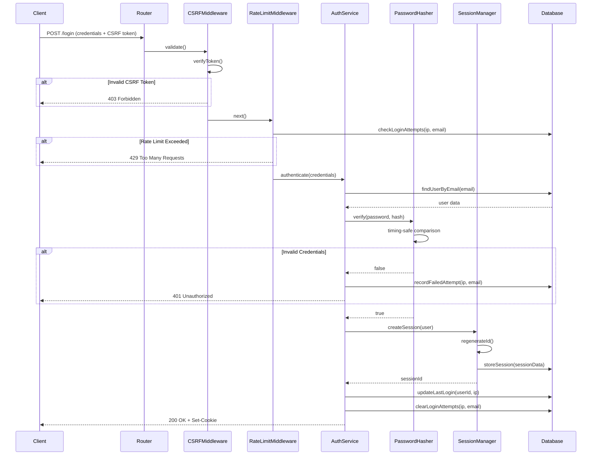
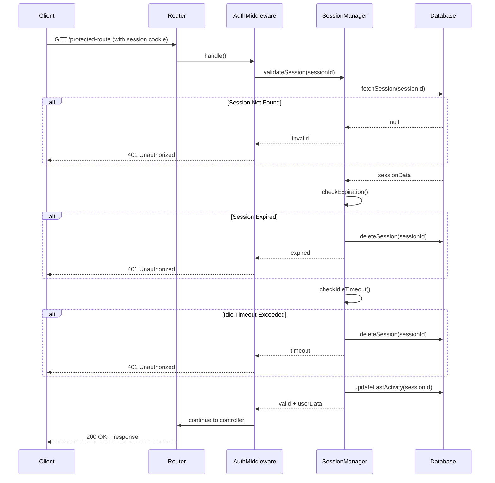
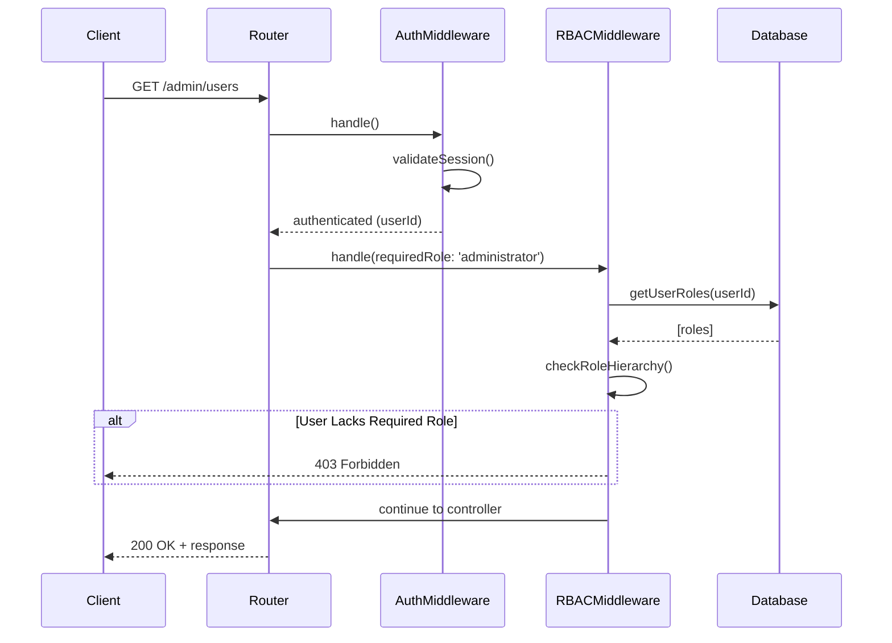

# Design Document: Authentication Infrastructure Layer

## Overview

The Authentication Infrastructure Layer provides secure, production-ready authentication and authorization services for the P.A.R.C.E PHP 8.2 MVC application. This layer implements password hashing, session management, CSRF protection, rate limiting, and RBAC middleware while maintaining strict separation from business logic. The design leverages existing database infrastructure, follows PSR-4 autoloading conventions, and implements security best practices including protection against timing attacks, session fixation, CSRF, and brute force attacks.

The infrastructure is designed to be stateless-ready for future API token management while currently focusing on database-backed session management for web application scalability. All components are built with PHP 8.2 features (typed properties, readonly classes, enums) and integrate seamlessly with the existing Database, Session, Router, and migration systems.

## Architecture



## Sequence Diagrams

### Login Flow with Security Checks



### Session Validation Flow



### RBAC Authorization Flow



## Components and Interfaces

### Component 1: PasswordHasher

**Purpose**: Provides secure password hashing and verification using Argon2id algorithm with timing-attack protection.

**Interface**:
```php
namespace App\Infrastructure\Auth;

interface PasswordHasherInterface
{
    public function hash(string $password): string;
    public function verify(string $password, string $hash): bool;
    public function needsRehash(string $hash): bool;
}
```

**Responsibilities**:
- Hash passwords using PHP's password_hash with PASSWORD_ARGON2ID
- Verify passwords with timing-safe comparison
- Detect if hash needs rehashing (algorithm upgrade)
- Enforce minimum password complexity requirements


### Component 2: AuthService

**Purpose**: Core authentication service handling login, logout, session management, and "remember me" functionality.

**Interface**:
```php
namespace App\Infrastructure\Auth;

interface AuthServiceInterface
{
    public function authenticate(string $email, string $password, bool $remember = false): AuthResult;
    public function logout(string $sessionId): bool;
    public function validateSession(string $sessionId): ?SessionData;
    public function refreshSession(string $sessionId): bool;
    public function getCurrentUser(): ?array;
    public function isAuthenticated(): bool;
}
```

**Responsibilities**:
- Authenticate users with email/password credentials
- Create and destroy user sessions
- Validate active sessions
- Manage "remember me" tokens
- Track last login timestamp and IP address
- Integrate with PasswordHasher and SessionManager

### Component 3: SessionManager

**Purpose**: Database-backed session management with security features including regeneration, timeout, and concurrent session handling.

**Interface**:
```php
namespace App\Infrastructure\Auth;

interface SessionManagerInterface
{
    public function create(int $userId, array $metadata): string;
    public function destroy(string $sessionId): bool;
    public function validate(string $sessionId): bool;
    public function get(string $sessionId): ?array;
    public function regenerate(string $sessionId): string;
    public function updateActivity(string $sessionId): bool;
    public function destroyAllUserSessions(int $userId): int;
    public function cleanup(): int;
}
```

**Responsibilities**:
- Store sessions in database (sessions table)
- Validate session existence and expiration
- Regenerate session IDs to prevent fixation
- Track last activity for idle timeout
- Handle concurrent session limits per user
- Clean up expired sessions
- Store session metadata (IP, user agent)


### Component 4: CsrfProtection

**Purpose**: Generate, validate, and manage CSRF tokens to protect against cross-site request forgery attacks.

**Interface**:
```php
namespace App\Infrastructure\Auth;

interface CsrfProtectionInterface
{
    public function generateToken(): string;
    public function validateToken(string $token): bool;
    public function getToken(): string;
    public function regenerateToken(): string;
}
```

**Responsibilities**:
- Generate cryptographically secure CSRF tokens
- Store tokens in session
- Validate tokens from request headers or body
- Regenerate tokens after successful validation
- Provide token for form/AJAX inclusion

### Component 5: RateLimiter

**Purpose**: Track and throttle login attempts to prevent brute force attacks with IP-based and account-based limiting.

**Interface**:
```php
namespace App\Infrastructure\Auth;

interface RateLimiterInterface
{
    public function attempt(string $key, int $maxAttempts, int $decayMinutes): bool;
    public function tooManyAttempts(string $key, int $maxAttempts): bool;
    public function hit(string $key, int $decayMinutes = 1): int;
    public function attempts(string $key): int;
    public function resetAttempts(string $key): void;
    public function availableIn(string $key): int;
    public function clear(string $key): void;
}
```

**Responsibilities**:
- Track login attempts by IP address
- Track login attempts by email address
- Implement exponential backoff
- Lock accounts after threshold exceeded
- Clear attempts after successful login
- Provide time until next attempt allowed


### Component 6: TokenGenerator

**Purpose**: Generate cryptographically secure random tokens for "remember me" functionality and other security tokens.

**Interface**:
```php
namespace App\Infrastructure\Auth;

interface TokenGeneratorInterface
{
    public function generate(int $length = 32): string;
    public function generateRememberToken(): string;
    public function hash(string $token): string;
}
```

**Responsibilities**:
- Generate secure random tokens using random_bytes()
- Create "remember me" tokens
- Hash tokens for database storage
- Provide configurable token length

### Component 7: AuthMiddleware

**Purpose**: Protect routes by validating user authentication status before allowing access.

**Interface**:
```php
namespace App\Infrastructure\Auth\Middleware;

interface MiddlewareInterface
{
    public function handle(Request $request, callable $next): Response;
}
```

**Responsibilities**:
- Validate session existence and validity
- Attach authenticated user data to request
- Redirect unauthenticated users to login
- Return 401 for API requests
- Refresh session activity timestamp

### Component 8: RBACMiddleware

**Purpose**: Enforce role-based access control by checking user roles against required permissions.

**Interface**:
```php
namespace App\Infrastructure\Auth\Middleware;

interface RBACMiddlewareInterface extends MiddlewareInterface
{
    public function requireRole(string|array $roles): self;
    public function requireAnyRole(array $roles): self;
    public function requireAllRoles(array $roles): self;
}
```

**Responsibilities**:
- Fetch user roles from database
- Check role hierarchy (super_admin > administrator > mechanic > customer)
- Support single role, any-of-roles, and all-of-roles checks
- Return 403 Forbidden for insufficient permissions
- Cache role checks within request lifecycle


## Data Models

### Model 1: AuthResult

```php
namespace App\Infrastructure\Auth\DTO;

readonly class AuthResult
{
    public function __construct(
        public bool $success,
        public ?int $userId,
        public ?string $sessionId,
        public ?string $message,
        public ?array $errors = null
    ) {}
    
    public static function success(int $userId, string $sessionId): self
    {
        return new self(true, $userId, $sessionId, 'Authentication successful');
    }
    
    public static function failure(string $message, ?array $errors = null): self
    {
        return new self(false, null, null, $message, $errors);
    }
}
```

**Validation Rules**:
- `success` must be boolean
- If `success` is true, `userId` and `sessionId` must not be null
- If `success` is false, `message` must be provided

### Model 2: SessionData

```php
namespace App\Infrastructure\Auth\DTO;

readonly class SessionData
{
    public function __construct(
        public string $id,
        public int $userId,
        public string $ipAddress,
        public string $userAgent,
        public int $lastActivity,
        public int $createdAt,
        public ?int $expiresAt = null
    ) {}
    
    public function isExpired(): bool
    {
        return $this->expiresAt !== null && time() > $this->expiresAt;
    }
    
    public function isIdle(int $maxIdleSeconds): bool
    {
        return (time() - $this->lastActivity) > $maxIdleSeconds;
    }
}
```

**Validation Rules**:
- `id` must be non-empty string (session ID)
- `userId` must be positive integer
- `ipAddress` must be valid IPv4 or IPv6 address
- `lastActivity` must be Unix timestamp
- `createdAt` must be Unix timestamp
- `expiresAt` must be null or future timestamp


### Model 3: RateLimitConfig

```php
namespace App\Infrastructure\Auth\DTO;

readonly class RateLimitConfig
{
    public function __construct(
        public int $maxAttempts,
        public int $decayMinutes,
        public int $lockoutMinutes
    ) {}
    
    public static function default(): self
    {
        return new self(
            maxAttempts: 5,
            decayMinutes: 15,
            lockoutMinutes: 30
        );
    }
    
    public static function strict(): self
    {
        return new self(
            maxAttempts: 3,
            decayMinutes: 10,
            lockoutMinutes: 60
        );
    }
}
```

**Validation Rules**:
- `maxAttempts` must be positive integer (1-100)
- `decayMinutes` must be positive integer (1-1440)
- `lockoutMinutes` must be positive integer (1-1440)

### Model 4: CookieConfig

```php
namespace App\Infrastructure\Auth\DTO;

readonly class CookieConfig
{
    public function __construct(
        public string $name,
        public int $lifetime,
        public string $path,
        public string $domain,
        public bool $secure,
        public bool $httpOnly,
        public string $sameSite
    ) {}
    
    public static function secure(): self
    {
        return new self(
            name: 'parce_session',
            lifetime: 7200, // 2 hours
            path: '/',
            domain: '',
            secure: true,
            httpOnly: true,
            sameSite: 'Lax'
        );
    }
}
```

**Validation Rules**:
- `name` must be non-empty string
- `lifetime` must be positive integer (seconds)
- `path` must start with '/'
- `secure` must be true in production
- `httpOnly` must be true
- `sameSite` must be 'Strict', 'Lax', or 'None'


## Algorithmic Pseudocode

### Main Authentication Algorithm

```php
/**
 * Authenticate user with email and password
 * 
 * @param string $email User email address
 * @param string $password Plain text password
 * @param bool $remember Enable "remember me" functionality
 * @return AuthResult Authentication result with session data
 */
function authenticate(string $email, string $password, bool $remember = false): AuthResult
{
    // Preconditions
    assert(!empty($email) && filter_var($email, FILTER_VALIDATE_EMAIL));
    assert(!empty($password) && strlen($password) >= 8);
    
    // Step 1: Fetch user from database
    $user = Database::fetchOne(
        'SELECT id, email, password_hash, account_status 
         FROM users 
         WHERE email = ? AND deleted_at IS NULL',
        [$email]
    );
    
    // Step 2: Handle user not found (timing-safe)
    if ($user === null) {
        // Perform dummy hash to prevent timing attacks
        PasswordHasher::hash('dummy_password_for_timing');
        return AuthResult::failure('Invalid credentials');
    }
    
    // Step 3: Check account status
    if ($user['account_status'] !== 'active') {
        return AuthResult::failure('Account is not active');
    }
    
    // Step 4: Verify password (timing-safe comparison)
    $isValid = PasswordHasher::verify($password, $user['password_hash']);
    
    if (!$isValid) {
        // Record failed attempt for rate limiting
        RateLimiter::hit("login:{$email}", 15);
        RateLimiter::hit("login_ip:{$_SERVER['REMOTE_ADDR']}", 15);
        return AuthResult::failure('Invalid credentials');
    }
    
    // Step 5: Check if password needs rehashing
    if (PasswordHasher::needsRehash($user['password_hash'])) {
        $newHash = PasswordHasher::hash($password);
        Database::update('users', ['password_hash' => $newHash], 'id = ?', [$user['id']]);
    }
    
    // Step 6: Create session
    $sessionId = SessionManager::create($user['id'], [
        'ip_address' => $_SERVER['REMOTE_ADDR'],
        'user_agent' => $_SERVER['HTTP_USER_AGENT'] ?? '',
        'remember' => $remember
    ]);
    
    // Step 7: Update last login
    Database::update('users', [
        'last_login_at' => date('Y-m-d H:i:s'),
        'last_login_ip' => $_SERVER['REMOTE_ADDR']
    ], 'id = ?', [$user['id']]);
    
    // Step 8: Clear rate limit attempts
    RateLimiter::clear("login:{$email}");
    RateLimiter::clear("login_ip:{$_SERVER['REMOTE_ADDR']}");
    
    // Step 9: Set session cookie
    $cookieConfig = CookieConfig::secure();
    setcookie(
        $cookieConfig->name,
        $sessionId,
        time() + ($remember ? 2592000 : $cookieConfig->lifetime), // 30 days or 2 hours
        $cookieConfig->path,
        $cookieConfig->domain,
        $cookieConfig->secure,
        $cookieConfig->httpOnly
    );
    
    // Postconditions
    assert($sessionId !== null && strlen($sessionId) > 0);
    
    return AuthResult::success($user['id'], $sessionId);
}
```

**Preconditions:**
- `$email` is non-empty and valid email format
- `$password` is non-empty and at least 8 characters
- Database connection is established
- Rate limiter is not blocking the request

**Postconditions:**
- Returns `AuthResult` with success status
- If successful: session created in database, cookie set, last login updated
- If failed: rate limit counter incremented, no session created
- Timing-safe execution regardless of success/failure

**Loop Invariants:** N/A (no loops in main flow)


### Session Validation Algorithm

```php
/**
 * Validate session and return session data
 * 
 * @param string $sessionId Session identifier from cookie
 * @return SessionData|null Session data if valid, null otherwise
 */
function validateSession(string $sessionId): ?SessionData
{
    // Preconditions
    assert(!empty($sessionId));
    assert(strlen($sessionId) === 40); // SHA1 hash length
    
    // Step 1: Fetch session from database
    $session = Database::fetchOne(
        'SELECT id, user_id, ip_address, user_agent, payload, last_activity, created_at
         FROM sessions
         WHERE id = ?',
        [$sessionId]
    );
    
    // Step 2: Check if session exists
    if ($session === null) {
        return null;
    }
    
    // Step 3: Decode payload
    $payload = json_decode($session['payload'], true);
    $expiresAt = $payload['expires_at'] ?? null;
    $maxIdleSeconds = $payload['max_idle_seconds'] ?? 1800; // 30 minutes default
    
    // Step 4: Check absolute expiration
    if ($expiresAt !== null && time() > $expiresAt) {
        Database::delete('sessions', 'id = ?', [$sessionId]);
        return null;
    }
    
    // Step 5: Check idle timeout
    $idleTime = time() - $session['last_activity'];
    if ($idleTime > $maxIdleSeconds) {
        Database::delete('sessions', 'id = ?', [$sessionId]);
        return null;
    }
    
    // Step 6: Update last activity
    Database::update('sessions', [
        'last_activity' => time()
    ], 'id = ?', [$sessionId]);
    
    // Step 7: Create SessionData object
    $sessionData = new SessionData(
        id: $session['id'],
        userId: (int)$session['user_id'],
        ipAddress: $session['ip_address'],
        userAgent: $session['user_agent'],
        lastActivity: (int)$session['last_activity'],
        createdAt: strtotime($session['created_at']),
        expiresAt: $expiresAt
    );
    
    // Postconditions
    assert($sessionData->userId > 0);
    assert(!$sessionData->isExpired());
    assert(!$sessionData->isIdle($maxIdleSeconds));
    
    return $sessionData;
}
```

**Preconditions:**
- `$sessionId` is non-empty string
- `$sessionId` is valid SHA1 hash format (40 characters)
- Database connection is established

**Postconditions:**
- Returns `SessionData` if session is valid and not expired
- Returns `null` if session is invalid, expired, or idle
- Expired/idle sessions are deleted from database
- Valid sessions have `last_activity` updated

**Loop Invariants:** N/A (no loops)


### Rate Limiting Algorithm

```php
/**
 * Check if rate limit is exceeded for given key
 * 
 * @param string $key Rate limit key (e.g., "login:email@example.com")
 * @param int $maxAttempts Maximum allowed attempts
 * @param int $decayMinutes Time window in minutes
 * @return bool True if too many attempts, false otherwise
 */
function tooManyAttempts(string $key, int $maxAttempts, int $decayMinutes): bool
{
    // Preconditions
    assert(!empty($key));
    assert($maxAttempts > 0 && $maxAttempts <= 100);
    assert($decayMinutes > 0 && $decayMinutes <= 1440);
    
    // Step 1: Fetch attempts from database
    $attempts = Database::fetchOne(
        'SELECT attempts, last_attempt_at
         FROM login_attempts
         WHERE key_hash = ? AND expires_at > NOW()',
        [hash('sha256', $key)]
    );
    
    // Step 2: No attempts recorded
    if ($attempts === null) {
        return false;
    }
    
    // Step 3: Check if attempts exceed maximum
    $exceeded = $attempts['attempts'] >= $maxAttempts;
    
    // Postconditions
    assert(is_bool($exceeded));
    
    return $exceeded;
}

/**
 * Record a rate limit attempt
 * 
 * @param string $key Rate limit key
 * @param int $decayMinutes Time window in minutes
 * @return int Current attempt count
 */
function hit(string $key, int $decayMinutes): int
{
    // Preconditions
    assert(!empty($key));
    assert($decayMinutes > 0 && $decayMinutes <= 1440);
    
    $keyHash = hash('sha256', $key);
    $expiresAt = date('Y-m-d H:i:s', time() + ($decayMinutes * 60));
    
    // Step 1: Try to fetch existing record
    $existing = Database::fetchOne(
        'SELECT id, attempts FROM login_attempts WHERE key_hash = ? AND expires_at > NOW()',
        [$keyHash]
    );
    
    // Step 2: Update or insert
    if ($existing !== null) {
        $newAttempts = $existing['attempts'] + 1;
        Database::update('login_attempts', [
            'attempts' => $newAttempts,
            'last_attempt_at' => date('Y-m-d H:i:s'),
            'expires_at' => $expiresAt
        ], 'id = ?', [$existing['id']]);
    } else {
        Database::insert('login_attempts', [
            'key_hash' => $keyHash,
            'attempts' => 1,
            'last_attempt_at' => date('Y-m-d H:i:s'),
            'expires_at' => $expiresAt,
            'created_at' => date('Y-m-d H:i:s')
        ]);
        $newAttempts = 1;
    }
    
    // Postconditions
    assert($newAttempts > 0);
    
    return $newAttempts;
}
```

**Preconditions:**
- `$key` is non-empty string
- `$maxAttempts` is positive integer (1-100)
- `$decayMinutes` is positive integer (1-1440)
- Database connection is established

**Postconditions:**
- `tooManyAttempts()` returns boolean indicating if limit exceeded
- `hit()` returns current attempt count after increment
- Expired attempts are automatically ignored via SQL WHERE clause
- Key is hashed with SHA256 before storage

**Loop Invariants:** N/A (no loops)


### CSRF Token Validation Algorithm

```php
/**
 * Validate CSRF token from request
 * 
 * @param string $token Token from request header or body
 * @return bool True if valid, false otherwise
 */
function validateCsrfToken(string $token): bool
{
    // Preconditions
    assert(!empty($token));
    assert(strlen($token) === 64); // 32 bytes hex-encoded
    
    // Step 1: Get stored token from session
    $storedToken = Session::get('csrf_token');
    
    // Step 2: Check if token exists in session
    if ($storedToken === null) {
        return false;
    }
    
    // Step 3: Timing-safe comparison
    $isValid = hash_equals($storedToken, $token);
    
    // Step 4: Regenerate token after successful validation (single-use)
    if ($isValid) {
        Session::set('csrf_token', bin2hex(random_bytes(32)));
    }
    
    // Postconditions
    assert(is_bool($isValid));
    
    return $isValid;
}

/**
 * Generate new CSRF token
 * 
 * @return string Hex-encoded token
 */
function generateCsrfToken(): string
{
    // Preconditions: None
    
    // Step 1: Generate cryptographically secure random bytes
    $token = bin2hex(random_bytes(32));
    
    // Step 2: Store in session
    Session::set('csrf_token', $token);
    
    // Postconditions
    assert(strlen($token) === 64);
    assert(ctype_xdigit($token));
    
    return $token;
}
```

**Preconditions:**
- `validateCsrfToken()`: `$token` is non-empty 64-character hex string
- `generateCsrfToken()`: Session is started
- PHP session is available

**Postconditions:**
- `validateCsrfToken()` returns boolean result of timing-safe comparison
- Valid tokens are regenerated after use (single-use pattern)
- `generateCsrfToken()` returns 64-character hex string
- Generated token is stored in session

**Loop Invariants:** N/A (no loops)


## Key Functions with Formal Specifications

### Function 1: PasswordHasher::hash()

```php
public function hash(string $password): string
```

**Preconditions:**
- `$password` is non-empty string
- `$password` length is at least 8 characters
- PHP password_hash function is available
- PASSWORD_ARGON2ID algorithm is supported

**Postconditions:**
- Returns non-empty string containing Argon2id hash
- Hash starts with "$argon2id$" prefix
- Hash can be verified with password_verify()
- Original password cannot be recovered from hash

**Loop Invariants:** N/A

### Function 2: PasswordHasher::verify()

```php
public function verify(string $password, string $hash): bool
```

**Preconditions:**
- `$password` is non-empty string
- `$hash` is non-empty string in valid password_hash format
- PHP password_verify function is available

**Postconditions:**
- Returns boolean indicating if password matches hash
- Execution time is constant regardless of result (timing-safe)
- No side effects on input parameters
- Result is deterministic for same inputs

**Loop Invariants:** N/A

### Function 3: SessionManager::create()

```php
public function create(int $userId, array $metadata): string
```

**Preconditions:**
- `$userId` is positive integer
- `$userId` exists in users table
- `$metadata` contains 'ip_address' and 'user_agent' keys
- Database connection is established

**Postconditions:**
- Returns non-empty session ID string (40 characters)
- Session record inserted into sessions table
- Session ID is cryptographically secure
- `last_activity` is set to current timestamp
- Session is immediately retrievable by returned ID

**Loop Invariants:** N/A


### Function 4: SessionManager::regenerate()

```php
public function regenerate(string $sessionId): string
```

**Preconditions:**
- `$sessionId` is non-empty string
- Session with `$sessionId` exists in database
- Database connection is established

**Postconditions:**
- Returns new session ID (different from input)
- Old session record is deleted from database
- New session record created with same user_id and metadata
- `last_activity` is updated to current timestamp
- Prevents session fixation attacks

**Loop Invariants:** N/A

### Function 5: RateLimiter::attempt()

```php
public function attempt(string $key, int $maxAttempts, int $decayMinutes): bool
```

**Preconditions:**
- `$key` is non-empty string
- `$maxAttempts` is positive integer (1-100)
- `$decayMinutes` is positive integer (1-1440)
- Database connection is established

**Postconditions:**
- Returns `true` if attempt is allowed (under limit)
- Returns `false` if rate limit exceeded
- If allowed, attempt counter is incremented
- Expired attempts are automatically cleaned up
- No side effects if limit exceeded

**Loop Invariants:** N/A

### Function 6: CsrfProtection::generateToken()

```php
public function generateToken(): string
```

**Preconditions:**
- PHP session is started
- random_bytes() function is available

**Postconditions:**
- Returns 64-character hex string
- Token is cryptographically secure
- Token is stored in session
- Token is unique (collision probability negligible)
- Token can be validated with validateToken()

**Loop Invariants:** N/A


### Function 7: AuthMiddleware::handle()

```php
public function handle(Request $request, callable $next): Response
```

**Preconditions:**
- `$request` is valid Request object
- `$next` is callable middleware chain
- Session cookie may or may not be present

**Postconditions:**
- If authenticated: request continues to next middleware with user data attached
- If not authenticated (web): returns redirect to login page
- If not authenticated (API): returns 401 JSON response
- Session activity timestamp is updated if valid
- No exceptions thrown for missing/invalid sessions

**Loop Invariants:** N/A

### Function 8: RBACMiddleware::handle()

```php
public function handle(Request $request, callable $next): Response
```

**Preconditions:**
- `$request` is valid Request object
- `$request` has authenticated user data attached (from AuthMiddleware)
- Required roles are configured on middleware instance
- Database connection is established

**Postconditions:**
- If authorized: request continues to next middleware
- If not authorized: returns 403 Forbidden response
- User roles are fetched from database
- Role hierarchy is respected (super_admin has all permissions)
- Role check result is cached in request for performance

**Loop Invariants:**
- When checking multiple required roles: all previously checked roles were valid

## Example Usage

### Example 1: Basic Login Flow

```php
// In LoginController.php
public function login(Request $request): Response
{
    $email = $request->input('email');
    $password = $request->input('password');
    $remember = $request->input('remember', false);
    
    // Authenticate user
    $result = $this->authService->authenticate($email, $password, $remember);
    
    if ($result->success) {
        return $this->success([
            'user_id' => $result->userId,
            'session_id' => $result->sessionId
        ], 'Login successful');
    }
    
    return $this->error($result->message, $result->errors, 401);
}
```


### Example 2: Protected Route with Authentication

```php
// In routes.php
$router->group(['middleware' => ['auth']], function($router) {
    $router->get('/dashboard', [DashboardController::class, 'index']);
    $router->get('/profile', [ProfileController::class, 'show']);
});

// Middleware automatically validates session and attaches user data
// In DashboardController.php
public function index(Request $request): Response
{
    $user = $request->getAttribute('auth_user');
    return $this->view('dashboard', ['user' => $user]);
}
```

### Example 3: RBAC Protected Route

```php
// In routes.php
$router->group(['middleware' => ['auth', 'rbac:administrator']], function($router) {
    $router->get('/admin/users', [AdminController::class, 'listUsers']);
    $router->post('/admin/users/{id}/suspend', [AdminController::class, 'suspendUser']);
});

// Only users with 'administrator' or 'super_admin' role can access
// In AdminController.php
public function listUsers(Request $request): Response
{
    $users = Database::fetchAll('SELECT * FROM users WHERE deleted_at IS NULL');
    return $this->json(['users' => $users]);
}
```

### Example 4: CSRF Protection in Form

```php
// In view template
<form method="POST" action="/login">
    <input type="hidden" name="csrf_token" value="<?= $csrfToken ?>">
    <input type="email" name="email" required>
    <input type="password" name="password" required>
    <button type="submit">Login</button>
</form>

// In routes.php - CSRF middleware automatically validates token
$router->group(['middleware' => ['csrf']], function($router) {
    $router->post('/login', [AuthController::class, 'login']);
    $router->post('/logout', [AuthController::class, 'logout']);
});
```

### Example 5: Rate Limiting

```php
// In routes.php - Rate limit middleware protects login endpoint
$router->post('/login', [AuthController::class, 'login'])
    ->middleware(['rate_limit:5,15']); // 5 attempts per 15 minutes

// Rate limiter automatically tracks attempts by IP and email
// Returns 429 Too Many Requests if exceeded
```


### Example 6: Session Management

```php
// Logout and destroy session
public function logout(Request $request): Response
{
    $sessionId = $request->cookie('parce_session');
    
    if ($sessionId) {
        $this->sessionManager->destroy($sessionId);
    }
    
    // Clear cookie
    setcookie('parce_session', '', time() - 3600, '/', '', true, true);
    
    return $this->redirect('/login');
}

// Logout from all devices
public function logoutAllDevices(Request $request): Response
{
    $user = $request->getAttribute('auth_user');
    $count = $this->sessionManager->destroyAllUserSessions($user['id']);
    
    return $this->success(['sessions_destroyed' => $count], 'Logged out from all devices');
}
```

### Example 7: Password Hashing

```php
// Hash password during user registration
public function register(Request $request): Response
{
    $password = $request->input('password');
    $hashedPassword = $this->passwordHasher->hash($password);
    
    $userId = Database::insert('users', [
        'email' => $request->input('email'),
        'password_hash' => $hashedPassword,
        'first_name' => $request->input('first_name'),
        'last_name' => $request->input('last_name'),
        'account_status' => 'pending_verification'
    ]);
    
    return $this->success(['user_id' => $userId], 'Registration successful');
}
```

## Correctness Properties

*A property is a characteristic or behavior that should hold true across all valid executions of a system-essentially, a formal statement about what the system should do. Properties serve as the bridge between human-readable specifications and machine-verifiable correctness guarantees.*

### Property 1: Password Security
**∀ password ∈ Passwords**: `hash(password)` produces irreversible Argon2id hash that cannot be converted back to plaintext

**Validates: Requirements 1.1, 1.2, 1.3, 1.5**

### Property 2: Timing Attack Prevention
**∀ password₁, password₂ ∈ Passwords, ∀ hash ∈ Hashes**: `execution_time(verify(password₁, hash)) ≈ execution_time(verify(password₂, hash))` (constant time)

**Validates: Requirements 2.4, 24.1, 24.2, 24.3, 24.4**

### Property 3: Session Uniqueness
**∀ session₁, session₂ ∈ Sessions**: `session₁.id ≠ session₂.id` (collision probability < 2⁻¹²⁸)

**Validates: Requirements 4.1, 4.6**

### Property 4: Session Expiration
**∀ session ∈ Sessions**: `(current_time > session.expires_at) ⟹ validate(session.id) = null`

**Validates: Requirements 5.3, 6.1, 6.3**

### Property 5: Session Idle Timeout
**∀ session ∈ Sessions**: `(current_time - session.last_activity > max_idle_seconds) ⟹ validate(session.id) = null`

**Validates: Requirements 5.4, 6.2, 6.3**

### Property 6: Password Verification Round-Trip
**∀ password ∈ Passwords**: `verify(password, hash(password)) = true`

**Validates: Requirements 2.1, 2.2**

### Property 7: Password Verification Rejection
**∀ password₁, password₂ ∈ Passwords where password₁ ≠ password₂**: `verify(password₁, hash(password₂)) = false`

**Validates: Requirement 2.3**

### Property 8: Session ID Format
**∀ session ∈ Sessions**: `length(session.id) = 40 ∧ ctype_xdigit(session.id) = true`

**Validates: Requirement 4.2**

### Property 9: Session Regeneration Security
**∀ session ∈ Sessions**: `regenerate(session.id) ⟹ (validate(session.id) = null) ∧ (∃ newSession: validate(newSession.id) ≠ null)`

**Validates: Requirements 7.1, 7.2, 7.3, 7.5**

### Property 10: Cookie Security
**∀ cookie ∈ SessionCookies**: `(cookie.httpOnly = true) ∧ (cookie.secure = true in production) ∧ (cookie.sameSite ∈ {'Strict', 'Lax'})`

**Validates: Requirements 12.1, 12.2, 12.3**

### Property 11: Session Metadata Preservation
**∀ session ∈ Sessions, metadata ∈ Metadata**: `create(userId, metadata) ⟹ get(session.id).metadata = metadata`

**Validates: Requirements 4.4, 19.1, 19.2, 19.3, 19.5**

### Property 12: Session Activity Update
**∀ session ∈ Sessions**: `validate(session.id) ⟹ session.last_activity = current_time`

**Validates: Requirements 5.5, 7.4**

### Property 13: AuthResult Consistency
**∀ result ∈ AuthResults**: `(result.success = true ⟹ result.userId ≠ null ∧ result.sessionId ≠ null) ∧ (result.success = false ⟹ result.message ≠ null)`

**Validates: Requirements 10.3, 10.4**

### Property 14: SessionData Validation
**∀ sessionData ∈ SessionData**: `sessionData.userId > 0 ∧ isValidIP(sessionData.ipAddress) ∧ sessionData.lastActivity > 0 ∧ sessionData.createdAt > 0`

**Validates: Requirements 11.3, 11.4, 11.5**

### Property 15: CookieConfig Path Validation
**∀ config ∈ CookieConfig**: `startsWith(config.path, '/')`

**Validates: Requirement 12.5**

### Property 16: RateLimitConfig Bounds
**∀ config ∈ RateLimitConfig**: `(1 ≤ config.maxAttempts ≤ 100) ∧ (1 ≤ config.decayMinutes ≤ 1440) ∧ (1 ≤ config.lockoutMinutes ≤ 1440)`

**Validates: Requirements 13.1, 13.2, 13.3**

### Property 17: Session Destruction Completeness
**∀ userId ∈ UserIds**: `destroyAllUserSessions(userId) ⟹ (∀ session ∈ Sessions: session.userId ≠ userId)`

**Validates: Requirements 9.1, 22.3**

### Property 18: Session Payload Completeness
**∀ session ∈ Sessions**: `session.payload contains {user_id, expires_at, max_idle_seconds, remember, created_at, ip_address, user_agent}`

**Validates: Requirement 23.2**

### Property 19: Authentication Error Message Uniformity
**∀ email₁, email₂ ∈ Emails where exists(email₁) ∧ ¬exists(email₂)**: `authenticate(email₁, wrong_password).message = authenticate(email₂, any_password).message`

**Validates: Requirements 3.2, 18.4**

### Property 20: Hash Non-Determinism
**∀ password ∈ Passwords**: `hash(password) ≠ hash(password)` (different salts produce different hashes)

**Validates: Requirement 1.3**

## Error Handling

### Error Scenario 1: Invalid Credentials

**Condition**: User provides incorrect email or password during login
**Response**: 
- Return 401 Unauthorized with generic message "Invalid credentials"
- Increment rate limit counter for IP and email
- Do NOT reveal whether email exists (prevent user enumeration)
- Perform dummy hash operation to maintain constant timing
**Recovery**: User can retry with correct credentials (subject to rate limiting)

### Error Scenario 2: Rate Limit Exceeded

**Condition**: User exceeds maximum login attempts within time window
**Response**:
- Return 429 Too Many Requests
- Include `Retry-After` header with seconds until next attempt allowed
- Log suspicious activity for security monitoring
- Display lockout duration to user
**Recovery**: User must wait for decay period to expire, or contact support for manual unlock

### Error Scenario 3: Session Expired

**Condition**: User's session has exceeded absolute or idle timeout
**Response**:
- Delete expired session from database
- Return 401 Unauthorized for API requests
- Redirect to login page for web requests
- Preserve intended destination URL for post-login redirect
**Recovery**: User must re-authenticate to create new session

### Error Scenario 4: CSRF Token Mismatch

**Condition**: Request contains invalid or missing CSRF token
**Response**:
- Return 403 Forbidden with message "CSRF token validation failed"
- Log potential CSRF attack attempt
- Do NOT process the request
- Regenerate new CSRF token for next request
**Recovery**: User should refresh page to get new token and retry

### Error Scenario 5: Insufficient Permissions

**Condition**: Authenticated user lacks required role for protected resource
**Response**:
- Return 403 Forbidden with message "Insufficient permissions"
- Log unauthorized access attempt
- Do NOT reveal what roles are required (information disclosure)
**Recovery**: User must request role assignment through admin access request workflow


### Error Scenario 6: Account Suspended

**Condition**: User attempts to login with suspended or deactivated account
**Response**:
- Return 403 Forbidden with message "Account is not active"
- Do NOT create session or update last login
- Log login attempt for audit trail
**Recovery**: User must contact support to reactivate account

### Error Scenario 7: Database Connection Failure

**Condition**: Database connection is unavailable during authentication
**Response**:
- Return 503 Service Unavailable
- Log database error with full stack trace
- Display generic error message to user (do not expose internal details)
- Retry connection with exponential backoff (handled by Database class)
**Recovery**: System automatically retries; user should wait and retry request

### Error Scenario 8: Session Fixation Attack

**Condition**: Attacker attempts to use pre-set session ID
**Response**:
- Regenerate session ID immediately after successful login
- Invalidate old session ID
- Create new session with fresh ID
- Update session cookie with new ID
**Recovery**: Automatic - no user action required

## Testing Strategy

### Unit Testing Approach

**Test Coverage Goals**: 90%+ code coverage for all authentication components

**Key Test Cases**:

1. **PasswordHasher Tests**:
   - Hash produces valid Argon2id format
   - Verify returns true for correct password
   - Verify returns false for incorrect password
   - needsRehash detects outdated algorithms
   - Timing consistency across success/failure paths

2. **AuthService Tests**:
   - Successful authentication creates session
   - Invalid credentials return failure
   - Suspended accounts cannot login
   - Last login timestamp updated on success
   - Rate limit counters cleared on success
   - Dummy hash performed for non-existent users

3. **SessionManager Tests**:
   - Create generates unique session IDs
   - Validate returns null for expired sessions
   - Validate returns null for idle sessions
   - Regenerate creates new ID and deletes old
   - destroyAllUserSessions removes all user sessions
   - cleanup removes expired sessions

4. **CsrfProtection Tests**:
   - generateToken produces 64-character hex string
   - validateToken returns true for valid token
   - validateToken returns false for invalid token
   - Token regenerated after successful validation
   - Timing-safe comparison used

5. **RateLimiter Tests**:
   - tooManyAttempts returns false under limit
   - tooManyAttempts returns true over limit
   - hit increments counter
   - clear resets counter
   - Expired attempts ignored


6. **Middleware Tests**:
   - AuthMiddleware allows authenticated requests
   - AuthMiddleware blocks unauthenticated requests
   - RBACMiddleware allows authorized roles
   - RBACMiddleware blocks unauthorized roles
   - CsrfMiddleware validates tokens correctly
   - RateLimitMiddleware enforces limits

### Property-Based Testing Approach

**Property Test Library**: PHPUnit with custom property generators

**Properties to Test**:

1. **Password Hashing Properties**:
   - ∀ password: `verify(password, hash(password)) = true`
   - ∀ password₁ ≠ password₂: `hash(password₁) ≠ hash(password₂)`
   - ∀ password: `length(hash(password)) > 0`

2. **Session ID Properties**:
   - ∀ session: `length(session.id) = 40`
   - ∀ session₁, session₂: `session₁.id ≠ session₂.id` (uniqueness)
   - ∀ session: `ctype_xdigit(session.id) = true`

3. **CSRF Token Properties**:
   - ∀ token: `length(token) = 64`
   - ∀ token: `ctype_xdigit(token) = true`
   - ∀ token₁, token₂: `token₁ ≠ token₂` (uniqueness)

4. **Rate Limiting Properties**:
   - ∀ key, n < maxAttempts: `hit(key, n times) ⟹ tooManyAttempts(key) = false`
   - ∀ key, n ≥ maxAttempts: `hit(key, n times) ⟹ tooManyAttempts(key) = true`
   - ∀ key: `clear(key) ⟹ attempts(key) = 0`

5. **Timing Attack Properties**:
   - ∀ password, hash: `variance(execution_time(verify(password, hash))) < threshold`
   - ∀ email: `variance(execution_time(authenticate(email, password))) < threshold`

### Integration Testing Approach

**Integration Test Scenarios**:

1. **Full Login Flow**:
   - POST /login with valid credentials
   - Verify session created in database
   - Verify cookie set in response
   - Verify last_login_at updated
   - Verify rate limit cleared

2. **Protected Route Access**:
   - GET /dashboard without session → 401
   - GET /dashboard with valid session → 200
   - GET /dashboard with expired session → 401

3. **RBAC Flow**:
   - GET /admin/users as customer → 403
   - GET /admin/users as administrator → 200
   - GET /admin/users as super_admin → 200

4. **Rate Limiting Flow**:
   - POST /login 5 times with wrong password
   - 6th attempt → 429 Too Many Requests
   - Wait for decay period
   - Next attempt → allowed

5. **CSRF Protection Flow**:
   - POST /login without CSRF token → 403
   - POST /login with invalid CSRF token → 403
   - POST /login with valid CSRF token → 200

6. **Session Lifecycle**:
   - Login → session created
   - Access protected route → session validated
   - Idle for 30 minutes → session expired
   - Access protected route → 401


## Performance Considerations

### Database Query Optimization

**Session Validation**:
- Index on `sessions.id` (primary key) for O(1) lookup
- Index on `sessions.last_activity` for efficient cleanup queries
- Index on `sessions.user_id` for user session management

**Rate Limiting**:
- Index on `login_attempts.key_hash` for fast lookup
- Index on `login_attempts.expires_at` for automatic expiration filtering
- Composite index on `(key_hash, expires_at)` for optimal query performance

**User Authentication**:
- Index on `users.email` for fast user lookup during login
- Index on `users.account_status` for filtering active accounts

### Caching Strategy

**Session Data Caching**:
- Cache validated session data in PHP session for request duration
- Avoid repeated database queries for same session within request
- Cache user roles after first RBAC check in request

**Rate Limit Caching**:
- Consider Redis/Memcached for high-traffic rate limiting
- Current database approach suitable for moderate traffic (<1000 req/s)

### Performance Targets

- **Login Request**: < 200ms (including password verification)
- **Session Validation**: < 50ms (database lookup + validation)
- **RBAC Check**: < 30ms (cached roles)
- **CSRF Validation**: < 5ms (session lookup + comparison)
- **Rate Limit Check**: < 20ms (database lookup)

### Scalability Considerations

**Horizontal Scaling**:
- Database-backed sessions support multiple application servers
- No server-side session affinity required
- Rate limiting works across all servers (shared database)

**Session Cleanup**:
- Scheduled job to delete expired sessions (run every hour)
- Cleanup query: `DELETE FROM sessions WHERE last_activity < (UNIX_TIMESTAMP() - max_idle_seconds)`
- Batch delete in chunks to avoid table locks

**Connection Pooling**:
- Existing Database class uses PDO persistent connections
- Reduces connection overhead for authentication queries


## Security Considerations

### Threat Model

**Threats Addressed**:
1. **Brute Force Attacks**: Rate limiting with exponential backoff
2. **Session Fixation**: Session ID regeneration after login
3. **Session Hijacking**: Secure cookies (HttpOnly, Secure, SameSite)
4. **CSRF Attacks**: Token-based protection with single-use tokens
5. **Timing Attacks**: Constant-time password verification
6. **User Enumeration**: Generic error messages for invalid credentials
7. **Password Cracking**: Argon2id hashing with high cost parameters
8. **Replay Attacks**: Session expiration and idle timeout
9. **Concurrent Session Abuse**: Optional session limit per user
10. **SQL Injection**: Parameterized queries via PDO

### Security Best Practices

**Password Security**:
- Argon2id algorithm (memory-hard, resistant to GPU attacks)
- Minimum 8 characters enforced at application layer
- Password complexity requirements (business logic layer)
- Automatic rehashing when algorithm parameters updated

**Session Security**:
- Cryptographically secure session IDs (random_bytes)
- Session regeneration after privilege escalation
- Absolute timeout (2 hours default)
- Idle timeout (30 minutes default)
- IP address and user agent tracking for anomaly detection

**Cookie Security**:
- `HttpOnly`: Prevents JavaScript access (XSS mitigation)
- `Secure`: HTTPS-only transmission (MITM mitigation)
- `SameSite=Lax`: CSRF protection at browser level
- Short lifetime for non-remember sessions

**Rate Limiting**:
- IP-based limiting (5 attempts per 15 minutes)
- Email-based limiting (5 attempts per 15 minutes)
- Account lockout after threshold (30 minutes)
- Exponential backoff for repeated failures

**CSRF Protection**:
- Token required for all state-changing operations
- Single-use tokens (regenerated after validation)
- Token stored in session (not cookie)
- Timing-safe token comparison

**Audit Logging**:
- Log all authentication attempts (success and failure)
- Log rate limit violations
- Log CSRF validation failures
- Log RBAC authorization failures
- Include timestamp, IP address, user agent, and user ID

### Compliance Considerations

**OWASP Top 10 Coverage**:
- A01:2021 - Broken Access Control: RBAC middleware
- A02:2021 - Cryptographic Failures: Argon2id hashing, secure tokens
- A03:2021 - Injection: Parameterized queries
- A05:2021 - Security Misconfiguration: Secure defaults
- A07:2021 - Identification and Authentication Failures: Comprehensive auth system

**GDPR Considerations**:
- Session data includes IP address (personal data)
- Provide session deletion on user account deletion
- Log retention policy for audit logs
- User consent for "remember me" functionality


## Dependencies

### PHP Extensions
- **ext-pdo**: Database connectivity (required)
- **ext-pdo_mysql**: MySQL driver (required)
- **ext-sodium**: Cryptographic operations (required for PHP 8.2)
- **ext-json**: JSON encoding/decoding (required)
- **ext-mbstring**: Multibyte string operations (recommended)

### PHP Built-in Functions
- `password_hash()`: Argon2id password hashing
- `password_verify()`: Password verification
- `password_needs_rehash()`: Hash algorithm detection
- `random_bytes()`: Cryptographically secure random generation
- `hash_equals()`: Timing-safe string comparison
- `hash()`: SHA256 hashing for rate limit keys
- `session_start()`: PHP session management
- `setcookie()`: Cookie management

### Existing Application Components
- **App\Core\Database**: Database query execution and connection management
- **App\Core\Session**: PHP session wrapper with security features
- **App\Core\Router**: Route registration and middleware pipeline
- **App\Core\Route**: Individual route with middleware support
- **App\Core\Request**: HTTP request abstraction
- **App\Core\Response**: HTTP response abstraction
- **App\Core\Controller**: Base controller class

### Database Tables
- **users**: User account information (existing)
- **roles**: System roles for RBAC (existing)
- **user_roles**: User-role assignments (existing)
- **sessions**: Database-backed session storage (existing)
- **login_attempts**: Rate limiting tracking (new - requires migration)

### Configuration Requirements
- **APP_KEY**: Application encryption key (for token generation)
- **SESSION_LIFETIME**: Session absolute timeout in minutes (default: 120)
- **SESSION_IDLE_TIMEOUT**: Session idle timeout in minutes (default: 30)
- **RATE_LIMIT_MAX_ATTEMPTS**: Maximum login attempts (default: 5)
- **RATE_LIMIT_DECAY_MINUTES**: Rate limit time window (default: 15)
- **RATE_LIMIT_LOCKOUT_MINUTES**: Account lockout duration (default: 30)
- **CSRF_TOKEN_NAME**: CSRF token field name (default: csrf_token)
- **REMEMBER_ME_LIFETIME**: Remember me cookie lifetime in days (default: 30)

### External Libraries
None - implementation uses only PHP standard library and existing application infrastructure

### Future Dependencies (Out of Scope)
- JWT library for API token management
- OAuth client library for social login
- Email service for verification workflows
- Two-factor authentication library


## Database Schema Requirements

### New Migration: login_attempts Table

```sql
CREATE TABLE login_attempts (
    id BIGINT UNSIGNED AUTO_INCREMENT PRIMARY KEY,
    key_hash VARCHAR(64) NOT NULL,
    attempts INT UNSIGNED NOT NULL DEFAULT 1,
    last_attempt_at TIMESTAMP NOT NULL DEFAULT CURRENT_TIMESTAMP,
    expires_at TIMESTAMP NOT NULL,
    created_at TIMESTAMP DEFAULT CURRENT_TIMESTAMP,
    
    INDEX idx_key_hash (key_hash),
    INDEX idx_expires_at (expires_at),
    INDEX idx_key_expires (key_hash, expires_at)
) ENGINE=InnoDB DEFAULT CHARSET=utf8mb4 COLLATE=utf8mb4_unicode_ci;
```

**Purpose**: Track login attempts for rate limiting by IP address and email

**Fields**:
- `key_hash`: SHA256 hash of rate limit key (e.g., "login:email@example.com" or "login_ip:192.168.1.1")
- `attempts`: Number of failed attempts within time window
- `last_attempt_at`: Timestamp of most recent attempt
- `expires_at`: Expiration timestamp (attempts reset after this time)

### Enhancements to Existing sessions Table

The existing `sessions` table structure is sufficient, but the following indexes should be verified:

```sql
-- Verify these indexes exist
INDEX idx_user_id (user_id)
INDEX idx_last_activity (last_activity)
```

**Payload Structure** (JSON stored in `payload` column):
```json
{
    "user_id": 123,
    "expires_at": 1735689600,
    "max_idle_seconds": 1800,
    "remember": false,
    "created_at": 1735682400,
    "ip_address": "192.168.1.1",
    "user_agent": "Mozilla/5.0..."
}
```

## Implementation Phases

### Phase 1: Core Authentication (Priority: High)
- PasswordHasher service
- AuthService with login/logout
- SessionManager with database backend
- Basic AuthMiddleware

### Phase 2: Security Features (Priority: High)
- CsrfProtection service
- CsrfMiddleware
- RateLimiter service
- RateLimitMiddleware
- login_attempts migration

### Phase 3: Authorization (Priority: Medium)
- RBACMiddleware
- Role hierarchy implementation
- Permission checking utilities

### Phase 4: Advanced Features (Priority: Low)
- "Remember me" functionality
- Concurrent session management
- Session cleanup scheduler
- Audit logging enhancements

## File Structure

```
app/
├── Infrastructure/
│   └── Auth/
│       ├── Services/
│       │   ├── PasswordHasher.php
│       │   ├── AuthService.php
│       │   ├── SessionManager.php
│       │   ├── CsrfProtection.php
│       │   ├── RateLimiter.php
│       │   └── TokenGenerator.php
│       ├── Middleware/
│       │   ├── AuthMiddleware.php
│       │   ├── RBACMiddleware.php
│       │   ├── CsrfMiddleware.php
│       │   └── RateLimitMiddleware.php
│       ├── DTO/
│       │   ├── AuthResult.php
│       │   ├── SessionData.php
│       │   ├── RateLimitConfig.php
│       │   └── CookieConfig.php
│       └── Exceptions/
│           ├── AuthenticationException.php
│           ├── AuthorizationException.php
│           ├── RateLimitException.php
│           └── CsrfException.php
database/
└── migrations/
    └── 2024_01_02_000001_create_login_attempts_table.php
```

## Conclusion

This design provides a comprehensive, secure, and scalable authentication infrastructure layer for the P.A.R.C.E application. The implementation follows PHP 8.2 best practices, integrates seamlessly with existing infrastructure, and addresses all major security concerns including brute force attacks, session fixation, CSRF, timing attacks, and unauthorized access.

The modular design allows for phased implementation, with core authentication features in Phase 1 and advanced security features in subsequent phases. All components are designed with testability in mind, supporting both unit and integration testing strategies.

The infrastructure layer maintains strict separation from business logic, making it reusable across different application contexts and future-proof for API token management and OAuth integration.
