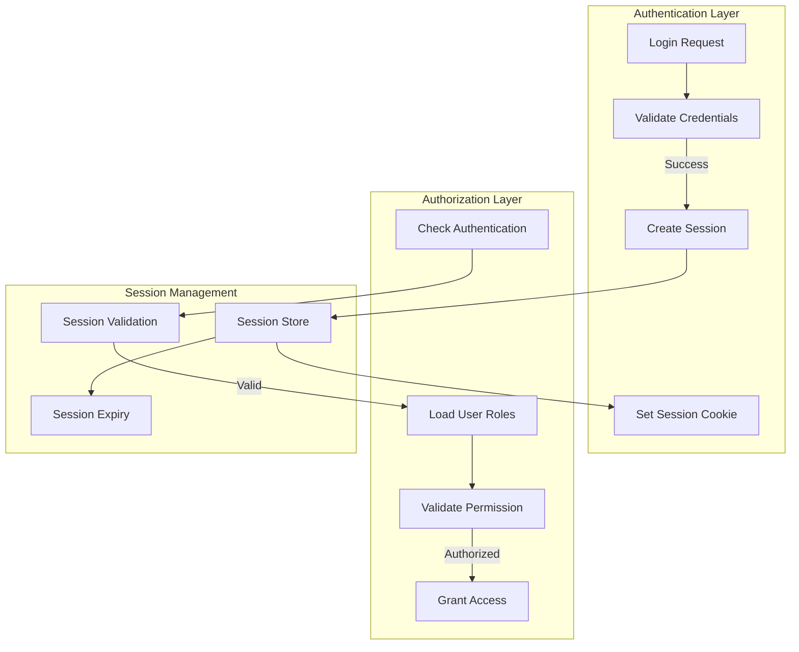
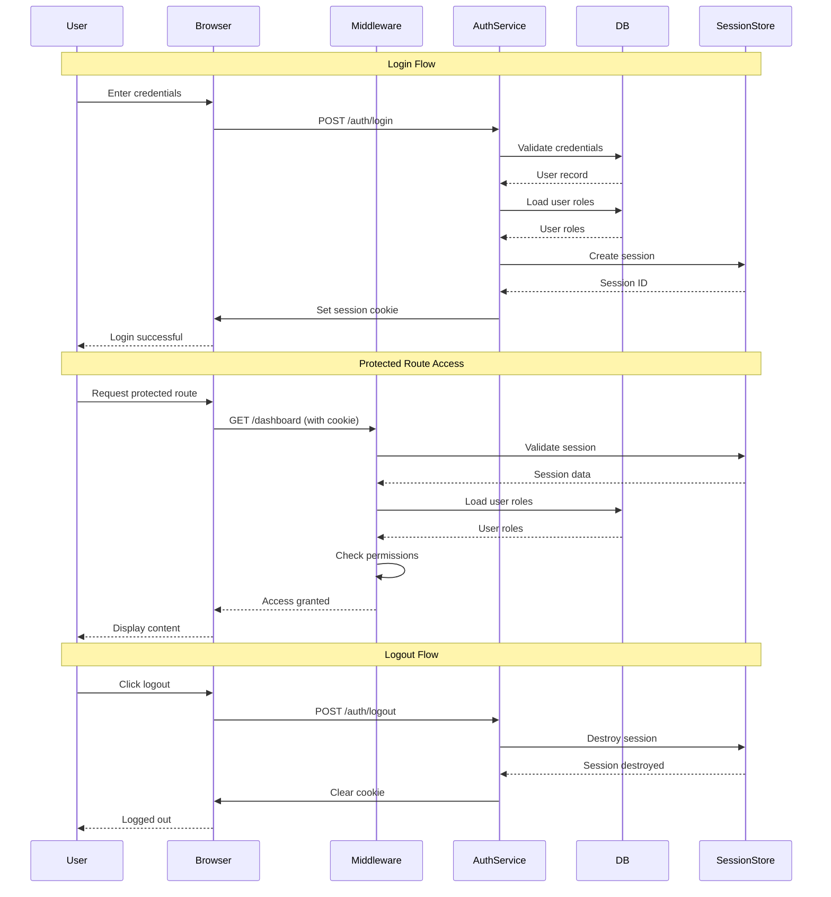
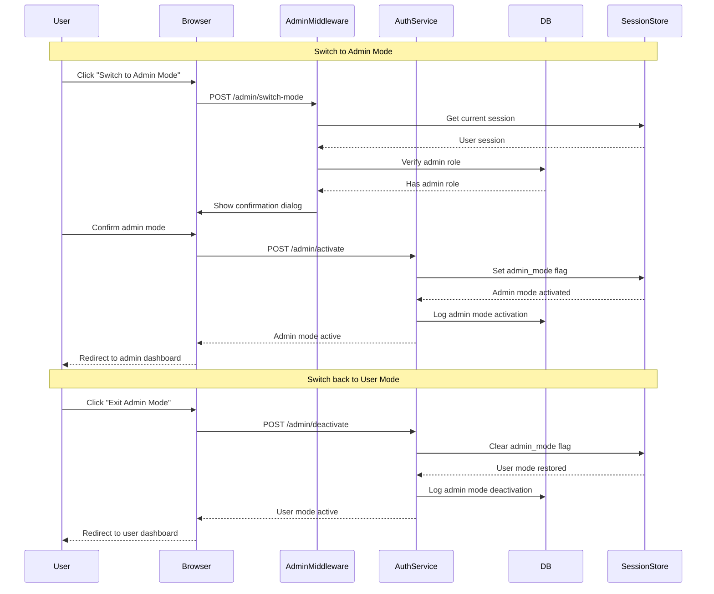

# Authentication and Authorization Architecture Design

## Overview

This document specifies the comprehensive authentication and authorization architecture for the P.A.R.C.E platform. The architecture addresses critical gaps in route protection, session management, RBAC implementation, administrator mode switching, and mechanic verification access control. The design leverages the existing refactored users, roles, and user_roles tables to implement a secure, scalable authentication and authorization system with proper middleware architecture, session lifecycle management, and multi-device awareness.

The architecture supports login/logout flows, password recovery, session expiration, role-based access control (RBAC), protected routes, administrator approval workflows, mechanic verification restrictions, and secure session validation. Security considerations include brute force protection, CSRF prevention, XSS mitigation, secure cookie handling, and password reset token strategies.

## Architecture

### High-Level Authentication Flow




### Complete Authentication and Authorization Flow




### Administrator Mode Switching Flow




## Components and Interfaces

### Component 1: Authentication Service

**Purpose**: Handles user authentication, login, logout, and credential validation

**Responsibilities**:
- Validate user credentials (email + password)
- Create authenticated sessions
- Destroy sessions on logout
- Handle "remember me" functionality
- Manage password reset tokens
- Track login attempts for brute force protection
- Update last_login_at and last_login_ip

**Interface Methods**:
```
login(email, password, remember_me) -> Session
logout(session_id) -> boolean
logoutAllDevices(user_id) -> boolean
validateSession(session_id) -> Session | null
refreshSession(session_id) -> Session
requestPasswordReset(email) -> ResetToken
validateResetToken(token) -> boolean
resetPassword(token, new_password) -> boolean
```

**Security Considerations**:
- Password hashing: bcrypt with cost factor 12
- Rate limiting: Max 5 login attempts per 15 minutes per IP
- Session token: Cryptographically secure random 64-character string
- Remember me token: Separate long-lived token (30 days)
- Password reset token: Single-use, expires in 1 hour


### Component 2: Authorization Service

**Purpose**: Handles role-based access control (RBAC) and permission validation

**Responsibilities**:
- Load user roles from database
- Validate user permissions for routes/actions
- Check role expiration and active status
- Support role hierarchy (admin > mechanic > customer)
- Cache role data for performance
- Handle temporary role assignments

**Interface Methods**:
```
hasRole(user_id, role_slug) -> boolean
hasAnyRole(user_id, role_slugs[]) -> boolean
hasAllRoles(user_id, role_slugs[]) -> boolean
getUserRoles(user_id) -> Role[]
canAccessRoute(user_id, route) -> boolean
canPerformAction(user_id, action, resource) -> boolean
```

**Authorization Query** (optimized for performance):
```sql
SELECT COUNT(*) > 0 as has_role
FROM user_roles ur
JOIN roles r ON r.id = ur.role_id
WHERE ur.user_id = ?
  AND r.slug = ?
  AND ur.is_active = TRUE
  AND (ur.expires_at IS NULL OR ur.expires_at > NOW());
```


### Component 3: Session Manager

**Purpose**: Manages session lifecycle, storage, and validation

**Responsibilities**:
- Create new sessions on login
- Store session data (user_id, roles, admin_mode, device_info)
- Validate session tokens
- Handle session expiration
- Support "remember me" extended sessions
- Enable logout from all devices
- Clean up expired sessions

**Session Storage Options**:
1. **Database** (recommended for MVP):
   - Persistent across server restarts
   - Supports multi-server deployments
   - Easy to query and manage
   - Slightly slower than in-memory

2. **Redis** (recommended for scale):
   - Fast in-memory storage
   - Built-in expiration support
   - Supports distributed caching
   - Requires additional infrastructure

**Session Data Structure**:
```json
{
  "session_id": "abc123...",
  "user_id": 42,
  "roles": ["customer", "mechanic"],
  "admin_mode": false,
  "remember_me": false,
  "ip_address": "192.168.1.1",
  "user_agent": "Mozilla/5.0...",
  "created_at": "2024-01-15T10:30:00Z",
  "last_activity": "2024-01-15T11:45:00Z",
  "expires_at": "2024-01-15T12:30:00Z"
}
```


### Component 4: Middleware Architecture

**Purpose**: Intercept requests to enforce authentication and authorization rules

**Middleware Stack**:
```
Request
  ↓
[1] CSRF Protection Middleware
  ↓
[2] Authentication Middleware
  ↓
[3] Authorization Middleware (Role-based)
  ↓
[4] Admin Mode Middleware (if admin route)
  ↓
[5] Mechanic Verification Middleware (if mechanic route)
  ↓
Controller
```

**Middleware 1: CSRF Protection**
- Validates CSRF token on state-changing requests (POST, PUT, DELETE)
- Generates and validates tokens per session
- Rejects requests with invalid/missing tokens

**Middleware 2: Authentication**
- Validates session cookie
- Loads user data from session store
- Rejects unauthenticated requests to protected routes
- Allows public routes to pass through

**Middleware 3: Authorization (Role-based)**
- Checks if user has required role(s)
- Supports single role or multiple role requirements
- Returns 403 Forbidden if unauthorized

**Middleware 4: Admin Mode**
- Verifies admin_mode flag is set in session
- Prevents accidental admin actions in user mode
- Requires explicit admin mode activation

**Middleware 5: Mechanic Verification**
- Checks mechanic verification status
- Blocks unverified mechanics from service routes
- Allows access to verification-related routes


### Component 5: Administrator Mode Manager

**Purpose**: Manages switching between user mode and admin mode for users with admin roles

**Responsibilities**:
- Verify user has admin role before allowing mode switch
- Set/clear admin_mode flag in session
- Log all admin mode activations/deactivations
- Require confirmation before activating admin mode
- Auto-deactivate admin mode after inactivity (30 minutes)
- Prevent accidental admin actions in user mode

**Admin Mode Rules**:
1. Only users with 'administrator' or 'super_admin' role can activate admin mode
2. Admin mode requires explicit activation (not automatic on login)
3. Admin mode is session-specific (not persistent across logins)
4. Admin actions are logged with admin_mode flag
5. Admin mode auto-expires after 30 minutes of inactivity
6. User can manually deactivate admin mode at any time

**Admin Mode Session Data**:
```json
{
  "admin_mode": true,
  "admin_mode_activated_at": "2024-01-15T10:00:00Z",
  "admin_mode_last_activity": "2024-01-15T10:25:00Z",
  "admin_mode_expires_at": "2024-01-15T10:30:00Z"
}
```


### Component 6: Mechanic Verification Manager

**Purpose**: Enforces access restrictions for unverified mechanics

**Responsibilities**:
- Check mechanic verification status
- Block unverified mechanics from accepting services
- Allow access to verification-related routes
- Handle suspended mechanic accounts
- Support pending verification state

**Verification Status Checks**:
```sql
-- Check if mechanic is verified and can accept services
SELECT 
    u.id,
    u.account_status,
    COUNT(CASE WHEN vd.status = 'verified' THEN 1 END) as verified_docs,
    COUNT(CASE WHEN dt.is_required = TRUE THEN 1 END) as required_docs
FROM users u
JOIN user_roles ur ON ur.user_id = u.id
JOIN roles r ON r.id = ur.role_id
LEFT JOIN vehicles v ON v.mechanic_id = u.id AND v.deleted_at IS NULL
LEFT JOIN vehicle_documents vd ON vd.vehicle_id = v.id
LEFT JOIN document_types dt ON dt.id = vd.document_type_id
WHERE u.id = ?
  AND r.slug = 'mechanic'
  AND ur.is_active = TRUE
  AND u.account_status = 'active'
GROUP BY u.id, u.account_status
HAVING verified_docs >= required_docs;
```

**Access Restrictions**:
- **Unverified Mechanics**: Can view profile, upload documents, view verification status
- **Verified Mechanics**: Full access to service acceptance, location tracking, payments
- **Suspended Mechanics**: Read-only access, cannot accept new services
- **Pending Verification**: Can complete profile, cannot accept services yet


## Data Models

### Model 1: sessions (New Table)

**Purpose**: Store active user sessions for authentication and session management

```sql
CREATE TABLE sessions (
    id VARCHAR(64) PRIMARY KEY COMMENT 'Cryptographically secure session ID',
    user_id BIGINT UNSIGNED NOT NULL,
    ip_address VARCHAR(45) NOT NULL COMMENT 'IPv4 or IPv6 address',
    user_agent TEXT NULL COMMENT 'Browser user agent string',
    payload TEXT NOT NULL COMMENT 'Serialized session data',
    last_activity TIMESTAMP NOT NULL DEFAULT CURRENT_TIMESTAMP ON UPDATE CURRENT_TIMESTAMP,
    expires_at TIMESTAMP NOT NULL,
    created_at TIMESTAMP DEFAULT CURRENT_TIMESTAMP,
    
    FOREIGN KEY (user_id) REFERENCES users(id) ON DELETE CASCADE,
    
    INDEX idx_user_id (user_id),
    INDEX idx_last_activity (last_activity),
    INDEX idx_expires_at (expires_at),
    INDEX idx_user_last_activity (user_id, last_activity DESC)
) ENGINE=InnoDB DEFAULT CHARSET=utf8mb4 COLLATE=utf8mb4_unicode_ci;
```

**Validation Rules**:
- `id` must be 64-character cryptographically secure random string
- `user_id` must reference valid user
- `ip_address` must be valid IPv4 or IPv6 format
- `expires_at` must be in the future
- `last_activity` updated on every request
- Sessions expire after 2 hours of inactivity (configurable)


### Model 2: remember_tokens (New Table)

**Purpose**: Store long-lived "remember me" tokens for persistent authentication

```sql
CREATE TABLE remember_tokens (
    id BIGINT UNSIGNED AUTO_INCREMENT PRIMARY KEY,
    user_id BIGINT UNSIGNED NOT NULL,
    token VARCHAR(64) NOT NULL UNIQUE COMMENT 'Cryptographically secure token',
    ip_address VARCHAR(45) NOT NULL,
    user_agent TEXT NULL,
    expires_at TIMESTAMP NOT NULL,
    created_at TIMESTAMP DEFAULT CURRENT_TIMESTAMP,
    
    FOREIGN KEY (user_id) REFERENCES users(id) ON DELETE CASCADE,
    
    INDEX idx_user_id (user_id),
    INDEX idx_token (token),
    INDEX idx_expires_at (expires_at)
) ENGINE=InnoDB DEFAULT CHARSET=utf8mb4 COLLATE=utf8mb4_unicode_ci;
```

**Validation Rules**:
- `token` must be 64-character cryptographically secure random string
- `token` must be unique across all remember tokens
- `user_id` must reference valid user
- `expires_at` typically 30 days from creation
- Tokens are single-use (deleted after use, new token issued)


### Model 3: password_reset_tokens (New Table)

**Purpose**: Store password reset tokens for secure password recovery

```sql
CREATE TABLE password_reset_tokens (
    id BIGINT UNSIGNED AUTO_INCREMENT PRIMARY KEY,
    user_id BIGINT UNSIGNED NOT NULL,
    token VARCHAR(64) NOT NULL UNIQUE COMMENT 'Cryptographically secure token',
    ip_address VARCHAR(45) NOT NULL,
    expires_at TIMESTAMP NOT NULL,
    used_at TIMESTAMP NULL,
    created_at TIMESTAMP DEFAULT CURRENT_TIMESTAMP,
    
    FOREIGN KEY (user_id) REFERENCES users(id) ON DELETE CASCADE,
    
    INDEX idx_user_id (user_id),
    INDEX idx_token (token),
    INDEX idx_expires_at (expires_at),
    INDEX idx_used_at (used_at)
) ENGINE=InnoDB DEFAULT CHARSET=utf8mb4 COLLATE=utf8mb4_unicode_ci;
```

**Validation Rules**:
- `token` must be 64-character cryptographically secure random string
- `token` must be unique across all reset tokens
- `user_id` must reference valid user
- `expires_at` typically 1 hour from creation
- Tokens are single-use (marked as used after password reset)
- Unused tokens expire automatically


### Model 4: login_attempts (New Table)

**Purpose**: Track login attempts for brute force protection

```sql
CREATE TABLE login_attempts (
    id BIGINT UNSIGNED AUTO_INCREMENT PRIMARY KEY,
    email VARCHAR(255) NOT NULL,
    ip_address VARCHAR(45) NOT NULL,
    user_agent TEXT NULL,
    success BOOLEAN NOT NULL DEFAULT FALSE,
    failure_reason VARCHAR(100) NULL COMMENT 'invalid_credentials, account_suspended, etc.',
    attempted_at TIMESTAMP DEFAULT CURRENT_TIMESTAMP,
    
    INDEX idx_email (email),
    INDEX idx_ip_address (ip_address),
    INDEX idx_attempted_at (attempted_at),
    INDEX idx_email_ip_attempted (email, ip_address, attempted_at DESC),
    INDEX idx_success (success)
) ENGINE=InnoDB DEFAULT CHARSET=utf8mb4 COLLATE=utf8mb4_unicode_ci;
```

**Validation Rules**:
- `email` stores attempted email (even if user doesn't exist)
- `ip_address` must be valid IPv4 or IPv6 format
- `success` indicates if login was successful
- `failure_reason` explains why login failed
- Records older than 30 days can be deleted (retention policy)

**Brute Force Protection Logic**:
```sql
-- Check if IP or email has exceeded login attempt limit
SELECT COUNT(*) as failed_attempts
FROM login_attempts
WHERE (email = ? OR ip_address = ?)
  AND success = FALSE
  AND attempted_at > NOW() - INTERVAL 15 MINUTE;
  
-- If failed_attempts >= 5, block login for 15 minutes
```


### Model 5: admin_mode_logs (New Table)

**Purpose**: Audit trail for administrator mode activations and actions

```sql
CREATE TABLE admin_mode_logs (
    id BIGINT UNSIGNED AUTO_INCREMENT PRIMARY KEY,
    user_id BIGINT UNSIGNED NOT NULL,
    session_id VARCHAR(64) NOT NULL,
    action ENUM('activated', 'deactivated', 'expired', 'action_performed') NOT NULL,
    action_details TEXT NULL COMMENT 'Details of admin action performed',
    ip_address VARCHAR(45) NOT NULL,
    user_agent TEXT NULL,
    created_at TIMESTAMP DEFAULT CURRENT_TIMESTAMP,
    
    FOREIGN KEY (user_id) REFERENCES users(id) ON DELETE CASCADE,
    
    INDEX idx_user_id (user_id),
    INDEX idx_session_id (session_id),
    INDEX idx_action (action),
    INDEX idx_created_at (created_at),
    INDEX idx_user_action_created (user_id, action, created_at DESC)
) ENGINE=InnoDB DEFAULT CHARSET=utf8mb4 COLLATE=utf8mb4_unicode_ci;
```

**Validation Rules**:
- `user_id` must reference valid user with admin role
- `session_id` must reference valid session
- `action` tracks admin mode lifecycle and actions
- `action_details` stores JSON with action metadata
- All admin mode changes are logged for audit


### Model 6: mechanic_verification_status (New View)

**Purpose**: Consolidated view of mechanic verification status

```sql
CREATE OR REPLACE VIEW v_mechanic_verification_status AS
SELECT 
    u.id AS user_id,
    u.email,
    u.first_name,
    u.last_name,
    u.account_status,
    u.email_verification_status,
    u.phone_verification_status,
    v.id AS vehicle_id,
    v.license_plate,
    COUNT(DISTINCT vd.id) AS total_documents,
    COUNT(DISTINCT CASE WHEN vd.status = 'verified' THEN vd.id END) AS verified_documents,
    COUNT(DISTINCT CASE WHEN dt.is_required = TRUE THEN dt.id END) AS required_documents,
    COUNT(DISTINCT CASE WHEN vd.status = 'verified' AND dt.is_required = TRUE THEN vd.id END) AS verified_required_documents,
    CASE 
        WHEN u.account_status != 'active' THEN 'suspended'
        WHEN u.email_verification_status != 'verified' THEN 'email_unverified'
        WHEN u.phone_verification_status != 'verified' THEN 'phone_unverified'
        WHEN v.id IS NULL THEN 'no_vehicle'
        WHEN COUNT(DISTINCT CASE WHEN vd.status = 'verified' AND dt.is_required = TRUE THEN vd.id END) < 
             COUNT(DISTINCT CASE WHEN dt.is_required = TRUE THEN dt.id END) THEN 'documents_pending'
        ELSE 'verified'
    END AS verification_status,
    CASE 
        WHEN u.account_status != 'active' THEN FALSE
        WHEN u.email_verification_status != 'verified' THEN FALSE
        WHEN u.phone_verification_status != 'verified' THEN FALSE
        WHEN v.id IS NULL THEN FALSE
        WHEN COUNT(DISTINCT CASE WHEN vd.status = 'verified' AND dt.is_required = TRUE THEN vd.id END) < 
             COUNT(DISTINCT CASE WHEN dt.is_required = TRUE THEN dt.id END) THEN FALSE
        ELSE TRUE
    END AS can_accept_services
FROM users u
JOIN user_roles ur ON ur.user_id = u.id
JOIN roles r ON r.id = ur.role_id
LEFT JOIN vehicles v ON v.mechanic_id = u.id AND v.deleted_at IS NULL
LEFT JOIN vehicle_documents vd ON vd.vehicle_id = v.id
LEFT JOIN document_types dt ON dt.id = vd.document_type_id
WHERE r.slug = 'mechanic'
  AND ur.is_active = TRUE
  AND u.deleted_at IS NULL
GROUP BY u.id, u.email, u.first_name, u.last_name, u.account_status, 
         u.email_verification_status, u.phone_verification_status, v.id, v.license_plate;
```


## Authentication Flows

### Flow 1: Login with Credentials

**Steps**:
1. User submits email and password
2. System validates CSRF token
3. System checks brute force protection (max 5 attempts per 15 minutes)
4. System validates email format
5. System retrieves user by email
6. System verifies password hash (bcrypt)
7. System checks account_status (must be 'active')
8. System loads user roles
9. System creates session record
10. System generates session cookie (HttpOnly, Secure, SameSite=Lax)
11. System updates last_login_at and last_login_ip
12. System logs successful login attempt
13. System returns success response

**Pseudocode**:
```
function login(email, password, remember_me):
    // Brute force check
    if countFailedAttempts(email, ip) >= 5:
        return error("Too many attempts. Try again in 15 minutes")
    
    // Validate credentials
    user = findUserByEmail(email)
    if not user or not verifyPassword(password, user.password_hash):
        logLoginAttempt(email, ip, false, "invalid_credentials")
        return error("Invalid credentials")
    
    // Check account status
    if user.account_status != 'active':
        logLoginAttempt(email, ip, false, "account_" + user.account_status)
        return error("Account is " + user.account_status)
    
    // Load roles
    roles = getUserRoles(user.id)
    
    // Create session
    session_id = generateSecureToken(64)
    session_data = {
        user_id: user.id,
        roles: roles,
        admin_mode: false,
        ip_address: ip,
        user_agent: user_agent
    }
    
    expires_at = remember_me ? now() + 30 days : now() + 2 hours
    
    createSession(session_id, user.id, ip, user_agent, session_data, expires_at)
    
    // Create remember token if requested
    if remember_me:
        remember_token = generateSecureToken(64)
        createRememberToken(user.id, remember_token, ip, user_agent, now() + 30 days)
        setRememberCookie(remember_token)
    
    // Update user record
    updateUser(user.id, {
        last_login_at: now(),
        last_login_ip: ip
    })
    
    // Log success
    logLoginAttempt(email, ip, true, null)
    
    // Set session cookie
    setSessionCookie(session_id, expires_at)
    
    return success(user, roles)
```


### Flow 2: Logout

**Steps**:
1. User clicks logout
2. System validates session cookie
3. System deletes session record from database
4. System clears session cookie
5. System clears remember token cookie (if exists)
6. System redirects to login page

**Pseudocode**:
```
function logout(session_id):
    // Delete session
    deleteSession(session_id)
    
    // Clear cookies
    clearSessionCookie()
    clearRememberCookie()
    
    return redirect("/login")
```


### Flow 3: Logout from All Devices

**Steps**:
1. User clicks "Logout from all devices"
2. System validates current session
3. System deletes all sessions for user
4. System deletes all remember tokens for user
5. System clears current session cookie
6. System redirects to login page

**Pseudocode**:
```
function logoutAllDevices(user_id):
    // Delete all sessions
    deleteAllSessions(user_id)
    
    // Delete all remember tokens
    deleteAllRememberTokens(user_id)
    
    // Clear cookies
    clearSessionCookie()
    clearRememberCookie()
    
    return redirect("/login")
```


### Flow 4: Password Reset Request

**Steps**:
1. User submits email for password reset
2. System validates CSRF token
3. System finds user by email (silent fail if not found for security)
4. System generates password reset token
5. System stores token with 1-hour expiration
6. System sends reset email with token link
7. System returns success message (even if email doesn't exist)

**Pseudocode**:
```
function requestPasswordReset(email):
    user = findUserByEmail(email)
    
    // Silent fail for security (don't reveal if email exists)
    if not user:
        return success("If email exists, reset link sent")
    
    // Generate token
    token = generateSecureToken(64)
    expires_at = now() + 1 hour
    
    // Store token
    createPasswordResetToken(user.id, token, ip, expires_at)
    
    // Send email
    sendPasswordResetEmail(user.email, token)
    
    return success("If email exists, reset link sent")
```


### Flow 5: Password Reset Completion

**Steps**:
1. User clicks reset link with token
2. System validates token exists and not expired
3. System validates token not already used
4. User submits new password
5. System validates password strength
6. System hashes new password (bcrypt)
7. System updates user password
8. System marks token as used
9. System invalidates all sessions for user
10. System sends confirmation email
11. System redirects to login page

**Pseudocode**:
```
function resetPassword(token, new_password):
    // Validate token
    reset_token = findPasswordResetToken(token)
    
    if not reset_token:
        return error("Invalid or expired token")
    
    if reset_token.used_at:
        return error("Token already used")
    
    if reset_token.expires_at < now():
        return error("Token expired")
    
    // Validate password strength
    if not isStrongPassword(new_password):
        return error("Password too weak")
    
    // Hash password
    password_hash = bcrypt(new_password, cost=12)
    
    // Update user
    updateUser(reset_token.user_id, {
        password_hash: password_hash
    })
    
    // Mark token as used
    markTokenUsed(reset_token.id)
    
    // Invalidate all sessions
    deleteAllSessions(reset_token.user_id)
    deleteAllRememberTokens(reset_token.user_id)
    
    // Send confirmation email
    sendPasswordChangedEmail(reset_token.user_id)
    
    return success("Password reset successful")
```


### Flow 6: Session Validation (Middleware)

**Steps**:
1. Request arrives with session cookie
2. Middleware extracts session ID from cookie
3. Middleware retrieves session from database/cache
4. Middleware validates session not expired
5. Middleware updates last_activity timestamp
6. Middleware loads user data and roles
7. Middleware attaches user to request context
8. Request proceeds to controller

**Pseudocode**:
```
function validateSession(request):
    session_id = getSessionCookie(request)
    
    if not session_id:
        return unauthorized("No session")
    
    // Retrieve session
    session = findSession(session_id)
    
    if not session:
        return unauthorized("Invalid session")
    
    // Check expiration
    if session.expires_at < now():
        deleteSession(session_id)
        return unauthorized("Session expired")
    
    // Update activity
    updateSessionActivity(session_id)
    
    // Load user and roles
    user = findUser(session.user_id)
    roles = getUserRoles(session.user_id)
    
    // Attach to request
    request.user = user
    request.roles = roles
    request.session = session
    
    return next()
```


## Authorization Flows

### Flow 1: Role-Based Route Protection

**Steps**:
1. Request arrives at protected route
2. Authentication middleware validates session
3. Authorization middleware checks required role(s)
4. System queries user_roles table
5. System validates role is active and not expired
6. If authorized, request proceeds to controller
7. If unauthorized, return 403 Forbidden

**Pseudocode**:
```
function requireRole(required_role):
    return function(request):
        if not request.user:
            return unauthorized("Not authenticated")
        
        has_role = checkUserHasRole(request.user.id, required_role)
        
        if not has_role:
            return forbidden("Insufficient permissions")
        
        return next()
```

**Authorization Query**:
```sql
-- Check if user has specific role
SELECT COUNT(*) > 0 as has_role
FROM user_roles ur
JOIN roles r ON r.id = ur.role_id
WHERE ur.user_id = ?
  AND r.slug = ?
  AND ur.is_active = TRUE
  AND (ur.expires_at IS NULL OR ur.expires_at > NOW());
```


### Flow 2: Multiple Role Requirements

**Steps**:
1. Route requires one of multiple roles (e.g., admin OR super_admin)
2. Authorization middleware checks if user has ANY of the required roles
3. System queries user_roles with IN clause
4. If user has at least one role, access granted
5. If user has none of the roles, return 403 Forbidden

**Pseudocode**:
```
function requireAnyRole(required_roles):
    return function(request):
        if not request.user:
            return unauthorized("Not authenticated")
        
        has_any_role = checkUserHasAnyRole(request.user.id, required_roles)
        
        if not has_any_role:
            return forbidden("Insufficient permissions")
        
        return next()
```

**Authorization Query**:
```sql
-- Check if user has any of the specified roles
SELECT COUNT(*) > 0 as has_any_role
FROM user_roles ur
JOIN roles r ON r.id = ur.role_id
WHERE ur.user_id = ?
  AND r.slug IN (?, ?, ?)
  AND ur.is_active = TRUE
  AND (ur.expires_at IS NULL OR ur.expires_at > NOW());
```


### Flow 3: Administrator Mode Activation

**Steps**:
1. User with admin role clicks "Switch to Admin Mode"
2. System validates user has 'administrator' or 'super_admin' role
3. System displays confirmation dialog
4. User confirms admin mode activation
5. System sets admin_mode flag in session
6. System logs admin mode activation
7. System redirects to admin dashboard

**Pseudocode**:
```
function activateAdminMode(user_id, session_id):
    // Verify admin role
    has_admin_role = checkUserHasAnyRole(user_id, ['administrator', 'super_admin'])
    
    if not has_admin_role:
        return forbidden("Not an administrator")
    
    // Update session
    updateSession(session_id, {
        admin_mode: true,
        admin_mode_activated_at: now(),
        admin_mode_expires_at: now() + 30 minutes
    })
    
    // Log activation
    logAdminMode(user_id, session_id, 'activated', ip, user_agent)
    
    return success("Admin mode activated")
```


### Flow 4: Administrator Mode Deactivation

**Steps**:
1. User clicks "Exit Admin Mode"
2. System clears admin_mode flag in session
3. System logs admin mode deactivation
4. System redirects to user dashboard

**Pseudocode**:
```
function deactivateAdminMode(user_id, session_id):
    // Update session
    updateSession(session_id, {
        admin_mode: false,
        admin_mode_activated_at: null,
        admin_mode_expires_at: null
    })
    
    // Log deactivation
    logAdminMode(user_id, session_id, 'deactivated', ip, user_agent)
    
    return success("Admin mode deactivated")
```


### Flow 5: Admin Route Protection

**Steps**:
1. Request arrives at admin route
2. Authentication middleware validates session
3. Authorization middleware checks admin role
4. Admin mode middleware checks admin_mode flag
5. If admin_mode is false, return 403 with message "Activate admin mode first"
6. If admin_mode is true but expired, deactivate and return 403
7. If admin_mode is valid, request proceeds to controller

**Pseudocode**:
```
function requireAdminMode():
    return function(request):
        if not request.user:
            return unauthorized("Not authenticated")
        
        has_admin_role = checkUserHasAnyRole(request.user.id, ['administrator', 'super_admin'])
        
        if not has_admin_role:
            return forbidden("Not an administrator")
        
        if not request.session.admin_mode:
            return forbidden("Admin mode not activated")
        
        // Check expiration
        if request.session.admin_mode_expires_at < now():
            deactivateAdminMode(request.user.id, request.session.id)
            return forbidden("Admin mode expired")
        
        // Extend expiration on activity
        extendAdminModeExpiration(request.session.id, now() + 30 minutes)
        
        return next()
```


### Flow 6: Mechanic Verification Check

**Steps**:
1. Request arrives at mechanic-only route (e.g., accept service)
2. Authentication middleware validates session
3. Authorization middleware checks mechanic role
4. Mechanic verification middleware checks verification status
5. System queries v_mechanic_verification_status view
6. If can_accept_services is false, return 403 with verification requirements
7. If can_accept_services is true, request proceeds to controller

**Pseudocode**:
```
function requireVerifiedMechanic():
    return function(request):
        if not request.user:
            return unauthorized("Not authenticated")
        
        has_mechanic_role = checkUserHasRole(request.user.id, 'mechanic')
        
        if not has_mechanic_role:
            return forbidden("Not a mechanic")
        
        // Check verification status
        verification = getMechanicVerificationStatus(request.user.id)
        
        if not verification.can_accept_services:
            return forbidden({
                message: "Mechanic verification incomplete",
                status: verification.verification_status,
                requirements: {
                    email_verified: verification.email_verification_status == 'verified',
                    phone_verified: verification.phone_verification_status == 'verified',
                    vehicle_added: verification.vehicle_id != null,
                    documents_verified: verification.verified_required_documents >= verification.required_documents
                }
            })
        
        return next()
```

**Verification Status Query**:
```sql
-- Get mechanic verification status
SELECT 
    verification_status,
    can_accept_services,
    email_verification_status,
    phone_verification_status,
    vehicle_id,
    verified_required_documents,
    required_documents
FROM v_mechanic_verification_status
WHERE user_id = ?;
```


## Route Protection Strategy

### Public Routes (No Authentication Required)

```
GET  /                          # Landing page
GET  /about                     # About page
GET  /contact                   # Contact page
GET  /auth/login                # Login page
POST /auth/login                # Login submission
GET  /auth/register             # Registration page
POST /auth/register             # Registration submission
GET  /auth/forgot-password      # Password reset request page
POST /auth/forgot-password      # Password reset request submission
GET  /auth/reset-password       # Password reset page (with token)
POST /auth/reset-password       # Password reset submission
```


### Authenticated Routes (Requires Login)

```
GET  /dashboard                 # User dashboard (any authenticated user)
GET  /profile                   # User profile
POST /profile/update            # Update profile
POST /auth/logout               # Logout
POST /auth/logout-all           # Logout from all devices
```


### Customer Routes (Requires 'customer' Role)

```
GET  /services/request          # Request service page
POST /services/request          # Submit service request
GET  /services/my-services      # View customer's services
GET  /services/{id}             # View service details
POST /services/{id}/cancel      # Cancel service
POST /services/{id}/rate        # Rate completed service
GET  /payments/my-payments      # View payment history
```


### Mechanic Routes (Requires 'mechanic' Role)

**Unverified Mechanic Access** (verification_status != 'verified'):
```
GET  /mechanic/profile          # View/edit profile
POST /mechanic/profile/update   # Update profile
GET  /mechanic/vehicles         # View vehicles
POST /mechanic/vehicles/add     # Add vehicle
GET  /mechanic/documents        # View documents
POST /mechanic/documents/upload # Upload documents
GET  /mechanic/verification     # View verification status
```

**Verified Mechanic Access** (verification_status == 'verified'):
```
GET  /mechanic/services         # View available services
POST /mechanic/services/{id}/accept    # Accept service
POST /mechanic/services/{id}/reject    # Reject service
POST /mechanic/services/{id}/start     # Start service
POST /mechanic/services/{id}/complete  # Complete service
POST /mechanic/services/{id}/location  # Update location
GET  /mechanic/earnings         # View earnings
GET  /mechanic/ratings          # View ratings
```
