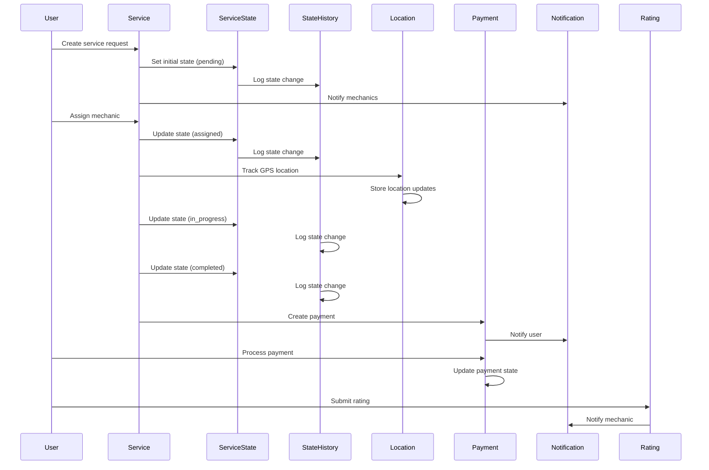
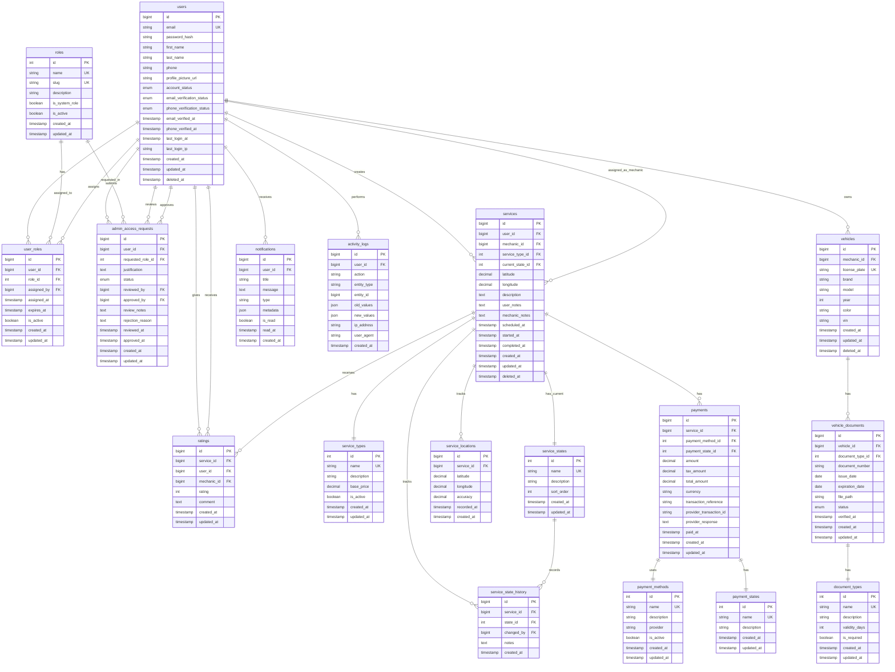

# Design Document: P.A.R.C.E Database Architecture

## ⚠️ CRITICAL UPDATE: Users and Roles Module Refactoring

**Last Updated**: [Current Date]  
**Scope**: Users, Roles, User_Roles, Admin_Access_Requests tables only  
**Status**: Refactored to eliminate role duplication and implement proper RBAC

### Summary of Changes

This refactoring addresses a critical design flaw in the original database architecture where user roles were managed in two places:
1. ❌ **REMOVED**: `user_type` ENUM field in `users` table (customer, mechanic, admin)
2. ✅ **ENHANCED**: `roles` and `user_roles` tables as the single source of truth

### What Changed

**users table**:
- ❌ Removed `user_type` ENUM field
- ❌ Removed `verification_status` ENUM (replaced with separate fields)
- ✅ Added `profile_picture_url` for user avatars
- ✅ Added `account_status` ENUM (active, suspended, deactivated, pending_verification)
- ✅ Split verification into `email_verification_status` and `phone_verification_status`
- ✅ Added `last_login_at` and `last_login_ip` for security tracking

**roles table**:
- ✅ Added `slug` field (machine-readable identifier like 'customer', 'mechanic', 'administrator')
- ✅ Added `is_system_role` flag (prevents deletion of core roles)
- ✅ Added `is_active` flag (enables/disables roles without deletion)

**user_roles table**:
- ✅ Added `assigned_by` field (tracks who assigned the role)
- ✅ Added `expires_at` field (supports temporary role assignments)
- ✅ Added `is_active` flag (enables/disables role without deletion)

**admin_access_requests table**:
- ✅ Added `requested_role_id` field (specifies which role is requested)
- ✅ Added `approved_by` field (separate from reviewer for two-person rule)
- ✅ Added `approved_at` timestamp
- ✅ Added `rejection_reason` field (required for rejected requests)
- ✅ Added CHECK constraints for data integrity

### Why This Matters

**Before (Problems)**:
- Two sources of truth for user roles (user_type vs user_roles)
- Users could only have one role (customer OR mechanic, not both)
- Adding new roles required schema changes (ALTER TABLE)
- No audit trail for role assignments
- No support for temporary access

**After (Benefits)**:
- Single source of truth (user_roles table)
- Users can have multiple roles simultaneously
- New roles can be added without schema changes
- Complete audit trail (who assigned, when, why)
- Supports temporary role assignments with expiration
- Better security with two-person rule for sensitive roles

### Migration Required

If you have existing data with `user_type` field, you must migrate:

```sql
-- Migrate existing user_type to user_roles
INSERT INTO user_roles (user_id, role_id, assigned_by, assigned_at)
SELECT u.id, r.id, NULL, u.created_at
FROM users u
JOIN roles r ON r.slug = u.user_type;

-- After verification, drop the old column
ALTER TABLE users DROP COLUMN user_type;
```

### Developer Action Required

**Update all authorization code**:
```sql
-- ❌ OLD (DO NOT USE)
SELECT * FROM users WHERE id = ? AND user_type = 'admin';

-- ✅ NEW (USE THIS)
SELECT COUNT(*) > 0 FROM user_roles ur
JOIN roles r ON r.id = ur.role_id
WHERE ur.user_id = ? AND r.slug = 'administrator'
  AND ur.is_active = TRUE
  AND (ur.expires_at IS NULL OR ur.expires_at > NOW());
```

---

## Overview

This design establishes a scalable, normalized, production-ready relational database architecture for the P.A.R.C.E platform (Plataforma de Asistencia Rápida para Conductores en Emergencia). The architecture supports core platform functionality including user management with role-based access control, service request lifecycle management with full state history tracking, mechanic vehicle and document management, payment processing with multiple providers, real-time GPS location tracking, notification systems, ratings and reputation management, and comprehensive audit logging. The database design follows third normal form (3NF) principles, uses relational lookup tables to eliminate data duplication, implements proper foreign key constraints for referential integrity, and includes strategic indexing for query performance. This foundation enables mobile app compatibility, analytics capabilities, and future scalability while maintaining data consistency and integrity.

## Architecture

```mermaid
graph TB
    subgraph "User Management"
        Users[users]
        Roles[roles]
        UserRoles[user_roles]
        AdminRequests[admin_access_requests]
    end
    
    subgraph "Service Management"
        Services[services]
        ServiceTypes[service_types]
        ServiceStates[service_states]
        ServiceStateHistory[service_state_history]
    end
    
    subgraph "Vehicle Management"
        Vehicles[vehicles]
        VehicleDocuments[vehicle_documents]
        DocumentTypes[document_types]
    end
    
    subgraph "Payment Management"
        Payments[payments]
        PaymentMethods[payment_methods]
        PaymentStates[payment_states]
    end
    
    subgraph "Location Tracking"
        ServiceLocations[service_locations]
    end
    
    subgraph "Notifications"
        Notifications[notifications]
    end
    
    subgraph "Ratings & Reviews"
        Ratings[ratings]
    end
    
    subgraph "Audit & Logging"
        ActivityLogs[activity_logs]
    end
    
    Users --> UserRoles
    Roles --> UserRoles
    Users --> AdminRequests
    Users --> Services
    Users --> Vehicles
    Users --> Notifications
    Users --> Ratings
    Users --> ActivityLogs
    
    Services --> ServiceTypes
    Services --> ServiceStates
    Services --> ServiceStateHistory
    Services --> ServiceLocations
    Services --> Payments
    Services --> Ratings
    
    Vehicles --> VehicleDocuments
    VehicleDocuments --> DocumentTypes
    
    Payments --> PaymentMethods
    Payments --> PaymentStates
```

## Main Database Workflow




## Entity Relationship Diagram (ERD)

**NOTE**: This ERD reflects the refactored Users and Roles module with proper RBAC implementation. The `user_type` field has been removed from the users table.



## Components and Interfaces

### CRITICAL REFACTORING: Users and Roles Module

**Problem Identified**: The original design duplicated role management responsibilities between:
1. `user_type` ENUM field in the `users` table
2. `roles` and `user_roles` tables implementing RBAC

This duplication created several issues:
- **Inconsistency Risk**: Two sources of truth for user roles could become out of sync
- **Limited Flexibility**: ENUM field cannot support multiple roles per user
- **Poor Scalability**: Adding new roles requires schema changes (ALTER TABLE)
- **Authorization Complexity**: Middleware must check both user_type and user_roles

**Solution Implemented**: Proper RBAC (Role-Based Access Control) structure:
1. **Removed** `user_type` ENUM from `users` table
2. **Enhanced** `roles` table with slug, is_system_role, and is_active fields
3. **Improved** `user_roles` table with assigned_by, expires_at, and is_active fields
4. **Upgraded** `admin_access_requests` with requested_role_id, approved_by, and rejection_reason

**Key Improvements**:
- **Single Source of Truth**: `user_roles` is the only place to check user roles
- **Multiple Roles**: Users can have multiple roles simultaneously (e.g., customer + mechanic)
- **Audit Trail**: Tracks who assigned roles and when
- **Temporary Access**: Supports time-limited role assignments via expires_at
- **Extensibility**: New roles can be added without schema changes
- **Better Security**: Separation of reviewer and approver for sensitive roles

**Migration Path from Old Design**:
```sql
-- Step 1: Migrate existing user_type values to user_roles
INSERT INTO user_roles (user_id, role_id, assigned_by, assigned_at)
SELECT 
    u.id,
    r.id,
    NULL, -- Self-assigned during migration
    u.created_at
FROM users u
JOIN roles r ON r.slug = u.user_type
WHERE NOT EXISTS (
    SELECT 1 FROM user_roles ur 
    WHERE ur.user_id = u.id AND ur.role_id = r.id
);

-- Step 2: Verify all users have at least one role
SELECT u.id, u.email, COUNT(ur.id) as role_count
FROM users u
LEFT JOIN user_roles ur ON ur.user_id = u.id
GROUP BY u.id, u.email
HAVING role_count = 0;

-- Step 3: After verification, drop user_type column
ALTER TABLE users DROP COLUMN user_type;
```

**Authorization Middleware Pattern**:
```sql
-- Old approach (DEPRECATED - DO NOT USE)
SELECT * FROM users WHERE id = ? AND user_type = 'admin';

-- New approach (CORRECT - USE THIS)
SELECT COUNT(*) > 0 as has_role
FROM user_roles ur
JOIN roles r ON r.id = ur.role_id
WHERE ur.user_id = ? 
  AND r.slug = 'administrator'
  AND ur.is_active = TRUE
  AND (ur.expires_at IS NULL OR ur.expires_at > NOW());
```

---

### Component 1: User Management System

**Purpose**: Manages user accounts, authentication, roles, and access control

**Core Tables**:
- `users`: User account information
- `roles`: System roles (admin, mechanic, customer)
- `user_roles`: Many-to-many relationship between users and roles
- `admin_access_requests`: Tracks requests for administrative privileges

**Responsibilities**:
- Store user credentials securely
- Manage user verification status (email, phone)
- Support role-based access control (RBAC)
- Track administrator access requests and approvals
- Support soft deletes for user accounts
- Maintain audit trail of user changes

### Component 2: Service Management System

**Purpose**: Manages the complete lifecycle of service requests from creation to completion

**Core Tables**:
- `services`: Main service request records
- `service_types`: Catalog of available service types
- `service_states`: Lookup table for service states
- `service_state_history`: Complete audit trail of state changes

**Responsibilities**:
- Track service requests with timestamps
- Maintain current state and full state history
- Link services to users (customers) and mechanics
- Store location data for service requests
- Track service lifecycle (scheduled, started, completed)
- Support soft deletes for services
- Enable state transition auditing


### Component 3: Vehicle Management System

**Purpose**: Manages mechanic vehicles and associated documentation

**Core Tables**:
- `vehicles`: Mechanic vehicle information
- `vehicle_documents`: Document records (SOAT, Tecnomecánica, etc.)
- `document_types`: Lookup table for document types

**Responsibilities**:
- Store vehicle identification and details
- Track vehicle documents with expiration dates
- Validate document status and expiration
- Support multiple document types per vehicle
- Enable document verification workflow
- Support soft deletes for vehicles

### Component 4: Payment Processing System

**Purpose**: Manages payment transactions with multiple payment providers

**Core Tables**:
- `payments`: Payment transaction records
- `payment_methods`: Available payment methods
- `payment_states`: Payment status lookup table

**Responsibilities**:
- Track payment amounts with tax calculations
- Store transaction references for reconciliation
- Support multiple payment providers
- Maintain payment state history
- Store provider responses for debugging
- Enable multi-currency support
- Link payments to service requests

### Component 5: Real-Time Location Tracking System

**Purpose**: Tracks GPS locations during service execution

**Core Tables**:
- `service_locations`: Timestamped GPS coordinates

**Responsibilities**:
- Store latitude/longitude coordinates
- Track location accuracy
- Maintain chronological location history
- Support real-time location updates
- Enable route reconstruction
- Optimize for high-frequency inserts


### Component 6: Notification System

**Purpose**: Manages user notifications with read/unread tracking

**Core Tables**:
- `notifications`: Notification records

**Responsibilities**:
- Store notification content (title, message)
- Track read/unread status
- Support notification types/categories
- Store metadata as JSON for flexibility
- Enable timestamp-based queries
- Support bulk notification operations

### Component 7: Rating and Reputation System

**Purpose**: Manages service ratings and reviews

**Core Tables**:
- `ratings`: Rating and review records

**Responsibilities**:
- Link ratings to services, users, and mechanics
- Store numeric ratings (1-5 scale)
- Store optional text comments
- Enable reputation calculations
- Support rating updates
- Prevent duplicate ratings per service

### Component 8: Activity Logging System

**Purpose**: Maintains comprehensive audit trail of system activities

**Core Tables**:
- `activity_logs`: Audit log records

**Responsibilities**:
- Track administrative actions
- Store before/after values for changes
- Record IP addresses and user agents
- Support entity-agnostic logging
- Enable compliance and forensics
- Optimize for append-only operations
- Store structured data as JSON


## Data Models

### Model 1: users

**Purpose**: Stores user account information for all platform users (customers, mechanics, administrators)

**CRITICAL DESIGN CHANGE**: Removed `user_type` enum to eliminate role duplication. User roles are now managed exclusively through the `roles` and `user_roles` tables, implementing proper RBAC (Role-Based Access Control).

```sql
CREATE TABLE users (
    id BIGINT UNSIGNED AUTO_INCREMENT PRIMARY KEY,
    email VARCHAR(255) NOT NULL UNIQUE,
    password_hash VARCHAR(255) NOT NULL,
    first_name VARCHAR(100) NOT NULL,
    last_name VARCHAR(100) NOT NULL,
    phone VARCHAR(20),
    profile_picture_url VARCHAR(500) NULL,
    account_status ENUM('active', 'suspended', 'deactivated', 'pending_verification') 
        NOT NULL DEFAULT 'pending_verification',
    email_verification_status ENUM('unverified', 'verified') 
        NOT NULL DEFAULT 'unverified',
    phone_verification_status ENUM('unverified', 'verified') 
        NOT NULL DEFAULT 'unverified',
    email_verified_at TIMESTAMP NULL,
    phone_verified_at TIMESTAMP NULL,
    last_login_at TIMESTAMP NULL,
    last_login_ip VARCHAR(45) NULL,
    created_at TIMESTAMP DEFAULT CURRENT_TIMESTAMP,
    updated_at TIMESTAMP DEFAULT CURRENT_TIMESTAMP ON UPDATE CURRENT_TIMESTAMP,
    deleted_at TIMESTAMP NULL,
    
    INDEX idx_email (email),
    INDEX idx_account_status (account_status),
    INDEX idx_email_verification_status (email_verification_status),
    INDEX idx_phone_verification_status (phone_verification_status),
    INDEX idx_last_login_at (last_login_at),
    INDEX idx_deleted_at (deleted_at),
    INDEX idx_created_at (created_at)
) ENGINE=InnoDB DEFAULT CHARSET=utf8mb4 COLLATE=utf8mb4_unicode_ci;
```

**Validation Rules**:
- `email` must be valid email format and unique across all users
- `password_hash` must be bcrypt/argon2 hashed (minimum cost factor 10, never plain text)
- `first_name` and `last_name` are required, max 100 characters each
- `phone` is optional, max 20 characters (E.164 format recommended)
- `profile_picture_url` is optional, stores URL or path to user's profile picture
- `account_status` tracks overall account state:
  - `active`: Account is fully operational
  - `suspended`: Temporarily disabled by admin (can be reactivated)
  - `deactivated`: User-initiated deactivation (can be reactivated)
  - `pending_verification`: New account awaiting verification
- `email_verification_status` and `phone_verification_status` track verification independently
- `email_verified_at` and `phone_verified_at` store verification timestamps
- `last_login_at` tracks most recent successful authentication
- `last_login_ip` stores IP address of last login (supports IPv4 and IPv6)
- `deleted_at` NULL means active user (soft delete pattern for GDPR compliance)

**Security Considerations**:
- Password hashes use bcrypt or argon2id with appropriate cost factors
- Email must be verified before certain operations (configurable per role)
- Account status can prevent login even with valid credentials
- Last login tracking supports security auditing and anomaly detection
- Soft delete preserves referential integrity and audit trails

**Session Management Support**:
- `last_login_at` and `last_login_ip` support session tracking
- Design is compatible with JWT tokens (user_id as subject claim)
- Role information should be embedded in JWT payload for middleware authorization
- Session invalidation can be implemented via `account_status` changes


### Model 2: roles

**Purpose**: Defines system roles for role-based access control (RBAC). This is the single source of truth for user roles in the system.

**CRITICAL DESIGN PRINCIPLE**: This table, combined with `user_roles`, replaces the deprecated `user_type` enum. All role-based logic must query this table, not check a user_type field.

```sql
CREATE TABLE roles (
    id INT UNSIGNED AUTO_INCREMENT PRIMARY KEY,
    name VARCHAR(50) NOT NULL UNIQUE,
    slug VARCHAR(50) NOT NULL UNIQUE,
    description TEXT,
    is_system_role BOOLEAN NOT NULL DEFAULT FALSE,
    is_active BOOLEAN NOT NULL DEFAULT TRUE,
    created_at TIMESTAMP DEFAULT CURRENT_TIMESTAMP,
    updated_at TIMESTAMP DEFAULT CURRENT_TIMESTAMP ON UPDATE CURRENT_TIMESTAMP,
    
    INDEX idx_name (name),
    INDEX idx_slug (slug),
    INDEX idx_is_active (is_active),
    INDEX idx_is_system_role (is_system_role)
) ENGINE=InnoDB DEFAULT CHARSET=utf8mb4 COLLATE=utf8mb4_unicode_ci;
```

**Validation Rules**:
- `name` must be unique, max 50 characters (human-readable display name)
- `slug` must be unique, max 50 characters (machine-readable identifier, lowercase with underscores)
- `description` is optional, explains role purpose and permissions
- `is_system_role` marks core roles that cannot be deleted (customer, mechanic, administrator)
- `is_active` allows disabling roles without deletion (for future role types)
- System roles (customer, mechanic, administrator) have `is_system_role = TRUE`

**Role Hierarchy and Permissions**:
- **customer**: Can create service requests, make payments, rate mechanics
- **mechanic**: Can accept service requests, update service status, manage vehicles
- **administrator**: Can manage users, approve admin requests, view all data
- **super_admin**: Full system access including role management and system configuration
- **support**: Read-only access for customer support operations

**Initial Data**:
```sql
INSERT INTO roles (name, slug, description, is_system_role, is_active) VALUES
('Customer', 'customer', 'Standard customer user with service request capabilities', TRUE, TRUE),
('Mechanic', 'mechanic', 'Mechanic user with service execution and vehicle management capabilities', TRUE, TRUE),
('Administrator', 'administrator', 'Administrative access to manage users, services, and platform operations', TRUE, TRUE),
('Super Administrator', 'super_admin', 'Full system access with all permissions including role and system configuration', TRUE, TRUE),
('Support Staff', 'support', 'Customer support staff with read-only access to assist users', FALSE, TRUE);
```

**Future Extensibility**:
- New roles can be added without schema changes (e.g., 'fleet_manager', 'dispatcher', 'auditor')
- Role-based permissions can be implemented via separate `role_permissions` table if needed
- Roles can be temporarily disabled via `is_active` flag without affecting existing user assignments

### Model 3: user_roles

**Purpose**: Many-to-many relationship between users and roles. This is the authoritative source for determining what roles a user has.

**CRITICAL DESIGN PRINCIPLE**: All authorization checks must query this table. Never check a deprecated `user_type` field. Users can have multiple roles simultaneously (e.g., a user can be both 'mechanic' and 'administrator').

```sql
CREATE TABLE user_roles (
    id BIGINT UNSIGNED AUTO_INCREMENT PRIMARY KEY,
    user_id BIGINT UNSIGNED NOT NULL,
    role_id INT UNSIGNED NOT NULL,
    assigned_by BIGINT UNSIGNED NULL,
    assigned_at TIMESTAMP DEFAULT CURRENT_TIMESTAMP,
    expires_at TIMESTAMP NULL,
    is_active BOOLEAN NOT NULL DEFAULT TRUE,
    created_at TIMESTAMP DEFAULT CURRENT_TIMESTAMP,
    updated_at TIMESTAMP DEFAULT CURRENT_TIMESTAMP ON UPDATE CURRENT_TIMESTAMP,
    
    FOREIGN KEY (user_id) REFERENCES users(id) ON DELETE CASCADE,
    FOREIGN KEY (role_id) REFERENCES roles(id) ON DELETE CASCADE,
    FOREIGN KEY (assigned_by) REFERENCES users(id) ON DELETE SET NULL,
    UNIQUE KEY unique_user_role (user_id, role_id),
    INDEX idx_user_id (user_id),
    INDEX idx_role_id (role_id),
    INDEX idx_assigned_by (assigned_by),
    INDEX idx_is_active (is_active),
    INDEX idx_expires_at (expires_at),
    INDEX idx_assigned_at (assigned_at)
) ENGINE=InnoDB DEFAULT CHARSET=utf8mb4 COLLATE=utf8mb4_unicode_ci;
```

**Validation Rules**:
- `user_id` must reference valid user in `users` table
- `role_id` must reference valid role in `roles` table
- Combination of `user_id` and `role_id` must be unique (prevents duplicate role assignments)
- `assigned_by` tracks which administrator assigned the role (NULL for self-registration roles)
- `assigned_at` records when the role was assigned
- `expires_at` is optional, enables temporary role assignments (NULL = permanent)
- `is_active` allows temporarily disabling a role without deletion
- Users can have multiple active roles simultaneously

**Role Assignment Logic**:
- **Self-Registration**: When users register, they are automatically assigned the 'customer' role (`assigned_by = NULL`)
- **Mechanic Application**: When users apply to become mechanics, 'mechanic' role is assigned after approval
- **Admin Promotion**: Administrators can assign 'administrator' role via admin_access_requests workflow
- **Multiple Roles**: A user can be both 'customer' and 'mechanic' (e.g., mechanic who also requests services)
- **Temporary Roles**: Use `expires_at` for time-limited access (e.g., temporary admin access)

**Authorization Middleware Pattern**:
```sql
-- Check if user has specific role (for middleware)
SELECT COUNT(*) > 0 as has_role
FROM user_roles ur
JOIN roles r ON r.id = ur.role_id
WHERE ur.user_id = ? 
  AND r.slug = ?
  AND ur.is_active = TRUE
  AND (ur.expires_at IS NULL OR ur.expires_at > NOW());

-- Get all active roles for user (for JWT token generation)
SELECT r.slug, r.name
FROM user_roles ur
JOIN roles r ON r.id = ur.role_id
WHERE ur.user_id = ?
  AND ur.is_active = TRUE
  AND (ur.expires_at IS NULL OR ur.expires_at > NOW());
```

**Audit Trail**:
- `assigned_by` tracks who granted the role
- `assigned_at` tracks when the role was granted
- Combined with `activity_logs` table for complete audit trail
- Role changes should trigger activity log entries


### Model 4: admin_access_requests

**Purpose**: Tracks requests for administrative access with approval workflow and comprehensive audit trail

**IMPROVED AUDITABILITY**: Added `approved_by`, `reviewed_at`, and `rejection_reason` fields for complete audit trail of administrative access decisions.

```sql
CREATE TABLE admin_access_requests (
    id BIGINT UNSIGNED AUTO_INCREMENT PRIMARY KEY,
    user_id BIGINT UNSIGNED NOT NULL,
    requested_role_id INT UNSIGNED NOT NULL,
    justification TEXT NOT NULL,
    status ENUM('pending', 'approved', 'rejected', 'cancelled') NOT NULL DEFAULT 'pending',
    reviewed_by BIGINT UNSIGNED NULL,
    approved_by BIGINT UNSIGNED NULL,
    review_notes TEXT NULL,
    rejection_reason TEXT NULL,
    reviewed_at TIMESTAMP NULL,
    approved_at TIMESTAMP NULL,
    created_at TIMESTAMP DEFAULT CURRENT_TIMESTAMP,
    updated_at TIMESTAMP DEFAULT CURRENT_TIMESTAMP ON UPDATE CURRENT_TIMESTAMP,
    
    FOREIGN KEY (user_id) REFERENCES users(id) ON DELETE CASCADE,
    FOREIGN KEY (requested_role_id) REFERENCES roles(id) ON DELETE CASCADE,
    FOREIGN KEY (reviewed_by) REFERENCES users(id) ON DELETE SET NULL,
    FOREIGN KEY (approved_by) REFERENCES users(id) ON DELETE SET NULL,
    INDEX idx_user_id (user_id),
    INDEX idx_requested_role_id (requested_role_id),
    INDEX idx_status (status),
    INDEX idx_reviewed_by (reviewed_by),
    INDEX idx_approved_by (approved_by),
    INDEX idx_reviewed_at (reviewed_at),
    INDEX idx_created_at (created_at),
    CONSTRAINT chk_approval_consistency CHECK (
        (status = 'approved' AND approved_by IS NOT NULL AND approved_at IS NOT NULL) OR
        (status != 'approved')
    ),
    CONSTRAINT chk_rejection_reason CHECK (
        (status = 'rejected' AND rejection_reason IS NOT NULL) OR
        (status != 'rejected')
    )
) ENGINE=InnoDB DEFAULT CHARSET=utf8mb4 COLLATE=utf8mb4_unicode_ci;
```

**Validation Rules**:
- `user_id` must reference valid user requesting access
- `requested_role_id` must reference valid role (typically 'administrator' or 'mechanic')
- `justification` is required, explains why user needs the role
- `status` must be one of: pending, approved, rejected, cancelled
- `reviewed_by` must reference valid administrator who reviewed the request
- `approved_by` must reference valid administrator who approved (can differ from reviewer)
- `review_notes` is optional, stores reviewer's internal notes
- `rejection_reason` is required when status is 'rejected', explains why request was denied
- `reviewed_at` must be set when status changes from 'pending'
- `approved_at` must be set when status is 'approved'
- CHECK constraints ensure data consistency for approval and rejection fields

**Workflow States**:
- **pending**: Request submitted, awaiting review
- **approved**: Request approved, role should be assigned to user
- **rejected**: Request denied, user not granted role
- **cancelled**: User cancelled their own request before review

**Audit Trail Improvements**:
- `reviewed_by`: Tracks who reviewed the request (may delegate approval)
- `approved_by`: Tracks who gave final approval (accountability)
- `reviewed_at`: Timestamp of review action
- `approved_at`: Timestamp of approval (may differ from review time)
- `rejection_reason`: Required explanation for denials (transparency)
- `review_notes`: Internal notes for administrative record-keeping

**Security Considerations**:
- Separation of reviewer and approver enables two-person rule for sensitive roles
- Rejection reasons provide transparency and reduce repeat requests
- All state changes should trigger activity log entries
- Approved requests should automatically create `user_roles` entry

**Business Logic**:
```sql
-- When request is approved, assign role to user
INSERT INTO user_roles (user_id, role_id, assigned_by, assigned_at)
SELECT user_id, requested_role_id, approved_by, approved_at
FROM admin_access_requests
WHERE id = ? AND status = 'approved';

-- Audit query: Get all admin access grants in date range
SELECT 
    aar.id,
    u.email as requester_email,
    r.name as role_name,
    aar.justification,
    approver.email as approved_by_email,
    aar.approved_at
FROM admin_access_requests aar
JOIN users u ON u.id = aar.user_id
JOIN roles r ON r.id = aar.requested_role_id
LEFT JOIN users approver ON approver.id = aar.approved_by
WHERE aar.status = 'approved'
  AND aar.approved_at BETWEEN ? AND ?
ORDER BY aar.approved_at DESC;
```

---

## Users and Roles Module: Indexes, Constraints, and Performance

### Recommended Indexes

**users table**:
```sql
-- Already included in table definition:
INDEX idx_email (email)                          -- Fast login lookups
INDEX idx_account_status (account_status)        -- Filter active/suspended users
INDEX idx_email_verification_status (email_verification_status)
INDEX idx_phone_verification_status (phone_verification_status)
INDEX idx_last_login_at (last_login_at)         -- Security audits, inactive user reports
INDEX idx_deleted_at (deleted_at)               -- Soft delete queries
INDEX idx_created_at (created_at)               -- User registration reports

-- Additional composite indexes for common queries:
CREATE INDEX idx_account_email_status ON users(account_status, email_verification_status);
-- Supports: Find all active users with verified emails

CREATE INDEX idx_last_login_account ON users(last_login_at, account_status);
-- Supports: Find inactive users (last login > 90 days ago) with active accounts
```

**roles table**:
```sql
-- Already included in table definition:
INDEX idx_name (name)                           -- Display name lookups
INDEX idx_slug (slug)                           -- Authorization checks (most common)
INDEX idx_is_active (is_active)                 -- Filter active roles
INDEX idx_is_system_role (is_system_role)       -- Protect system roles from deletion

-- Composite index for role management UI:
CREATE INDEX idx_active_system ON roles(is_active, is_system_role);
-- Supports: List all active roles, separate system vs custom roles
```

**user_roles table**:
```sql
-- Already included in table definition:
UNIQUE KEY unique_user_role (user_id, role_id)  -- Prevent duplicate assignments
INDEX idx_user_id (user_id)                     -- Get all roles for a user (most common)
INDEX idx_role_id (role_id)                     -- Get all users with a role
INDEX idx_assigned_by (assigned_by)             -- Audit: who assigned roles
INDEX idx_is_active (is_active)                 -- Filter active role assignments
INDEX idx_expires_at (expires_at)               -- Find expiring roles
INDEX idx_assigned_at (assigned_at)             -- Audit: when roles were assigned

-- Critical composite index for authorization middleware:
CREATE INDEX idx_user_role_active_expires ON user_roles(user_id, role_id, is_active, expires_at);
-- Supports: Fast authorization checks (most critical query)

-- Composite index for role expiration cleanup job:
CREATE INDEX idx_expires_active ON user_roles(expires_at, is_active);
-- Supports: Find roles expiring soon or already expired
```

**admin_access_requests table**:
```sql
-- Already included in table definition:
INDEX idx_user_id (user_id)                     -- User's request history
INDEX idx_requested_role_id (requested_role_id) -- Requests by role type
INDEX idx_status (status)                       -- Pending requests dashboard
INDEX idx_reviewed_by (reviewed_by)             -- Reviewer's activity
INDEX idx_approved_by (approved_by)             -- Approver's activity
INDEX idx_reviewed_at (reviewed_at)             -- Audit timeline
INDEX idx_created_at (created_at)               -- Request timeline

-- Composite index for admin dashboard (pending requests):
CREATE INDEX idx_status_created ON admin_access_requests(status, created_at DESC);
-- Supports: Show pending requests ordered by submission date

-- Composite index for audit reports:
CREATE INDEX idx_status_reviewed_approved ON admin_access_requests(status, reviewed_at, approved_at);
-- Supports: Audit reports on approval timelines
```

### Foreign Key Constraints and Referential Integrity

**users table**:
- No foreign keys (root table in hierarchy)
- Unique constraint on `email` prevents duplicate accounts
- Soft delete via `deleted_at` preserves referential integrity

**roles table**:
- No foreign keys (lookup table)
- Unique constraints on `name` and `slug` prevent duplicates
- `is_system_role` flag prevents accidental deletion of core roles

**user_roles table**:
```sql
FOREIGN KEY (user_id) REFERENCES users(id) ON DELETE CASCADE
-- When user is deleted, all role assignments are removed

FOREIGN KEY (role_id) REFERENCES roles(id) ON DELETE CASCADE
-- When role is deleted, all assignments are removed (protected by is_system_role)

FOREIGN KEY (assigned_by) REFERENCES users(id) ON DELETE SET NULL
-- When assigning admin is deleted, preserve assignment but lose attribution
```

**admin_access_requests table**:
```sql
FOREIGN KEY (user_id) REFERENCES users(id) ON DELETE CASCADE
-- When user is deleted, their access requests are removed

FOREIGN KEY (requested_role_id) REFERENCES roles(id) ON DELETE CASCADE
-- When role is deleted, requests for that role are removed

FOREIGN KEY (reviewed_by) REFERENCES users(id) ON DELETE SET NULL
-- Preserve request even if reviewer account is deleted

FOREIGN KEY (approved_by) REFERENCES users(id) ON DELETE SET NULL
-- Preserve request even if approver account is deleted
```

### Check Constraints for Data Integrity

**admin_access_requests table**:
```sql
-- Ensure approval fields are consistent
CONSTRAINT chk_approval_consistency CHECK (
    (status = 'approved' AND approved_by IS NOT NULL AND approved_at IS NOT NULL) OR
    (status != 'approved')
)
-- Prevents approved requests without approver or timestamp

-- Ensure rejection reason is provided
CONSTRAINT chk_rejection_reason CHECK (
    (status = 'rejected' AND rejection_reason IS NOT NULL) OR
    (status != 'rejected')
)
-- Prevents rejected requests without explanation
```

**Recommended additional constraints**:
```sql
-- users table: Ensure verification timestamps match status
ALTER TABLE users ADD CONSTRAINT chk_email_verification CHECK (
    (email_verification_status = 'verified' AND email_verified_at IS NOT NULL) OR
    (email_verification_status = 'unverified')
);

ALTER TABLE users ADD CONSTRAINT chk_phone_verification CHECK (
    (phone_verification_status = 'verified' AND phone_verified_at IS NOT NULL) OR
    (phone_verification_status = 'unverified')
);

-- user_roles table: Ensure expires_at is in the future when set
ALTER TABLE user_roles ADD CONSTRAINT chk_expires_future CHECK (
    expires_at IS NULL OR expires_at > assigned_at
);
```

### Performance Optimization Strategies

**Query Optimization**:
1. **Authorization Checks** (most frequent query):
   ```sql
   -- Optimized with idx_user_role_active_expires
   SELECT COUNT(*) > 0 FROM user_roles ur
   JOIN roles r ON r.id = ur.role_id
   WHERE ur.user_id = ? AND r.slug = ?
     AND ur.is_active = TRUE
     AND (ur.expires_at IS NULL OR ur.expires_at > NOW());
   ```
   - Uses covering index for maximum performance
   - Consider caching results in JWT token or session

2. **User Role Lookup** (for JWT generation):
   ```sql
   -- Optimized with idx_user_id
   SELECT r.slug, r.name FROM user_roles ur
   JOIN roles r ON r.id = ur.role_id
   WHERE ur.user_id = ?
     AND ur.is_active = TRUE
     AND (ur.expires_at IS NULL OR ur.expires_at > NOW());
   ```
   - Cache in JWT token to avoid repeated queries
   - JWT should include: user_id, roles[], email, account_status

3. **Pending Requests Dashboard**:
   ```sql
   -- Optimized with idx_status_created
   SELECT * FROM admin_access_requests
   WHERE status = 'pending'
   ORDER BY created_at DESC
   LIMIT 50;
   ```

**Caching Strategy**:
- **User Roles**: Cache in JWT token (refresh on role changes)
- **Role Definitions**: Cache in application memory (rarely change)
- **Active Users Count**: Cache with 5-minute TTL
- **Pending Requests Count**: Cache with 1-minute TTL

**Scheduled Maintenance Jobs**:
```sql
-- Job 1: Expire temporary roles (run every hour)
UPDATE user_roles
SET is_active = FALSE, updated_at = NOW()
WHERE expires_at IS NOT NULL
  AND expires_at < NOW()
  AND is_active = TRUE;

-- Job 2: Clean up old soft-deleted users (run daily)
DELETE FROM users
WHERE deleted_at IS NOT NULL
  AND deleted_at < DATE_SUB(NOW(), INTERVAL 90 DAY);

-- Job 3: Alert on expiring roles (run daily)
SELECT u.email, r.name, ur.expires_at
FROM user_roles ur
JOIN users u ON u.id = ur.user_id
JOIN roles r ON r.id = ur.role_id
WHERE ur.expires_at BETWEEN NOW() AND DATE_ADD(NOW(), INTERVAL 7 DAY)
  AND ur.is_active = TRUE;
```

### Security Considerations

**Password Security**:
- Use bcrypt or argon2id with cost factor ≥ 10
- Never store plain text passwords
- Implement password complexity requirements in application layer
- Consider password history to prevent reuse

**Session Management**:
- Store `last_login_at` and `last_login_ip` for anomaly detection
- Implement session timeout based on role (admin = 30 min, user = 24 hours)
- Invalidate all sessions on password change
- Use `account_status` to immediately block access

**Role-Based Access Control**:
- Always check `is_active` flag on user_roles
- Respect `expires_at` for temporary access
- Log all role assignments and changes to `activity_logs`
- Implement two-person rule for sensitive roles (reviewer + approver)

**Audit Trail**:
- All role changes must create `activity_logs` entry
- Store old and new values in JSON format
- Track IP address and user agent
- Retain logs for compliance (minimum 1 year)

---

### Model 5: service_types

**Purpose**: Catalog of available service types with pricing

```sql
CREATE TABLE service_types (
    id INT UNSIGNED AUTO_INCREMENT PRIMARY KEY,
    name VARCHAR(100) NOT NULL UNIQUE,
    description TEXT,
    base_price DECIMAL(10, 2) NOT NULL DEFAULT 0.00,
    is_active BOOLEAN NOT NULL DEFAULT TRUE,
    created_at TIMESTAMP DEFAULT CURRENT_TIMESTAMP,
    updated_at TIMESTAMP DEFAULT CURRENT_TIMESTAMP ON UPDATE CURRENT_TIMESTAMP,
    
    INDEX idx_name (name),
    INDEX idx_is_active (is_active)
) ENGINE=InnoDB DEFAULT CHARSET=utf8mb4 COLLATE=utf8mb4_unicode_ci;
```

**Validation Rules**:
- `name` must be unique, max 100 characters
- `base_price` must be non-negative decimal
- `is_active` determines if service type is available for new requests


**Initial Data**:
```sql
INSERT INTO service_types (name, description, base_price) VALUES
('Tire Change', 'Flat tire replacement or repair', 50000.00),
('Battery Jump Start', 'Jump start service for dead battery', 30000.00),
('Fuel Delivery', 'Emergency fuel delivery service', 40000.00),
('Lockout Service', 'Vehicle lockout assistance', 45000.00),
('Towing', 'Vehicle towing service', 80000.00),
('Minor Repair', 'On-site minor mechanical repairs', 60000.00);
```

### Model 6: service_states

**Purpose**: Lookup table for service lifecycle states

```sql
CREATE TABLE service_states (
    id INT UNSIGNED AUTO_INCREMENT PRIMARY KEY,
    name VARCHAR(50) NOT NULL UNIQUE,
    description TEXT,
    sort_order INT NOT NULL DEFAULT 0,
    created_at TIMESTAMP DEFAULT CURRENT_TIMESTAMP,
    updated_at TIMESTAMP DEFAULT CURRENT_TIMESTAMP ON UPDATE CURRENT_TIMESTAMP,
    
    INDEX idx_name (name),
    INDEX idx_sort_order (sort_order)
) ENGINE=InnoDB DEFAULT CHARSET=utf8mb4 COLLATE=utf8mb4_unicode_ci;
```

**Validation Rules**:
- `name` must be unique, max 50 characters
- `sort_order` determines display order in UI

**Initial Data**:
```sql
INSERT INTO service_states (name, description, sort_order) VALUES
('pending', 'Service request created, awaiting mechanic assignment', 1),
('assigned', 'Mechanic assigned to service request', 2),
('en_route', 'Mechanic is traveling to service location', 3),
('in_progress', 'Service is being performed', 4),
('completed', 'Service completed successfully', 5),
('cancelled', 'Service cancelled by user or mechanic', 6),
('failed', 'Service could not be completed', 7);
```


### Model 7: services

**Purpose**: Main service request records with lifecycle tracking

```sql
CREATE TABLE services (
    id BIGINT UNSIGNED AUTO_INCREMENT PRIMARY KEY,
    user_id BIGINT UNSIGNED NOT NULL,
    mechanic_id BIGINT UNSIGNED NULL,
    service_type_id INT UNSIGNED NOT NULL,
    current_state_id INT UNSIGNED NOT NULL,
    latitude DECIMAL(10, 8) NOT NULL,
    longitude DECIMAL(11, 8) NOT NULL,
    description TEXT,
    user_notes TEXT NULL,
    mechanic_notes TEXT NULL,
    scheduled_at TIMESTAMP NULL,
    started_at TIMESTAMP NULL,
    completed_at TIMESTAMP NULL,
    created_at TIMESTAMP DEFAULT CURRENT_TIMESTAMP,
    updated_at TIMESTAMP DEFAULT CURRENT_TIMESTAMP ON UPDATE CURRENT_TIMESTAMP,
    deleted_at TIMESTAMP NULL,
    
    FOREIGN KEY (user_id) REFERENCES users(id) ON DELETE CASCADE,
    FOREIGN KEY (mechanic_id) REFERENCES users(id) ON DELETE SET NULL,
    FOREIGN KEY (service_type_id) REFERENCES service_types(id) ON DELETE RESTRICT,
    FOREIGN KEY (current_state_id) REFERENCES service_states(id) ON DELETE RESTRICT,
    INDEX idx_user_id (user_id),
    INDEX idx_mechanic_id (mechanic_id),
    INDEX idx_service_type_id (service_type_id),
    INDEX idx_current_state_id (current_state_id),
    INDEX idx_created_at (created_at),
    INDEX idx_deleted_at (deleted_at),
    INDEX idx_location (latitude, longitude)
) ENGINE=InnoDB DEFAULT CHARSET=utf8mb4 COLLATE=utf8mb4_unicode_ci;
```

**Validation Rules**:
- `user_id` must reference valid customer user
- `mechanic_id` must reference valid mechanic user (NULL until assigned)
- `service_type_id` must reference valid service type
- `current_state_id` must reference valid service state
- `latitude` must be between -90 and 90
- `longitude` must be between -180 and 180
- `scheduled_at` is optional (for scheduled services)
- `started_at` must be set when state changes to 'in_progress'
- `completed_at` must be set when state changes to 'completed'
- `deleted_at` NULL means active service (soft delete pattern)


### Model 8: service_state_history

**Purpose**: Complete audit trail of service state changes

```sql
CREATE TABLE service_state_history (
    id BIGINT UNSIGNED AUTO_INCREMENT PRIMARY KEY,
    service_id BIGINT UNSIGNED NOT NULL,
    state_id INT UNSIGNED NOT NULL,
    changed_by BIGINT UNSIGNED NOT NULL,
    notes TEXT NULL,
    created_at TIMESTAMP DEFAULT CURRENT_TIMESTAMP,
    
    FOREIGN KEY (service_id) REFERENCES services(id) ON DELETE CASCADE,
    FOREIGN KEY (state_id) REFERENCES service_states(id) ON DELETE RESTRICT,
    FOREIGN KEY (changed_by) REFERENCES users(id) ON DELETE RESTRICT,
    INDEX idx_service_id (service_id),
    INDEX idx_state_id (state_id),
    INDEX idx_created_at (created_at)
) ENGINE=InnoDB DEFAULT CHARSET=utf8mb4 COLLATE=utf8mb4_unicode_ci;
```

**Validation Rules**:
- `service_id` must reference valid service
- `state_id` must reference valid service state
- `changed_by` must reference valid user
- `notes` is optional, stores reason for state change
- Records are append-only (no updates or deletes)
- `created_at` is automatically set and immutable

### Model 9: service_locations

**Purpose**: GPS location tracking during service execution

```sql
CREATE TABLE service_locations (
    id BIGINT UNSIGNED AUTO_INCREMENT PRIMARY KEY,
    service_id BIGINT UNSIGNED NOT NULL,
    latitude DECIMAL(10, 8) NOT NULL,
    longitude DECIMAL(11, 8) NOT NULL,
    accuracy DECIMAL(6, 2) NULL,
    recorded_at TIMESTAMP NOT NULL,
    created_at TIMESTAMP DEFAULT CURRENT_TIMESTAMP,
    
    FOREIGN KEY (service_id) REFERENCES services(id) ON DELETE CASCADE,
    INDEX idx_service_id (service_id),
    INDEX idx_recorded_at (recorded_at),
    INDEX idx_location (latitude, longitude)
) ENGINE=InnoDB DEFAULT CHARSET=utf8mb4 COLLATE=utf8mb4_unicode_ci;
```

**Validation Rules**:
- `service_id` must reference valid service
- `latitude` must be between -90 and 90
- `longitude` must be between -180 and 180
- `accuracy` is optional, measured in meters
- `recorded_at` is the actual GPS timestamp
- Records are append-only (optimized for high-frequency inserts)


### Model 10: vehicles

**Purpose**: Mechanic vehicle information

```sql
CREATE TABLE vehicles (
    id BIGINT UNSIGNED AUTO_INCREMENT PRIMARY KEY,
    mechanic_id BIGINT UNSIGNED NOT NULL,
    license_plate VARCHAR(20) NOT NULL UNIQUE,
    brand VARCHAR(50) NOT NULL,
    model VARCHAR(50) NOT NULL,
    year INT NOT NULL,
    color VARCHAR(30),
    vin VARCHAR(17) NULL,
    created_at TIMESTAMP DEFAULT CURRENT_TIMESTAMP,
    updated_at TIMESTAMP DEFAULT CURRENT_TIMESTAMP ON UPDATE CURRENT_TIMESTAMP,
    deleted_at TIMESTAMP NULL,
    
    FOREIGN KEY (mechanic_id) REFERENCES users(id) ON DELETE CASCADE,
    INDEX idx_mechanic_id (mechanic_id),
    INDEX idx_license_plate (license_plate),
    INDEX idx_deleted_at (deleted_at)
) ENGINE=InnoDB DEFAULT CHARSET=utf8mb4 COLLATE=utf8mb4_unicode_ci;
```

**Validation Rules**:
- `mechanic_id` must reference valid mechanic user
- `license_plate` must be unique, max 20 characters
- `brand` and `model` are required, max 50 characters
- `year` must be valid 4-digit year
- `color` is optional, max 30 characters
- `vin` is optional Vehicle Identification Number (17 characters)
- `deleted_at` NULL means active vehicle (soft delete pattern)

### Model 11: document_types

**Purpose**: Lookup table for vehicle document types

```sql
CREATE TABLE document_types (
    id INT UNSIGNED AUTO_INCREMENT PRIMARY KEY,
    name VARCHAR(50) NOT NULL UNIQUE,
    description TEXT,
    validity_days INT NOT NULL DEFAULT 365,
    is_required BOOLEAN NOT NULL DEFAULT TRUE,
    created_at TIMESTAMP DEFAULT CURRENT_TIMESTAMP,
    updated_at TIMESTAMP DEFAULT CURRENT_TIMESTAMP ON UPDATE CURRENT_TIMESTAMP,
    
    INDEX idx_name (name)
) ENGINE=InnoDB DEFAULT CHARSET=utf8mb4 COLLATE=utf8mb4_unicode_ci;
```

**Validation Rules**:
- `name` must be unique, max 50 characters
- `validity_days` determines document expiration period
- `is_required` indicates if document is mandatory for mechanic activation


**Initial Data**:
```sql
INSERT INTO document_types (name, description, validity_days, is_required) VALUES
('SOAT', 'Seguro Obligatorio de Accidentes de Tránsito', 365, TRUE),
('Tecnomecánica', 'Revisión Técnico-Mecánica y de Emisiones Contaminantes', 365, TRUE),
('Drivers License', 'Valid driver license', 3650, TRUE),
('Vehicle Registration', 'Vehicle registration certificate', 365, TRUE),
('Insurance Policy', 'Vehicle insurance policy', 365, FALSE);
```

### Model 12: vehicle_documents

**Purpose**: Vehicle document records with expiration tracking

```sql
CREATE TABLE vehicle_documents (
    id BIGINT UNSIGNED AUTO_INCREMENT PRIMARY KEY,
    vehicle_id BIGINT UNSIGNED NOT NULL,
    document_type_id INT UNSIGNED NOT NULL,
    document_number VARCHAR(100) NOT NULL,
    issue_date DATE NOT NULL,
    expiration_date DATE NOT NULL,
    file_path VARCHAR(255) NULL,
    status ENUM('pending', 'verified', 'rejected', 'expired') NOT NULL DEFAULT 'pending',
    verified_at TIMESTAMP NULL,
    created_at TIMESTAMP DEFAULT CURRENT_TIMESTAMP,
    updated_at TIMESTAMP DEFAULT CURRENT_TIMESTAMP ON UPDATE CURRENT_TIMESTAMP,
    
    FOREIGN KEY (vehicle_id) REFERENCES vehicles(id) ON DELETE CASCADE,
    FOREIGN KEY (document_type_id) REFERENCES document_types(id) ON DELETE RESTRICT,
    INDEX idx_vehicle_id (vehicle_id),
    INDEX idx_document_type_id (document_type_id),
    INDEX idx_expiration_date (expiration_date),
    INDEX idx_status (status)
) ENGINE=InnoDB DEFAULT CHARSET=utf8mb4 COLLATE=utf8mb4_unicode_ci;
```

**Validation Rules**:
- `vehicle_id` must reference valid vehicle
- `document_type_id` must reference valid document type
- `document_number` is required, max 100 characters
- `issue_date` must be before or equal to current date
- `expiration_date` must be after `issue_date`
- `file_path` is optional, stores path to uploaded document file
- `status` must be one of: pending, verified, rejected, expired
- `verified_at` must be set when status changes to 'verified'


### Model 13: payment_methods

**Purpose**: Available payment methods with provider information

```sql
CREATE TABLE payment_methods (
    id INT UNSIGNED AUTO_INCREMENT PRIMARY KEY,
    name VARCHAR(50) NOT NULL UNIQUE,
    description TEXT,
    provider VARCHAR(50) NOT NULL,
    is_active BOOLEAN NOT NULL DEFAULT TRUE,
    created_at TIMESTAMP DEFAULT CURRENT_TIMESTAMP,
    updated_at TIMESTAMP DEFAULT CURRENT_TIMESTAMP ON UPDATE CURRENT_TIMESTAMP,
    
    INDEX idx_name (name),
    INDEX idx_provider (provider),
    INDEX idx_is_active (is_active)
) ENGINE=InnoDB DEFAULT CHARSET=utf8mb4 COLLATE=utf8mb4_unicode_ci;
```

**Validation Rules**:
- `name` must be unique, max 50 characters
- `provider` identifies payment gateway (e.g., 'stripe', 'paypal', 'mercadopago')
- `is_active` determines if payment method is available

**Initial Data**:
```sql
INSERT INTO payment_methods (name, description, provider) VALUES
('Credit Card', 'Credit card payment via Stripe', 'stripe'),
('Debit Card', 'Debit card payment via Stripe', 'stripe'),
('PSE', 'PSE bank transfer', 'mercadopago'),
('Cash', 'Cash payment on service completion', 'manual'),
('Nequi', 'Nequi mobile payment', 'nequi'),
('Daviplata', 'Daviplata mobile payment', 'daviplata');
```

### Model 14: payment_states

**Purpose**: Lookup table for payment status

```sql
CREATE TABLE payment_states (
    id INT UNSIGNED AUTO_INCREMENT PRIMARY KEY,
    name VARCHAR(50) NOT NULL UNIQUE,
    description TEXT,
    created_at TIMESTAMP DEFAULT CURRENT_TIMESTAMP,
    updated_at TIMESTAMP DEFAULT CURRENT_TIMESTAMP ON UPDATE CURRENT_TIMESTAMP,
    
    INDEX idx_name (name)
) ENGINE=InnoDB DEFAULT CHARSET=utf8mb4 COLLATE=utf8mb4_unicode_ci;
```

**Validation Rules**:
- `name` must be unique, max 50 characters


**Initial Data**:
```sql
INSERT INTO payment_states (name, description) VALUES
('pending', 'Payment initiated but not yet processed'),
('processing', 'Payment is being processed by provider'),
('completed', 'Payment successfully completed'),
('failed', 'Payment failed or was declined'),
('refunded', 'Payment was refunded to customer'),
('cancelled', 'Payment was cancelled before processing');
```

### Model 15: payments

**Purpose**: Payment transaction records

```sql
CREATE TABLE payments (
    id BIGINT UNSIGNED AUTO_INCREMENT PRIMARY KEY,
    service_id BIGINT UNSIGNED NOT NULL,
    payment_method_id INT UNSIGNED NOT NULL,
    payment_state_id INT UNSIGNED NOT NULL,
    amount DECIMAL(10, 2) NOT NULL,
    tax_amount DECIMAL(10, 2) NOT NULL DEFAULT 0.00,
    total_amount DECIMAL(10, 2) NOT NULL,
    currency VARCHAR(3) NOT NULL DEFAULT 'COP',
    transaction_reference VARCHAR(100) NOT NULL UNIQUE,
    provider_transaction_id VARCHAR(255) NULL,
    provider_response TEXT NULL,
    paid_at TIMESTAMP NULL,
    created_at TIMESTAMP DEFAULT CURRENT_TIMESTAMP,
    updated_at TIMESTAMP DEFAULT CURRENT_TIMESTAMP ON UPDATE CURRENT_TIMESTAMP,
    
    FOREIGN KEY (service_id) REFERENCES services(id) ON DELETE CASCADE,
    FOREIGN KEY (payment_method_id) REFERENCES payment_methods(id) ON DELETE RESTRICT,
    FOREIGN KEY (payment_state_id) REFERENCES payment_states(id) ON DELETE RESTRICT,
    INDEX idx_service_id (service_id),
    INDEX idx_payment_method_id (payment_method_id),
    INDEX idx_payment_state_id (payment_state_id),
    INDEX idx_transaction_reference (transaction_reference),
    INDEX idx_created_at (created_at)
) ENGINE=InnoDB DEFAULT CHARSET=utf8mb4 COLLATE=utf8mb4_unicode_ci;
```

**Validation Rules**:
- `service_id` must reference valid service
- `payment_method_id` must reference valid payment method
- `payment_state_id` must reference valid payment state
- `amount` must be non-negative
- `tax_amount` must be non-negative
- `total_amount` must equal `amount + tax_amount`
- `currency` is ISO 4217 currency code (default: COP for Colombian Peso)
- `transaction_reference` must be unique for idempotency
- `provider_transaction_id` stores external payment provider's transaction ID
- `provider_response` stores raw provider response for debugging
- `paid_at` must be set when payment_state changes to 'completed'


### Model 16: notifications

**Purpose**: User notification records with read tracking

```sql
CREATE TABLE notifications (
    id BIGINT UNSIGNED AUTO_INCREMENT PRIMARY KEY,
    user_id BIGINT UNSIGNED NOT NULL,
    title VARCHAR(255) NOT NULL,
    message TEXT NOT NULL,
    type VARCHAR(50) NOT NULL,
    metadata JSON NULL,
    is_read BOOLEAN NOT NULL DEFAULT FALSE,
    read_at TIMESTAMP NULL,
    created_at TIMESTAMP DEFAULT CURRENT_TIMESTAMP,
    
    FOREIGN KEY (user_id) REFERENCES users(id) ON DELETE CASCADE,
    INDEX idx_user_id (user_id),
    INDEX idx_is_read (is_read),
    INDEX idx_type (type),
    INDEX idx_created_at (created_at)
) ENGINE=InnoDB DEFAULT CHARSET=utf8mb4 COLLATE=utf8mb4_unicode_ci;
```

**Validation Rules**:
- `user_id` must reference valid user
- `title` is required, max 255 characters
- `message` is required
- `type` categorizes notification (e.g., 'service_update', 'payment_received', 'rating_received')
- `metadata` stores additional structured data as JSON
- `is_read` defaults to FALSE
- `read_at` must be set when `is_read` changes to TRUE

### Model 17: ratings

**Purpose**: Service ratings and reviews

```sql
CREATE TABLE ratings (
    id BIGINT UNSIGNED AUTO_INCREMENT PRIMARY KEY,
    service_id BIGINT UNSIGNED NOT NULL,
    user_id BIGINT UNSIGNED NOT NULL,
    mechanic_id BIGINT UNSIGNED NOT NULL,
    rating INT NOT NULL,
    comment TEXT NULL,
    created_at TIMESTAMP DEFAULT CURRENT_TIMESTAMP,
    updated_at TIMESTAMP DEFAULT CURRENT_TIMESTAMP ON UPDATE CURRENT_TIMESTAMP,
    
    FOREIGN KEY (service_id) REFERENCES services(id) ON DELETE CASCADE,
    FOREIGN KEY (user_id) REFERENCES users(id) ON DELETE CASCADE,
    FOREIGN KEY (mechanic_id) REFERENCES users(id) ON DELETE CASCADE,
    UNIQUE KEY unique_service_rating (service_id),
    INDEX idx_service_id (service_id),
    INDEX idx_user_id (user_id),
    INDEX idx_mechanic_id (mechanic_id),
    INDEX idx_rating (rating),
    CONSTRAINT chk_rating_range CHECK (rating >= 1 AND rating <= 5)
) ENGINE=InnoDB DEFAULT CHARSET=utf8mb4 COLLATE=utf8mb4_unicode_ci;
```

**Validation Rules**:
- `service_id` must reference valid service (unique - one rating per service)
- `user_id` must reference valid customer user
- `mechanic_id` must reference valid mechanic user
- `rating` must be integer between 1 and 5 (inclusive)
- `comment` is optional text review
- Only one rating allowed per service


### Model 18: activity_logs

**Purpose**: Comprehensive audit trail of system activities

```sql
CREATE TABLE activity_logs (
    id BIGINT UNSIGNED AUTO_INCREMENT PRIMARY KEY,
    user_id BIGINT UNSIGNED NULL,
    action VARCHAR(100) NOT NULL,
    entity_type VARCHAR(50) NOT NULL,
    entity_id BIGINT UNSIGNED NULL,
    old_values JSON NULL,
    new_values JSON NULL,
    ip_address VARCHAR(45) NULL,
    user_agent TEXT NULL,
    created_at TIMESTAMP DEFAULT CURRENT_TIMESTAMP,
    
    FOREIGN KEY (user_id) REFERENCES users(id) ON DELETE SET NULL,
    INDEX idx_user_id (user_id),
    INDEX idx_action (action),
    INDEX idx_entity_type (entity_type),
    INDEX idx_entity_id (entity_id),
    INDEX idx_created_at (created_at)
) ENGINE=InnoDB DEFAULT CHARSET=utf8mb4 COLLATE=utf8mb4_unicode_ci;
```

**Validation Rules**:
- `user_id` can be NULL for system actions
- `action` describes the action performed (e.g., 'created', 'updated', 'deleted')
- `entity_type` identifies the affected entity (e.g., 'service', 'user', 'payment')
- `entity_id` references the affected entity's ID
- `old_values` stores previous state as JSON (for updates)
- `new_values` stores new state as JSON
- `ip_address` supports both IPv4 and IPv6 (max 45 characters)
- `user_agent` stores browser/client information
- Records are append-only (no updates or deletes)

## Algorithmic Pseudocode

### Service State Transition Algorithm

```sql
-- Algorithm: Update service state with history tracking
-- INPUT: service_id, new_state_id, user_id, notes
-- OUTPUT: Success/failure status
-- PRECONDITION: service_id exists, new_state_id is valid, user_id exists
-- POSTCONDITION: Service state updated, history record created

START TRANSACTION;

-- Step 1: Validate service exists and is not deleted
SELECT id, current_state_id 
FROM services 
WHERE id = service_id AND deleted_at IS NULL
FOR UPDATE;

-- ASSERT: Service exists and is active

-- Step 2: Validate state transition is allowed
-- (Business logic would validate valid state transitions)

-- Step 3: Update service current state
UPDATE services 
SET current_state_id = new_state_id,
    updated_at = CURRENT_TIMESTAMP
WHERE id = service_id;


-- Step 4: Insert state change into history
INSERT INTO service_state_history 
    (service_id, state_id, changed_by, notes, created_at)
VALUES 
    (service_id, new_state_id, user_id, notes, CURRENT_TIMESTAMP);

-- Step 5: Update service timestamps based on state
IF new_state_id = 'in_progress' THEN
    UPDATE services SET started_at = CURRENT_TIMESTAMP WHERE id = service_id;
END IF;

IF new_state_id = 'completed' THEN
    UPDATE services SET completed_at = CURRENT_TIMESTAMP WHERE id = service_id;
END IF;

-- Step 6: Create notification for relevant users
INSERT INTO notifications (user_id, title, message, type, created_at)
SELECT 
    CASE 
        WHEN new_state_id IN ('assigned', 'en_route', 'in_progress', 'completed') 
        THEN s.user_id
        ELSE s.mechanic_id
    END,
    CONCAT('Service ', ss.name),
    CONCAT('Your service has been updated to: ', ss.name),
    'service_state_change',
    CURRENT_TIMESTAMP
FROM services s
JOIN service_states ss ON ss.id = new_state_id
WHERE s.id = service_id;

COMMIT;

-- POSTCONDITION: State updated, history logged, notification sent
```

**Preconditions:**
- `service_id` references an existing, non-deleted service
- `new_state_id` references a valid service state
- `user_id` references an existing user with permission to change state
- Database transaction is active

**Postconditions:**
- Service `current_state_id` is updated to `new_state_id`
- New record inserted into `service_state_history`
- Service timestamps updated based on state (started_at, completed_at)
- Notification created for relevant user
- All changes committed atomically

**Loop Invariants:** N/A (no loops in this algorithm)


### Document Expiration Check Algorithm

```sql
-- Algorithm: Check and update expired vehicle documents
-- INPUT: None (runs as scheduled job)
-- OUTPUT: Count of documents marked as expired
-- PRECONDITION: Database connection established
-- POSTCONDITION: All expired documents have status updated to 'expired'

-- Step 1: Find all documents that are expired but not marked as such
SELECT id, vehicle_id, document_type_id, expiration_date
FROM vehicle_documents
WHERE expiration_date < CURRENT_DATE
  AND status != 'expired';

-- LOOP INVARIANT: All previously processed documents are marked as expired

-- Step 2: Update expired documents
UPDATE vehicle_documents
SET status = 'expired',
    updated_at = CURRENT_TIMESTAMP
WHERE expiration_date < CURRENT_DATE
  AND status != 'expired';

-- Step 3: Get affected mechanics
SELECT DISTINCT v.mechanic_id
FROM vehicles v
JOIN vehicle_documents vd ON vd.vehicle_id = v.id
WHERE vd.expiration_date < CURRENT_DATE
  AND vd.status = 'expired'
  AND v.deleted_at IS NULL;

-- Step 4: Create notifications for mechanics with expired documents
INSERT INTO notifications (user_id, title, message, type, created_at)
SELECT DISTINCT 
    v.mechanic_id,
    'Document Expired',
    CONCAT('Your ', dt.name, ' has expired. Please update it.'),
    'document_expired',
    CURRENT_TIMESTAMP
FROM vehicles v
JOIN vehicle_documents vd ON vd.vehicle_id = v.id
JOIN document_types dt ON dt.id = vd.document_type_id
WHERE vd.expiration_date < CURRENT_DATE
  AND vd.status = 'expired'
  AND v.deleted_at IS NULL;

-- ASSERT: All expired documents are marked and mechanics notified
```

**Preconditions:**
- Database connection is established
- `vehicle_documents` table contains records
- Current date is available

**Postconditions:**
- All documents with `expiration_date < CURRENT_DATE` have `status = 'expired'`
- Notifications created for all mechanics with expired documents
- `updated_at` timestamp updated for all affected documents

**Loop Invariants:**
- All previously checked documents have correct expiration status
- No document is marked expired if expiration_date >= CURRENT_DATE


### Payment Processing Algorithm

```sql
-- Algorithm: Process payment transaction
-- INPUT: service_id, payment_method_id, amount, tax_amount
-- OUTPUT: payment_id or error
-- PRECONDITION: service exists, payment method is active, amounts are valid
-- POSTCONDITION: Payment record created, service notified

START TRANSACTION;

-- Step 1: Validate service exists and is completed
SELECT id, user_id, mechanic_id, current_state_id
FROM services
WHERE id = service_id 
  AND deleted_at IS NULL
  AND current_state_id = (SELECT id FROM service_states WHERE name = 'completed')
FOR UPDATE;

-- ASSERT: Service exists, is completed, and not deleted

-- Step 2: Check if payment already exists for this service
SELECT COUNT(*) INTO existing_payment_count
FROM payments
WHERE service_id = service_id
  AND payment_state_id IN (
      SELECT id FROM payment_states WHERE name IN ('completed', 'processing')
  );

-- ASSERT: No existing completed or processing payment

IF existing_payment_count > 0 THEN
    ROLLBACK;
    SIGNAL SQLSTATE '45000' SET MESSAGE_TEXT = 'Payment already exists for this service';
END IF;

-- Step 3: Generate unique transaction reference
SET @transaction_ref = CONCAT('TXN-', service_id, '-', UNIX_TIMESTAMP());

-- Step 4: Calculate total amount
SET @total = amount + tax_amount;

-- Step 5: Insert payment record
INSERT INTO payments (
    service_id,
    payment_method_id,
    payment_state_id,
    amount,
    tax_amount,
    total_amount,
    currency,
    transaction_reference,
    created_at
) VALUES (
    service_id,
    payment_method_id,
    (SELECT id FROM payment_states WHERE name = 'pending'),
    amount,
    tax_amount,
    @total,
    'COP',
    @transaction_ref,
    CURRENT_TIMESTAMP
);

SET @payment_id = LAST_INSERT_ID();

-- Step 6: Create notification for user
INSERT INTO notifications (user_id, title, message, type, created_at)
SELECT 
    s.user_id,
    'Payment Required',
    CONCAT('Payment of ', @total, ' COP is required for your service'),
    'payment_created',
    CURRENT_TIMESTAMP
FROM services s
WHERE s.id = service_id;

COMMIT;

RETURN @payment_id;

-- POSTCONDITION: Payment created, notification sent, transaction committed
```


**Preconditions:**
- `service_id` references an existing, completed service
- `payment_method_id` references an active payment method
- `amount` and `tax_amount` are non-negative decimals
- No existing completed or processing payment for this service
- Database transaction is active

**Postconditions:**
- New payment record created with status 'pending'
- Unique transaction reference generated
- Total amount calculated correctly (amount + tax_amount)
- Notification created for service user
- All changes committed atomically
- Returns payment_id on success

**Loop Invariants:** N/A (no loops in this algorithm)

### Mechanic Reputation Calculation Algorithm

```sql
-- Algorithm: Calculate mechanic average rating
-- INPUT: mechanic_id
-- OUTPUT: average_rating, total_ratings
-- PRECONDITION: mechanic_id exists
-- POSTCONDITION: Returns accurate rating statistics

-- Step 1: Calculate average rating and count
SELECT 
    COALESCE(AVG(r.rating), 0) AS average_rating,
    COUNT(r.id) AS total_ratings,
    COUNT(CASE WHEN r.rating = 5 THEN 1 END) AS five_star_count,
    COUNT(CASE WHEN r.rating = 4 THEN 1 END) AS four_star_count,
    COUNT(CASE WHEN r.rating = 3 THEN 1 END) AS three_star_count,
    COUNT(CASE WHEN r.rating = 2 THEN 1 END) AS two_star_count,
    COUNT(CASE WHEN r.rating = 1 THEN 1 END) AS one_star_count
FROM ratings r
JOIN services s ON s.id = r.service_id
WHERE r.mechanic_id = mechanic_id
  AND s.deleted_at IS NULL;

-- ASSERT: Rating statistics calculated from all valid ratings

-- Step 2: Calculate completion rate
SELECT 
    COUNT(CASE WHEN current_state_id = (SELECT id FROM service_states WHERE name = 'completed') 
          THEN 1 END) * 100.0 / NULLIF(COUNT(*), 0) AS completion_rate
FROM services
WHERE mechanic_id = mechanic_id
  AND deleted_at IS NULL;

-- Step 3: Calculate average response time (time from pending to assigned)
SELECT 
    AVG(TIMESTAMPDIFF(MINUTE, s.created_at, ssh.created_at)) AS avg_response_minutes
FROM services s
JOIN service_state_history ssh ON ssh.service_id = s.id
WHERE s.mechanic_id = mechanic_id
  AND ssh.state_id = (SELECT id FROM service_states WHERE name = 'assigned')
  AND s.deleted_at IS NULL;

-- POSTCONDITION: Complete reputation metrics calculated
```


**Preconditions:**
- `mechanic_id` references an existing mechanic user
- Ratings table contains rating records
- Services table contains service records

**Postconditions:**
- Returns average rating (0 if no ratings)
- Returns total count of ratings
- Returns rating distribution (1-5 stars)
- Returns completion rate percentage
- Returns average response time in minutes
- All calculations based on non-deleted services

**Loop Invariants:**
- All ratings belong to services assigned to the specified mechanic
- All calculations exclude soft-deleted services

## Key Functions with Formal Specifications

### Function 1: Create Service Request

```sql
CREATE PROCEDURE create_service_request(
    IN p_user_id BIGINT,
    IN p_service_type_id INT,
    IN p_latitude DECIMAL(10,8),
    IN p_longitude DECIMAL(11,8),
    IN p_description TEXT,
    OUT p_service_id BIGINT
)
```

**Preconditions:**
- `p_user_id` references an existing, active user
- `p_service_type_id` references an active service type
- `p_latitude` is between -90 and 90
- `p_longitude` is between -180 and 180
- `p_description` is non-empty text

**Postconditions:**
- New service record created with status 'pending'
- Service state history record created
- Initial location recorded in service_locations
- Notification sent to available mechanics
- Returns `p_service_id` of newly created service

**Loop Invariants:** N/A
