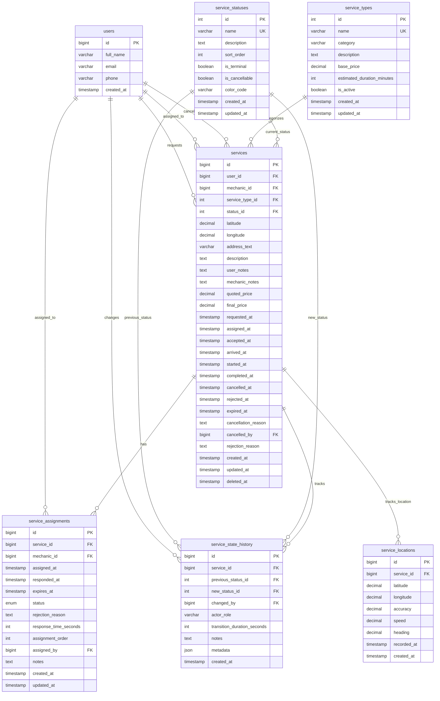
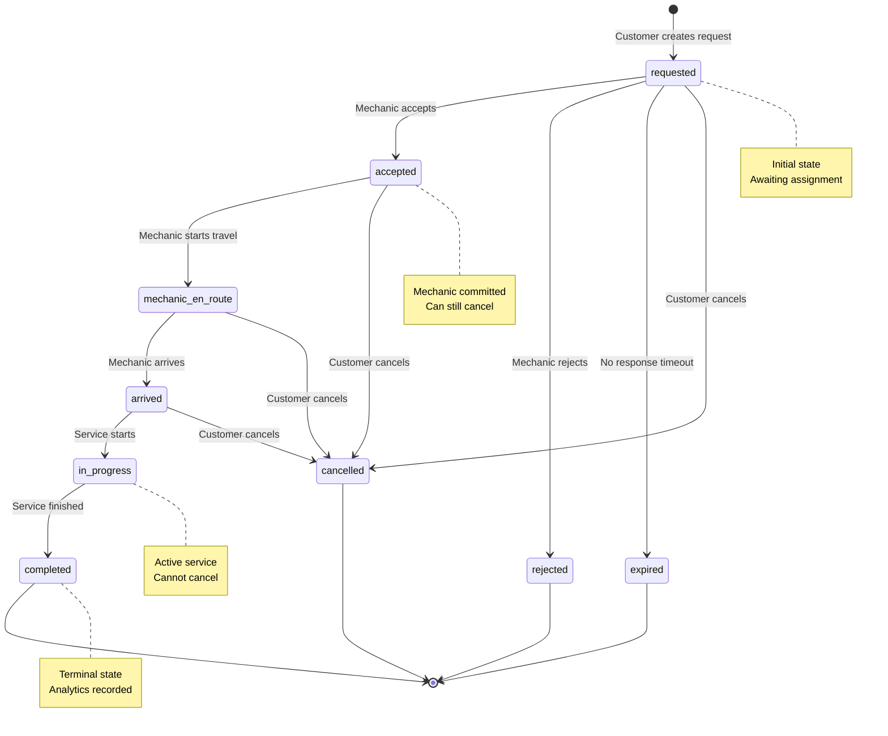
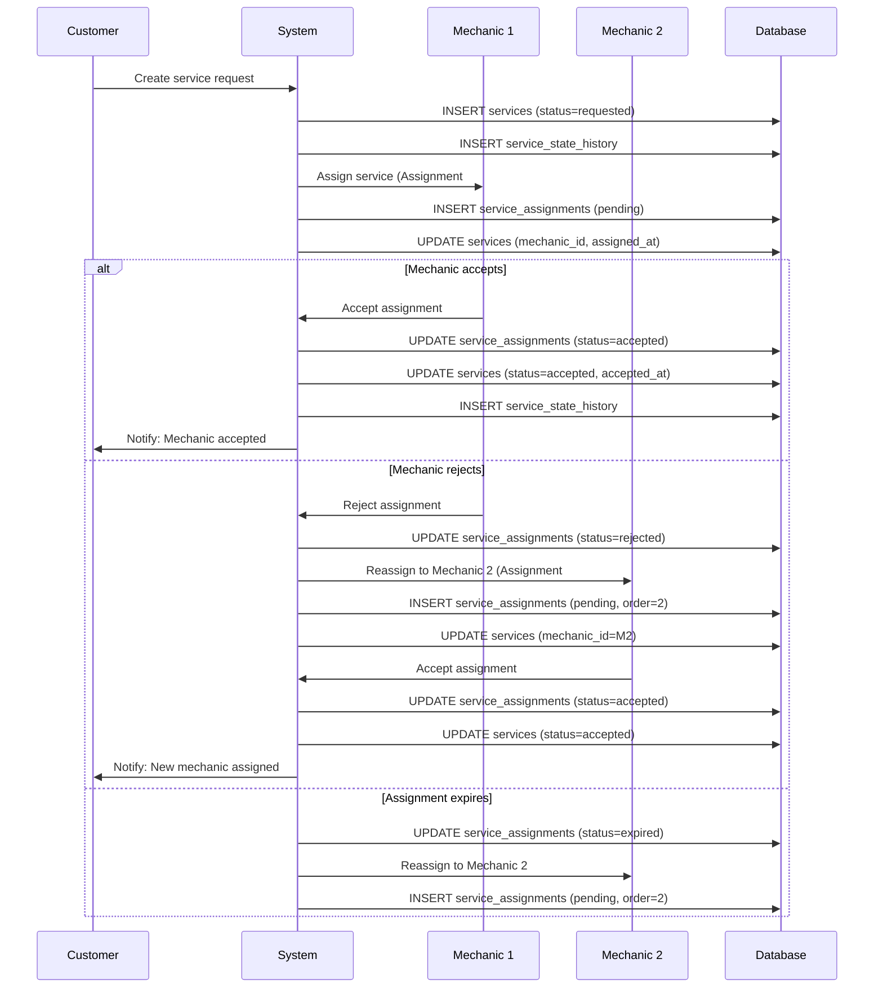
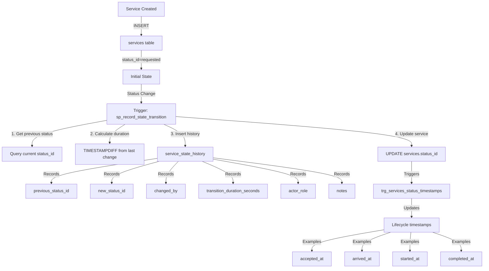
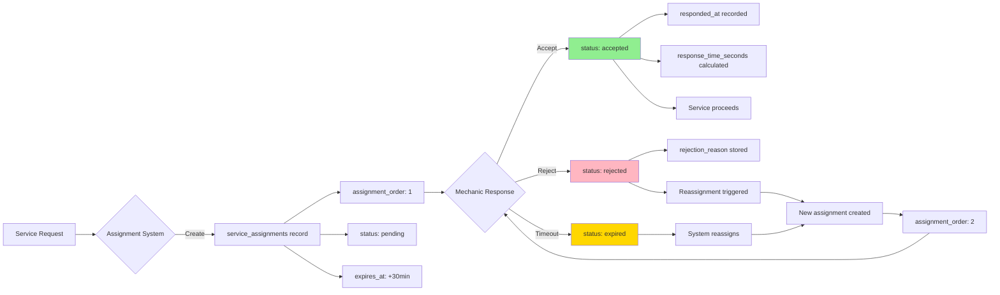
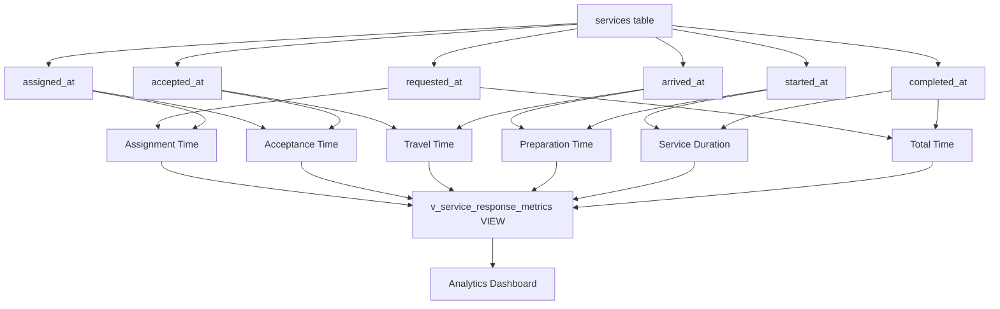
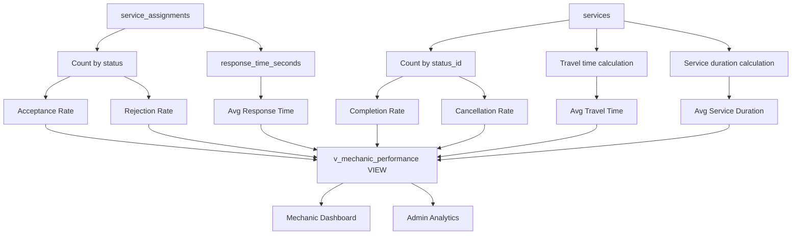

# Services Module - Entity Relationship Diagram

## Overview
This document provides visual representations of the refactored Services module database architecture for the P.A.R.C.E platform.

---

## Complete Services Module ERD



---

## Service Lifecycle Flow Diagram



---

## Service Assignment Flow Diagram



---

## State History Tracking Pattern



---

## Assignment Tracking Architecture



---

## Analytics Query Patterns

### Response Time Calculation


### Mechanic Performance Tracking


---

## Relationship Cardinalities

| Relationship | Cardinality | Description |
|--------------|-------------|-------------|
| users → services (customer) | 1:N | One customer can request many services |
| users → services (mechanic) | 1:N | One mechanic can be assigned to many services |
| service_types → services | 1:N | One service type can have many service requests |
| service_statuses → services | 1:N | One status can be current for many services |
| services → service_assignments | 1:N | One service can have multiple assignment attempts |
| services → service_state_history | 1:N | One service has many state transitions |
| services → service_locations | 1:N | One service has many GPS tracking points |
| users → service_assignments | 1:N | One mechanic can have many assignments |
| users → service_state_history | 1:N | One user can trigger many state changes |

---

## Key Improvements Over Original Design

### 1. **Comprehensive Lifecycle Timestamps**
- **Before**: Only `scheduled_at`, `started_at`, `completed_at`
- **After**: Added `requested_at`, `assigned_at`, `accepted_at`, `arrived_at`, `cancelled_at`, `rejected_at`, `expired_at`
- **Benefit**: Complete visibility into every stage of service lifecycle

### 2. **Dedicated Assignment System**
- **Before**: Assignment tracked only in `services.mechanic_id`
- **After**: Separate `service_assignments` table with full history
- **Benefit**: Supports reassignment, rejection tracking, and mechanic performance analytics

### 3. **Enhanced State History**
- **Before**: Basic state tracking with `state_id` and `changed_by`
- **After**: Added `previous_status_id`, `transition_duration_seconds`, `actor_role`, `metadata`
- **Benefit**: Complete audit trail with transition analytics

### 4. **Robust Status Architecture**
- **Before**: 7 basic states
- **After**: 9 states with `is_terminal`, `is_cancellable`, `color_code` flags
- **Benefit**: Better business logic support and UI integration

### 5. **Analytics-Ready Design**
- **Before**: Limited indexing for analytics
- **After**: Composite indexes, pre-built views, stored procedures
- **Benefit**: Fast analytics queries without impacting transactional performance

### 6. **Normalized Service Types**
- **Before**: Basic service type catalog
- **After**: Added `category` and `estimated_duration_minutes`
- **Benefit**: Better grouping and scheduling capabilities

---

## Index Strategy

### Primary Indexes (Single Column)
- `services`: user_id, mechanic_id, service_type_id, status_id, requested_at
- `service_assignments`: service_id, mechanic_id, status, assigned_at
- `service_state_history`: service_id, new_status_id, created_at

### Composite Indexes (Analytics)
- `services`: (status_id, requested_at), (mechanic_id, status_id, requested_at)
- `service_assignments`: (mechanic_id, status, assigned_at), (service_id, assignment_order)
- `service_state_history`: (service_id, created_at), (previous_status_id, new_status_id, created_at)

### Spatial Indexes
- `services`: (latitude, longitude)
- `service_locations`: (latitude, longitude)

---

## Constraints Summary

### Foreign Key Constraints
- All relationships properly enforced with appropriate ON DELETE actions
- CASCADE for dependent data (assignments, history, locations)
- RESTRICT for reference data (service_types, service_statuses)
- SET NULL for optional relationships (mechanic_id when mechanic deleted)

### Check Constraints
- Latitude: BETWEEN -90 AND 90
- Longitude: BETWEEN -180 AND 180
- Prices: >= 0 (non-negative)
- GPS accuracy: >= 0
- GPS heading: BETWEEN 0 AND 360

### Unique Constraints
- `service_types.name`: Prevents duplicate service type names
- `service_statuses.name`: Prevents duplicate status names
- `service_assignments`: (service_id, status, mechanic_id) for pending assignments

---

## Trigger Automation

### 1. Status Timestamp Trigger
**Purpose**: Automatically set lifecycle timestamps when status changes
**Trigger**: `trg_services_status_timestamps`
**Logic**: 
- When status changes to 'accepted' → Set `accepted_at`
- When status changes to 'arrived' → Set `arrived_at`
- When status changes to 'in_progress' → Set `started_at`
- When status changes to 'completed' → Set `completed_at`
- When status changes to 'cancelled' → Set `cancelled_at`

### 2. Response Time Trigger
**Purpose**: Calculate mechanic response time automatically
**Trigger**: `trg_assignment_response_time`
**Logic**: When `responded_at` is set, calculate `response_time_seconds` as difference from `assigned_at`

---

## Stored Procedures

### 1. sp_assign_service_to_mechanic
**Purpose**: Assign or reassign a service to a mechanic
**Parameters**:
- `p_service_id`: Service to assign
- `p_mechanic_id`: Mechanic to assign to
- `p_assigned_by`: User creating the assignment
- `p_expires_minutes`: Minutes until assignment expires
- `p_assignment_id` (OUT): ID of created assignment

**Logic**:
1. Calculate assignment order (1, 2, 3, etc.)
2. Calculate expiration timestamp
3. Create assignment record
4. Update service with mechanic_id and assigned_at

### 2. sp_record_state_transition
**Purpose**: Record a state change with full audit trail
**Parameters**:
- `p_service_id`: Service being updated
- `p_new_status_id`: New status
- `p_changed_by`: User making the change
- `p_actor_role`: Role of the user (customer, mechanic, admin, system)
- `p_notes`: Optional notes about the change

**Logic**:
1. Get current status from services table
2. Get timestamp of last state change
3. Calculate duration in previous state
4. Insert state history record
5. Update service status

---

## Migration Path from Original Design

### Step 1: Add New Columns to services
```sql
ALTER TABLE services
ADD COLUMN requested_at TIMESTAMP NOT NULL DEFAULT CURRENT_TIMESTAMP AFTER deleted_at,
ADD COLUMN assigned_at TIMESTAMP NULL AFTER requested_at,
ADD COLUMN accepted_at TIMESTAMP NULL AFTER assigned_at,
ADD COLUMN arrived_at TIMESTAMP NULL AFTER accepted_at,
ADD COLUMN cancelled_at TIMESTAMP NULL AFTER completed_at,
ADD COLUMN rejected_at TIMESTAMP NULL AFTER cancelled_at,
ADD COLUMN expired_at TIMESTAMP NULL AFTER rejected_at,
ADD COLUMN cancellation_reason TEXT NULL AFTER expired_at,
ADD COLUMN cancelled_by BIGINT UNSIGNED NULL AFTER cancellation_reason,
ADD COLUMN rejection_reason TEXT NULL AFTER cancelled_by,
ADD COLUMN quoted_price DECIMAL(10, 2) NULL AFTER mechanic_notes,
ADD COLUMN final_price DECIMAL(10, 2) NULL AFTER quoted_price,
ADD COLUMN address_text VARCHAR(255) NULL AFTER longitude;
```

### Step 2: Rename service_states to service_statuses
```sql
RENAME TABLE service_states TO service_statuses;
ALTER TABLE services CHANGE current_state_id status_id INT UNSIGNED NOT NULL;
ALTER TABLE service_state_history CHANGE state_id new_status_id INT UNSIGNED NOT NULL;
```

### Step 3: Add New Columns to service_statuses
```sql
ALTER TABLE service_statuses
ADD COLUMN is_terminal BOOLEAN NOT NULL DEFAULT FALSE AFTER sort_order,
ADD COLUMN is_cancellable BOOLEAN NOT NULL DEFAULT TRUE AFTER is_terminal,
ADD COLUMN color_code VARCHAR(7) DEFAULT '#6B7280' AFTER is_cancellable;
```

### Step 4: Create service_assignments Table
```sql
-- Use the CREATE TABLE statement from services-module-refactored.sql
```

### Step 5: Add New Columns to service_state_history
```sql
ALTER TABLE service_state_history
ADD COLUMN previous_status_id INT UNSIGNED NULL AFTER service_id,
ADD COLUMN actor_role VARCHAR(50) NULL AFTER changed_by,
ADD COLUMN transition_duration_seconds INT UNSIGNED NULL AFTER actor_role,
ADD COLUMN metadata JSON NULL AFTER notes;
```

### Step 6: Add New Statuses
```sql
INSERT INTO service_statuses (name, description, sort_order, is_terminal, is_cancellable, color_code) VALUES
('requested', 'Service request created, awaiting mechanic assignment', 1, FALSE, TRUE, '#3B82F6'),
('accepted', 'Mechanic accepted the service request', 2, FALSE, TRUE, '#10B981'),
('rejected', 'Service request rejected by mechanic', 8, TRUE, FALSE, '#EF4444'),
('expired', 'Service request expired without assignment', 9, TRUE, FALSE, '#DC2626');
```

### Step 7: Create Indexes
```sql
-- Use the CREATE INDEX statements from services-module-refactored.sql
```

### Step 8: Create Views, Procedures, and Triggers
```sql
-- Use the CREATE VIEW, CREATE PROCEDURE, and CREATE TRIGGER statements
```

---

## End of ERD Documentation
