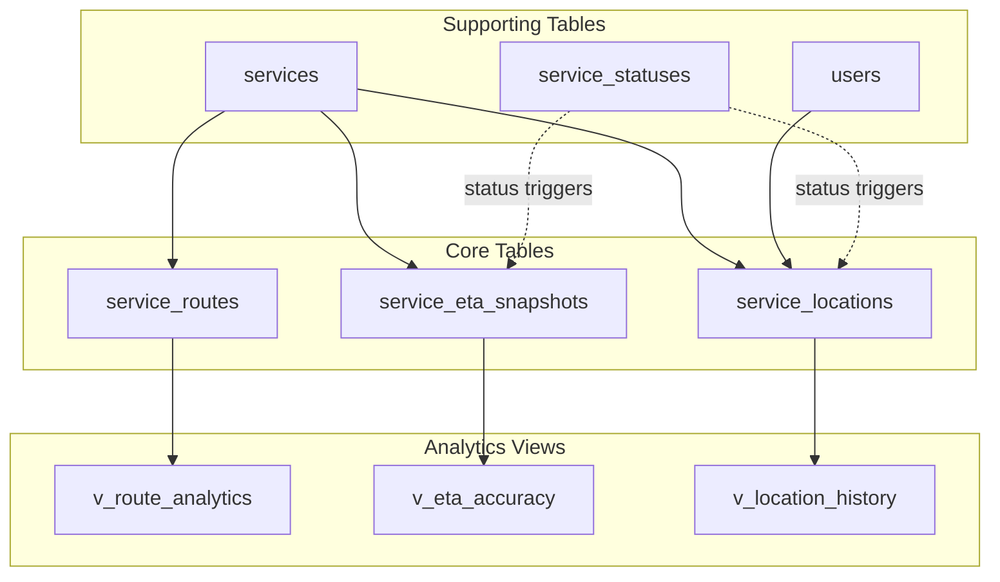
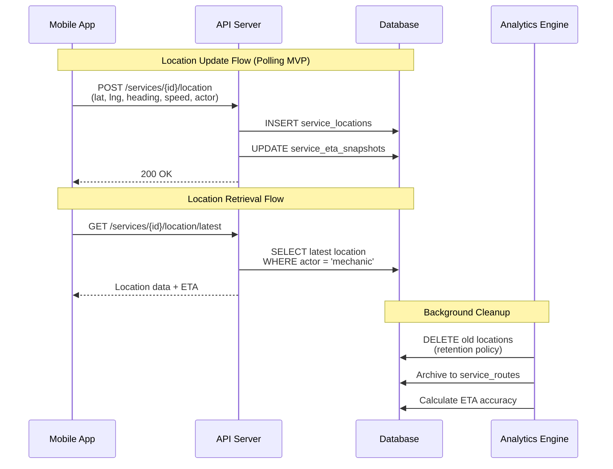
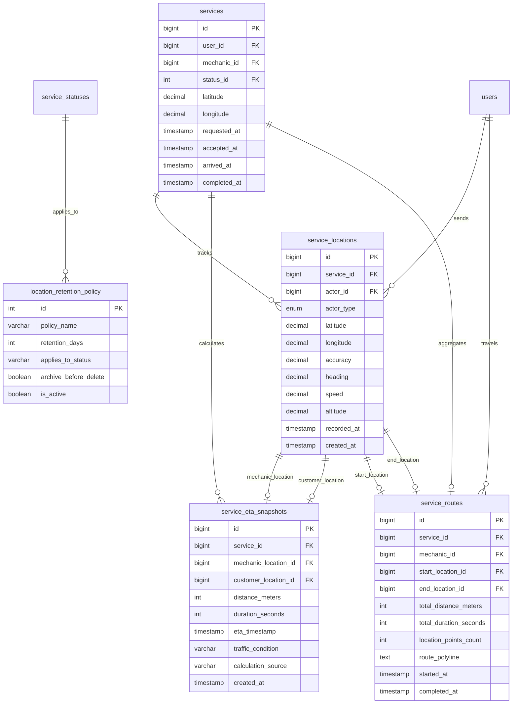
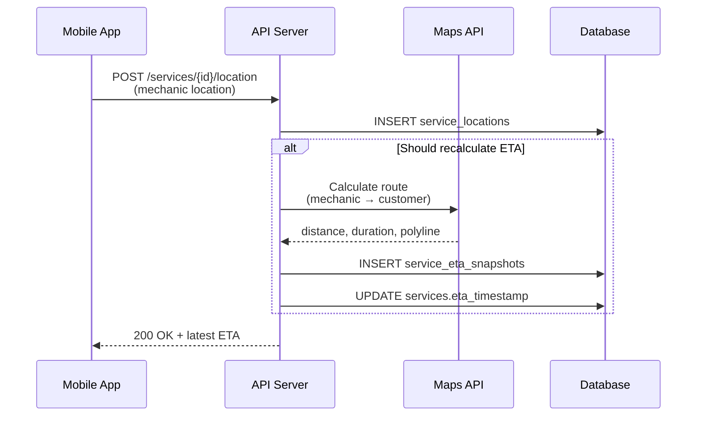

# Design Document: Tracking and Location Module Refactoring

## Overview

This document specifies the comprehensive refactoring of the P.A.R.C.E platform's tracking and location database module. The current `service_locations` table is too basic and lacks critical features needed for real-time location tracking, ETA calculations, privacy controls, and analytics. This refactoring introduces actor identification (customer vs mechanic), heading/speed data, ETA support structures, location history retention policies, and privacy-compliant data management.

The refactored module will support controlled polling for MVP (with future websocket compatibility), efficient location queries, route progress tracking, and analytics-ready data structures while maintaining strict privacy controls and service-scoped visibility.

## Architecture

### High-Level Architecture




### Data Flow Architecture




## Components and Interfaces

### Component 1: service_locations (Enhanced)

**Purpose**: Real-time GPS location tracking with actor identification, heading, speed, and accuracy data

**Interface**:
```sql
CREATE TABLE service_locations (
    id BIGINT UNSIGNED AUTO_INCREMENT PRIMARY KEY,
    service_id BIGINT UNSIGNED NOT NULL,
    actor_id BIGINT UNSIGNED NOT NULL,
    actor_type ENUM('customer', 'mechanic') NOT NULL,
    latitude DECIMAL(10, 8) NOT NULL,
    longitude DECIMAL(11, 8) NOT NULL,
    accuracy DECIMAL(6, 2) NULL,
    heading DECIMAL(5, 2) NULL,
    speed DECIMAL(6, 2) NULL,
    altitude DECIMAL(8, 2) NULL,
    recorded_at TIMESTAMP NOT NULL,
    created_at TIMESTAMP DEFAULT CURRENT_TIMESTAMP,
    
    FOREIGN KEY (service_id) REFERENCES services(id) ON DELETE CASCADE,
    FOREIGN KEY (actor_id) REFERENCES users(id) ON DELETE CASCADE
) ENGINE=InnoDB;
```

**Responsibilities**:
- Store high-frequency location updates from both customers and mechanics
- Support actor identification for privacy-scoped queries
- Capture heading and speed for map visualization and ETA calculations
- Maintain GPS accuracy metadata for quality filtering
- Optimize for append-only inserts (no updates)
- Enable efficient queries by service, actor, and time range


### Component 2: service_eta_snapshots

**Purpose**: Track estimated time of arrival calculations and enable ETA accuracy analytics

**Interface**:
```sql
CREATE TABLE service_eta_snapshots (
    id BIGINT UNSIGNED AUTO_INCREMENT PRIMARY KEY,
    service_id BIGINT UNSIGNED NOT NULL,
    mechanic_location_id BIGINT UNSIGNED NULL,
    customer_location_id BIGINT UNSIGNED NULL,
    distance_meters INT UNSIGNED NOT NULL,
    duration_seconds INT UNSIGNED NOT NULL,
    eta_timestamp TIMESTAMP NOT NULL,
    traffic_condition VARCHAR(20) NULL,
    calculation_source VARCHAR(50) NOT NULL,
    created_at TIMESTAMP DEFAULT CURRENT_TIMESTAMP,
    
    FOREIGN KEY (service_id) REFERENCES services(id) ON DELETE CASCADE,
    FOREIGN KEY (mechanic_location_id) REFERENCES service_locations(id) ON DELETE SET NULL,
    FOREIGN KEY (customer_location_id) REFERENCES service_locations(id) ON DELETE SET NULL
) ENGINE=InnoDB;
```

**Responsibilities**:
- Store ETA calculations at regular intervals
- Link to specific location snapshots for accuracy analysis
- Capture distance and duration from mapping APIs
- Track traffic conditions when available
- Enable ETA accuracy metrics (predicted vs actual arrival)
- Support recalculation triggers based on route changes


### Component 3: service_routes

**Purpose**: Aggregate route data for completed services to support analytics and historical tracking

**Interface**:
```sql
CREATE TABLE service_routes (
    id BIGINT UNSIGNED AUTO_INCREMENT PRIMARY KEY,
    service_id BIGINT UNSIGNED NOT NULL UNIQUE,
    mechanic_id BIGINT UNSIGNED NOT NULL,
    start_location_id BIGINT UNSIGNED NULL,
    end_location_id BIGINT UNSIGNED NULL,
    total_distance_meters INT UNSIGNED NULL,
    total_duration_seconds INT UNSIGNED NULL,
    location_points_count INT UNSIGNED NOT NULL DEFAULT 0,
    route_polyline TEXT NULL,
    started_at TIMESTAMP NOT NULL,
    completed_at TIMESTAMP NULL,
    created_at TIMESTAMP DEFAULT CURRENT_TIMESTAMP,
    updated_at TIMESTAMP DEFAULT CURRENT_TIMESTAMP ON UPDATE CURRENT_TIMESTAMP,
    
    FOREIGN KEY (service_id) REFERENCES services(id) ON DELETE CASCADE,
    FOREIGN KEY (mechanic_id) REFERENCES users(id) ON DELETE CASCADE,
    FOREIGN KEY (start_location_id) REFERENCES service_locations(id) ON DELETE SET NULL,
    FOREIGN KEY (end_location_id) REFERENCES service_locations(id) ON DELETE SET NULL
) ENGINE=InnoDB;
```

**Responsibilities**:
- Aggregate route data when service transitions to terminal states
- Store route polyline for map visualization
- Calculate total distance and duration traveled
- Link to first and last location points
- Support route efficiency analytics
- Enable mechanic performance tracking


### Component 4: location_retention_policy

**Purpose**: Define and enforce location data retention rules for privacy compliance

**Interface**:
```sql
CREATE TABLE location_retention_policy (
    id INT UNSIGNED AUTO_INCREMENT PRIMARY KEY,
    policy_name VARCHAR(100) NOT NULL UNIQUE,
    retention_days INT UNSIGNED NOT NULL,
    applies_to_status VARCHAR(50) NOT NULL,
    archive_before_delete BOOLEAN NOT NULL DEFAULT TRUE,
    is_active BOOLEAN NOT NULL DEFAULT TRUE,
    description TEXT,
    created_at TIMESTAMP DEFAULT CURRENT_TIMESTAMP,
    updated_at TIMESTAMP DEFAULT CURRENT_TIMESTAMP ON UPDATE CURRENT_TIMESTAMP
) ENGINE=InnoDB;
```

**Responsibilities**:
- Define retention periods for different service statuses
- Control whether data is archived before deletion
- Enable/disable policies without code changes
- Support compliance with privacy regulations
- Provide audit trail for retention policy changes


## Data Models

### Model 1: Enhanced service_locations

```sql
service_locations {
    id: BIGINT UNSIGNED PK
    service_id: BIGINT UNSIGNED FK -> services.id
    actor_id: BIGINT UNSIGNED FK -> users.id
    actor_type: ENUM('customer', 'mechanic')
    latitude: DECIMAL(10, 8)
    longitude: DECIMAL(11, 8)
    accuracy: DECIMAL(6, 2) NULL
    heading: DECIMAL(5, 2) NULL
    speed: DECIMAL(6, 2) NULL
    altitude: DECIMAL(8, 2) NULL
    recorded_at: TIMESTAMP
    created_at: TIMESTAMP
}
```

**Validation Rules**:
- `service_id` must reference an active service
- `actor_id` must be either the customer or assigned mechanic for the service
- `actor_type` must match the role of `actor_id` in the service
- `latitude` must be between -90 and 90
- `longitude` must be between -180 and 180
- `accuracy` must be >= 0 (meters) if provided
- `heading` must be between 0 and 360 (degrees) if provided
- `speed` must be >= 0 (km/h) if provided
- `recorded_at` must not be in the future
- Records are append-only (no updates allowed)


### Model 2: service_eta_snapshots

```sql
service_eta_snapshots {
    id: BIGINT UNSIGNED PK
    service_id: BIGINT UNSIGNED FK -> services.id
    mechanic_location_id: BIGINT UNSIGNED FK -> service_locations.id
    customer_location_id: BIGINT UNSIGNED FK -> service_locations.id
    distance_meters: INT UNSIGNED
    duration_seconds: INT UNSIGNED
    eta_timestamp: TIMESTAMP
    traffic_condition: VARCHAR(20) NULL
    calculation_source: VARCHAR(50)
    created_at: TIMESTAMP
}
```

**Validation Rules**:
- `service_id` must reference an active service
- `mechanic_location_id` must reference a location where `actor_type = 'mechanic'`
- `customer_location_id` must reference a location where `actor_type = 'customer'`
- `distance_meters` must be > 0
- `duration_seconds` must be > 0
- `eta_timestamp` must be in the future relative to `created_at`
- `traffic_condition` values: 'light', 'moderate', 'heavy', 'unknown'
- `calculation_source` examples: 'google_maps', 'openstreetmap', 'manual', 'estimated'


### Model 3: service_routes

```sql
service_routes {
    id: BIGINT UNSIGNED PK
    service_id: BIGINT UNSIGNED FK -> services.id UNIQUE
    mechanic_id: BIGINT UNSIGNED FK -> users.id
    start_location_id: BIGINT UNSIGNED FK -> service_locations.id
    end_location_id: BIGINT UNSIGNED FK -> service_locations.id
    total_distance_meters: INT UNSIGNED NULL
    total_duration_seconds: INT UNSIGNED NULL
    location_points_count: INT UNSIGNED
    route_polyline: TEXT NULL
    started_at: TIMESTAMP
    completed_at: TIMESTAMP NULL
    created_at: TIMESTAMP
    updated_at: TIMESTAMP
}
```

**Validation Rules**:
- `service_id` must be unique (one route per service)
- `mechanic_id` must match the assigned mechanic for the service
- `start_location_id` must be the first location recorded for the mechanic
- `end_location_id` must be the last location recorded for the mechanic
- `total_distance_meters` must be >= 0 if provided
- `total_duration_seconds` must be >= 0 if provided
- `location_points_count` must match actual count in service_locations
- `route_polyline` uses encoded polyline format (Google Maps compatible)
- `started_at` must be <= `completed_at` if both are set


### Model 4: location_retention_policy

```sql
location_retention_policy {
    id: INT UNSIGNED PK
    policy_name: VARCHAR(100) UNIQUE
    retention_days: INT UNSIGNED
    applies_to_status: VARCHAR(50)
    archive_before_delete: BOOLEAN
    is_active: BOOLEAN
    description: TEXT
    created_at: TIMESTAMP
    updated_at: TIMESTAMP
}
```

**Validation Rules**:
- `policy_name` must be unique and descriptive
- `retention_days` must be > 0
- `applies_to_status` must match a valid service status name
- `archive_before_delete` determines if data moves to service_routes first
- `is_active` allows enabling/disabling policies without deletion
- Default policies: 'completed' (30 days), 'cancelled' (7 days), 'active' (no deletion)


## Entity Relationship Diagram




## Correctness Properties

### Universal Quantification Statements

1. **Actor Authorization**: ∀ location ∈ service_locations, location.actor_id ∈ {service.user_id, service.mechanic_id}
   - Every location must be sent by either the customer or the assigned mechanic

2. **Actor Type Consistency**: ∀ location ∈ service_locations, (location.actor_type = 'customer' ⟹ location.actor_id = service.user_id) ∧ (location.actor_type = 'mechanic' ⟹ location.actor_id = service.mechanic_id)
   - Actor type must match the actual role of the actor in the service

3. **Geographic Bounds**: ∀ location ∈ service_locations, (-90 ≤ location.latitude ≤ 90) ∧ (-180 ≤ location.longitude ≤ 180)
   - All coordinates must be within valid geographic ranges

4. **ETA Future Constraint**: ∀ eta ∈ service_eta_snapshots, eta.eta_timestamp > eta.created_at
   - Estimated arrival time must always be in the future relative to calculation time

5. **Route Uniqueness**: ∀ service ∈ services, |{route ∈ service_routes : route.service_id = service.id}| ≤ 1
   - Each service can have at most one aggregated route

6. **Location Immutability**: ∀ location ∈ service_locations, location is append-only (no UPDATE operations)
   - Location records are never modified after insertion

7. **Service Scope Visibility**: ∀ location ∈ service_locations, location is visible only to {service.user_id, service.mechanic_id, admin_users}
   - Location data is restricted to service participants and administrators

8. **Retention Policy Application**: ∀ service ∈ services with terminal status, ∃ policy ∈ location_retention_policy : policy.applies_to_status = service.status ∧ policy.is_active = true
   - Every terminal service status must have an active retention policy


## Error Handling

### Error Scenario 1: Unauthorized Location Update

**Condition**: User attempts to send location for a service they are not part of
**Response**: Reject the location insert with authorization error
**Recovery**: Application layer validates actor_id against service participants before INSERT

### Error Scenario 2: Invalid Geographic Coordinates

**Condition**: Location data contains latitude/longitude outside valid ranges
**Response**: Database CHECK constraint violation
**Recovery**: Application validates coordinates before submission; return validation error to client

### Error Scenario 3: Actor Type Mismatch

**Condition**: actor_type='mechanic' but actor_id is the customer
**Response**: Application-level validation error before INSERT
**Recovery**: Correct actor_type based on actor_id role in service

### Error Scenario 4: ETA Calculation Failure

**Condition**: Mapping API fails or returns invalid data
**Response**: Skip ETA snapshot creation; log error
**Recovery**: Retry on next location update; use last known ETA if available

### Error Scenario 5: Retention Policy Conflict

**Condition**: Multiple active policies apply to same service status
**Response**: Use policy with shortest retention period (most conservative)
**Recovery**: Admin resolves conflict by deactivating duplicate policies

### Error Scenario 6: High-Frequency Location Spam

**Condition**: Client sends location updates faster than recommended interval
**Response**: Rate limit at application layer (e.g., max 1 update per 5 seconds)
**Recovery**: Queue updates and process at controlled rate; reject excess updates


## Testing Strategy

### Unit Testing Approach

**Database Constraint Testing**:
- Test CHECK constraints for latitude/longitude bounds
- Test CHECK constraints for heading (0-360), speed (>=0), accuracy (>=0)
- Test FOREIGN KEY constraints for service_id, actor_id references
- Test UNIQUE constraint on service_routes.service_id
- Test ENUM validation for actor_type

**Data Integrity Testing**:
- Verify actor_id must be service participant (customer or mechanic)
- Verify actor_type matches actor_id role
- Verify ETA timestamp is always future relative to created_at
- Verify location records are append-only (no UPDATE allowed)
- Verify retention policies apply correctly to terminal statuses

**Index Performance Testing**:
- Measure query performance for latest location by service and actor
- Measure query performance for location history within time range
- Measure query performance for ETA snapshots by service
- Verify composite indexes are used in query plans


### Property-Based Testing Approach

**Property Test Library**: Not applicable for database schema design (SQL DDL testing)

**Property Tests for Application Layer** (when implementing API):
- **Property 1**: For any valid service and participant, location insert succeeds
- **Property 2**: For any non-participant user, location insert fails with authorization error
- **Property 3**: For any location with invalid coordinates, insert fails with constraint violation
- **Property 4**: For any service, querying latest mechanic location returns most recent by recorded_at
- **Property 5**: For any completed service, retention policy cleanup removes locations after retention_days
- **Property 6**: For any ETA calculation, eta_timestamp > created_at always holds

### Integration Testing Approach

**Location Update Flow**:
- Test complete flow: mobile app → API → database → response
- Verify location is stored with correct actor_id and actor_type
- Verify ETA snapshot is created when mechanic location updates
- Verify latest location query returns correct data

**Retention Policy Flow**:
- Test scheduled cleanup job execution
- Verify locations are archived to service_routes before deletion
- Verify only locations matching retention policy are deleted
- Verify active services are never affected by cleanup

**Analytics Query Flow**:
- Test route analytics view returns correct aggregations
- Test ETA accuracy view calculates correct metrics
- Test location history view respects service scope visibility


## Performance Considerations

### Indexing Strategy

**service_locations Indexes**:
- `idx_service_actor` (service_id, actor_type, recorded_at DESC): Latest location by actor
- `idx_service_chronological` (service_id, recorded_at DESC): Location history queries
- `idx_actor_service` (actor_id, service_id, recorded_at DESC): User's location history
- `idx_recorded_at` (recorded_at): Retention policy cleanup queries
- `idx_location_spatial` (latitude, longitude): Proximity searches (future)

**service_eta_snapshots Indexes**:
- `idx_service_latest` (service_id, created_at DESC): Latest ETA query
- `idx_service_chronological` (service_id, created_at): ETA history
- `idx_mechanic_location` (mechanic_location_id): Join optimization
- `idx_customer_location` (customer_location_id): Join optimization

**service_routes Indexes**:
- `idx_mechanic_completed` (mechanic_id, completed_at DESC): Mechanic route history
- `idx_service_unique` (service_id UNIQUE): Enforce one route per service
- `idx_started_at` (started_at): Time-based analytics

### Query Optimization

**Latest Location Query** (most frequent):
```sql
SELECT * FROM service_locations
WHERE service_id = ? AND actor_type = 'mechanic'
ORDER BY recorded_at DESC
LIMIT 1;
```
- Uses `idx_service_actor` covering index
- Expected execution time: <5ms

**Location History Query**:
```sql
SELECT * FROM service_locations
WHERE service_id = ? AND recorded_at >= ?
ORDER BY recorded_at ASC;
```
- Uses `idx_service_chronological` index
- Expected execution time: <10ms for 100 records


### Write Performance

**High-Frequency Inserts**:
- service_locations table optimized for append-only writes
- No UPDATE operations (immutable records)
- Minimal indexes to reduce write overhead
- InnoDB engine with row-level locking
- Expected throughput: >1000 inserts/second

**Batch Cleanup Operations**:
- Retention policy cleanup runs during off-peak hours
- DELETE operations batched (e.g., 1000 records per transaction)
- Archive to service_routes before deletion (single transaction)
- Expected cleanup time: <1 minute per 10,000 records

### Storage Optimization

**Location Data Growth**:
- Estimated: 1 location update per 10 seconds during active service
- Average service duration: 45 minutes = 270 location records
- Record size: ~100 bytes per location
- Daily storage (1000 services): 270,000 records × 100 bytes = 27 MB/day
- Monthly storage (30 days): ~810 MB/month

**Retention Policy Impact**:
- Completed services: 30-day retention = ~810 MB retained
- Cancelled services: 7-day retention = ~189 MB retained
- Active services: No deletion until terminal status
- Total storage with retention: ~1 GB for 30 days of data


## Security Considerations

### Privacy Controls

**Service-Scoped Visibility**:
- Location data is ONLY visible to service participants (customer, mechanic)
- Administrators can access for support/debugging purposes
- No cross-service location sharing
- No location history visible after service completion + retention period

**Actor Authorization**:
- Only the customer or assigned mechanic can send location updates
- Application layer validates actor_id against service.user_id and service.mechanic_id
- Database foreign keys enforce referential integrity
- Unauthorized location updates are rejected at API layer

**Data Minimization**:
- Only collect location data during active service statuses
- Stop collecting when service reaches terminal status
- Delete location data after retention period expires
- No indefinite storage of location history

### Access Control

**Role-Based Access**:
- **Customer**: Can view mechanic's location for their own services only
- **Mechanic**: Can view customer's location for assigned services only
- **Admin**: Can view all locations for support purposes (audit logged)
- **System**: Can execute retention policy cleanup

**API Endpoint Security**:
- `POST /services/{id}/location`: Requires authentication + service participant check
- `GET /services/{id}/location/latest`: Requires authentication + service participant check
- `GET /services/{id}/location/history`: Requires authentication + service participant check
- `DELETE /admin/locations/cleanup`: Requires admin role + audit logging


### Compliance Considerations

**GDPR Compliance**:
- Right to erasure: Location data deleted after retention period
- Data minimization: Only collect necessary location data
- Purpose limitation: Location data used only for service delivery
- Storage limitation: Automatic deletion via retention policies
- Transparency: Users informed of location tracking in terms of service

**Data Breach Protection**:
- Location data encrypted at rest (database encryption)
- Location data encrypted in transit (HTTPS/TLS)
- Access logging for all location queries (audit trail)
- No location data in application logs
- Database backups encrypted and access-controlled

**Audit Trail**:
- All location access logged with timestamp, user_id, service_id
- Retention policy execution logged with records affected
- Admin access to locations logged separately
- Audit logs retained longer than location data (e.g., 1 year)


## MVP Realtime Update Strategy

### Controlled Polling Approach

**Polling Intervals**:
- **Active tracking** (mechanic_en_route, arrived): Poll every 10 seconds
- **Service in progress**: Poll every 30 seconds (less critical)
- **Idle states** (requested, accepted): No polling (no location updates expected)
- **Terminal states** (completed, cancelled): Stop polling immediately

**Client-Side Implementation**:
```javascript
// Pseudocode for mobile app polling
function startLocationPolling(serviceId, status) {
    const interval = getPollingInterval(status);
    
    if (interval === null) {
        stopPolling();
        return;
    }
    
    setInterval(() => {
        fetchLatestLocation(serviceId);
    }, interval);
}

function getPollingInterval(status) {
    switch(status) {
        case 'mechanic_en_route':
        case 'arrived':
            return 10000; // 10 seconds
        case 'in_progress':
            return 30000; // 30 seconds
        default:
            return null; // No polling
    }
}
```


### Database Overhead Control

**Write Rate Limiting**:
- Maximum 1 location update per 5 seconds per actor
- Application layer enforces rate limit before INSERT
- Prevents database spam from misbehaving clients
- Expected write rate: ~0.2 writes/second per active service

**Query Optimization**:
- Use `LIMIT 1` for latest location queries
- Use indexed columns in WHERE clauses
- Avoid full table scans with proper indexing
- Cache ETA calculations for 30 seconds at application layer

**Connection Pooling**:
- Reuse database connections for location updates
- Pool size: 20-50 connections for location service
- Connection timeout: 30 seconds
- Idle connection timeout: 5 minutes

### Future Websocket Compatibility

**Design Considerations**:
- Database schema supports both polling and push models
- No schema changes needed for websocket implementation
- Websocket server can subscribe to location updates
- Push notifications triggered by INSERT events (database triggers or application events)

**Migration Path**:
1. **Phase 1 (MVP)**: Controlled polling with intervals
2. **Phase 2**: Hybrid (polling + server-sent events for critical updates)
3. **Phase 3**: Full websocket implementation with fallback to polling


## Location History Retention Policy

### Retention Rules by Service Status

**Active Services** (requested, accepted, mechanic_en_route, arrived, in_progress):
- **Retention**: Indefinite (no deletion while service is active)
- **Rationale**: Location data needed for real-time tracking and ETA calculations
- **Cleanup Trigger**: Service transitions to terminal status

**Completed Services**:
- **Retention**: 30 days after completion
- **Rationale**: Support dispute resolution, quality assurance, analytics
- **Archive**: Yes (aggregate to service_routes before deletion)
- **Cleanup Trigger**: Scheduled job runs daily

**Cancelled Services**:
- **Retention**: 7 days after cancellation
- **Rationale**: Minimal retention for immediate dispute resolution
- **Archive**: Yes (aggregate to service_routes before deletion)
- **Cleanup Trigger**: Scheduled job runs daily

**Rejected Services**:
- **Retention**: 7 days after rejection
- **Rationale**: Minimal retention for assignment analytics
- **Archive**: No (typically no location data collected)
- **Cleanup Trigger**: Scheduled job runs daily

**Expired Services**:
- **Retention**: 7 days after expiration
- **Rationale**: Minimal retention for system analytics
- **Archive**: No (typically no location data collected)
- **Cleanup Trigger**: Scheduled job runs daily


### Cleanup Implementation

**Scheduled Job** (runs daily at 2:00 AM):
```sql
-- Pseudocode for cleanup procedure
PROCEDURE cleanup_expired_locations()
BEGIN
    -- Step 1: Archive completed service locations
    INSERT INTO service_routes (service_id, mechanic_id, ...)
    SELECT service_id, mechanic_id, ...
    FROM service_locations sl
    JOIN services s ON sl.service_id = s.id
    JOIN service_statuses ss ON s.status_id = ss.id
    JOIN location_retention_policy lrp ON ss.name = lrp.applies_to_status
    WHERE lrp.is_active = TRUE
      AND lrp.archive_before_delete = TRUE
      AND s.completed_at < NOW() - INTERVAL lrp.retention_days DAY
      AND NOT EXISTS (SELECT 1 FROM service_routes WHERE service_id = s.id);
    
    -- Step 2: Delete expired locations
    DELETE FROM service_locations
    WHERE service_id IN (
        SELECT s.id
        FROM services s
        JOIN service_statuses ss ON s.status_id = ss.id
        JOIN location_retention_policy lrp ON ss.name = lrp.applies_to_status
        WHERE lrp.is_active = TRUE
          AND (
              (ss.name = 'completed' AND s.completed_at < NOW() - INTERVAL lrp.retention_days DAY)
              OR (ss.name = 'cancelled' AND s.cancelled_at < NOW() - INTERVAL lrp.retention_days DAY)
              OR (ss.name = 'rejected' AND s.rejected_at < NOW() - INTERVAL lrp.retention_days DAY)
              OR (ss.name = 'expired' AND s.expired_at < NOW() - INTERVAL lrp.retention_days DAY)
          )
    );
    
    -- Step 3: Delete expired ETA snapshots
    DELETE FROM service_eta_snapshots
    WHERE service_id IN (
        SELECT id FROM services WHERE completed_at < NOW() - INTERVAL 30 DAY
    );
END;
```


### Manual Deletion (User Request)

**Right to Erasure** (GDPR Article 17):
```sql
-- Procedure for user-requested location deletion
PROCEDURE delete_user_location_data(p_user_id BIGINT, p_service_id BIGINT)
BEGIN
    -- Verify user is authorized to delete (customer or mechanic of service)
    IF NOT EXISTS (
        SELECT 1 FROM services 
        WHERE id = p_service_id 
        AND (user_id = p_user_id OR mechanic_id = p_user_id)
    ) THEN
        SIGNAL SQLSTATE '45000' SET MESSAGE_TEXT = 'Unauthorized deletion request';
    END IF;
    
    -- Delete user's location data for the service
    DELETE FROM service_locations
    WHERE service_id = p_service_id
      AND actor_id = p_user_id;
    
    -- Log deletion for audit trail
    INSERT INTO audit_log (action, user_id, service_id, details)
    VALUES ('location_deletion', p_user_id, p_service_id, 'User-requested location data deletion');
END;
```


## ETA and Distance Support

### ETA Calculation Triggers

**When to Calculate ETA**:
1. **Mechanic accepts service**: Initial ETA calculation
2. **Mechanic location updates**: Recalculate every 30 seconds (not every location update)
3. **Significant route deviation**: Recalculate if mechanic moves >500m off expected route
4. **Traffic condition changes**: Recalculate if traffic changes from light to heavy
5. **Customer location changes**: Recalculate if customer moves >100m

**ETA Calculation Flow**:



### Distance Calculation Methods

**Haversine Formula** (for straight-line distance):
```sql
-- Function to calculate distance between two points
CREATE FUNCTION calculate_distance_meters(
    lat1 DECIMAL(10,8), 
    lon1 DECIMAL(11,8),
    lat2 DECIMAL(10,8), 
    lon2 DECIMAL(11,8)
) RETURNS INT UNSIGNED
DETERMINISTIC
BEGIN
    DECLARE R INT DEFAULT 6371000; -- Earth radius in meters
    DECLARE dLat DECIMAL(20,10);
    DECLARE dLon DECIMAL(20,10);
    DECLARE a DECIMAL(20,10);
    DECLARE c DECIMAL(20,10);
    
    SET dLat = RADIANS(lat2 - lat1);
    SET dLon = RADIANS(lon2 - lon1);
    
    SET a = SIN(dLat/2) * SIN(dLat/2) +
            COS(RADIANS(lat1)) * COS(RADIANS(lat2)) *
            SIN(dLon/2) * SIN(dLon/2);
    
    SET c = 2 * ATAN2(SQRT(a), SQRT(1-a));
    
    RETURN ROUND(R * c);
END;
```

**Routing API** (for actual road distance):
- Use Google Maps Distance Matrix API or Directions API
- Use OpenStreetMap OSRM for open-source alternative
- Cache results for 30 seconds to reduce API costs
- Fall back to Haversine if API unavailable


### ETA Accuracy Tracking

**Accuracy Metrics**:
- **Predicted ETA**: eta_timestamp from service_eta_snapshots
- **Actual Arrival**: services.arrived_at timestamp
- **Accuracy**: Difference between predicted and actual (in minutes)
- **Acceptable Range**: ±5 minutes considered accurate

**Analytics View**:
```sql
CREATE OR REPLACE VIEW v_eta_accuracy AS
SELECT 
    s.id AS service_id,
    s.mechanic_id,
    eta.eta_timestamp AS predicted_arrival,
    s.arrived_at AS actual_arrival,
    TIMESTAMPDIFF(MINUTE, eta.eta_timestamp, s.arrived_at) AS accuracy_minutes,
    CASE 
        WHEN ABS(TIMESTAMPDIFF(MINUTE, eta.eta_timestamp, s.arrived_at)) <= 5 THEN 'accurate'
        WHEN TIMESTAMPDIFF(MINUTE, eta.eta_timestamp, s.arrived_at) > 5 THEN 'late'
        ELSE 'early'
    END AS accuracy_category,
    eta.distance_meters,
    eta.duration_seconds,
    eta.traffic_condition,
    eta.calculation_source
FROM services s
JOIN service_eta_snapshots eta ON eta.service_id = s.id
WHERE s.arrived_at IS NOT NULL
  AND eta.id = (
      SELECT id FROM service_eta_snapshots
      WHERE service_id = s.id
      ORDER BY created_at DESC
      LIMIT 1
  );
```


## Map System Compatibility

### Google Maps Integration

**Required APIs**:
- **Directions API**: Calculate route from mechanic to customer
- **Distance Matrix API**: Calculate distance and duration
- **Geocoding API**: Convert addresses to coordinates (if needed)
- **Maps JavaScript API**: Display map with markers and polylines

**Data Format Compatibility**:
- Coordinates stored as DECIMAL(10,8) for latitude, DECIMAL(11,8) for longitude
- Polyline stored as TEXT using encoded polyline format (Google Maps compatible)
- Heading stored as DECIMAL(5,2) in degrees (0-360)
- Speed stored as DECIMAL(6,2) in km/h

**Example Integration**:
```javascript
// Pseudocode for displaying mechanic location on map
function updateMechanicMarker(location) {
    const position = {
        lat: parseFloat(location.latitude),
        lng: parseFloat(location.longitude)
    };
    
    mechanicMarker.setPosition(position);
    
    if (location.heading !== null) {
        mechanicMarker.setIcon({
            path: google.maps.SymbolPath.FORWARD_CLOSED_ARROW,
            scale: 5,
            rotation: location.heading
        });
    }
    
    map.panTo(position);
}
```


### OpenStreetMap Integration

**Required Services**:
- **OSRM (Open Source Routing Machine)**: Route calculation
- **Nominatim**: Geocoding and reverse geocoding
- **Leaflet.js**: Map display library

**Data Format Compatibility**:
- Same coordinate format as Google Maps (fully compatible)
- Polyline format: Use polyline encoding library or GeoJSON
- No API key required (self-hosted or public instances)

**Cost Comparison**:
- **Google Maps**: $5 per 1000 requests (Directions API)
- **OpenStreetMap**: Free (self-hosted) or donation-based (public instances)
- **Recommendation**: Start with Google Maps for reliability, migrate to OSM if costs become prohibitive

### Route Rendering

**Polyline Storage**:
- Store encoded polyline in service_routes.route_polyline
- Encoding reduces storage size (e.g., 100 points → ~200 bytes)
- Decode on client side for map rendering

**Route Visualization**:
```javascript
// Pseudocode for rendering route polyline
function displayRoute(routePolyline) {
    const path = google.maps.geometry.encoding.decodePath(routePolyline);
    
    const routeLine = new google.maps.Polyline({
        path: path,
        geodesic: true,
        strokeColor: '#FF0000',
        strokeOpacity: 0.8,
        strokeWeight: 4
    });
    
    routeLine.setMap(map);
}
```


## Analytics Readiness

### Response Time Analytics

**View: Route Analytics**:
```sql
CREATE OR REPLACE VIEW v_route_analytics AS
SELECT 
    sr.service_id,
    sr.mechanic_id,
    s.service_type_id,
    sr.total_distance_meters,
    sr.total_duration_seconds,
    sr.location_points_count,
    TIMESTAMPDIFF(MINUTE, s.accepted_at, s.arrived_at) AS actual_travel_time_minutes,
    ROUND(sr.total_distance_meters / 1000.0, 2) AS distance_km,
    ROUND(sr.total_duration_seconds / 60.0, 2) AS duration_minutes,
    CASE 
        WHEN sr.total_duration_seconds > 0 THEN 
            ROUND((sr.total_distance_meters / 1000.0) / (sr.total_duration_seconds / 3600.0), 2)
        ELSE NULL
    END AS average_speed_kmh,
    s.requested_at,
    s.accepted_at,
    s.arrived_at,
    s.completed_at
FROM service_routes sr
JOIN services s ON sr.service_id = s.id
WHERE s.arrived_at IS NOT NULL;
```

**Metrics Provided**:
- Total distance traveled (meters and kilometers)
- Total duration (seconds and minutes)
- Average speed during travel
- Actual travel time (accepted → arrived)
- Location points collected
- Service lifecycle timestamps


### Mechanic Performance Tracking

**View: Mechanic Travel Metrics**:
```sql
CREATE OR REPLACE VIEW v_mechanic_travel_metrics AS
SELECT 
    m.id AS mechanic_id,
    m.full_name AS mechanic_name,
    COUNT(DISTINCT sr.service_id) AS total_services_with_routes,
    AVG(sr.total_distance_meters / 1000.0) AS avg_distance_km,
    AVG(sr.total_duration_seconds / 60.0) AS avg_travel_time_minutes,
    AVG(TIMESTAMPDIFF(MINUTE, s.accepted_at, s.arrived_at)) AS avg_actual_travel_time_minutes,
    MIN(sr.total_distance_meters / 1000.0) AS min_distance_km,
    MAX(sr.total_distance_meters / 1000.0) AS max_distance_km,
    SUM(sr.total_distance_meters / 1000.0) AS total_distance_km,
    AVG(
        CASE 
            WHEN sr.total_duration_seconds > 0 THEN 
                (sr.total_distance_meters / 1000.0) / (sr.total_duration_seconds / 3600.0)
            ELSE NULL
        END
    ) AS avg_speed_kmh
FROM users m
JOIN service_routes sr ON sr.mechanic_id = m.id
JOIN services s ON sr.service_id = s.id
WHERE m.deleted_at IS NULL
  AND s.arrived_at IS NOT NULL
GROUP BY m.id, m.full_name;
```

**Metrics Provided**:
- Total services completed with route data
- Average distance traveled per service
- Average travel time (GPS-based and actual)
- Minimum and maximum distances
- Total distance traveled (all services)
- Average speed during travel


### Route Efficiency Metrics

**View: Route Efficiency Analysis**:
```sql
CREATE OR REPLACE VIEW v_route_efficiency AS
SELECT 
    sr.service_id,
    sr.mechanic_id,
    sr.total_distance_meters AS actual_distance_meters,
    calculate_distance_meters(
        (SELECT latitude FROM service_locations WHERE id = sr.start_location_id),
        (SELECT longitude FROM service_locations WHERE id = sr.start_location_id),
        (SELECT latitude FROM service_locations WHERE id = sr.end_location_id),
        (SELECT longitude FROM service_locations WHERE id = sr.end_location_id)
    ) AS straight_line_distance_meters,
    ROUND(
        sr.total_distance_meters / NULLIF(
            calculate_distance_meters(
                (SELECT latitude FROM service_locations WHERE id = sr.start_location_id),
                (SELECT longitude FROM service_locations WHERE id = sr.start_location_id),
                (SELECT latitude FROM service_locations WHERE id = sr.end_location_id),
                (SELECT longitude FROM service_locations WHERE id = sr.end_location_id)
            ), 0
        ), 2
    ) AS route_efficiency_ratio,
    CASE 
        WHEN sr.total_distance_meters / NULLIF(
            calculate_distance_meters(
                (SELECT latitude FROM service_locations WHERE id = sr.start_location_id),
                (SELECT longitude FROM service_locations WHERE id = sr.start_location_id),
                (SELECT latitude FROM service_locations WHERE id = sr.end_location_id),
                (SELECT longitude FROM service_locations WHERE id = sr.end_location_id)
            ), 0
        ) <= 1.3 THEN 'efficient'
        WHEN sr.total_distance_meters / NULLIF(
            calculate_distance_meters(
                (SELECT latitude FROM service_locations WHERE id = sr.start_location_id),
                (SELECT longitude FROM service_locations WHERE id = sr.start_location_id),
                (SELECT latitude FROM service_locations WHERE id = sr.end_location_id),
                (SELECT longitude FROM service_locations WHERE id = sr.end_location_id)
            ), 0
        ) <= 1.8 THEN 'moderate'
        ELSE 'inefficient'
    END AS efficiency_category
FROM service_routes sr
WHERE sr.start_location_id IS NOT NULL
  AND sr.end_location_id IS NOT NULL;
```

**Metrics Provided**:
- Actual distance traveled vs straight-line distance
- Route efficiency ratio (1.0 = perfect straight line, >1.0 = detours)
- Efficiency category (efficient, moderate, inefficient)
- Useful for identifying navigation issues or traffic patterns


## Dependencies

### External Services

**Mapping APIs**:
- **Google Maps Platform** (recommended for MVP):
  - Directions API: Route calculation
  - Distance Matrix API: Distance and duration
  - Maps JavaScript API: Map display
  - Geocoding API: Address conversion
  - Cost: ~$5 per 1000 requests
  
- **OpenStreetMap** (alternative):
  - OSRM: Route calculation (self-hosted or public)
  - Nominatim: Geocoding (self-hosted or public)
  - Leaflet.js: Map display (free, open-source)
  - Cost: Free (self-hosted) or donation-based

**Database**:
- MySQL 8.0+ (for CHECK constraints, JSON support, window functions)
- InnoDB storage engine (for foreign keys, transactions, row-level locking)

### Internal Dependencies

**Database Tables**:
- `services`: Core service records (foreign key dependency)
- `users`: Customer and mechanic records (foreign key dependency)
- `service_statuses`: Status definitions (for retention policy mapping)

**Application Layer**:
- Authentication service: Verify actor authorization
- Rate limiting service: Control location update frequency
- Caching layer: Cache ETA calculations (Redis recommended)
- Background job scheduler: Execute retention policy cleanup (cron or Laravel scheduler)


### Libraries and Tools

**Backend (PHP/Laravel)**:
- `guzzlehttp/guzzle`: HTTP client for Maps API requests
- `league/geotools`: Geographic calculations (Haversine, etc.)
- `polyline-encoder`: Encode/decode polylines for route storage

**Frontend (JavaScript)**:
- `@googlemaps/js-api-loader`: Load Google Maps JavaScript API
- `leaflet`: OpenStreetMap display (if using OSM)
- `@mapbox/polyline`: Decode polylines for route rendering

**Database Tools**:
- MySQL Workbench: Schema design and visualization
- phpMyAdmin: Database administration
- Adminer: Lightweight database management

### Configuration Requirements

**Environment Variables**:
```env
# Maps API Configuration
MAPS_PROVIDER=google  # or 'osm'
GOOGLE_MAPS_API_KEY=your_api_key_here
OSRM_BASE_URL=http://router.project-osrm.org  # if using OSM

# Location Tracking Configuration
LOCATION_UPDATE_RATE_LIMIT=5  # seconds between updates
ETA_RECALCULATION_INTERVAL=30  # seconds between ETA calculations
LOCATION_POLLING_INTERVAL_ACTIVE=10  # seconds for active tracking
LOCATION_POLLING_INTERVAL_PROGRESS=30  # seconds for in-progress services

# Retention Policy Configuration
LOCATION_RETENTION_COMPLETED=30  # days
LOCATION_RETENTION_CANCELLED=7  # days
LOCATION_CLEANUP_SCHEDULE="0 2 * * *"  # cron expression (daily at 2 AM)
```


## Scalability Recommendations

### Horizontal Scaling Strategy

**Database Sharding** (for high-volume scenarios):
- **Shard Key**: `service_id` (keeps all locations for a service on same shard)
- **Shard Count**: Start with 4 shards, scale to 16+ as needed
- **Benefits**: Distributes write load, improves query performance
- **Tradeoffs**: Increased complexity, cross-shard queries more expensive

**Read Replicas**:
- Use read replicas for analytics queries (v_route_analytics, v_eta_accuracy)
- Master handles writes (location inserts, ETA snapshots)
- Replicas handle reads (latest location queries, history queries)
- Replication lag: <1 second acceptable for location tracking

**Partitioning Strategy**:
```sql
-- Partition service_locations by recorded_at (monthly partitions)
ALTER TABLE service_locations
PARTITION BY RANGE (UNIX_TIMESTAMP(recorded_at)) (
    PARTITION p202401 VALUES LESS THAN (UNIX_TIMESTAMP('2024-02-01')),
    PARTITION p202402 VALUES LESS THAN (UNIX_TIMESTAMP('2024-03-01')),
    PARTITION p202403 VALUES LESS THAN (UNIX_TIMESTAMP('2024-04-01')),
    -- Add new partitions monthly
    PARTITION p_future VALUES LESS THAN MAXVALUE
);
```

**Benefits of Partitioning**:
- Faster retention policy cleanup (drop old partitions instead of DELETE)
- Improved query performance (partition pruning)
- Easier archival (move old partitions to archive storage)


### Caching Strategy

**Application-Level Caching** (Redis):
- **Latest Location**: Cache for 5 seconds (key: `location:service:{id}:mechanic`)
- **Latest ETA**: Cache for 30 seconds (key: `eta:service:{id}`)
- **Service Status**: Cache for 10 seconds (key: `service:{id}:status`)
- **Invalidation**: On location update or status change

**Database Query Cache**:
- Enable MySQL query cache for read-heavy queries
- Cache size: 256 MB - 1 GB depending on traffic
- Cache invalidation: Automatic on table updates

**CDN Caching** (for map tiles):
- Cache map tiles at CDN edge locations
- Reduces latency for map rendering
- No impact on location data (dynamic content not cached)


### Load Balancing

**API Load Balancing**:
- Distribute location update requests across multiple API servers
- Use round-robin or least-connections algorithm
- Health checks: Verify database connectivity before routing requests
- Sticky sessions: Not required (stateless location updates)

**Database Load Balancing**:
- Write requests → Master database
- Read requests → Read replicas (round-robin)
- Connection pooling: 50-100 connections per API server
- Failover: Automatic promotion of replica to master if master fails


### Performance Monitoring

**Key Metrics to Track**:
- Location insert rate (inserts/second)
- Location query latency (p50, p95, p99)
- ETA calculation latency
- Database connection pool utilization
- Cache hit rate (Redis)
- Retention policy cleanup duration

**Alerting Thresholds**:
- Location insert rate > 1000/second: Scale database writes
- Query latency p95 > 100ms: Investigate slow queries
- Cache hit rate < 80%: Increase cache TTL or size
- Connection pool utilization > 80%: Increase pool size
- Cleanup duration > 5 minutes: Optimize DELETE queries


## Complete SQL DDL

```sql
-- ============================================================================
-- P.A.R.C.E PLATFORM - TRACKING AND LOCATION MODULE REFACTORED
-- ============================================================================
-- Purpose: Comprehensive location tracking with ETA support and privacy controls
-- Focus: Real-time tracking, route analytics, retention policies
-- ============================================================================

-- ============================================================================
-- TABLE 1: service_locations (Enhanced)
-- ============================================================================

CREATE TABLE service_locations (
    id BIGINT UNSIGNED AUTO_INCREMENT PRIMARY KEY,
    service_id BIGINT UNSIGNED NOT NULL COMMENT 'Service being tracked',
    actor_id BIGINT UNSIGNED NOT NULL COMMENT 'User sending location (customer or mechanic)',
    actor_type ENUM('customer', 'mechanic') NOT NULL COMMENT 'Role of the actor',
    latitude DECIMAL(10, 8) NOT NULL COMMENT 'GPS latitude (-90 to 90)',
    longitude DECIMAL(11, 8) NOT NULL COMMENT 'GPS longitude (-180 to 180)',
    accuracy DECIMAL(6, 2) NULL COMMENT 'GPS accuracy in meters',
    heading DECIMAL(5, 2) NULL COMMENT 'Direction in degrees (0-360)',
    speed DECIMAL(6, 2) NULL COMMENT 'Speed in km/h',
    altitude DECIMAL(8, 2) NULL COMMENT 'Altitude in meters',
    recorded_at TIMESTAMP NOT NULL COMMENT 'GPS timestamp from device',
    created_at TIMESTAMP DEFAULT CURRENT_TIMESTAMP COMMENT 'Database insert timestamp',
    
    -- Foreign keys
    FOREIGN KEY (service_id) REFERENCES services(id) ON DELETE CASCADE,
    FOREIGN KEY (actor_id) REFERENCES users(id) ON DELETE CASCADE,
    
    -- Indexes for performance
    INDEX idx_service_actor (service_id, actor_type, recorded_at DESC) COMMENT 'Latest location by actor',
    INDEX idx_service_chronological (service_id, recorded_at DESC) COMMENT 'Location history',
    INDEX idx_actor_service (actor_id, service_id, recorded_at DESC) COMMENT 'User location history',
    INDEX idx_recorded_at (recorded_at) COMMENT 'Retention policy cleanup',
    INDEX idx_location_spatial (latitude, longitude) COMMENT 'Proximity searches',
    
    -- Check constraints
    CONSTRAINT chk_sl_latitude CHECK (latitude BETWEEN -90 AND 90),
    CONSTRAINT chk_sl_longitude CHECK (longitude BETWEEN -180 AND 180),
    CONSTRAINT chk_sl_accuracy CHECK (accuracy IS NULL OR accuracy >= 0),
    CONSTRAINT chk_sl_heading CHECK (heading IS NULL OR (heading >= 0 AND heading <= 360)),
    CONSTRAINT chk_sl_speed CHECK (speed IS NULL OR speed >= 0),
    CONSTRAINT chk_sl_recorded_future CHECK (recorded_at <= NOW() + INTERVAL 1 MINUTE)
) ENGINE=InnoDB DEFAULT CHARSET=utf8mb4 COLLATE=utf8mb4_unicode_ci
COMMENT='Real-time location tracking with actor identification and GPS metadata';


-- ============================================================================
-- TABLE 2: service_eta_snapshots
-- ============================================================================

CREATE TABLE service_eta_snapshots (
    id BIGINT UNSIGNED AUTO_INCREMENT PRIMARY KEY,
    service_id BIGINT UNSIGNED NOT NULL COMMENT 'Service for ETA calculation',
    mechanic_location_id BIGINT UNSIGNED NULL COMMENT 'Mechanic location at calculation time',
    customer_location_id BIGINT UNSIGNED NULL COMMENT 'Customer location at calculation time',
    distance_meters INT UNSIGNED NOT NULL COMMENT 'Distance from mechanic to customer',
    duration_seconds INT UNSIGNED NOT NULL COMMENT 'Estimated travel time',
    eta_timestamp TIMESTAMP NOT NULL COMMENT 'Predicted arrival time',
    traffic_condition VARCHAR(20) NULL COMMENT 'Traffic: light, moderate, heavy, unknown',
    calculation_source VARCHAR(50) NOT NULL COMMENT 'API used: google_maps, osrm, estimated',
    created_at TIMESTAMP DEFAULT CURRENT_TIMESTAMP COMMENT 'Calculation timestamp',
    
    -- Foreign keys
    FOREIGN KEY (service_id) REFERENCES services(id) ON DELETE CASCADE,
    FOREIGN KEY (mechanic_location_id) REFERENCES service_locations(id) ON DELETE SET NULL,
    FOREIGN KEY (customer_location_id) REFERENCES service_locations(id) ON DELETE SET NULL,
    
    -- Indexes
    INDEX idx_service_latest (service_id, created_at DESC) COMMENT 'Latest ETA query',
    INDEX idx_service_chronological (service_id, created_at) COMMENT 'ETA history',
    INDEX idx_mechanic_location (mechanic_location_id) COMMENT 'Join optimization',
    INDEX idx_customer_location (customer_location_id) COMMENT 'Join optimization',
    
    -- Check constraints
    CONSTRAINT chk_eta_distance CHECK (distance_meters > 0),
    CONSTRAINT chk_eta_duration CHECK (duration_seconds > 0),
    CONSTRAINT chk_eta_future CHECK (eta_timestamp > created_at)
) ENGINE=InnoDB DEFAULT CHARSET=utf8mb4 COLLATE=utf8mb4_unicode_ci
COMMENT='ETA calculations with traffic and source tracking for accuracy analysis';


-- ============================================================================
-- TABLE 3: service_routes
-- ============================================================================

CREATE TABLE service_routes (
    id BIGINT UNSIGNED AUTO_INCREMENT PRIMARY KEY,
    service_id BIGINT UNSIGNED NOT NULL UNIQUE COMMENT 'One route per service',
    mechanic_id BIGINT UNSIGNED NOT NULL COMMENT 'Mechanic who traveled',
    start_location_id BIGINT UNSIGNED NULL COMMENT 'First location point',
    end_location_id BIGINT UNSIGNED NULL COMMENT 'Last location point',
    total_distance_meters INT UNSIGNED NULL COMMENT 'Total distance traveled',
    total_duration_seconds INT UNSIGNED NULL COMMENT 'Total travel time',
    location_points_count INT UNSIGNED NOT NULL DEFAULT 0 COMMENT 'Number of location records',
    route_polyline TEXT NULL COMMENT 'Encoded polyline for map rendering',
    started_at TIMESTAMP NOT NULL COMMENT 'Route start time',
    completed_at TIMESTAMP NULL COMMENT 'Route end time',
    created_at TIMESTAMP DEFAULT CURRENT_TIMESTAMP,
    updated_at TIMESTAMP DEFAULT CURRENT_TIMESTAMP ON UPDATE CURRENT_TIMESTAMP,
    
    -- Foreign keys
    FOREIGN KEY (service_id) REFERENCES services(id) ON DELETE CASCADE,
    FOREIGN KEY (mechanic_id) REFERENCES users(id) ON DELETE CASCADE,
    FOREIGN KEY (start_location_id) REFERENCES service_locations(id) ON DELETE SET NULL,
    FOREIGN KEY (end_location_id) REFERENCES service_locations(id) ON DELETE SET NULL,
    
    -- Indexes
    INDEX idx_mechanic_completed (mechanic_id, completed_at DESC) COMMENT 'Mechanic route history',
    INDEX idx_service_unique (service_id) COMMENT 'Enforce one route per service',
    INDEX idx_started_at (started_at) COMMENT 'Time-based analytics',
    
    -- Check constraints
    CONSTRAINT chk_sr_distance CHECK (total_distance_meters IS NULL OR total_distance_meters >= 0),
    CONSTRAINT chk_sr_duration CHECK (total_duration_seconds IS NULL OR total_duration_seconds >= 0),
    CONSTRAINT chk_sr_timestamps CHECK (completed_at IS NULL OR started_at <= completed_at)
) ENGINE=InnoDB DEFAULT CHARSET=utf8mb4 COLLATE=utf8mb4_unicode_ci
COMMENT='Aggregated route data for completed services with polyline storage';


-- ============================================================================
-- TABLE 4: location_retention_policy
-- ============================================================================

CREATE TABLE location_retention_policy (
    id INT UNSIGNED AUTO_INCREMENT PRIMARY KEY,
    policy_name VARCHAR(100) NOT NULL UNIQUE COMMENT 'Descriptive policy name',
    retention_days INT UNSIGNED NOT NULL COMMENT 'Days to retain location data',
    applies_to_status VARCHAR(50) NOT NULL COMMENT 'Service status this policy applies to',
    archive_before_delete BOOLEAN NOT NULL DEFAULT TRUE COMMENT 'Archive to service_routes first',
    is_active BOOLEAN NOT NULL DEFAULT TRUE COMMENT 'Enable/disable policy',
    description TEXT COMMENT 'Policy explanation',
    created_at TIMESTAMP DEFAULT CURRENT_TIMESTAMP,
    updated_at TIMESTAMP DEFAULT CURRENT_TIMESTAMP ON UPDATE CURRENT_TIMESTAMP,
    
    -- Indexes
    INDEX idx_status_active (applies_to_status, is_active) COMMENT 'Policy lookup',
    INDEX idx_policy_name (policy_name) COMMENT 'Name lookup',
    
    -- Check constraints
    CONSTRAINT chk_lrp_retention CHECK (retention_days > 0)
) ENGINE=InnoDB DEFAULT CHARSET=utf8mb4 COLLATE=utf8mb4_unicode_ci
COMMENT='Configurable retention policies for location data privacy compliance';

-- Initial retention policies
INSERT INTO location_retention_policy (policy_name, retention_days, applies_to_status, archive_before_delete, description) VALUES
('Completed Services', 30, 'completed', TRUE, 'Retain location data for 30 days after service completion for dispute resolution and analytics'),
('Cancelled Services', 7, 'cancelled', TRUE, 'Retain location data for 7 days after cancellation for immediate dispute resolution'),
('Rejected Services', 7, 'rejected', FALSE, 'Retain location data for 7 days after rejection (typically minimal data)'),
('Expired Services', 7, 'expired', FALSE, 'Retain location data for 7 days after expiration (typically minimal data)');


-- ============================================================================
-- ANALYTICS VIEWS
-- ============================================================================

-- View: Location History (with privacy controls)
CREATE OR REPLACE VIEW v_location_history AS
SELECT 
    sl.id,
    sl.service_id,
    sl.actor_id,
    sl.actor_type,
    sl.latitude,
    sl.longitude,
    sl.accuracy,
    sl.heading,
    sl.speed,
    sl.altitude,
    sl.recorded_at,
    sl.created_at,
    s.user_id AS service_customer_id,
    s.mechanic_id AS service_mechanic_id,
    s.status_id
FROM service_locations sl
JOIN services s ON sl.service_id = s.id
WHERE s.deleted_at IS NULL;

-- View: Route Analytics
CREATE OR REPLACE VIEW v_route_analytics AS
SELECT 
    sr.service_id,
    sr.mechanic_id,
    s.service_type_id,
    sr.total_distance_meters,
    sr.total_duration_seconds,
    sr.location_points_count,
    TIMESTAMPDIFF(MINUTE, s.accepted_at, s.arrived_at) AS actual_travel_time_minutes,
    ROUND(sr.total_distance_meters / 1000.0, 2) AS distance_km,
    ROUND(sr.total_duration_seconds / 60.0, 2) AS duration_minutes,
    CASE 
        WHEN sr.total_duration_seconds > 0 THEN 
            ROUND((sr.total_distance_meters / 1000.0) / (sr.total_duration_seconds / 3600.0), 2)
        ELSE NULL
    END AS average_speed_kmh,
    s.requested_at,
    s.accepted_at,
    s.arrived_at,
    s.completed_at
FROM service_routes sr
JOIN services s ON sr.service_id = s.id
WHERE s.arrived_at IS NOT NULL;

-- View: ETA Accuracy
CREATE OR REPLACE VIEW v_eta_accuracy AS
SELECT 
    s.id AS service_id,
    s.mechanic_id,
    eta.eta_timestamp AS predicted_arrival,
    s.arrived_at AS actual_arrival,
    TIMESTAMPDIFF(MINUTE, eta.eta_timestamp, s.arrived_at) AS accuracy_minutes,
    CASE 
        WHEN ABS(TIMESTAMPDIFF(MINUTE, eta.eta_timestamp, s.arrived_at)) <= 5 THEN 'accurate'
        WHEN TIMESTAMPDIFF(MINUTE, eta.eta_timestamp, s.arrived_at) > 5 THEN 'late'
        ELSE 'early'
    END AS accuracy_category,
    eta.distance_meters,
    eta.duration_seconds,
    eta.traffic_condition,
    eta.calculation_source
FROM services s
JOIN service_eta_snapshots eta ON eta.service_id = s.id
WHERE s.arrived_at IS NOT NULL
  AND eta.id = (
      SELECT id FROM service_eta_snapshots
      WHERE service_id = s.id
      ORDER BY created_at DESC
      LIMIT 1
  );


-- ============================================================================
-- STORED PROCEDURES
-- ============================================================================

DELIMITER //

-- Function: Calculate distance between two points (Haversine formula)
CREATE FUNCTION calculate_distance_meters(
    lat1 DECIMAL(10,8), 
    lon1 DECIMAL(11,8),
    lat2 DECIMAL(10,8), 
    lon2 DECIMAL(11,8)
) RETURNS INT UNSIGNED
DETERMINISTIC
BEGIN
    DECLARE R INT DEFAULT 6371000; -- Earth radius in meters
    DECLARE dLat DECIMAL(20,10);
    DECLARE dLon DECIMAL(20,10);
    DECLARE a DECIMAL(20,10);
    DECLARE c DECIMAL(20,10);
    
    SET dLat = RADIANS(lat2 - lat1);
    SET dLon = RADIANS(lon2 - lon1);
    
    SET a = SIN(dLat/2) * SIN(dLat/2) +
            COS(RADIANS(lat1)) * COS(RADIANS(lat2)) *
            SIN(dLon/2) * SIN(dLon/2);
    
    SET c = 2 * ATAN2(SQRT(a), SQRT(1-a));
    
    RETURN ROUND(R * c);
END//

-- Procedure: Cleanup expired locations (retention policy enforcement)
CREATE PROCEDURE sp_cleanup_expired_locations()
BEGIN
    DECLARE v_rows_deleted INT DEFAULT 0;
    DECLARE v_routes_created INT DEFAULT 0;
    
    -- Step 1: Archive completed service locations to service_routes
    INSERT INTO service_routes (
        service_id, 
        mechanic_id, 
        start_location_id, 
        end_location_id,
        total_distance_meters,
        total_duration_seconds,
        location_points_count,
        started_at,
        completed_at
    )
    SELECT 
        s.id AS service_id,
        s.mechanic_id,
        (SELECT id FROM service_locations WHERE service_id = s.id AND actor_type = 'mechanic' ORDER BY recorded_at ASC LIMIT 1) AS start_location_id,
        (SELECT id FROM service_locations WHERE service_id = s.id AND actor_type = 'mechanic' ORDER BY recorded_at DESC LIMIT 1) AS end_location_id,
        NULL AS total_distance_meters, -- Calculate in application layer
        TIMESTAMPDIFF(SECOND, s.accepted_at, s.arrived_at) AS total_duration_seconds,
        (SELECT COUNT(*) FROM service_locations WHERE service_id = s.id AND actor_type = 'mechanic') AS location_points_count,
        s.accepted_at AS started_at,
        s.arrived_at AS completed_at
    FROM services s
    JOIN service_statuses ss ON s.status_id = ss.id
    JOIN location_retention_policy lrp ON ss.name = lrp.applies_to_status
    WHERE lrp.is_active = TRUE
      AND lrp.archive_before_delete = TRUE
      AND ss.name = 'completed'
      AND s.completed_at < NOW() - INTERVAL lrp.retention_days DAY
      AND NOT EXISTS (SELECT 1 FROM service_routes WHERE service_id = s.id);
    
    SET v_routes_created = ROW_COUNT();
    
    -- Step 2: Delete expired locations for completed services
    DELETE FROM service_locations
    WHERE service_id IN (
        SELECT s.id
        FROM services s
        JOIN service_statuses ss ON s.status_id = ss.id
        JOIN location_retention_policy lrp ON ss.name = lrp.applies_to_status
        WHERE lrp.is_active = TRUE
          AND ss.name = 'completed'
          AND s.completed_at < NOW() - INTERVAL lrp.retention_days DAY
    );
    
    SET v_rows_deleted = v_rows_deleted + ROW_COUNT();
    
    -- Step 3: Delete expired locations for cancelled services
    DELETE FROM service_locations
    WHERE service_id IN (
        SELECT s.id
        FROM services s
        JOIN service_statuses ss ON s.status_id = ss.id
        JOIN location_retention_policy lrp ON ss.name = lrp.applies_to_status
        WHERE lrp.is_active = TRUE
          AND ss.name = 'cancelled'
          AND s.cancelled_at < NOW() - INTERVAL lrp.retention_days DAY
    );
    
    SET v_rows_deleted = v_rows_deleted + ROW_COUNT();
    
    -- Step 4: Delete expired locations for rejected services
    DELETE FROM service_locations
    WHERE service_id IN (
        SELECT s.id
        FROM services s
        JOIN service_statuses ss ON s.status_id = ss.id
        JOIN location_retention_policy lrp ON ss.name = lrp.applies_to_status
        WHERE lrp.is_active = TRUE
          AND ss.name = 'rejected'
          AND s.rejected_at < NOW() - INTERVAL lrp.retention_days DAY
    );
    
    SET v_rows_deleted = v_rows_deleted + ROW_COUNT();
    
    -- Step 5: Delete expired locations for expired services
    DELETE FROM service_locations
    WHERE service_id IN (
        SELECT s.id
        FROM services s
        JOIN service_statuses ss ON s.status_id = ss.id
        JOIN location_retention_policy lrp ON ss.name = lrp.applies_to_status
        WHERE lrp.is_active = TRUE
          AND ss.name = 'expired'
          AND s.expired_at < NOW() - INTERVAL lrp.retention_days DAY
    );
    
    SET v_rows_deleted = v_rows_deleted + ROW_COUNT();
    
    -- Step 6: Delete expired ETA snapshots
    DELETE FROM service_eta_snapshots
    WHERE service_id IN (
        SELECT id FROM services WHERE completed_at < NOW() - INTERVAL 30 DAY
    );
    
    -- Return summary
    SELECT v_routes_created AS routes_created, v_rows_deleted AS locations_deleted;
END//

-- Procedure: User-requested location deletion (GDPR right to erasure)
CREATE PROCEDURE sp_delete_user_location_data(
    IN p_user_id BIGINT UNSIGNED,
    IN p_service_id BIGINT UNSIGNED
)
BEGIN
    -- Verify user is authorized to delete (customer or mechanic of service)
    IF NOT EXISTS (
        SELECT 1 FROM services 
        WHERE id = p_service_id 
        AND (user_id = p_user_id OR mechanic_id = p_user_id)
    ) THEN
        SIGNAL SQLSTATE '45000' SET MESSAGE_TEXT = 'Unauthorized deletion request';
    END IF;
    
    -- Delete user's location data for the service
    DELETE FROM service_locations
    WHERE service_id = p_service_id
      AND actor_id = p_user_id;
    
    -- Note: Audit logging should be handled at application layer
END//

DELIMITER ;


-- ============================================================================
-- TRIGGERS
-- ============================================================================

DELIMITER //

-- Trigger: Validate actor authorization before location insert
CREATE TRIGGER trg_validate_location_actor
BEFORE INSERT ON service_locations
FOR EACH ROW
BEGIN
    DECLARE v_user_id BIGINT UNSIGNED;
    DECLARE v_mechanic_id BIGINT UNSIGNED;
    
    -- Get service participants
    SELECT user_id, mechanic_id INTO v_user_id, v_mechanic_id
    FROM services
    WHERE id = NEW.service_id;
    
    -- Verify actor is a service participant
    IF NEW.actor_id NOT IN (v_user_id, IFNULL(v_mechanic_id, 0)) THEN
        SIGNAL SQLSTATE '45000' SET MESSAGE_TEXT = 'Actor is not a participant in this service';
    END IF;
    
    -- Verify actor_type matches actor role
    IF NEW.actor_type = 'customer' AND NEW.actor_id != v_user_id THEN
        SIGNAL SQLSTATE '45000' SET MESSAGE_TEXT = 'Actor type mismatch: actor is not the customer';
    END IF;
    
    IF NEW.actor_type = 'mechanic' AND NEW.actor_id != v_mechanic_id THEN
        SIGNAL SQLSTATE '45000' SET MESSAGE_TEXT = 'Actor type mismatch: actor is not the mechanic';
    END IF;
END//

DELIMITER ;


-- ============================================================================
-- INDEXES SUMMARY
-- ============================================================================

-- service_locations indexes:
-- - idx_service_actor: Latest location by actor (service_id, actor_type, recorded_at DESC)
-- - idx_service_chronological: Location history (service_id, recorded_at DESC)
-- - idx_actor_service: User location history (actor_id, service_id, recorded_at DESC)
-- - idx_recorded_at: Retention policy cleanup (recorded_at)
-- - idx_location_spatial: Proximity searches (latitude, longitude)

-- service_eta_snapshots indexes:
-- - idx_service_latest: Latest ETA query (service_id, created_at DESC)
-- - idx_service_chronological: ETA history (service_id, created_at)
-- - idx_mechanic_location: Join optimization (mechanic_location_id)
-- - idx_customer_location: Join optimization (customer_location_id)

-- service_routes indexes:
-- - idx_mechanic_completed: Mechanic route history (mechanic_id, completed_at DESC)
-- - idx_service_unique: Enforce one route per service (service_id UNIQUE)
-- - idx_started_at: Time-based analytics (started_at)

-- location_retention_policy indexes:
-- - idx_status_active: Policy lookup (applies_to_status, is_active)
-- - idx_policy_name: Name lookup (policy_name)


-- ============================================================================
-- END OF TRACKING AND LOCATION MODULE REFACTORING
-- ============================================================================
```


## Summary of Changes

### What Was Added

1. **Enhanced service_locations table**:
   - Added `actor_id` and `actor_type` for customer/mechanic identification
   - Added `heading`, `speed`, `altitude` for enhanced GPS data
   - Added comprehensive indexes for performance
   - Added CHECK constraints for data validation
   - Added trigger for actor authorization validation

2. **New service_eta_snapshots table**:
   - Tracks ETA calculations over time
   - Links to specific location snapshots
   - Captures traffic conditions and calculation source
   - Enables ETA accuracy analytics

3. **New service_routes table**:
   - Aggregates route data for completed services
   - Stores route polyline for map visualization
   - Calculates total distance and duration
   - Supports route efficiency analytics

4. **New location_retention_policy table**:
   - Configurable retention rules by service status
   - Supports privacy compliance (GDPR)
   - Controls archival before deletion
   - Enable/disable policies without code changes

5. **Analytics views**:
   - `v_location_history`: Privacy-controlled location access
   - `v_route_analytics`: Route performance metrics
   - `v_eta_accuracy`: ETA prediction accuracy tracking

6. **Stored procedures and functions**:
   - `calculate_distance_meters()`: Haversine distance calculation
   - `sp_cleanup_expired_locations()`: Automated retention policy enforcement
   - `sp_delete_user_location_data()`: GDPR right to erasure support

7. **Comprehensive documentation**:
   - MVP realtime update strategy (controlled polling)
   - ETA calculation triggers and methods
   - Map system compatibility (Google Maps, OpenStreetMap)
   - Privacy and security controls
   - Scalability recommendations
   - Performance optimization strategies


### What Was Removed

- Basic `service_locations` table without actor identification
- No retention policy management
- No ETA tracking infrastructure
- No route aggregation for analytics


### Migration Impact

**Breaking Changes**:
- `service_locations` table structure changed (added required fields)
- Existing location data needs migration to add `actor_id` and `actor_type`

**Migration Script**:
```sql
-- Add new columns to existing service_locations table
ALTER TABLE service_locations
ADD COLUMN actor_id BIGINT UNSIGNED NOT NULL AFTER service_id,
ADD COLUMN actor_type ENUM('customer', 'mechanic') NOT NULL AFTER actor_id,
ADD COLUMN heading DECIMAL(5, 2) NULL AFTER accuracy,
ADD COLUMN speed DECIMAL(6, 2) NULL AFTER heading,
ADD COLUMN altitude DECIMAL(8, 2) NULL AFTER speed;

-- Populate actor_id and actor_type from services table
-- (Assumes existing locations are from mechanics)
UPDATE service_locations sl
JOIN services s ON sl.service_id = s.id
SET sl.actor_id = s.mechanic_id,
    sl.actor_type = 'mechanic'
WHERE sl.actor_id IS NULL;

-- Add foreign key constraints
ALTER TABLE service_locations
ADD CONSTRAINT fk_sl_actor FOREIGN KEY (actor_id) REFERENCES users(id) ON DELETE CASCADE;

-- Add new indexes
CREATE INDEX idx_service_actor ON service_locations(service_id, actor_type, recorded_at DESC);
CREATE INDEX idx_actor_service ON service_locations(actor_id, service_id, recorded_at DESC);
```


### Business Value

1. **Improved Customer Experience**:
   - Real-time mechanic location tracking
   - Accurate ETA predictions
   - Transparent service progress

2. **Enhanced Privacy Controls**:
   - Automatic location data deletion
   - Service-scoped visibility
   - GDPR compliance support

3. **Better Analytics**:
   - Route efficiency metrics
   - Mechanic performance tracking
   - ETA accuracy analysis

4. **Operational Efficiency**:
   - Automated retention policy enforcement
   - Optimized database storage
   - Scalable architecture for growth

5. **Cost Optimization**:
   - Controlled polling reduces API costs
   - Efficient indexing improves query performance
   - Retention policies prevent unbounded storage growth
