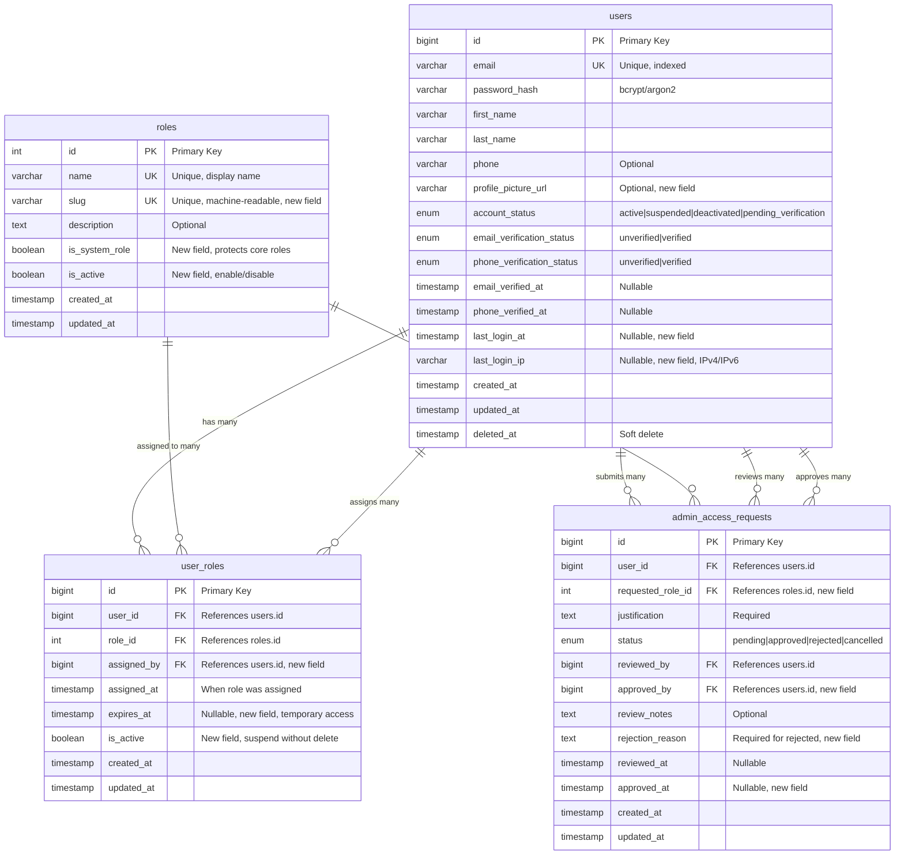
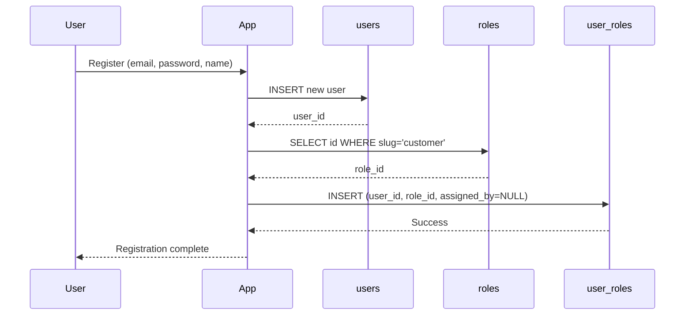
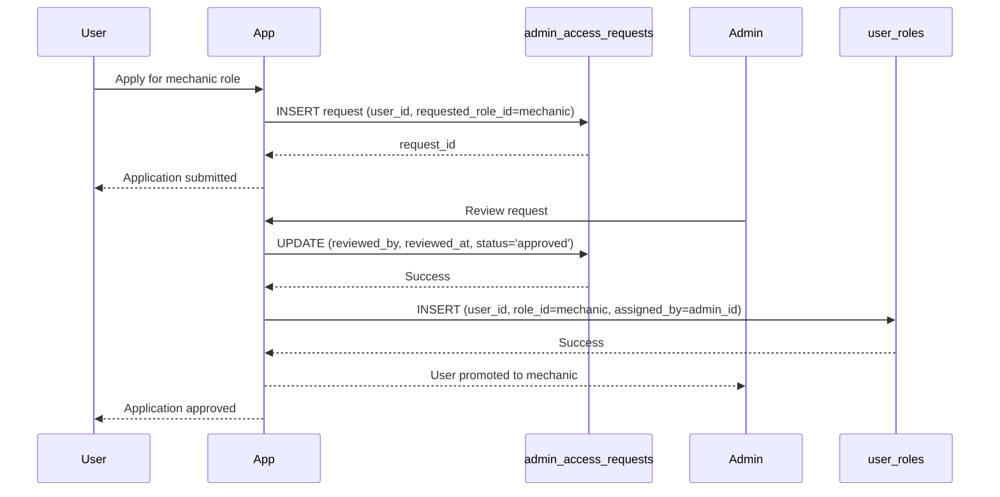
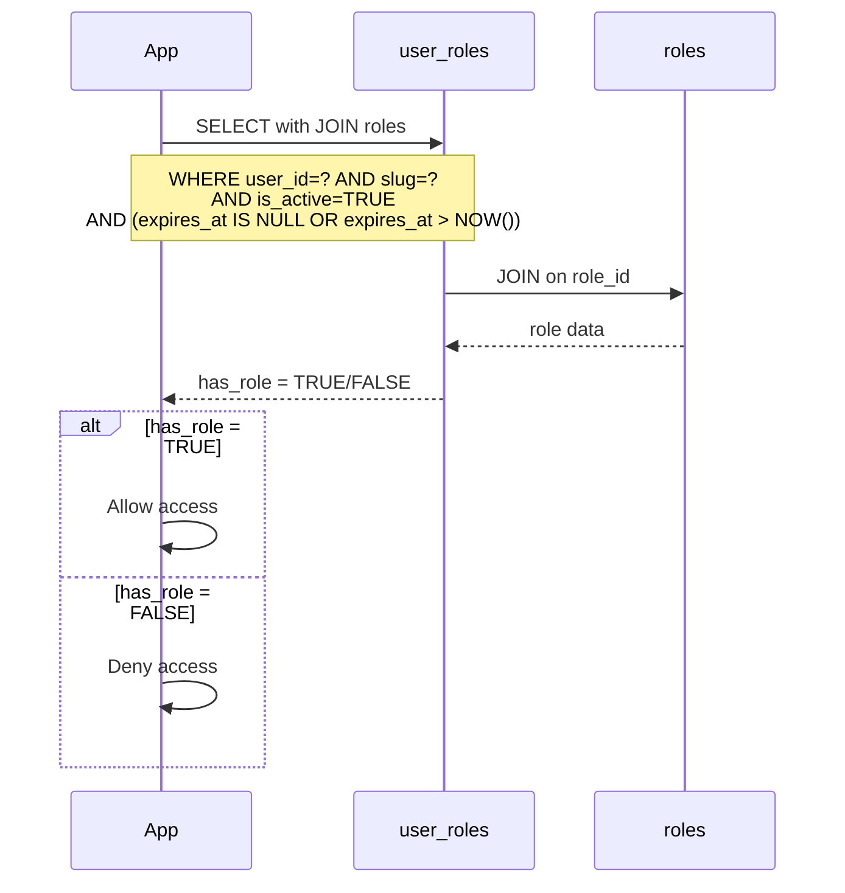
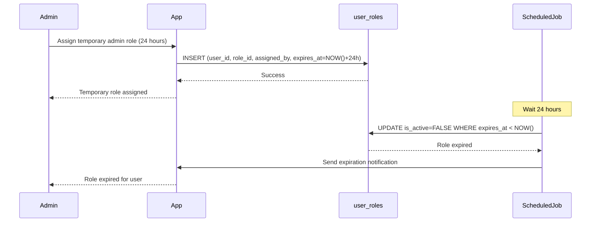
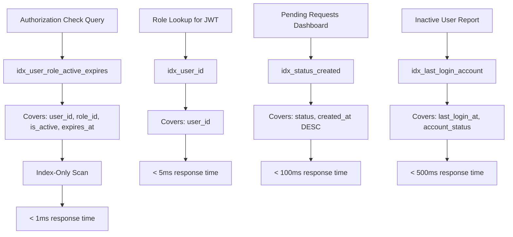
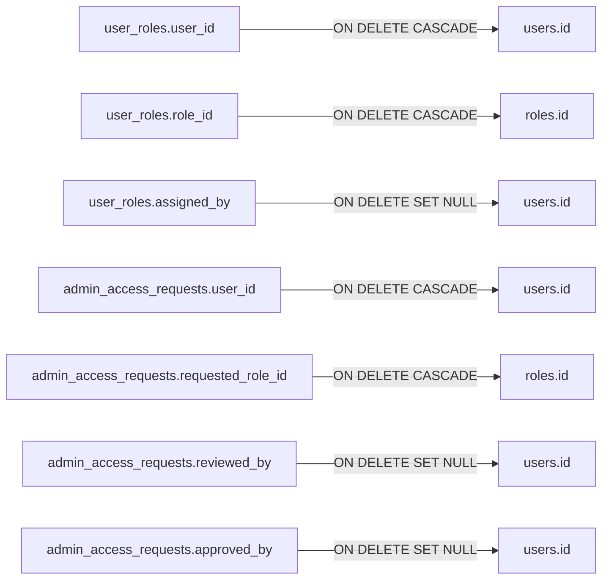
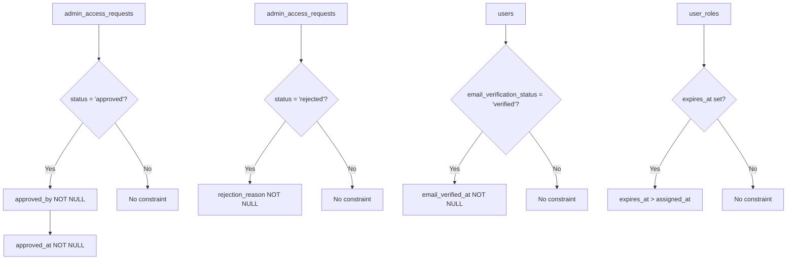

# Users and Roles Module - Entity Relationship Diagram

## Overview

This document provides detailed entity relationship diagrams for the refactored Users and Roles module of the P.A.R.C.E database.

---

## Complete Users and Roles ERD



---

## Detailed Relationship Descriptions

### 1. users ↔ user_roles (One-to-Many)

**Relationship**: A user can have multiple roles

**Cardinality**: 1:N (One user to many user_roles)

**Foreign Key**: `user_roles.user_id` → `users.id`

**Delete Behavior**: CASCADE (when user is deleted, all role assignments are removed)

**Business Rules**:
- A user must have at least one role (typically 'customer' on registration)
- A user can have multiple roles simultaneously (e.g., customer + mechanic)
- The combination of `user_id` and `role_id` must be unique (no duplicate assignments)

**Example**:
```
User ID 123 (John Doe) has:
- user_roles.id = 1, role_id = 1 (customer)
- user_roles.id = 2, role_id = 2 (mechanic)
```

---

### 2. roles ↔ user_roles (One-to-Many)

**Relationship**: A role can be assigned to multiple users

**Cardinality**: 1:N (One role to many user_roles)

**Foreign Key**: `user_roles.role_id` → `roles.id`

**Delete Behavior**: CASCADE (when role is deleted, all assignments are removed)

**Business Rules**:
- System roles (`is_system_role = TRUE`) should not be deleted
- Inactive roles (`is_active = FALSE`) cannot be assigned to new users
- Existing assignments remain valid when role is deactivated

**Example**:
```
Role ID 2 (mechanic) is assigned to:
- user_roles.id = 2, user_id = 123 (John Doe)
- user_roles.id = 5, user_id = 456 (Jane Smith)
- user_roles.id = 8, user_id = 789 (Bob Johnson)
```

---

### 3. users ↔ user_roles (assigned_by) (One-to-Many)

**Relationship**: A user (administrator) can assign roles to other users

**Cardinality**: 1:N (One admin to many role assignments)

**Foreign Key**: `user_roles.assigned_by` → `users.id`

**Delete Behavior**: SET NULL (preserve assignment even if assigning admin is deleted)

**Business Rules**:
- `assigned_by` is NULL for self-assigned roles (e.g., customer role on registration)
- `assigned_by` must reference a user with administrator privileges
- Used for audit trail and accountability

**Example**:
```
Admin User ID 999 (Admin Alice) assigned:
- user_roles.id = 2, user_id = 123, role_id = 2 (gave John mechanic role)
- user_roles.id = 5, user_id = 456, role_id = 2 (gave Jane mechanic role)
```

---

### 4. users ↔ admin_access_requests (submits) (One-to-Many)

**Relationship**: A user can submit multiple admin access requests

**Cardinality**: 1:N (One user to many requests)

**Foreign Key**: `admin_access_requests.user_id` → `users.id`

**Delete Behavior**: CASCADE (when user is deleted, their requests are removed)

**Business Rules**:
- A user can have multiple requests (e.g., request mechanic role, later request admin role)
- Only one pending request per user per role (enforced in application logic)
- Users can cancel their own pending requests

**Example**:
```
User ID 123 (John Doe) submitted:
- Request ID 1: requested mechanic role (approved)
- Request ID 5: requested administrator role (pending)
```

---

### 5. roles ↔ admin_access_requests (requested_in) (One-to-Many)

**Relationship**: A role can be requested by multiple users

**Cardinality**: 1:N (One role to many requests)

**Foreign Key**: `admin_access_requests.requested_role_id` → `roles.id`

**Delete Behavior**: CASCADE (when role is deleted, requests for that role are removed)

**Business Rules**:
- Typically used for 'mechanic' and 'administrator' roles
- 'customer' role is auto-assigned on registration (no request needed)
- System roles can be requested but require approval

**Example**:
```
Role ID 2 (mechanic) was requested in:
- Request ID 1: by user 123 (approved)
- Request ID 3: by user 456 (approved)
- Request ID 7: by user 789 (pending)
```

---

### 6. users ↔ admin_access_requests (reviews) (One-to-Many)

**Relationship**: A user (administrator) can review multiple access requests

**Cardinality**: 1:N (One admin to many reviews)

**Foreign Key**: `admin_access_requests.reviewed_by` → `users.id`

**Delete Behavior**: SET NULL (preserve request even if reviewer is deleted)

**Business Rules**:
- `reviewed_by` must reference a user with administrator privileges
- Reviewer can be different from approver (two-person rule)
- `reviewed_at` timestamp is set when status changes from 'pending'

**Example**:
```
Admin User ID 999 (Admin Alice) reviewed:
- Request ID 1: approved John's mechanic request
- Request ID 3: rejected Jane's admin request
- Request ID 5: pending review
```

---

### 7. users ↔ admin_access_requests (approves) (One-to-Many)

**Relationship**: A user (administrator) can approve multiple access requests

**Cardinality**: 1:N (One admin to many approvals)

**Foreign Key**: `admin_access_requests.approved_by` → `users.id`

**Delete Behavior**: SET NULL (preserve request even if approver is deleted)

**Business Rules**:
- `approved_by` must reference a user with administrator privileges
- Approver can be different from reviewer (two-person rule for sensitive roles)
- `approved_at` timestamp is set when status changes to 'approved'
- When approved, a corresponding `user_roles` entry should be created

**Example**:
```
Admin User ID 888 (Admin Bob) approved:
- Request ID 1: approved John's mechanic request (reviewed by Alice)
- Request ID 4: approved Jane's mechanic request (reviewed by Alice)
```

---

## Workflow Diagrams

### User Registration Workflow



### Mechanic Application Workflow



### Authorization Check Workflow



### Temporary Role Assignment Workflow



---

## Index Strategy Visualization

### Critical Indexes for Performance



---

## Data Integrity Constraints

### Foreign Key Constraints



### Check Constraints



---

## Cardinality Summary

| Relationship | From | To | Cardinality | Delete Behavior |
|--------------|------|-----|-------------|-----------------|
| User has roles | users | user_roles | 1:N | CASCADE |
| Role assigned to users | roles | user_roles | 1:N | CASCADE |
| Admin assigns roles | users | user_roles (assigned_by) | 1:N | SET NULL |
| User submits requests | users | admin_access_requests | 1:N | CASCADE |
| Role requested | roles | admin_access_requests | 1:N | CASCADE |
| Admin reviews requests | users | admin_access_requests (reviewed_by) | 1:N | SET NULL |
| Admin approves requests | users | admin_access_requests (approved_by) | 1:N | SET NULL |

---

## Field Type Reference

### ENUM Types

**users.account_status**:
- `active`: Normal operation
- `suspended`: Admin-imposed temporary block
- `deactivated`: User-initiated deactivation
- `pending_verification`: New account awaiting verification

**users.email_verification_status**:
- `unverified`: Email not verified
- `verified`: Email verified

**users.phone_verification_status**:
- `unverified`: Phone not verified
- `verified`: Phone verified

**admin_access_requests.status**:
- `pending`: Awaiting review
- `approved`: Request approved
- `rejected`: Request denied
- `cancelled`: User cancelled request

### Key Field Sizes

| Field | Type | Max Length | Notes |
|-------|------|------------|-------|
| users.email | VARCHAR | 255 | Standard email length |
| users.password_hash | VARCHAR | 255 | bcrypt/argon2 hash |
| users.first_name | VARCHAR | 100 | |
| users.last_name | VARCHAR | 100 | |
| users.phone | VARCHAR | 20 | E.164 format |
| users.profile_picture_url | VARCHAR | 500 | URL or file path |
| users.last_login_ip | VARCHAR | 45 | IPv4 (15) or IPv6 (45) |
| roles.name | VARCHAR | 50 | Display name |
| roles.slug | VARCHAR | 50 | Machine-readable |

---

## Migration Impact Diagram

```mermaid
graph TD
    A[Old Schema] --> B{Migration}
    B --> C[New Schema]
    
    A1[users.user_type ENUM] -.->|Removed| B
    A2[users.verification_status ENUM] -.->|Removed| B
    
    B -->|Added| C1[users.profile_picture_url]
    B -->|Added| C2[users.account_status]
    B -->|Added| C3[users.email_verification_status]
    B -->|Added| C4[users.phone_verification_status]
    B -->|Added| C5[users.last_login_at]
    B -->|Added| C6[users.last_login_ip]
    
    B -->|Added| D1[roles.slug]
    B -->|Added| D2[roles.is_system_role]
    B -->|Added| D3[roles.is_active]
    
    B -->|Added| E1[user_roles.assigned_by]
    B -->|Added| E2[user_roles.expires_at]
    B -->|Added| E3[user_roles.is_active]
    
    B -->|Added| F1[admin_access_requests.requested_role_id]
    B -->|Added| F2[admin_access_requests.approved_by]
    B -->|Added| F3[admin_access_requests.rejection_reason]
    B -->|Added| F4[admin_access_requests.approved_at]
    
    style A1 fill:#ffcccc
    style A2 fill:#ffcccc
    style C1 fill:#ccffcc
    style C2 fill:#ccffcc
    style C3 fill:#ccffcc
    style C4 fill:#ccffcc
    style C5 fill:#ccffcc
    style C6 fill:#ccffcc
    style D1 fill:#ccffcc
    style D2 fill:#ccffcc
    style D3 fill:#ccffcc
    style E1 fill:#ccffcc
    style E2 fill:#ccffcc
    style E3 fill:#ccffcc
    style F1 fill:#ccffcc
    style F2 fill:#ccffcc
    style F3 fill:#ccffcc
    style F4 fill:#ccffcc
```



**Legend**:
- 🔴 Red: Removed fields
- 🟢 Green: Added fields

---

## Summary

This ERD documentation provides a complete visual and textual reference for the refactored Users and Roles module. Key improvements include:

1. **Eliminated role duplication** by removing `user_type` ENUM
2. **Enhanced audit trail** with `assigned_by`, `reviewed_by`, `approved_by` fields
3. **Added temporary access** via `expires_at` field
4. **Improved security** with two-person approval rule
5. **Better user management** with separate verification statuses and account status
6. **Complete relationship documentation** with cardinality and delete behaviors

For implementation details, see:
- `users-roles-module.sql` - Complete DDL
- `REFACTORING-SUMMARY.md` - Detailed explanation of changes
- `design.md` - Full database architecture document
