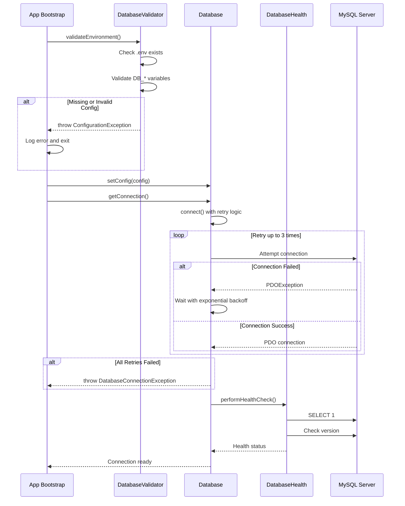
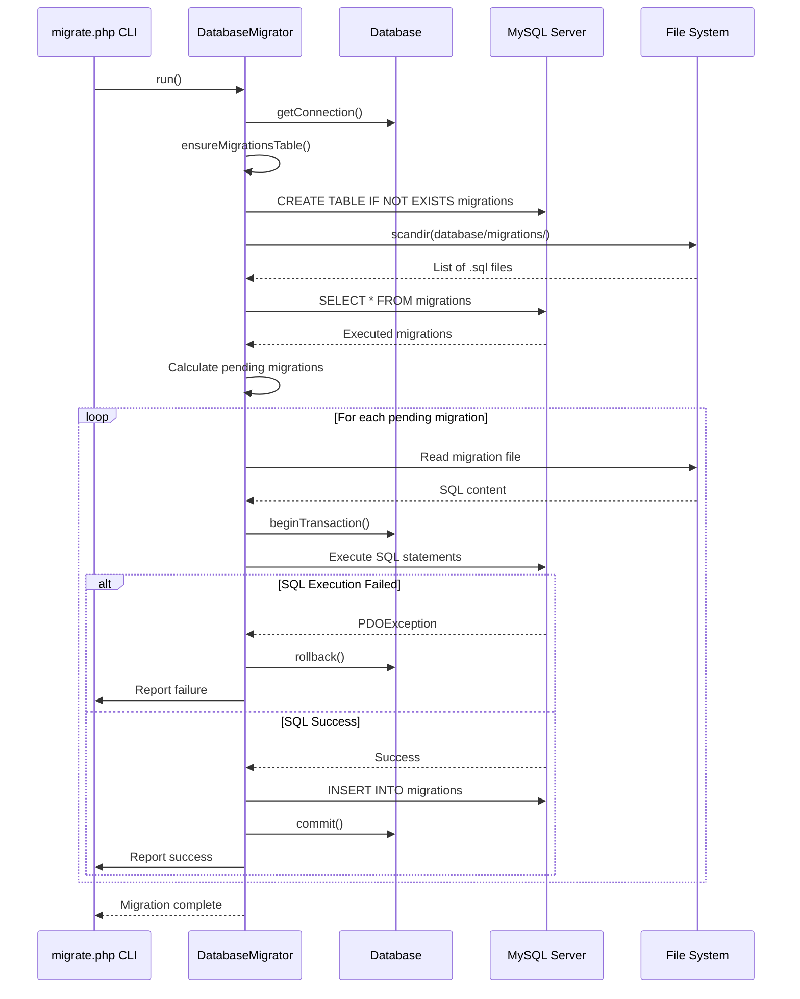
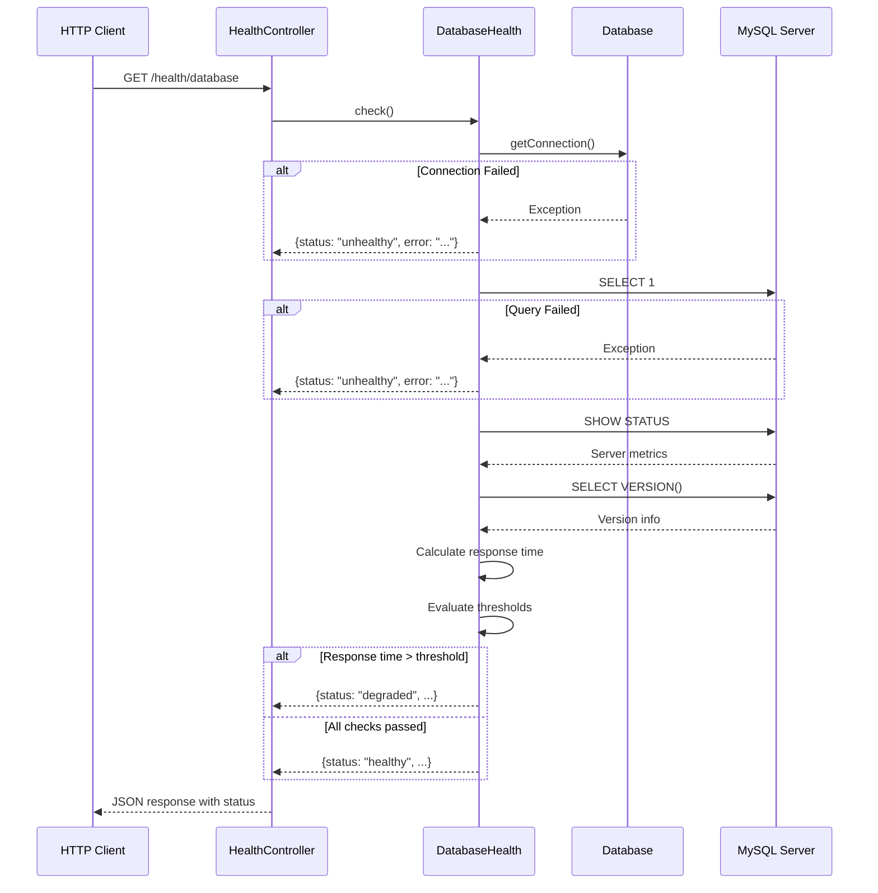

# Design Document: Database Infrastructure Layer

## Overview

The Database Infrastructure Layer enhancement provides a robust, production-ready foundation for the P.A.R.C.E platform's data persistence layer. This design introduces critical infrastructure components including database connection validation, health monitoring, a migration system for schema management, enhanced error handling with structured logging, and connection resilience with retry logic. The architecture maintains full backward compatibility with the existing `Database` class API while adding enterprise-grade reliability features essential for a production service platform.

The design follows clean separation of concerns with dedicated components for migrations, health checks, validation, and connection management. All components integrate seamlessly with the existing MVC architecture and PSR-4 autoloading structure.

## Architecture

```mermaid
graph TB
    subgraph "Application Layer"
        App[App.php Bootstrap]
        Controllers[Controllers]
        Models[Models]
    end
    
    subgraph "Database Infrastructure Layer"
        DB[Database Class<br/>Core PDO Wrapper]
        Health[DatabaseHealth<br/>Health Checks]
        Validator[DatabaseValidator<br/>Config Validation]
        Migrator[DatabaseMigrator<br/>Schema Management]
        Logger[DatabaseLogger<br/>Structured Logging]
    end
    
    subgraph "CLI Interface"
        MigrateCLI[migrate.php CLI]
        HealthCLI[db-health.php CLI]
    end
    
    subgraph "HTTP Endpoints"
        HealthEndpoint[/health/database]
    end
    
    subgraph "External Systems"
        MySQL[(MySQL Database)]
        LogFiles[Log Files<br/>storage/logs/]
    end
    
    App -->|bootstrap| Validator
    App -->|initialize| DB
    App -->|setup| Migrator
    Controllers --> DB
    Models --> DB
    
    DB -->|uses| Logger
    DB -->|validates| Validator
    DB -->|monitors| Health
    
    Health -->|checks| MySQL
    Migrator -->|executes| MySQL
    Validator -->|validates| MySQL
    
    MigrateCLI -->|commands| Migrator
    HealthCLI -->|checks| Health
    HealthEndpoint -->|queries| Health
    
    Logger -->|writes| LogFiles
    
    style DB fill:#3B82F6,stroke:#1E40AF,color:#fff
    style Health fill:#10B981,stroke:#059669,color:#fff
    style Validator fill:#F59E0B,stroke:#D97706,color:#fff
    style Migrator fill:#8B5CF6,stroke:#6D28D9,color:#fff
```

## Sequence Diagrams

### Application Bootstrap with Database Validation



### Migration Execution Flow



### Health Check HTTP Endpoint Flow



## Components and Interfaces

### Component 1: DatabaseValidator

**Purpose**: Validates database configuration and environment setup before connection attempts

**Interface**:
```php
<?php

namespace App\Core\Database;

interface DatabaseValidatorInterface
{
    /**
     * Validate environment configuration
     * 
     * @throws ConfigurationException if .env missing or invalid
     */
    public function validateEnvironment(): void;
    
    /**
     * Validate database configuration array
     * 
     * @param array $config Database configuration
     * @throws ConfigurationException if config invalid
     */
    public function validateConfig(array $config): void;
    
    /**
     * Check if database credentials are valid
     * 
     * @param array $config Database configuration
     * @return bool True if credentials valid
     */
    public function testCredentials(array $config): bool;
}
```

**Responsibilities**:
- Verify .env file exists and is readable
- Validate required DB_* environment variables are present
- Check configuration values are well-formed (port is numeric, host is valid, etc.)
- Provide early failure detection before connection attempts
- Generate actionable error messages for configuration issues


### Component 2: DatabaseHealth

**Purpose**: Monitors database connection health and provides diagnostic information

**Interface**:
```php
<?php

namespace App\Core\Database;

interface DatabaseHealthInterface
{
    /**
     * Perform comprehensive health check
     * 
     * @return array Health status with metrics
     */
    public function check(): array;
    
    /**
     * Quick connectivity test
     * 
     * @return bool True if database is reachable
     */
    public function ping(): bool;
    
    /**
     * Get database server metrics
     * 
     * @return array Server status information
     */
    public function getMetrics(): array;
    
    /**
     * Check if database is ready for queries
     * 
     * @return bool True if ready
     */
    public function isReady(): bool;
}
```

**Responsibilities**:
- Execute connectivity tests (SELECT 1)
- Measure query response times
- Retrieve server version and status
- Monitor connection pool status
- Provide structured health data for monitoring systems
- Support HTTP health check endpoints


### Component 3: DatabaseMigrator

**Purpose**: Manages database schema migrations with version tracking and rollback support

**Interface**:
```php
<?php

namespace App\Core\Database;

interface DatabaseMigratorInterface
{
    /**
     * Run all pending migrations
     * 
     * @return array Results of migration execution
     */
    public function run(): array;
    
    /**
     * Rollback last migration batch
     * 
     * @param int $steps Number of migrations to rollback
     * @return array Results of rollback
     */
    public function rollback(int $steps = 1): array;
    
    /**
     * Get list of pending migrations
     * 
     * @return array Pending migration files
     */
    public function getPending(): array;
    
    /**
     * Get list of executed migrations
     * 
     * @return array Executed migration records
     */
    public function getExecuted(): array;
    
    /**
     * Reset database (rollback all migrations)
     * 
     * @return array Results of reset
     */
    public function reset(): array;
}
```

**Responsibilities**:
- Scan migration directory for .sql files
- Track executed migrations in `migrations` table
- Execute pending migrations in order
- Support transactional migration execution
- Provide rollback capability for failed migrations
- Generate migration status reports
- Validate migration file format and naming


### Component 4: DatabaseLogger

**Purpose**: Provides structured logging for database operations with context and severity levels

**Interface**:
```php
<?php

namespace App\Core\Database;

interface DatabaseLoggerInterface
{
    /**
     * Log database query execution
     * 
     * @param string $query SQL query
     * @param array $params Query parameters
     * @param float $duration Execution time in seconds
     */
    public function logQuery(string $query, array $params, float $duration): void;
    
    /**
     * Log database error
     * 
     * @param \Throwable $exception Exception object
     * @param array $context Additional context
     */
    public function logError(\Throwable $exception, array $context = []): void;
    
    /**
     * Log connection event
     * 
     * @param string $event Event type (connected, disconnected, retry)
     * @param array $context Event context
     */
    public function logConnection(string $event, array $context = []): void;
    
    /**
     * Log migration event
     * 
     * @param string $migration Migration name
     * @param string $status Status (started, completed, failed)
     * @param array $context Additional context
     */
    public function logMigration(string $migration, string $status, array $context = []): void;
}
```

**Responsibilities**:
- Write structured logs to storage/logs/database-{date}.log
- Include timestamps, severity levels, and context
- Log slow queries exceeding threshold
- Track connection lifecycle events
- Record migration execution history
- Support log rotation and retention policies


### Component 5: Enhanced Database Class

**Purpose**: Core PDO wrapper with added resilience, logging, and health monitoring

**Interface** (extends existing Database class):
```php
<?php

namespace App\Core;

class Database
{
    // Existing methods (unchanged for backward compatibility)
    public static function setConfig(array $config): void;
    public static function getConnection(): PDO;
    public static function query(string $sql, array $params = []): \PDOStatement;
    public static function fetchAll(string $sql, array $params = []): array;
    public static function fetchOne(string $sql, array $params = []): ?array;
    public static function insert(string $table, array $data): int;
    public static function update(string $table, array $data, string $where, array $whereParams = []): int;
    public static function delete(string $table, string $where, array $whereParams = []): int;
    public static function beginTransaction(): bool;
    public static function commit(): bool;
    public static function rollback(): bool;
    public static function inTransaction(): bool;
    public static function disconnect(): void;
    
    // New methods for infrastructure layer
    
    /**
     * Get health checker instance
     */
    public static function health(): DatabaseHealthInterface;
    
    /**
     * Get validator instance
     */
    public static function validator(): DatabaseValidatorInterface;
    
    /**
     * Get logger instance
     */
    public static function logger(): DatabaseLoggerInterface;
    
    /**
     * Test database connection without throwing exceptions
     */
    public static function testConnection(): bool;
    
    /**
     * Get connection statistics
     */
    public static function getStats(): array;
}
```

**Responsibilities**:
- Maintain existing API for backward compatibility
- Integrate retry logic with exponential backoff
- Delegate logging to DatabaseLogger
- Provide access to health, validator, and logger components
- Track connection statistics (queries executed, errors, duration)


## Data Models

### Migration Record Model

```php
<?php

namespace App\Core\Database\Models;

/**
 * Represents a migration record in the migrations table
 */
class Migration
{
    public int $id;
    public string $migration;
    public int $batch;
    public string $executed_at;
    
    /**
     * Validation rules for migration records
     */
    public function validate(): bool
    {
        return !empty($this->migration) 
            && $this->batch > 0 
            && preg_match('/^\d{4}_\d{2}_\d{2}_\d{6}_[a-z0-9_]+\.sql$/', $this->migration);
    }
}
```

**Validation Rules**:
- `migration` must be non-empty string
- `migration` must match format: `YYYY_MM_DD_HHMMSS_description.sql`
- `batch` must be positive integer
- `executed_at` must be valid timestamp

### Health Check Result Model

```php
<?php

namespace App\Core\Database\Models;

/**
 * Represents database health check result
 */
class HealthCheckResult
{
    public string $status; // 'healthy', 'degraded', 'unhealthy'
    public float $response_time_ms;
    public string $version;
    public array $metrics;
    public ?string $error;
    public string $checked_at;
    
    /**
     * Check if database is healthy
     */
    public function isHealthy(): bool
    {
        return $this->status === 'healthy';
    }
    
    /**
     * Convert to array for JSON response
     */
    public function toArray(): array
    {
        return [
            'status' => $this->status,
            'response_time_ms' => $this->response_time_ms,
            'version' => $this->version,
            'metrics' => $this->metrics,
            'error' => $this->error,
            'checked_at' => $this->checked_at,
        ];
    }
}
```

**Validation Rules**:
- `status` must be one of: 'healthy', 'degraded', 'unhealthy'
- `response_time_ms` must be non-negative float
- `version` must be non-empty string
- `checked_at` must be valid ISO 8601 timestamp


### Database Configuration Model

```php
<?php

namespace App\Core\Database\Models;

/**
 * Represents validated database configuration
 */
class DatabaseConfig
{
    public string $driver;
    public string $host;
    public int $port;
    public string $database;
    public string $username;
    public string $password;
    public string $charset;
    public int $max_retries;
    public int $retry_delay_ms;
    public int $connection_timeout;
    public int $query_timeout;
    
    /**
     * Create from array
     */
    public static function fromArray(array $config): self
    {
        $instance = new self();
        $instance->driver = $config['driver'] ?? 'mysql';
        $instance->host = $config['host'] ?? '127.0.0.1';
        $instance->port = (int)($config['port'] ?? 3306);
        $instance->database = $config['database'] ?? '';
        $instance->username = $config['username'] ?? 'root';
        $instance->password = $config['password'] ?? '';
        $instance->charset = $config['charset'] ?? 'utf8mb4';
        $instance->max_retries = (int)($config['max_retries'] ?? 3);
        $instance->retry_delay_ms = (int)($config['retry_delay_ms'] ?? 100);
        $instance->connection_timeout = (int)($config['connection_timeout'] ?? 5);
        $instance->query_timeout = (int)($config['query_timeout'] ?? 30);
        
        return $instance;
    }
    
    /**
     * Validate configuration
     */
    public function validate(): array
    {
        $errors = [];
        
        if (empty($this->host)) {
            $errors[] = 'Database host is required';
        }
        
        if ($this->port < 1 || $this->port > 65535) {
            $errors[] = 'Database port must be between 1 and 65535';
        }
        
        if (empty($this->database)) {
            $errors[] = 'Database name is required';
        }
        
        if (empty($this->username)) {
            $errors[] = 'Database username is required';
        }
        
        return $errors;
    }
}
```

**Validation Rules**:
- `host` must be non-empty string
- `port` must be integer between 1 and 65535
- `database` must be non-empty string
- `username` must be non-empty string
- `max_retries` must be non-negative integer
- `retry_delay_ms` must be positive integer
- `connection_timeout` must be positive integer
- `query_timeout` must be positive integer


## Algorithmic Pseudocode

### Connection Retry Algorithm with Exponential Backoff

```php
<?php

/**
 * ALGORITHM: establishConnectionWithRetry
 * 
 * INPUT: 
 *   - config: DatabaseConfig object with connection parameters
 *   - maxRetries: Maximum number of retry attempts (default: 3)
 *   - baseDelayMs: Base delay in milliseconds for exponential backoff (default: 100)
 * 
 * OUTPUT: 
 *   - PDO connection object on success
 *   - Throws DatabaseConnectionException on failure after all retries
 * 
 * PRECONDITIONS:
 *   - config is validated and well-formed
 *   - config.host is reachable
 *   - maxRetries >= 1
 *   - baseDelayMs > 0
 * 
 * POSTCONDITIONS:
 *   - Returns valid PDO connection if successful
 *   - All retry attempts logged
 *   - Exception thrown if all retries exhausted
 *   - Connection state is either connected or null
 */

function establishConnectionWithRetry(
    DatabaseConfig $config, 
    int $maxRetries = 3, 
    int $baseDelayMs = 100
): PDO {
    $attempt = 0;
    $lastException = null;
    
    // LOOP INVARIANT: 
    // - attempt <= maxRetries
    // - If connection succeeds, loop terminates immediately
    // - Each failed attempt increments attempt counter
    while ($attempt < $maxRetries) {
        try {
            // Log connection attempt
            DatabaseLogger::logConnection('attempting', [
                'attempt' => $attempt + 1,
                'max_retries' => $maxRetries,
                'host' => $config->host,
                'database' => $config->database
            ]);
            
            // Build DSN string
            $dsn = sprintf(
                "%s:host=%s;port=%d;dbname=%s;charset=%s",
                $config->driver,
                $config->host,
                $config->port,
                $config->database,
                $config->charset
            );
            
            // Attempt PDO connection with timeout
            $pdo = new PDO(
                $dsn,
                $config->username,
                $config->password,
                [
                    PDO::ATTR_ERRMODE => PDO::ERRMODE_EXCEPTION,
                    PDO::ATTR_DEFAULT_FETCH_MODE => PDO::FETCH_ASSOC,
                    PDO::ATTR_EMULATE_PREPARES => false,
                    PDO::ATTR_PERSISTENT => true,
                    PDO::ATTR_TIMEOUT => $config->connection_timeout
                ]
            );
            
            // Connection successful
            DatabaseLogger::logConnection('connected', [
                'attempt' => $attempt + 1,
                'host' => $config->host
            ]);
            
            return $pdo;
            
        } catch (PDOException $e) {
            $lastException = $e;
            $attempt++;
            
            // Log failed attempt
            DatabaseLogger::logError($e, [
                'attempt' => $attempt,
                'max_retries' => $maxRetries,
                'will_retry' => $attempt < $maxRetries
            ]);
            
            // If not last attempt, wait with exponential backoff
            if ($attempt < $maxRetries) {
                // Calculate delay: baseDelay * 2^(attempt-1)
                // Example: 100ms, 200ms, 400ms for attempts 1, 2, 3
                $delayMs = $baseDelayMs * pow(2, $attempt - 1);
                
                DatabaseLogger::logConnection('retry_delay', [
                    'delay_ms' => $delayMs,
                    'next_attempt' => $attempt + 1
                ]);
                
                // Sleep for calculated delay
                usleep($delayMs * 1000); // Convert ms to microseconds
            }
        }
    }
    
    // All retries exhausted
    DatabaseLogger::logConnection('failed', [
        'total_attempts' => $attempt,
        'error' => $lastException->getMessage()
    ]);
    
    throw new DatabaseConnectionException(
        "Failed to connect to database after {$attempt} attempts: " . 
        $lastException->getMessage(),
        0,
        $lastException
    );
}
```

**Preconditions**:
- `config` is validated DatabaseConfig object
- `config.host` is a valid hostname or IP address
- `maxRetries` is positive integer (>= 1)
- `baseDelayMs` is positive integer (> 0)
- Database server is installed and running (may be temporarily unavailable)

**Postconditions**:
- Returns valid PDO connection object if any attempt succeeds
- Throws DatabaseConnectionException if all attempts fail
- All connection attempts are logged with context
- Exponential backoff delays are applied between retries
- Total execution time <= (connection_timeout * maxRetries) + sum of backoff delays

**Loop Invariants**:
- `attempt` is always <= `maxRetries`
- `lastException` contains the most recent PDOException if any attempt failed
- Each iteration either returns successfully or increments `attempt`
- Backoff delay increases exponentially with each retry


### Migration Execution Algorithm

```php
<?php

/**
 * ALGORITHM: executePendingMigrations
 * 
 * INPUT:
 *   - migrationsPath: Path to directory containing migration files
 *   - connection: Active PDO database connection
 * 
 * OUTPUT:
 *   - Array of migration results with status and details
 * 
 * PRECONDITIONS:
 *   - migrationsPath exists and is readable
 *   - connection is valid and active
 *   - migrations table exists in database
 *   - Migration files follow naming convention: YYYY_MM_DD_HHMMSS_description.sql
 * 
 * POSTCONDITIONS:
 *   - All pending migrations are executed in chronological order
 *   - Each successful migration is recorded in migrations table
 *   - Failed migrations trigger transaction rollback
 *   - Migration history is complete and consistent
 *   - Returns array with execution results for each migration
 */

function executePendingMigrations(string $migrationsPath, PDO $connection): array
{
    $results = [];
    
    // Step 1: Ensure migrations table exists
    ensureMigrationsTable($connection);
    
    // Step 2: Get list of all migration files
    $allMigrations = scanMigrationFiles($migrationsPath);
    
    // Sort migrations chronologically by filename
    sort($allMigrations);
    
    // Step 3: Get list of executed migrations from database
    $executedMigrations = getExecutedMigrations($connection);
    
    // Step 4: Calculate pending migrations
    $pendingMigrations = array_diff($allMigrations, $executedMigrations);
    
    // Step 5: Get current batch number
    $currentBatch = getCurrentBatch($connection) + 1;
    
    // LOOP INVARIANT:
    // - All previously processed migrations are either successfully executed or failed
    // - Database state is consistent (no partial migrations)
    // - Migration history table accurately reflects executed migrations
    foreach ($pendingMigrations as $migrationFile) {
        $migrationName = basename($migrationFile);
        $startTime = microtime(true);
        
        try {
            // Log migration start
            DatabaseLogger::logMigration($migrationName, 'started', [
                'batch' => $currentBatch,
                'file' => $migrationFile
            ]);
            
            // Read migration file content
            $sql = file_get_contents($migrationFile);
            
            if ($sql === false) {
                throw new MigrationException("Failed to read migration file: {$migrationFile}");
            }
            
            // Begin transaction for atomic migration
            $connection->beginTransaction();
            
            // Execute migration SQL
            // Split by semicolon to handle multiple statements
            $statements = splitSqlStatements($sql);
            
            foreach ($statements as $statement) {
                $trimmed = trim($statement);
                
                // Skip empty statements and comments
                if (empty($trimmed) || strpos($trimmed, '--') === 0) {
                    continue;
                }
                
                $connection->exec($trimmed);
            }
            
            // Record migration in history table
            $stmt = $connection->prepare(
                "INSERT INTO migrations (migration, batch, executed_at) VALUES (?, ?, NOW())"
            );
            $stmt->execute([$migrationName, $currentBatch]);
            
            // Commit transaction
            $connection->commit();
            
            $duration = microtime(true) - $startTime;
            
            // Log success
            DatabaseLogger::logMigration($migrationName, 'completed', [
                'batch' => $currentBatch,
                'duration_seconds' => $duration
            ]);
            
            $results[] = [
                'migration' => $migrationName,
                'status' => 'success',
                'batch' => $currentBatch,
                'duration' => $duration
            ];
            
        } catch (\Exception $e) {
            // Rollback transaction on failure
            if ($connection->inTransaction()) {
                $connection->rollBack();
            }
            
            $duration = microtime(true) - $startTime;
            
            // Log failure
            DatabaseLogger::logMigration($migrationName, 'failed', [
                'batch' => $currentBatch,
                'error' => $e->getMessage(),
                'duration_seconds' => $duration
            ]);
            
            $results[] = [
                'migration' => $migrationName,
                'status' => 'failed',
                'error' => $e->getMessage(),
                'duration' => $duration
            ];
            
            // Stop processing remaining migrations
            break;
        }
    }
    
    return $results;
}

/**
 * Helper: Ensure migrations table exists
 */
function ensureMigrationsTable(PDO $connection): void
{
    $sql = "
        CREATE TABLE IF NOT EXISTS migrations (
            id INT UNSIGNED AUTO_INCREMENT PRIMARY KEY,
            migration VARCHAR(255) NOT NULL,
            batch INT NOT NULL,
            executed_at TIMESTAMP DEFAULT CURRENT_TIMESTAMP,
            INDEX idx_migration (migration),
            INDEX idx_batch (batch)
        ) ENGINE=InnoDB DEFAULT CHARSET=utf8mb4 COLLATE=utf8mb4_unicode_ci
    ";
    
    $connection->exec($sql);
}

/**
 * Helper: Get executed migrations from database
 */
function getExecutedMigrations(PDO $connection): array
{
    $stmt = $connection->query("SELECT migration FROM migrations ORDER BY id");
    return $stmt->fetchAll(PDO::FETCH_COLUMN);
}

/**
 * Helper: Get current batch number
 */
function getCurrentBatch(PDO $connection): int
{
    $stmt = $connection->query("SELECT COALESCE(MAX(batch), 0) as max_batch FROM migrations");
    $result = $stmt->fetch();
    return (int)$result['max_batch'];
}

/**
 * Helper: Split SQL into individual statements
 */
function splitSqlStatements(string $sql): array
{
    // Remove SQL comments
    $sql = preg_replace('/--.*$/m', '', $sql);
    $sql = preg_replace('/\/\*.*?\*\//s', '', $sql);
    
    // Split by semicolon (simple approach)
    $statements = explode(';', $sql);
    
    return array_filter($statements, fn($s) => !empty(trim($s)));
}
```

**Preconditions**:
- `migrationsPath` is valid directory path containing .sql files
- `connection` is active PDO connection with write permissions
- Migration files follow naming convention: `YYYY_MM_DD_HHMMSS_description.sql`
- Each migration file contains valid SQL statements
- `migrations` table exists or can be created

**Postconditions**:
- All pending migrations executed in chronological order
- Each successful migration recorded in `migrations` table with batch number
- Failed migrations do not leave partial changes (transaction rollback)
- Returns array with detailed results for each migration attempt
- Database schema is in consistent state

**Loop Invariants**:
- All previously processed migrations in current execution are recorded in results array
- Database state remains consistent (no partial migrations due to transaction usage)
- Migration history table accurately reflects all successfully executed migrations
- Batch number remains constant throughout execution


### Health Check Algorithm

```php
<?php

/**
 * ALGORITHM: performDatabaseHealthCheck
 * 
 * INPUT:
 *   - connection: PDO database connection (may be null)
 *   - thresholds: Array of health check thresholds
 * 
 * OUTPUT:
 *   - HealthCheckResult object with status and metrics
 * 
 * PRECONDITIONS:
 *   - thresholds contains valid numeric values for response_time_warning_ms and response_time_critical_ms
 *   - thresholds.response_time_warning_ms < thresholds.response_time_critical_ms
 * 
 * POSTCONDITIONS:
 *   - Returns HealthCheckResult with status: 'healthy', 'degraded', or 'unhealthy'
 *   - Status 'healthy' if all checks pass and response time < warning threshold
 *   - Status 'degraded' if checks pass but response time >= warning threshold
 *   - Status 'unhealthy' if any check fails
 *   - All metrics are populated in result object
 */

function performDatabaseHealthCheck(
    ?PDO $connection, 
    array $thresholds = []
): HealthCheckResult {
    $result = new HealthCheckResult();
    $result->checked_at = date('c'); // ISO 8601 format
    
    // Default thresholds
    $warningThresholdMs = $thresholds['response_time_warning_ms'] ?? 100;
    $criticalThresholdMs = $thresholds['response_time_critical_ms'] ?? 500;
    
    // Check 1: Connection exists
    if ($connection === null) {
        $result->status = 'unhealthy';
        $result->error = 'Database connection is null';
        $result->response_time_ms = 0;
        $result->version = 'unknown';
        $result->metrics = [];
        return $result;
    }
    
    try {
        // Check 2: Connectivity test with timing
        $startTime = microtime(true);
        
        $stmt = $connection->query('SELECT 1 as health_check');
        $healthCheck = $stmt->fetch();
        
        $responseTime = (microtime(true) - $startTime) * 1000; // Convert to ms
        $result->response_time_ms = round($responseTime, 2);
        
        // Verify query returned expected result
        if ($healthCheck['health_check'] !== 1) {
            $result->status = 'unhealthy';
            $result->error = 'Health check query returned unexpected result';
            return $result;
        }
        
        // Check 3: Get database version
        $versionStmt = $connection->query('SELECT VERSION() as version');
        $versionResult = $versionStmt->fetch();
        $result->version = $versionResult['version'] ?? 'unknown';
        
        // Check 4: Get server metrics
        $metricsStmt = $connection->query("SHOW STATUS WHERE Variable_name IN (
            'Threads_connected',
            'Threads_running',
            'Max_used_connections',
            'Uptime',
            'Questions'
        )");
        
        $metrics = [];
        while ($row = $metricsStmt->fetch()) {
            $metrics[$row['Variable_name']] = $row['Value'];
        }
        $result->metrics = $metrics;
        
        // Determine status based on response time
        if ($responseTime >= $criticalThresholdMs) {
            $result->status = 'degraded';
            $result->error = "Response time ({$responseTime}ms) exceeds critical threshold ({$criticalThresholdMs}ms)";
        } elseif ($responseTime >= $warningThresholdMs) {
            $result->status = 'degraded';
            $result->error = "Response time ({$responseTime}ms) exceeds warning threshold ({$warningThresholdMs}ms)";
        } else {
            $result->status = 'healthy';
            $result->error = null;
        }
        
    } catch (\PDOException $e) {
        $result->status = 'unhealthy';
        $result->error = 'Database query failed: ' . $e->getMessage();
        $result->response_time_ms = 0;
        $result->version = 'unknown';
        $result->metrics = [];
        
        DatabaseLogger::logError($e, [
            'context' => 'health_check',
            'check_type' => 'connectivity'
        ]);
    }
    
    return $result;
}
```

**Preconditions**:
- `thresholds` array contains valid numeric values (if provided)
- `thresholds['response_time_warning_ms']` < `thresholds['response_time_critical_ms']`
- If `connection` is not null, it should be a valid PDO object

**Postconditions**:
- Returns HealthCheckResult object with all fields populated
- `status` is one of: 'healthy', 'degraded', 'unhealthy'
- `response_time_ms` is non-negative float
- `checked_at` is valid ISO 8601 timestamp
- If status is 'unhealthy', `error` field contains descriptive message
- All exceptions are caught and logged

**Loop Invariants**: N/A (no loops in this algorithm)


## Key Functions with Formal Specifications

### Function 1: DatabaseValidator::validateEnvironment()

```php
<?php

namespace App\Core\Database;

class DatabaseValidator implements DatabaseValidatorInterface
{
    /**
     * Validate environment configuration
     * 
     * @throws ConfigurationException if validation fails
     */
    public function validateEnvironment(): void
    {
        // Implementation in code section
    }
}
```

**Preconditions**:
- File system is accessible
- Application has read permissions for .env file location

**Postconditions**:
- If .env file exists and all required variables are present: returns normally
- If .env file missing: throws ConfigurationException with message "Environment file .env not found"
- If required DB_* variables missing: throws ConfigurationException listing missing variables
- No side effects on file system or environment

**Loop Invariants**: N/A

### Function 2: DatabaseMigrator::run()

```php
<?php

namespace App\Core\Database;

class DatabaseMigrator implements DatabaseMigratorInterface
{
    /**
     * Run all pending migrations
     * 
     * @return array Results of migration execution
     */
    public function run(): array
    {
        // Implementation follows executePendingMigrations algorithm
    }
}
```

**Preconditions**:
- Database connection is established and active
- Migration directory exists and is readable
- migrations table exists or can be created
- User has sufficient database permissions (CREATE, INSERT, SELECT)

**Postconditions**:
- Returns array of migration results
- Each result contains: migration name, status, batch number, duration
- All successful migrations are recorded in migrations table
- Failed migrations do not leave partial changes (rolled back)
- Database schema is in consistent state
- All execution logged to database log file

**Loop Invariants**:
- All processed migrations have corresponding entry in results array
- Database state remains consistent throughout execution
- Batch number remains constant for all migrations in single run

### Function 3: DatabaseHealth::check()

```php
<?php

namespace App\Core\Database;

class DatabaseHealth implements DatabaseHealthInterface
{
    /**
     * Perform comprehensive health check
     * 
     * @return array Health status with metrics
     */
    public function check(): array
    {
        // Implementation follows performDatabaseHealthCheck algorithm
    }
}
```

**Preconditions**:
- Database class is initialized
- Health check thresholds are configured (or defaults used)

**Postconditions**:
- Returns array with keys: status, response_time_ms, version, metrics, error, checked_at
- status is one of: 'healthy', 'degraded', 'unhealthy'
- response_time_ms is non-negative float
- All exceptions are caught and converted to 'unhealthy' status
- No modifications to database state

**Loop Invariants**: N/A


### Function 4: Database::query() (Enhanced)

```php
<?php

namespace App\Core;

class Database
{
    /**
     * Execute raw query with logging and error handling
     * 
     * @param string $sql SQL query
     * @param array $params Query parameters
     * @return \PDOStatement Executed statement
     * @throws DatabaseQueryException on query failure
     */
    public static function query(string $sql, array $params = []): \PDOStatement
    {
        // Implementation with logging and timing
    }
}
```

**Preconditions**:
- Database connection is established
- `$sql` is non-empty string containing valid SQL
- `$params` is array (may be empty)
- If `$params` is non-empty, `$sql` contains corresponding placeholders

**Postconditions**:
- Returns PDOStatement object if query succeeds
- Throws DatabaseQueryException if query fails
- Query execution time is logged if exceeds slow query threshold
- All query errors are logged with context
- No side effects on connection state (except for data modifications by the query itself)

**Loop Invariants**: N/A

### Function 5: DatabaseLogger::logQuery()

```php
<?php

namespace App\Core\Database;

class DatabaseLogger implements DatabaseLoggerInterface
{
    /**
     * Log database query execution
     * 
     * @param string $query SQL query
     * @param array $params Query parameters
     * @param float $duration Execution time in seconds
     */
    public function logQuery(string $query, array $params, float $duration): void
    {
        // Implementation writes to log file
    }
}
```

**Preconditions**:
- `$query` is non-empty string
- `$params` is array
- `$duration` is non-negative float
- Log directory exists and is writable

**Postconditions**:
- Log entry written to storage/logs/database-{date}.log
- Log entry contains: timestamp, query, params (sanitized), duration
- Sensitive data in params is masked (passwords, tokens)
- If log write fails, error is silently ignored (logging should not break application)
- Log file is created if it doesn't exist

**Loop Invariants**: N/A


## Example Usage

### Example 1: Application Bootstrap with Validation

```php
<?php

// In App.php bootstrap

use App\Core\Database;
use App\Core\Database\DatabaseValidator;
use App\Core\Database\Exceptions\ConfigurationException;

try {
    // Validate environment before attempting connection
    $validator = new DatabaseValidator();
    $validator->validateEnvironment();
    
    // Load configuration
    $config = [
        'driver' => $_ENV['DB_CONNECTION'],
        'host' => $_ENV['DB_HOST'],
        'port' => (int)$_ENV['DB_PORT'],
        'database' => $_ENV['DB_DATABASE'],
        'username' => $_ENV['DB_USERNAME'],
        'password' => $_ENV['DB_PASSWORD'],
        'charset' => 'utf8mb4',
        'max_retries' => 3,
        'retry_delay_ms' => 100,
    ];
    
    // Validate configuration
    $validator->validateConfig($config);
    
    // Set database configuration
    Database::setConfig($config);
    
    // Test connection (with retry logic)
    $connection = Database::getConnection();
    
    // Perform health check
    $health = Database::health()->check();
    
    if ($health['status'] === 'unhealthy') {
        throw new \Exception("Database is unhealthy: " . $health['error']);
    }
    
    echo "Database connected successfully\n";
    echo "Version: " . $health['version'] . "\n";
    echo "Response time: " . $health['response_time_ms'] . "ms\n";
    
} catch (ConfigurationException $e) {
    echo "Configuration error: " . $e->getMessage() . "\n";
    echo "Please check your .env file and ensure all DB_* variables are set.\n";
    exit(1);
} catch (\Exception $e) {
    echo "Database connection failed: " . $e->getMessage() . "\n";
    exit(1);
}
```

### Example 2: Running Migrations via CLI

```php
<?php

// In cli/migrate.php

require_once __DIR__ . '/../vendor/autoload.php';

use App\Core\Database;
use App\Core\Database\DatabaseMigrator;

// Load environment
$app = new \App\Core\App();

// Get command from arguments
$command = $argv[1] ?? 'run';

$migrator = new DatabaseMigrator(
    Database::getConnection(),
    __DIR__ . '/../database/migrations'
);

switch ($command) {
    case 'run':
        echo "Running pending migrations...\n";
        $results = $migrator->run();
        
        foreach ($results as $result) {
            if ($result['status'] === 'success') {
                echo "✓ {$result['migration']} (batch {$result['batch']}) - {$result['duration']}s\n";
            } else {
                echo "✗ {$result['migration']} - FAILED: {$result['error']}\n";
            }
        }
        break;
        
    case 'status':
        echo "Migration Status:\n";
        $pending = $migrator->getPending();
        $executed = $migrator->getExecuted();
        
        echo "\nExecuted: " . count($executed) . " migrations\n";
        echo "Pending: " . count($pending) . " migrations\n";
        
        if (!empty($pending)) {
            echo "\nPending migrations:\n";
            foreach ($pending as $migration) {
                echo "  - {$migration}\n";
            }
        }
        break;
        
    case 'rollback':
        $steps = (int)($argv[2] ?? 1);
        echo "Rolling back {$steps} migration(s)...\n";
        $results = $migrator->rollback($steps);
        
        foreach ($results as $result) {
            echo "✓ Rolled back: {$result['migration']}\n";
        }
        break;
        
    default:
        echo "Unknown command: {$command}\n";
        echo "Available commands: run, status, rollback\n";
        exit(1);
}
```

### Example 3: Health Check HTTP Endpoint

```php
<?php

// In app/Controllers/HealthController.php

namespace App\Controllers;

use App\Core\Controller;
use App\Core\Database;
use App\Core\Response;

class HealthController extends Controller
{
    /**
     * Database health check endpoint
     * GET /health/database
     */
    public function database(): Response
    {
        try {
            $health = Database::health()->check();
            
            // Set HTTP status code based on health status
            $statusCode = match($health['status']) {
                'healthy' => 200,
                'degraded' => 200, // Still operational
                'unhealthy' => 503, // Service unavailable
                default => 500
            };
            
            return Response::json($health, $statusCode);
            
        } catch (\Exception $e) {
            return Response::json([
                'status' => 'unhealthy',
                'error' => 'Health check failed: ' . $e->getMessage(),
                'checked_at' => date('c')
            ], 503);
        }
    }
    
    /**
     * Quick ping endpoint
     * GET /health/database/ping
     */
    public function ping(): Response
    {
        $isHealthy = Database::health()->ping();
        
        return Response::json([
            'status' => $isHealthy ? 'ok' : 'error',
            'timestamp' => date('c')
        ], $isHealthy ? 200 : 503);
    }
}
```

### Example 4: Query Execution with Logging

```php
<?php

// In a Model or Controller

use App\Core\Database;

// Simple query with automatic logging
$users = Database::fetchAll(
    "SELECT * FROM users WHERE account_status = ? AND deleted_at IS NULL",
    ['active']
);

// Query execution is automatically logged if it exceeds slow query threshold
// Log entry example:
// [2024-05-26 10:30:45] SLOW_QUERY: SELECT * FROM users WHERE account_status = ? (duration: 1.25s)

// Transaction with error handling
try {
    Database::beginTransaction();
    
    $userId = Database::insert('users', [
        'email' => 'user@example.com',
        'password_hash' => password_hash('secret', PASSWORD_BCRYPT),
        'first_name' => 'John',
        'last_name' => 'Doe',
        'account_status' => 'pending_verification'
    ]);
    
    Database::insert('user_roles', [
        'user_id' => $userId,
        'role_id' => 1, // Customer role
        'assigned_at' => date('Y-m-d H:i:s')
    ]);
    
    Database::commit();
    
    echo "User created with ID: {$userId}\n";
    
} catch (\Exception $e) {
    Database::rollback();
    
    // Error is automatically logged by DatabaseLogger
    echo "Failed to create user: " . $e->getMessage() . "\n";
}
```

### Example 5: Connection Statistics

```php
<?php

use App\Core\Database;

// Get connection statistics
$stats = Database::getStats();

echo "Database Statistics:\n";
echo "Queries executed: {$stats['queries_executed']}\n";
echo "Total query time: {$stats['total_query_time']}s\n";
echo "Average query time: {$stats['avg_query_time']}s\n";
echo "Slow queries: {$stats['slow_queries']}\n";
echo "Errors: {$stats['errors']}\n";
echo "Connection uptime: {$stats['uptime']}s\n";
```


## Correctness Properties

### Universal Quantification Statements

**Property 1: Connection Retry Guarantee**
```
∀ config ∈ ValidDatabaseConfig, ∀ maxRetries ∈ ℕ⁺:
  (DatabaseServerReachable(config) ∧ CredentialsValid(config)) ⟹
  ∃ attempt ∈ [1, maxRetries]: ConnectionSucceeds(config, attempt)
```
*For all valid database configurations and positive retry counts, if the database server is reachable and credentials are valid, then there exists an attempt within the retry limit where connection succeeds.*

**Property 2: Migration Atomicity**
```
∀ migration ∈ Migrations:
  ExecuteMigration(migration) ⟹ 
  (FullyApplied(migration) ∧ RecordedInHistory(migration)) ∨
  (NotApplied(migration) ∧ ¬RecordedInHistory(migration))
```
*For all migrations, executing a migration results in either the migration being fully applied and recorded, or not applied at all and not recorded (no partial states).*

**Property 3: Migration Ordering**
```
∀ m₁, m₂ ∈ Migrations:
  (Timestamp(m₁) < Timestamp(m₂) ∧ Executed(m₁) ∧ Executed(m₂)) ⟹
  ExecutionTime(m₁) < ExecutionTime(m₂)
```
*For all pairs of migrations, if migration m₁ has an earlier timestamp than m₂ and both are executed, then m₁ was executed before m₂.*

**Property 4: Health Check Consistency**
```
∀ t ∈ Time:
  HealthStatus(t) = 'healthy' ⟹
  (ConnectionActive(t) ∧ ResponseTime(t) < WarningThreshold ∧ QuerySucceeds(t))
```
*For all time points, if health status is 'healthy', then the connection is active, response time is below warning threshold, and test queries succeed.*

**Property 5: Transaction Safety**
```
∀ transaction ∈ Transactions:
  (BeginTransaction(transaction) ∧ ¬Commit(transaction)) ⟹
  ∀ operation ∈ transaction: ¬Applied(operation)
```
*For all transactions, if a transaction is begun but not committed, then none of its operations are applied to the database.*

**Property 6: Configuration Validation**
```
∀ config ∈ DatabaseConfig:
  ValidateConfig(config) = true ⟹
  (config.host ≠ ∅ ∧ 
   1 ≤ config.port ≤ 65535 ∧
   config.database ≠ ∅ ∧
   config.username ≠ ∅)
```
*For all database configurations, if validation passes, then host is non-empty, port is in valid range, database name is non-empty, and username is non-empty.*

**Property 7: Logging Completeness**
```
∀ query ∈ Queries:
  Execute(query) ⟹ ∃ logEntry ∈ LogFile:
    (logEntry.query = query ∧ 
     logEntry.timestamp ≥ ExecutionTime(query) ∧
     logEntry.duration = QueryDuration(query))
```
*For all queries, if a query is executed, then there exists a log entry containing the query, a timestamp at or after execution time, and the query duration.*

**Property 8: Exponential Backoff**
```
∀ attempt ∈ [1, maxRetries], ∀ baseDelay ∈ ℝ⁺:
  RetryDelay(attempt, baseDelay) = baseDelay × 2^(attempt-1)
```
*For all retry attempts and positive base delays, the retry delay follows exponential backoff formula.*

**Property 9: Migration Idempotency**
```
∀ migration ∈ Migrations:
  Executed(migration) ⟹ ¬InPendingList(migration)
```
*For all migrations, if a migration has been executed, then it does not appear in the pending migrations list.*

**Property 10: Health Status Monotonicity**
```
∀ t₁, t₂ ∈ Time:
  (t₁ < t₂ ∧ HealthStatus(t₁) = 'unhealthy') ⟹
  (HealthStatus(t₂) = 'unhealthy' ∨ ConnectionRestored(t₁, t₂))
```
*For all time pairs, if health status is 'unhealthy' at an earlier time, then it remains 'unhealthy' at a later time unless the connection was explicitly restored in between.*


## Error Handling

### Error Scenario 1: Missing .env File

**Condition**: Application bootstrap attempts to load environment but .env file does not exist

**Response**: 
- `DatabaseValidator::validateEnvironment()` throws `ConfigurationException` with message: "Environment file .env not found. Please copy .env.example to .env and configure database settings."
- Exception includes path where .env was expected
- Application bootstrap catches exception and logs to error log
- Application displays user-friendly error message

**Recovery**:
- User creates .env file from .env.example template
- User configures database credentials
- Application restart succeeds

### Error Scenario 2: Invalid Database Credentials

**Condition**: Database connection attempt with incorrect username or password

**Response**:
- First connection attempt fails with PDOException
- Retry logic attempts connection up to `max_retries` times with exponential backoff
- Each failed attempt logged with context
- After all retries exhausted, throws `DatabaseConnectionException` with message: "Failed to connect to database after N attempts: Access denied for user 'username'@'host'"
- Original PDOException wrapped as previous exception

**Recovery**:
- User corrects credentials in .env file
- Application restart or connection reset succeeds
- Health check endpoint returns 503 until credentials corrected

### Error Scenario 3: Database Server Unreachable

**Condition**: Database server is down or network is unavailable

**Response**:
- Connection attempt times out after `connection_timeout` seconds
- Retry logic attempts connection with exponential backoff
- Each timeout logged with attempt number and delay
- After all retries, throws `DatabaseConnectionException` with message: "Failed to connect to database after N attempts: Connection timed out"
- Health check endpoint returns status 'unhealthy' with error details

**Recovery**:
- Database server is started or network is restored
- Next connection attempt (on new request or health check) succeeds
- Application automatically recovers without restart

### Error Scenario 4: Migration Execution Failure

**Condition**: SQL syntax error or constraint violation during migration execution

**Response**:
- Migration execution wrapped in transaction
- SQL error triggers PDOException
- Transaction automatically rolled back
- Migration not recorded in migrations table
- Error logged with migration name, SQL statement, and error message
- Migration CLI displays error: "✗ migration_name - FAILED: error_message"
- Subsequent migrations in batch are not executed

**Recovery**:
- Developer fixes SQL error in migration file
- Developer runs migration command again
- Fixed migration executes successfully
- Database schema remains consistent (no partial migration)

### Error Scenario 5: Slow Query Performance

**Condition**: Query execution time exceeds slow query threshold

**Response**:
- Query executes normally and returns results
- Query duration measured and compared to threshold
- If duration > threshold, logged as SLOW_QUERY with full context
- Log entry includes: query text, parameters, duration, timestamp
- Application continues normal operation
- Health check may report 'degraded' status if response time high

**Recovery**:
- Developer reviews slow query logs
- Developer optimizes query or adds indexes
- Subsequent executions of optimized query are faster
- No application restart required


### Error Scenario 6: Migrations Table Corruption

**Condition**: migrations table is deleted or corrupted

**Response**:
- Migration system detects missing migrations table
- `ensureMigrationsTable()` automatically recreates table with correct schema
- Warning logged: "Migrations table not found, recreating"
- All migrations appear as pending (since history is lost)
- Migration CLI displays warning before execution

**Recovery**:
- If database backup exists, restore migrations table from backup
- Otherwise, re-run all migrations (they should be idempotent or use IF NOT EXISTS)
- Document current schema version for future reference

### Error Scenario 7: Disk Space Exhausted for Logs

**Condition**: Log directory runs out of disk space

**Response**:
- Log write operation fails silently (logging should not break application)
- Error logged to system error log if possible
- Application continues normal operation
- Database operations succeed but are not logged

**Recovery**:
- System administrator frees disk space
- Log rotation policy implemented to prevent recurrence
- Old log files archived or deleted
- Logging resumes automatically

### Error Scenario 8: Concurrent Migration Execution

**Condition**: Two processes attempt to run migrations simultaneously

**Response**:
- First process acquires database lock (via transaction)
- Second process waits for lock or times out
- Only one process executes migrations
- Second process detects migrations already executed
- Both processes complete without data corruption

**Recovery**:
- No recovery needed (system handles concurrency correctly)
- Consider implementing application-level migration lock for better control

### Error Scenario 9: Health Check Timeout

**Condition**: Health check query takes longer than expected

**Response**:
- Query timeout enforced by PDO::ATTR_TIMEOUT
- Health check catches timeout exception
- Returns status 'unhealthy' with error: "Health check query timed out"
- HTTP endpoint returns 503 status code
- Timeout logged with context

**Recovery**:
- Database performance issue investigated
- Query optimization or server resources increased
- Health check automatically succeeds once performance restored

### Error Scenario 10: Invalid Migration File Format

**Condition**: Migration file contains invalid SQL or wrong file extension

**Response**:
- Migration scanner validates file extension (.sql required)
- Invalid files skipped with warning logged
- SQL syntax errors caught during execution
- Transaction rolled back if SQL invalid
- Clear error message displayed to developer

**Recovery**:
- Developer corrects migration file format
- Developer ensures file has .sql extension
- Developer validates SQL syntax
- Migration re-run succeeds
