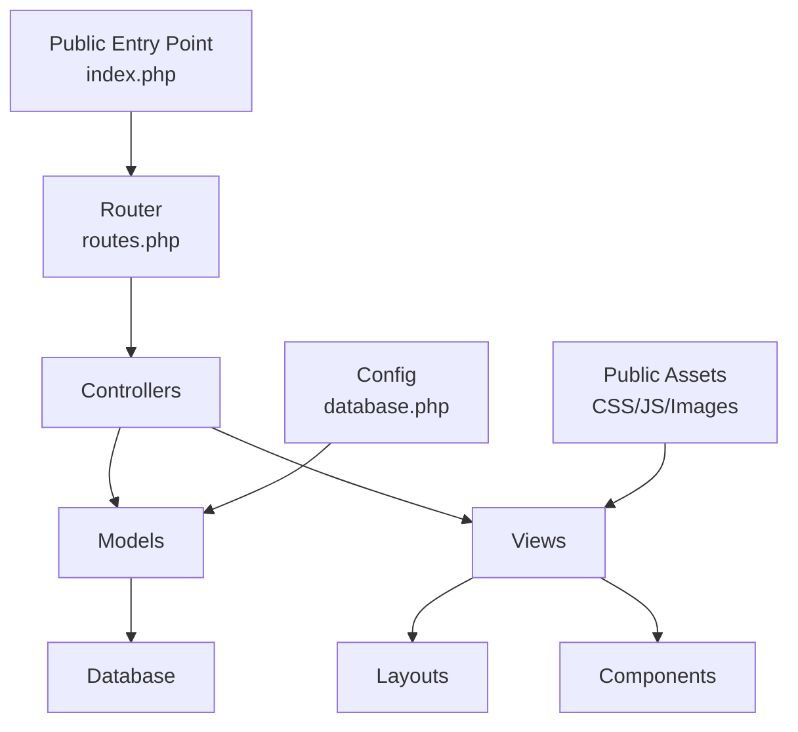
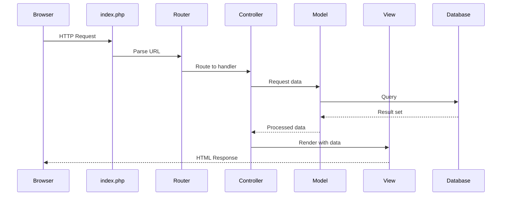
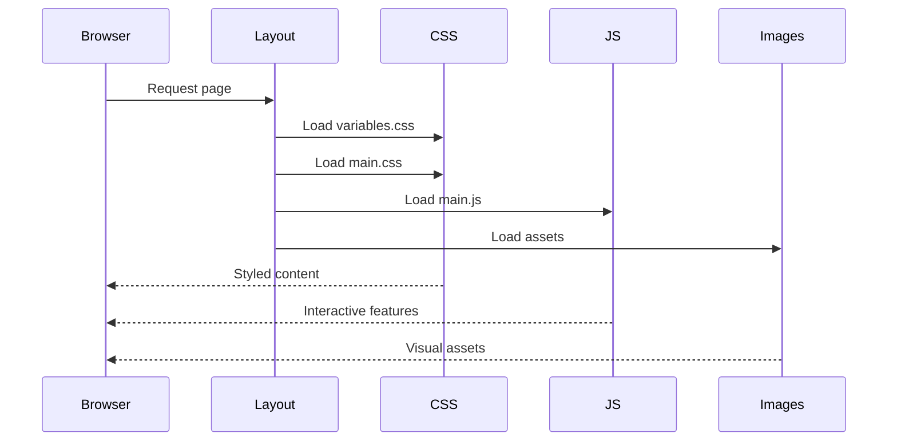

# Design Document: MVC Folder Structure

## Overview

This design establishes a beginner-friendly, scalable MVC (Model-View-Controller) folder structure for the P.A.R.C.E project using HTML, CSS, JavaScript, and PHP. The architecture separates concerns into distinct layers: Models handle database interactions, Views manage presentation logic, and Controllers coordinate between them. The structure includes reusable layouts, a simple routing system, organized public assets, CSS variables for consistent theming, and initial database planning. This foundation enables future expansion with authentication, dashboards, and feature modules while maintaining clean separation of concerns.

## Architecture



## Sequence Diagrams

### Request Flow



### Asset Loading Flow



## Components and Interfaces

### Component 1: Router

**Purpose**: Maps incoming URLs to appropriate controller actions

**Interface**:
```php
interface RouterInterface {
    public function route(string $url): void;
    public function addRoute(string $path, string $controller, string $action): void;
    public function getRoutes(): array;
}
```

**Responsibilities**:
- Parse incoming request URLs
- Match URLs to registered routes
- Instantiate controllers and call appropriate actions
- Handle 404 errors for unmatched routes

### Component 2: Base Controller

**Purpose**: Provides common functionality for all controllers

**Interface**:
```php
abstract class BaseController {
    protected function view(string $viewPath, array $data = []): void;
    protected function redirect(string $url): void;
    protected function json(array $data, int $statusCode = 200): void;
}
```

**Responsibilities**:
- Load and render views with data
- Handle redirects
- Return JSON responses for API endpoints
- Provide shared controller utilities

### Component 3: Base Model

**Purpose**: Provides database connection and common query methods

**Interface**:
```php
abstract class BaseModel {
    protected PDO $db;
    protected string $table;
    
    public function __construct();
    protected function query(string $sql, array $params = []): PDOStatement;
    protected function findAll(): array;
    protected function findById(int $id): ?array;
    protected function create(array $data): int;
    protected function update(int $id, array $data): bool;
    protected function delete(int $id): bool;
}
```

**Responsibilities**:
- Establish database connection
- Execute parameterized queries
- Provide CRUD operations
- Handle database errors

### Component 4: Layout System

**Purpose**: Provides reusable HTML structure for all pages

**Interface**:
```php
interface LayoutInterface {
    public function render(string $content, array $data = []): string;
    public function setTitle(string $title): void;
    public function addStylesheet(string $path): void;
    public function addScript(string $path): void;
}
```

**Responsibilities**:
- Define common HTML structure (header, footer, navigation)
- Inject page-specific content
- Manage meta tags and page titles
- Include CSS and JavaScript assets

## Data Models

### Model 1: Database Configuration

```php
interface DatabaseConfig {
    host: string;
    database: string;
    username: string;
    password: string;
    charset: string;
    options: array;
}
```

**Validation Rules**:
- Host must be non-empty string
- Database name must be non-empty string
- Charset defaults to 'utf8mb4'
- Options must be valid PDO options array

### Model 2: Route Definition

```php
interface RouteDefinition {
    path: string;
    controller: string;
    action: string;
    method: string;
}
```

**Validation Rules**:
- Path must start with '/'
- Controller must be valid class name
- Action must be valid method name
- Method must be GET, POST, PUT, DELETE, or PATCH

### Model 3: View Data

```php
interface ViewData {
    title: string;
    content: string;
    styles: array;
    scripts: array;
    meta: array;
}
```

**Validation Rules**:
- Title must be non-empty string
- Content can be empty string
- Styles and scripts must be arrays of valid file paths
- Meta must be associative array of key-value pairs

## Algorithmic Pseudocode

### Main Routing Algorithm

```php
function route($url) {
    // INPUT: $url - string representing the requested URL path
    // OUTPUT: void (renders response or throws exception)
    // PRECONDITION: $url is a valid string
    // POSTCONDITION: Appropriate controller action is executed or 404 is returned
    
    // Step 1: Parse URL and extract path
    $parsedUrl = parse_url($url);
    $path = $parsedUrl['path'] ?? '/';
    
    // Step 2: Match path against registered routes
    // LOOP INVARIANT: All previously checked routes did not match
    foreach ($this->routes as $route) {
        if ($this->matchRoute($route['path'], $path)) {
            // Step 3: Extract controller and action
            $controllerName = $route['controller'];
            $actionName = $route['action'];
            
            // Step 4: Instantiate controller
            $controller = new $controllerName();
            
            // Step 5: Call action method
            // ASSERT: Controller has the specified action method
            if (method_exists($controller, $actionName)) {
                $controller->$actionName();
                return;
            }
        }
    }
    
    // Step 6: No route matched - return 404
    $this->handle404();
}
```

**Preconditions:**
- `$url` is a valid string
- Routes array is properly initialized
- All registered controllers exist and are autoloadable

**Postconditions:**
- Appropriate controller action is executed if route matches
- 404 handler is called if no route matches
- Response is sent to browser

**Loop Invariants:**
- All previously checked routes did not match the requested path
- Routes array remains unchanged during iteration

### View Rendering Algorithm

```php
function view($viewPath, $data = []) {
    // INPUT: $viewPath - string path to view file, $data - associative array
    // OUTPUT: void (outputs HTML to browser)
    // PRECONDITION: $viewPath points to existing file, $data is associative array
    // POSTCONDITION: HTML is rendered and sent to output buffer
    
    // Step 1: Validate view file exists
    $fullPath = $this->viewsDir . '/' . $viewPath . '.php';
    
    if (!file_exists($fullPath)) {
        throw new Exception("View not found: {$viewPath}");
    }
    
    // Step 2: Extract data array to variables
    // LOOP INVARIANT: All extracted variables are accessible in view scope
    extract($data);
    
    // Step 3: Start output buffering
    ob_start();
    
    // Step 4: Include view file
    require $fullPath;
    
    // Step 5: Get buffered content
    $content = ob_get_clean();
    
    // Step 6: Wrap content in layout
    $this->renderLayout($content, $data);
}
```

**Preconditions:**
- `$viewPath` is a non-empty string
- `$data` is an associative array (can be empty)
- Views directory is properly configured
- View file exists at specified path

**Postconditions:**
- View file is included and executed
- Variables from `$data` are available in view scope
- Content is wrapped in layout template
- HTML output is sent to browser

**Loop Invariants:**
- All extracted variables remain accessible throughout view execution
- Output buffer captures all echoed content

### Database Query Algorithm

```php
function query($sql, $params = []) {
    // INPUT: $sql - SQL query string, $params - array of parameters
    // OUTPUT: PDOStatement object
    // PRECONDITION: $sql is valid SQL, $params match placeholders
    // POSTCONDITION: Query is executed, statement is returned
    
    try {
        // Step 1: Prepare statement
        $stmt = $this->db->prepare($sql);
        
        // Step 2: Bind parameters
        // LOOP INVARIANT: All previously bound parameters are valid
        foreach ($params as $key => $value) {
            if (is_int($key)) {
                // Positional parameter (1-indexed)
                $stmt->bindValue($key + 1, $value);
            } else {
                // Named parameter
                $stmt->bindValue($key, $value);
            }
        }
        
        // Step 3: Execute query
        $stmt->execute();
        
        // Step 4: Return statement
        // ASSERT: Statement executed successfully
        return $stmt;
        
    } catch (PDOException $e) {
        // Step 5: Handle database errors
        $this->handleError($e);
        throw $e;
    }
}
```

**Preconditions:**
- `$sql` is a valid SQL query string
- `$params` array matches the number and type of placeholders in SQL
- Database connection is established
- User has appropriate permissions for the query

**Postconditions:**
- Query is executed against database
- PDOStatement object is returned on success
- Exception is thrown on failure
- All parameters are properly escaped (SQL injection prevention)

**Loop Invariants:**
- All previously bound parameters are correctly associated with placeholders
- Parameter binding maintains type safety

## Key Functions with Formal Specifications

### Function 1: matchRoute()

```php
function matchRoute(string $pattern, string $path): bool
```

**Preconditions:**
- `$pattern` is a valid route pattern (may contain placeholders like `:id`)
- `$path` is a non-empty string representing the requested URL path

**Postconditions:**
- Returns `true` if and only if `$path` matches `$pattern`
- Returns `false` if no match
- No side effects on input parameters

**Loop Invariants:** N/A (no loops in this function)

### Function 2: sanitizeInput()

```php
function sanitizeInput(array $data): array
```

**Preconditions:**
- `$data` is an associative array (can be empty)

**Postconditions:**
- Returns sanitized array with HTML entities encoded
- All string values are trimmed
- No mutations to original `$data` parameter
- Array structure is preserved

**Loop Invariants:**
- For sanitization loops: All previously processed fields are sanitized
- Array keys remain unchanged

### Function 3: loadConfig()

```php
function loadConfig(string $configFile): array
```

**Preconditions:**
- `$configFile` is a valid file path
- Config file exists and is readable
- Config file returns a valid PHP array

**Postconditions:**
- Returns configuration array
- Throws exception if file not found or invalid
- No side effects on file system

**Loop Invariants:** N/A

### Function 4: renderLayout()

```php
function renderLayout(string $content, array $data): void
```

**Preconditions:**
- `$content` is a string (can be empty)
- `$data` is an associative array
- Layout file exists

**Postconditions:**
- HTML output is sent to browser
- Content is injected into layout template
- All data variables are available in layout scope

**Loop Invariants:**
- For asset loading loops: All previously loaded assets are included in output

## Example Usage

### Example 1: Basic Routing Setup

```php
// public/index.php
require_once '../app/core/Router.php';
require_once '../config/routes.php';

$router = new Router();

// Add routes
$router->addRoute('/', 'HomeController', 'index');
$router->addRoute('/about', 'HomeController', 'about');
$router->addRoute('/contact', 'HomeController', 'contact');

// Route the request
$url = $_SERVER['REQUEST_URI'];
$router->route($url);
```

### Example 2: Controller with View Rendering

```php
// app/controllers/HomeController.php
class HomeController extends BaseController {
    
    public function index() {
        $data = [
            'title' => 'Welcome to P.A.R.C.E',
            'message' => 'Hello, World!'
        ];
        
        $this->view('home/index', $data);
    }
    
    public function about() {
        $data = [
            'title' => 'About Us',
            'content' => 'Information about P.A.R.C.E'
        ];
        
        $this->view('home/about', $data);
    }
}
```

### Example 3: Model with Database Operations

```php
// app/models/User.php
class User extends BaseModel {
    protected string $table = 'users';
    
    public function getAllUsers(): array {
        return $this->findAll();
    }
    
    public function getUserById(int $id): ?array {
        return $this->findById($id);
    }
    
    public function createUser(array $userData): int {
        return $this->create($userData);
    }
}
```

### Example 4: View with Layout

```php
// app/views/home/index.php
<div class="container">
    <h1><?= htmlspecialchars($title) ?></h1>
    <p><?= htmlspecialchars($message) ?></p>
</div>
```

### Example 5: CSS Variables Usage

```css
/* public/assets/css/variables.css */
:root {
    --primary-color: #007bff;
    --secondary-color: #6c757d;
    --success-color: #28a745;
    --danger-color: #dc3545;
    --font-family: 'Arial', sans-serif;
    --spacing-unit: 8px;
}

/* public/assets/css/main.css */
.button-primary {
    background-color: var(--primary-color);
    padding: calc(var(--spacing-unit) * 2);
    font-family: var(--font-family);
}
```

### Example 6: Complete Request Flow

```php
// Browser requests: /users/123

// 1. Router matches route
$router->addRoute('/users/:id', 'UserController', 'show');

// 2. Controller handles request
class UserController extends BaseController {
    private User $userModel;
    
    public function __construct() {
        $this->userModel = new User();
    }
    
    public function show() {
        $id = $_GET['id'] ?? 0;
        $user = $this->userModel->getUserById($id);
        
        if (!$user) {
            $this->redirect('/404');
            return;
        }
        
        $this->view('users/show', ['user' => $user]);
    }
}

// 3. View renders with layout
// app/views/users/show.php displays user data
```

## Correctness Properties

### Property 1: Route Uniqueness
**∀ routes r1, r2 ∈ Routes: (r1.path = r2.path) ⟹ (r1 = r2)**

Every route path must be unique in the routing table. No two different routes can have the same path pattern.

### Property 2: View File Existence
**∀ view requests v: renderView(v) ⟹ ∃ file f: f.path = viewsDir + v.path**

For every view rendering request, the corresponding view file must exist in the views directory.

### Property 3: Database Connection Validity
**∀ model operations m: m.execute() ⟹ db.connected = true**

All model operations require an active database connection before execution.

### Property 4: Input Sanitization
**∀ user inputs i: processInput(i) ⟹ sanitized(i) = true**

All user inputs must be sanitized before processing to prevent XSS and SQL injection attacks.

### Property 5: Controller Action Existence
**∀ routes r: route(r) ⟹ ∃ method m: m.name = r.action ∧ m ∈ r.controller**

For every route, the specified action method must exist in the specified controller class.

### Property 6: Layout Consistency
**∀ views v: render(v) ⟹ ∃ layout l: v.content ⊆ l.structure**

All views must be rendered within a layout structure, ensuring consistent page structure.

### Property 7: Asset Path Validity
**∀ assets a ∈ {CSS, JS, Images}: include(a) ⟹ ∃ file f: f.path = publicDir + a.path**

All referenced assets (CSS, JS, images) must exist in the public directory.

### Property 8: Configuration Completeness
**∀ config requirements c: app.start() ⟹ ∀ c: config.has(c) = true**

All required configuration values must be present before application initialization.

## Error Handling

### Error Scenario 1: Route Not Found (404)

**Condition**: Requested URL does not match any registered route
**Response**: 
- Return HTTP 404 status code
- Render custom 404 error page
- Log the attempted URL for monitoring
**Recovery**: 
- Display user-friendly error message
- Provide navigation links to valid pages
- Suggest similar valid routes if available

### Error Scenario 2: View File Not Found

**Condition**: Controller attempts to render non-existent view file
**Response**:
- Throw ViewNotFoundException
- Log error with view path and controller context
- Return HTTP 500 status code
**Recovery**:
- Display generic error page in production
- Show detailed error message in development mode
- Prevent application crash

### Error Scenario 3: Database Connection Failure

**Condition**: Unable to establish connection to database
**Response**:
- Catch PDOException
- Log connection error details (without exposing credentials)
- Return HTTP 503 status code
**Recovery**:
- Display maintenance page to users
- Attempt reconnection with exponential backoff
- Alert administrators of database issues

### Error Scenario 4: Invalid Controller or Action

**Condition**: Route specifies non-existent controller class or method
**Response**:
- Throw ControllerNotFoundException or ActionNotFoundException
- Log error with route details
- Return HTTP 500 status code
**Recovery**:
- Display error page
- Prevent code execution
- Provide fallback to home page

### Error Scenario 5: SQL Query Error

**Condition**: Database query fails due to syntax error or constraint violation
**Response**:
- Catch PDOException
- Log query and error message
- Rollback transaction if applicable
**Recovery**:
- Return error message to controller
- Allow controller to handle gracefully
- Prevent data corruption

### Error Scenario 6: Missing Configuration

**Condition**: Required configuration value is not set
**Response**:
- Throw ConfigurationException
- Log missing configuration key
- Halt application initialization
**Recovery**:
- Display setup instructions
- Provide configuration template
- Prevent application from running in invalid state

## Testing Strategy

### Unit Testing Approach

**Framework**: PHPUnit for PHP backend, Jest for JavaScript frontend

**Key Test Cases**:
1. **Router Tests**:
   - Test route matching with various URL patterns
   - Test parameter extraction from URLs
   - Test 404 handling for unmatched routes
   - Test route priority and ordering

2. **Controller Tests**:
   - Test view rendering with data
   - Test redirect functionality
   - Test JSON response formatting
   - Mock model dependencies

3. **Model Tests**:
   - Test CRUD operations with test database
   - Test query parameter binding
   - Test error handling for invalid queries
   - Test transaction rollback

4. **View Tests**:
   - Test data injection into templates
   - Test HTML escaping for XSS prevention
   - Test layout rendering
   - Test asset inclusion

**Coverage Goals**: Minimum 80% code coverage for core components (Router, BaseController, BaseModel)

### Property-Based Testing Approach

**Property Test Library**: PHPUnit with custom property generators

**Properties to Test**:
1. **Route Matching Idempotence**: Matching the same URL multiple times produces the same result
2. **Input Sanitization**: All sanitized inputs are safe (no script tags, SQL injection patterns)
3. **Database Query Safety**: All queries use parameterized statements (no string concatenation)
4. **View Rendering Consistency**: Same data always produces same HTML output
5. **URL Generation Reversibility**: Generated URLs can be parsed back to original route

**Test Data Generators**:
- Random URL patterns with various characters
- Random SQL queries with injection attempts
- Random HTML content with XSS payloads
- Random configuration combinations

### Integration Testing Approach

**Test Scenarios**:
1. **Full Request Cycle**: Browser request → Router → Controller → Model → Database → View → Response
2. **Asset Loading**: Verify CSS, JS, and images load correctly in rendered pages
3. **Database Transactions**: Test multi-step operations with rollback on failure
4. **Error Propagation**: Verify errors bubble up correctly through layers
5. **Session Management**: Test session creation, persistence, and destruction

**Test Environment**:
- Separate test database with fixtures
- Mock external dependencies
- Use in-memory SQLite for fast tests
- Reset database state between tests

## Performance Considerations

### Database Connection Pooling
- Use persistent PDO connections to reduce connection overhead
- Implement connection pooling for high-traffic scenarios
- Close connections properly to prevent resource leaks

### View Caching
- Consider implementing view caching for static content
- Cache compiled templates to reduce file I/O
- Implement cache invalidation strategy

### Asset Optimization
- Minify CSS and JavaScript files for production
- Use CSS variables to reduce stylesheet size
- Implement lazy loading for images
- Consider CDN for static assets in future

### Query Optimization
- Use prepared statements for repeated queries
- Implement query result caching where appropriate
- Add database indexes for frequently queried columns
- Monitor slow queries and optimize

### Autoloading
- Implement PSR-4 autoloading to reduce manual requires
- Use Composer for dependency management in future
- Lazy-load controllers and models

## Security Considerations

### SQL Injection Prevention
- Always use parameterized queries (PDO prepared statements)
- Never concatenate user input into SQL strings
- Validate and sanitize all input data

### XSS Prevention
- Escape all output using `htmlspecialchars()`
- Use Content Security Policy headers
- Sanitize user input before storage

### CSRF Protection
- Implement CSRF tokens for forms (future enhancement)
- Validate token on POST requests
- Regenerate tokens after sensitive operations

### Password Security
- Use `password_hash()` with bcrypt for password storage (future)
- Never store plain text passwords
- Implement password strength requirements

### File Upload Security
- Validate file types and sizes (future enhancement)
- Store uploads outside public directory
- Scan for malicious content

### Configuration Security
- Store sensitive config outside public directory
- Use environment variables for credentials
- Never commit credentials to version control
- Implement `.gitignore` for config files

### Session Security
- Use secure session configuration (future enhancement)
- Implement session timeout
- Regenerate session IDs on privilege changes
- Use HTTPS in production

## Dependencies

### Required PHP Extensions
- **PDO**: Database abstraction layer
- **pdo_mysql**: MySQL driver for PDO
- **mbstring**: Multibyte string handling
- **json**: JSON encoding/decoding

### Development Dependencies
- **PHPUnit**: Unit testing framework (future)
- **Composer**: Dependency management (future)

### Database
- **MySQL 5.7+** or **MariaDB 10.2+**: Primary database system

### Web Server
- **Apache 2.4+** with mod_rewrite enabled
- Or **Nginx 1.18+** with PHP-FPM

### PHP Version
- **PHP 8.0+**: Required for typed properties and modern syntax

### Frontend Dependencies
- **No external JavaScript libraries initially**: Vanilla JS for simplicity
- **No CSS frameworks initially**: Custom CSS with variables

### Optional Future Dependencies
- **Composer**: For autoloading and package management
- **Dotenv**: For environment variable management
- **Monolog**: For advanced logging
- **Twig**: For template engine (if needed)
