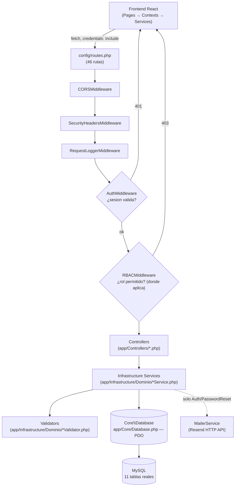
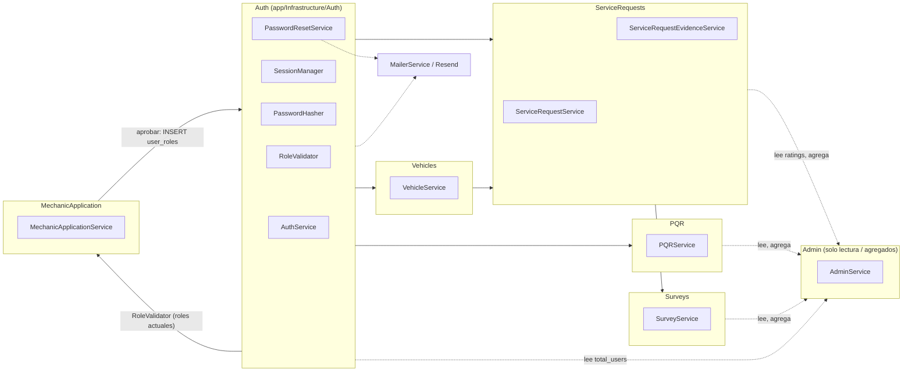
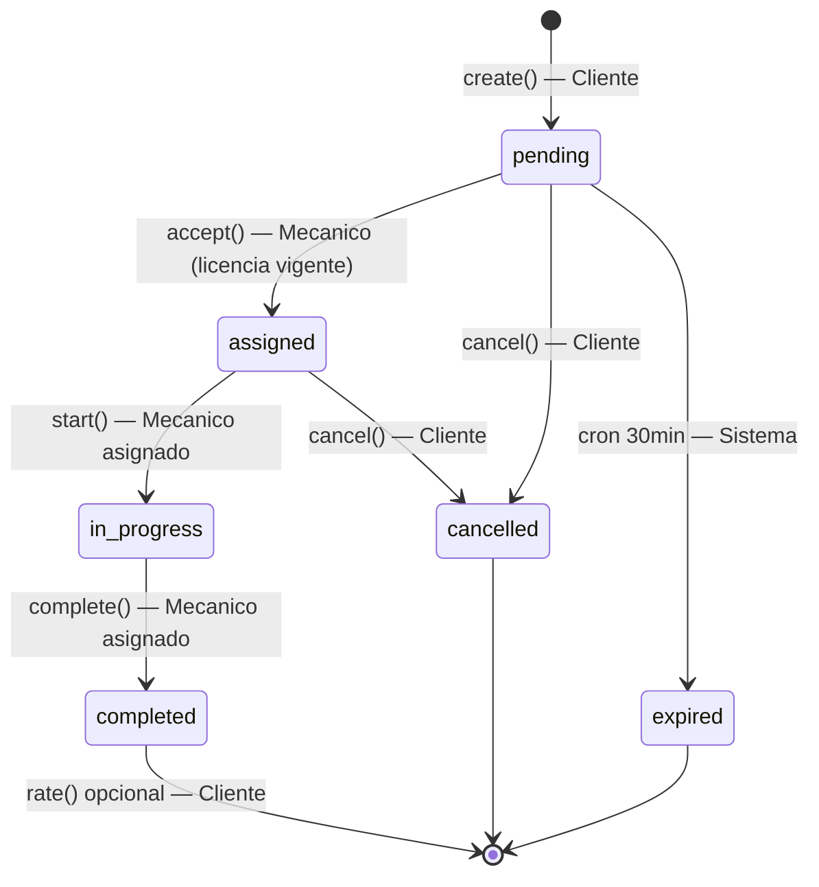
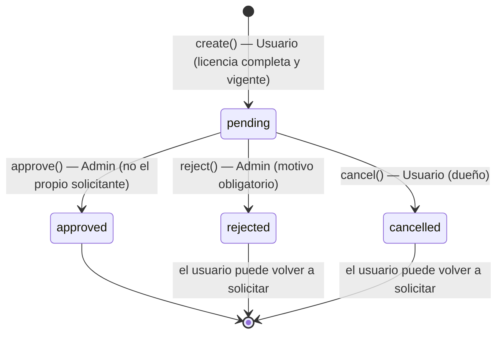

# P.A.R.C.E — Arquitectura AS-BUILT

> **Este documento describe el sistema tal como existe hoy en el código, verificado directamente contra `app/`, `config/routes.php`, `database/migrations/`, `tests/` y `frontend/src/`.**
> La documentación histórica (`.kiro/specs/`, el resto de `docs/`, `AI_CONTEXT_PARCE.md`) se usa únicamente como referencia de decisiones pasadas — ver [`AS_DESIGNED_VS_AS_BUILT.md`](AS_DESIGNED_VS_AS_BUILT.md) para las diferencias. Ante cualquier contradicción, **el código gana**.
>
> Última verificación: reconstrucción completa de código (backend + frontend + BD + tests + git history) — ver [`README.md`](README.md) de esta carpeta para el mapa completo de documentación.

---

## 1.1 Resumen del sistema

**Propósito actual:** P.A.R.C.E (Plataforma de Asistencia Rápida para Conductores en Emergencia) conecta clientes con mecánicos para asistencia vehicular en emergencia: creación de solicitudes de servicio, aceptación/ejecución por un mecánico, calificación, además de un módulo de PQR (peticiones/quejas/reclamos/sugerencias), encuestas de satisfacción y un panel de administración de solo lectura sobre esos datos.

**Stack tecnológico:**

| Capa | Tecnología |
|---|---|
| Backend | PHP 8.2, MVC propio (sin framework), PSR-4 autoloading |
| Base de datos | MySQL, acceso vía PDO |
| Frontend | React 18 + TypeScript + Vite + TailwindCSS |
| Autenticación | Sesión de servidor + cookie httpOnly (no JWT) |
| Email transaccional | Resend (HTTP API vía cURL, sin SDK) |
| Tests | PHPUnit (backend). No confirmado: tests automatizados de frontend |

**Backend** — `app/Core/` (16 clases: Router, Database, Request, Response, Controller base, Session, EnvLoader, Migration/MigrationRunner, Seeder, DomainException, DatabaseException, ConfigValidator, Route, RequestContext), `app/Controllers/` (9 clases, incl. `MechanicApplicationController`), `app/Infrastructure/` (9 dominios, incl. `MechanicApplication`), `app/Middleware/` (5 clases), `config/routes.php` (52 rutas: 1 web + 51 API).

**Frontend** — 20 páginas (incl. `MechanicApplicationPage`, `admin/AdminMechanicApplicationsPage`), 6 Contexts (incl. `MechanicApplicationContext`), 6 hooks, 8 services, 8 archivos de types, 6 componentes reutilizables, enrutamiento con `react-router-dom` v6 y guardas de rol vía `ProtectedRoute`.

**Base de datos** — 17 archivos de migración → **11 tablas reales**. Sin migraciones nuevas para el flujo de solicitud de mecánico — reutiliza `admin_access_requests`, existente desde la migración inicial. Ver [`ERD_AS_BUILT.md`](ERD_AS_BUILT.md) para el detalle completo.

**Tests** — 12 archivos PHPUnit unitarios, **150 tests / 231 aserciones** (ejecución verificada con `composer test` / `vendor/bin/phpunit`, todos en verde), **cobertura exclusiva de clases `*Validator`/DTOs y, desde el flujo de solicitud de mecánico, `MechanicApplicationValidator`**. Sin tests unitarios de `*Service.php`, Controllers ni Middleware (ver §1.16). Adicionalmente, **32 tests de integración** (`tests/Integration/`, contra una BD MySQL real aislada `parce_test`) cubren `MechanicApplicationService` de punta a punta, incl. una prueba real de concurrencia — infraestructura **opt-in**, no conectada a `composer test` ni a CI (ver §1.16 y §1.17).

**Arquitectura general:** MVC en capas simple, sin Repository/DAO intermedio, sin arquitectura modular (`app/Modules/` no existe). Cada dominio de negocio vive como una carpeta bajo `app/Infrastructure/` con un `*Service.php` (lógica + transacciones) y un `*Validator.php` (reglas de entrada).

---

## 1.2 Arquitectura actual

Flujo real de una petición:

```
Frontend React (Pages)
  → Contexts (Auth, Vehicle, Request, PQR, Admin)
    → Services (frontend/src/services/*.ts, vía apiClient.ts)
      → HTTP/JSON (fetch, credentials: include)
        → config/routes.php (46 rutas)
          → Middleware global: CORSMiddleware → SecurityHeadersMiddleware → RequestLoggerMiddleware
            → Middleware por ruta: AuthMiddleware (sesión) [→ RBACMiddleware (rol), donde aplica]
              → Controllers (app/Controllers/*.php)
                → Infrastructure Services (app/Infrastructure/{Dominio}/*Service.php)
                  → Validators (app/Infrastructure/{Dominio}/*Validator.php) — validan antes de tocar la BD
                  → Core\Database (app/Core/Database.php, PDO singleton con retry/backoff)
                    → MySQL (11 tablas)
```

**Afirmaciones explícitas sobre lo que NO existe, verificadas por búsqueda directa en el repositorio:**

- **NO existe `app/Modules/`.** La estructura modular documentada en `docs/roadmap/IMPLEMENTATION_ROADMAP_V1/V2.md` nunca se construyó (`Glob app/Modules/** = 0 resultados`).
- **NO existe una capa Repository/DAO intermedia.** Los `*Service.php` llaman directamente a los métodos estáticos de `App\Core\Database` (`Database::query()`, `Database::fetchAll()`, `Database::insert()`, etc.) — no hay clases `*Repository.php` en ningún dominio.
- **`app/Infrastructure/` contiene los dominios de negocio reales**: `Http` (utilidades transversales: `ErrorHandler`, `RateLimiter`, `RequestValidator`, `ResponseFormatter`, `IPValidator`), `Auth`, `ServiceRequest`, `Vehicle`, `Survey`, `PQR`, `Admin`, `Mail`. No hay más subcarpetas que estas 8.
- **No existe un ORM ni Active Record.** La clase `Model.php` (base Active Record) fue eliminada explícitamente por no usarse (commit `ad8f18c`, "remove unused Model.php active-record base class").

---

## 1.3 Estructura real de carpetas

```
app/Core/
├── App.php                  — bootstrap de la aplicación
├── ConfigValidator.php
├── Controller.php           — clase base abstracta de Controllers
├── Database.php             — PDO singleton, retry/backoff, transacciones
├── DatabaseException.php
├── DomainException.php      — excepción de negocio con statusCode (segura de mostrar al cliente)
├── EnvLoader.php
├── Migration.php            — clase base abstracta de migraciones
├── MigrationRunner.php
├── Request.php
├── RequestContext.php
├── Response.php
├── Route.php
├── Router.php
├── Seeder.php                — clase base abstracta de seeders
└── Session.php

app/Controllers/
├── AdminController.php
├── Auth/
│   └── AuthController.php
├── HealthController.php
├── HomeController.php
├── MechanicApplicationController.php
├── PQRController.php
├── ServiceRequestController.php
├── SurveyController.php
└── VehicleController.php

app/Infrastructure/
├── Admin/
│   └── AdminService.php
├── Auth/
│   ├── DTO/ (AuthResult, CookieConfig, RateLimitConfig, SessionData)
│   ├── Exceptions/AuthenticationException.php
│   └── Services/ (AuthService, PasswordHasher, PasswordResetService, RoleValidator, SessionManager)
├── Http/
│   ├── ErrorHandler.php
│   ├── IPValidator.php
│   ├── RateLimiter.php
│   ├── RequestValidator.php
│   └── ResponseFormatter.php
├── Mail/
│   └── MailerService.php
├── MechanicApplication/
│   ├── MechanicApplicationService.php
│   └── MechanicApplicationValidator.php
├── PQR/
│   ├── PQRService.php
│   └── PQRValidator.php
├── ServiceRequest/
│   ├── ServiceRequestEvidenceService.php
│   ├── ServiceRequestService.php
│   └── ServiceRequestValidator.php
├── Survey/
│   ├── SurveyService.php
│   └── SurveyValidator.php
└── Vehicle/
    ├── VehicleService.php
    └── VehicleValidator.php

app/Middleware/
├── AuthMiddleware.php
├── CORSMiddleware.php
├── RBACMiddleware.php
├── RequestLoggerMiddleware.php
└── SecurityHeadersMiddleware.php

config/
└── routes.php                — las 46 rutas de la aplicación (única fuente de verdad de rutas)

database/
├── migrations/                — 17 archivos, ver ERD_AS_BUILT.md (sin cambios por el flujo de mecánico)
└── seeders/
    ├── DatabaseSeeder.php      — orquestador (AdminUserSeeder → DemoUsersSeeder → VehiclesSeeder → ServiceRequestsSeeder)
    ├── AdminUserSeeder.php
    ├── DemoUsersSeeder.php
    ├── VehiclesSeeder.php
    └── ServiceRequestsSeeder.php

tests/
├── Unit/Infrastructure/       — 12 archivos, ver §1.16
└── Integration/                — opt-in, BD real `parce_test`, ver §1.16/§1.17
    ├── IntegrationTestCase.php
    ├── MechanicApplicationFlowTest.php
    └── scripts/concurrent_approve_probe.php

phpunit.integration.xml         — config PHPUnit separada para tests/Integration/ (NO referenciada por composer.json ni por .github/workflows/ci.yml)

frontend/src/
├── pages/                     — 20 páginas (customer/, mechanic/, admin/, + top-level auth/shared), incl. MechanicApplicationPage y admin/AdminMechanicApplicationsPage
├── components/                — auth/, common/, layout/, vehicles/ (6 archivos)
├── contexts/                  — AuthContext, VehicleContext, RequestContext, PQRContext, AdminContext, MechanicApplicationContext
├── hooks/                     — useAuth, useVehicles, useRequests, usePqr, useAdmin, useMechanicApplication
├── services/                  — apiClient, authService, vehicleService, serviceRequestService, pqrService, surveyService, adminService, mechanicApplicationService
├── types/                     — auth, vehicle, serviceRequest, pqr, survey, admin, pagination, mechanicApplication
├── routes/
│   └── ProtectedRoute.tsx
├── layouts/                   — AuthLayout, MainLayout
├── config/
│   └── api.ts                 — API_ENDPOINTS, API_CONFIG.API_URL
├── constants/
│   ├── pqr.ts
│   └── mechanicApplication.ts
├── utils/
│   └── apiErrors.ts
└── App.tsx                    — configuración del router
```

---

## 1.4 Diagrama de arquitectura AS-BUILT



**Fuente del comportamiento:** `config/routes.php` (middleware global y por-ruta), `app/Core/Router.php` (orden de ejecución de middleware), `app/Middleware/*.php`, `app/Core/Database.php`.

---

## 1.5 Diagrama de componentes



**No existen como módulos independientes** (verificado — sin carpeta, sin tabla, sin clase): Mechanics (perfil formal), Documents, Notifications, Tracking/Location, Payments. "Ratings" no es un módulo propio — son columnas dentro de `service_requests` (ver §1.14). `MechanicApplication` (nuevo, ver §1.17) tampoco es un perfil de mecánico — es únicamente el flujo de solicitud/revisión para *conceder* el rol `mechanic`.

**Fuente:** inventario completo de `app/Infrastructure/*` y `app/Controllers/*`; migraciones de `database/migrations/`.

**Diagrama:** ver [`uml/02-components.md`](uml/02-components.md) y [`uml/10-dependencies.md`](uml/10-dependencies.md).

---

## 1.6 ERD REAL (resumen — detalle completo en `ERD_AS_BUILT.md`)

11 tablas reales, derivadas de las 17 migraciones: `users`, `roles`, `user_roles`, `admin_access_requests`, `sessions`, `vehicles`, `service_requests`, `service_request_evidences`, `pqr`, `surveys`, `password_reset_tokens`.

**No incluidas porque no existen en ninguna migración actual:** `documents`, `document_verifications`, `document_types`, `mechanic_profiles`, `notifications`, `service_assignments`, `service_state_history`, `service_locations`, `service_statuses`.

Ver el diagrama Mermaid completo y las notas de divergencia en [`ERD_AS_BUILT.md`](ERD_AS_BUILT.md).

---

## 1.7 Relaciones y claves

| Tabla | PK | FK relevantes | UNIQUE | Notas |
|---|---|---|---|---|
| `users` | `id` | — | `email` | `account_status` ENUM(active,suspended,deactivated,pending_verification) |
| `roles` | `id` | — | `name`, `slug` | 5 roles sembrados: customer, mechanic, administrator, super_admin, support (`support` sin uso en `RBACMiddleware` de ninguna ruta actual) |
| `user_roles` | `id` | `user_id`→users(CASCADE), `role_id`→roles(CASCADE), `assigned_by`→users(SET NULL, nullable) | `(user_id, role_id)` | CHECK: `expires_at` nulo o posterior a `assigned_at` |
| `admin_access_requests` | `id` | `user_id`→users(CASCADE), `requested_role_id`→roles(CASCADE), `reviewed_by`/`approved_by`→users(SET NULL, nullable) | — | Existente desde la migración inicial, hoy **activamente usada** por `MechanicApplicationService` (§1.17) — sin migraciones nuevas, sin cambios de esquema |
| `sessions` | `id` (varchar) | `user_id`→users(CASCADE, nullable) | — | `payload` LONGTEXT, `last_activity` INT |
| `vehicles` | `id` | `user_id`→users(RESTRICT) | ninguna a nivel BD desde migración 16 (antes `license_plate`, `vin`) | Unicidad de placa/VIN aplicada solo en capa de aplicación (ver §1.10) |
| `service_requests` | `id` | `customer_id`→users(RESTRICT), `vehicle_id`→vehicles(RESTRICT), `mechanic_id`→users(RESTRICT, nullable), `resolved_by`→users(RESTRICT, nullable), `cancelled_by`→users(RESTRICT, nullable) | `service_code` | `status`/`emergency_type`/`priority` son VARCHAR planos, validados solo en `ServiceRequestValidator` (sin ENUM de BD ni tabla de catálogo) |
| `service_request_evidences` | `id` | `service_request_id`→service_requests(CASCADE), `uploaded_by`→users(sin ON DELETE explícito → RESTRICT por defecto) | — | `evidence_type` ENUM(before,during,after) real a nivel BD |
| `pqr` | `id` | `user_id`→users(RESTRICT), `responded_by`→users(SET NULL, nullable) | `ticket_code` | `type` y `status` son ENUM reales a nivel BD |
| `surveys` | `id` | `service_request_id`→service_requests(CASCADE), `customer_id`→users(RESTRICT) | `service_request_id` (relación 1:1 real) | CHECK `overall_satisfaction` BETWEEN 1 AND 5 |
| `password_reset_tokens` | `id` | `user_id`→users(CASCADE) | — | `token_hash` VARCHAR(64) (SHA-256 hex); el token en claro nunca se persiste |

**Relaciones 1:N:** users→vehicles, users→service_requests (como customer y como mechanic, dos FKs distintas), vehicles→service_requests, service_requests→service_request_evidences, users→pqr, users→sessions, users→password_reset_tokens, users→user_roles, roles→user_roles.

**Relación 1:1 real:** `service_requests`↔`surveys` (única relación con UNIQUE en la FK).

**Campos nullable relevantes:** `service_requests.mechanic_id` (hasta que se acepta), `vehicles.soat_*`/`tecnomecanica_*` (todos opcionales), `users.driver_license_*` (opcional, solo relevante para mecánicos), `pqr.admin_response`/`responded_by`/`responded_at` (hasta que se responde).

**Fuente:** lectura completa de las 17 migraciones en `database/migrations/`.

---

## 1.8 Autenticación

Flujo real (sin JWT):

1. **Registro** — `POST /api/auth/register` → `AuthController::register()` → `AuthService::register()`. Inserta `users` + `user_roles` en una transacción. **El registro público SOLO puede crear usuarios con rol `customer`** — `AuthService::register()` ya no acepta ningún parámetro de rol (el rol `customer` se resuelve internamente), `RequestValidator::validateRegistrationRequest()` rechaza con 400 cualquier `role` distinto de `customer` enviado en el body (no lo ignora en silencio), y el frontend (`RegisterRequest` en `types/auth.ts`) no tiene ningún campo de rol. El rol `mechanic` **ya no se autodeclara**: solo puede obtenerse solicitándolo tras el registro y siendo aprobado por un administrador — ver §1.17.
2. **Login** — `POST /api/auth/login` → `AuthService::authenticate()` → `SessionManager::create()` → se fija una **cookie httpOnly de sesión** (nombre configurable vía `ResponseFormatter::setSessionCookie()`). La fila de sesión se persiste en la tabla `sessions`.
3. **Verificación de sesión en cada petición protegida** — `AuthMiddleware` extrae la cookie, valida vía `SessionManager::validate()` (verifica timeout absoluto e inactividad), gestiona regeneración anti-fijación cuando corresponde, carga el usuario y sus roles, y adjunta `user`/`userId`/`userRole`/`userRoles`/`session` como atributos del `Request`. Responde 401 si la sesión es inválida/inexistente, 403 si la cuenta no está `active`.
4. **RBAC por ruta** — `RBACMiddleware(array $allowedRoles)`, instanciado por ruta en `config/routes.php` (p. ej. `RBACMiddleware(['customer'])`, `RBACMiddleware(['mechanic'])`, `RBACMiddleware(['administrator','super_admin'])`), consulta `RoleValidator::hasAnyRole()`. 403 si el usuario autenticado no tiene ninguno de los roles permitidos.
5. **Recuperación de contraseña** — `POST /api/auth/forgot-password` → `PasswordResetService::requestReset()`: busca el usuario por email (sin revelar si existe — misma respuesta siempre, anti-enumeración), toma un lock pesimista (`SELECT ... FOR UPDATE`) sobre la fila del usuario dentro de una transacción, invalida tokens previos no usados, genera un token aleatorio de 32 bytes, **almacena solo su hash SHA-256** en `password_reset_tokens.token_hash` (el token en claro nunca se persiste), fija `expires_at` = ahora + 1 hora, y envía el enlace por email vía `MailerService`.
6. **Reseteo** — `POST /api/auth/reset-password` → `PasswordResetService::resetPassword()`: hashea el token recibido, busca una fila no usada y no expirada (`DomainException` 400 si no existe), actualiza la contraseña, marca el token usado y **destruye todas las sesiones del usuario** (`SessionManager::destroyAllUserSessions()`) — logout forzado en todos los dispositivos. Mismo comportamiento que `AuthController::changePassword()`.
7. **Envío de email** — `MailerService::send()` es un wrapper directo (cURL, sin SDK) sobre la API HTTP de **Resend**. Si `RESEND_API_KEY` no está configurada, falla de forma silenciosa (`return false` + log) — por diseño, para que un email no configurado nunca rompa el flujo que lo dispara.
8. **Rate limiting** — aplicado a nivel de Controller (`AuthController`) vía `RateLimiter::check()`/`recordAttempt()` en login, register, forgot-password y reset-password, con ventana deslizante (persistencia en archivo, `storage/rate_limit.json`).

**Afirmaciones explícitas:**
- **No se utiliza JWT.** La autenticación es 100% sesión de servidor + cookie httpOnly, respaldada por la tabla `sessions`.
- **`password_reset_tokens` almacena únicamente `token_hash` (SHA-256)** — nunca el token en claro.
- **El flujo de recuperación de contraseña destruye todas las sesiones existentes del usuario** tras un reseteo exitoso.
- No existe CSRF token explícito en el código verificado en esta reconstrucción — no se afirma su existencia.
- No existe 2FA/MFA — no confirmado ningún rastro en el código.

**Diagrama:** ver [`uml/03-authentication.md`](uml/03-authentication.md). Para el flujo de obtención del rol `mechanic` (solicitud + revisión administrativa), ver §1.17 y [`uml/03-authentication.md`](uml/03-authentication.md) (diagrama de solicitud de mecánico, al final del archivo).

---

## 1.9 Service Requests

Estados reales, tomados de `ServiceRequestValidator::VALID_STATUSES`: **`pending`, `assigned`, `in_progress`, `completed`, `cancelled`, `expired`**. No existen (ni en el código ni en la BD) los estados `rejected`, `arrived` ni `mechanic_en_route` que aparecían en el ERD histórico de `docs/architecture/services-module-erd.md`.

| Transición | Método | Quién puede ejecutarla | Condiciones |
|---|---|---|---|
| `(nueva)` → `pending` | `ServiceRequestService::create()` | Cliente | Vehículo existe, pertenece al cliente, `status='active'`; sin otra solicitud activa (pending/assigned/in_progress) del mismo cliente o vehículo (lock pesimista) |
| `pending` → `assigned` | `accept()` | Mecánico | Solicitud debe existir y estar `pending`; licencia de conducción del mecánico no vacía y no vencida (403 si no cumple); UPDATE atómico condicionado a `status='pending'` (409 si ya fue tomada por otro mecánico) |
| `pending` → `cancelled` | `cancel()` | Cliente (dueño) | Solo si `status` en `(pending, assigned)`; UPDATE atómico condicionado |
| `pending` → `expired` | script `scripts/maintenance/expire_pending_requests.php` (cron, fuera de cualquier Service) | Sistema | `status='pending' AND requested_at < NOW() - INTERVAL 30 MINUTE` (configurable); UPDATE atómico condicionado, seguro frente a `accept()` concurrente |
| `assigned` → `in_progress` | `start()` | Mecánico asignado | Solo el mecánico asignado (403 si no); `status` debe ser `assigned`; UPDATE atómico condicionado |
| `assigned` → `cancelled` | `cancel()` | Cliente (dueño) | Igual que arriba |
| `in_progress` → `completed` | `complete()` | Mecánico asignado | Solo el mecánico asignado; `status` debe ser `in_progress`; `final_cost >= 0`; fija `final_cost`, `resolved_by`, `completed_at` |
| *(sin cambio de estado)* | `rate()` | Cliente (dueño) | Solo si `status='completed'` y `customer_rating IS NULL` (una sola calificación) |
| *(sin cambio de estado)* | `update()` | Cliente (dueño) | Solo si `status='pending'` (editable únicamente antes de ser tomada) |



Actores reales: **Cliente** (create, update, cancel, rate — sobre sus propias solicitudes), **Mecánico** (accept, start, complete, addEvidence — sobre la solicitud que tiene asignada), **Sistema** (expiración vía cron). **No existe** un actor "Administrador" con capacidad de transicionar el ciclo de vida.

**Fuente:** `app/Infrastructure/ServiceRequest/ServiceRequestService.php`, `ServiceRequestValidator.php`, `scripts/maintenance/expire_pending_requests.php`, `database/migrations/2024_01_01_000004_create_service_requests_table.php`.

---

## 1.10 Vehículos

- **Relación usuario → vehículos:** 1:N vía `vehicles.user_id` (FK RESTRICT — un usuario no puede borrarse mientras tenga vehículos).
- **SOAT:** `soat_number`, `soat_expiration_date` (DATE), `soat_document_url`, `soat_uploaded_at` — todos opcionales, columnas directas en `vehicles` (migración `2026_01_01_000005`, restaurada por `2026_07_10_000015` tras una deriva de esquema no documentada).
- **Tecnomecánica:** mismos 4 campos, prefijo `tecnomecanica_` (misma migración).
- **Licencia de conducción:** vive en `users` (no en `vehicles`), campos `driver_license_number`, `driver_license_expiration_date`, `driver_license_document_url`, `driver_license_uploaded_at`, más `driver_license_status` ENUM(not_set,valid,expiring_soon,expired) calculado y persistido (migración `2026_07_10_000013`).
- **Vehículo principal:** `vehicles.is_primary` (boolean). La reasignación de principal está envuelta en transacción en `create()`, `update()`, `delete()` y `setPrimary()` — garantiza que un usuario nunca queda sin vehículo principal entre sus vehículos activos.
- **Unicidad de placa/VIN (mecanismo actual):** **no hay `UNIQUE` a nivel de BD** desde la migración `2026_07_16_000016` (se eliminaron los índices únicos de `license_plate` y `vin`). La unicidad se aplica **solo en la capa de aplicación**, mediante locks nombrados de MySQL (`GET_LOCK`/`RELEASE_LOCK`, timeout 5s) más una verificación `SELECT`-antes-de-`INSERT`/`UPDATE` en `VehicleService`. Este cambio permite reutilizar la placa/VIN de un vehículo borrado lógicamente (soft delete).
- **`delete()` es un soft delete:** fija `status='inactive'` y `deleted_at`, y reasigna otro vehículo activo como principal si el eliminado lo era.

**Limitaciones reales confirmadas:**
- **SOAT y Tecnomecánica vencidos NO bloquean ninguna operación.** No existe, en `VehicleService`, `VehicleValidator` ni `ServiceRequestService`, ninguna comprobación de fecha de vencimiento de SOAT/Tecnomecánica que impida activar un vehículo o crear una solicitud de servicio con él. La única condición que `ServiceRequestService::create()` exige del vehículo es `status='active'`.
- Esto contrasta con la licencia de conducción del mecánico, que **sí** bloquea (`accept()` rechaza con 403 si está vencida o vacía) — es una asimetría real entre ambas validaciones documentales, no un descuido de esta documentación.
- No hay workflow de verificación/aprobación de estos documentos (a diferencia del diseño histórico de `document_verifications` — ver `AS_DESIGNED_VS_AS_BUILT.md`): el dato se guarda tal como el usuario lo ingresa.

**Fuente:** `app/Infrastructure/Vehicle/VehicleService.php`, `VehicleValidator.php`, migraciones `000003, 000005, 000006, 000013, 000015, 000016`.

**Diagrama:** ver [`uml/05-vehicles.md`](uml/05-vehicles.md).

---

## 1.11 Evidencias

`app/Infrastructure/ServiceRequest/ServiceRequestEvidenceService.php`, tabla `service_request_evidences`.

- **Creación:** `POST /api/mechanic/requests/{id}/evidence` → `ServiceRequestEvidenceService::addEvidence(int $serviceRequestId, int $mechanicId, array $data)`.
- **Permisos:** solo el mecánico asignado a la solicitud puede crear evidencia (`mechanic_id === $mechanicId`, 403 si no coincide, 404 si la solicitud no existe).
- **Estados de la solicitud permitidos para subir evidencia:** `assigned`, `in_progress`, `completed` (400 en cualquier otro estado).
- **Tipos permitidos (`evidence_type`):** `before`, `during`, `after` — ENUM real a nivel de BD y constante validada a nivel de aplicación.
- **Validación de `image_url`:** requerida, ≤500 caracteres, debe pasar `FILTER_VALIDATE_URL` y empezar con `http://` o `https://`.
- **Validación de extensión:** la extensión del path de la URL debe ser una de `jpg, jpeg, png, webp` (case-insensitive).
- **Validación de tamaño:** `file_size` (si se provee) no puede superar 5 242 880 bytes (5 MB).
- **Protección contra IDOR:** `getEvidences(int $serviceRequestId, int $userId, string $userRole)` solo permite el acceso al cliente dueño (`customer_id`) o al mecánico asignado (`mechanic_id`) de esa solicitud — 403 para cualquier otro usuario autenticado, 404 si la solicitud no existe.
- **Transacción y `SELECT ... FOR UPDATE`:** `addEvidence()` re-valida el `status` de la solicitud dentro de una transacción con lock pesimista inmediatamente antes del `INSERT`, cerrando una condición de carrera TOCTOU en la que la solicitud podría cancelarse entre la validación inicial y la escritura.

**Fuente:** `app/Infrastructure/ServiceRequest/ServiceRequestEvidenceService.php`, migraciones `2026_01_01_000008`, `2026_07_10_000014` (agrega `description`).

**Diagrama:** ver [`uml/06-evidence.md`](uml/06-evidence.md).

---

## 1.12 PQR

`app/Infrastructure/PQR/PQRService.php`, `PQRValidator.php`, `app/Controllers/PQRController.php`. **Sin documento de diseño previo — reconstruido 100% del código.**

- **`type` (ENUM real):** `peticion`, `queja`, `reclamo`, `sugerencia`.
- **`status` y transiciones válidas (`PQRValidator::VALID_TRANSITIONS`):**
  - `pending` → `in_review`, `rejected`, `resolved`
  - `in_review` → `rejected`, `resolved`
  - `resolved`/`rejected` son terminales.
- **`respond()`** es una acción separada de `updateStatus()`: siempre fija `status='resolved'` directamente (no pasa por la matriz de transiciones), guardado solo por "aún no respondido" (`admin_response IS NULL`, 409 si ya se respondió).

**Flujo:**

| Acción | Endpoint | Quién |
|---|---|---|
| Crear | `POST /api/pqr` | Cliente o mecánico autenticado |
| Consultar propio | `GET /api/pqr`, `GET /api/pqr/{id}` | Dueño del ticket (404 si no lo es) |
| Listar (admin) | `GET /api/admin/pqr?status&type&q&page&per_page` | administrator/super_admin — **paginado** (LIMIT/OFFSET) |
| Cambiar estado (admin) | `PUT /api/admin/pqr/{id}/status` | administrator/super_admin — valida contra `VALID_TRANSITIONS` |
| Responder (admin) | `POST /api/admin/pqr/{id}/respond` | administrator/super_admin — fuerza `resolved` |

`ticket_code` se genera post-insert con formato `PQR-YYYY-NNNNNN` (`PQRValidator::generateTicketCode()`), en una operación de dos pasos dentro de la misma transacción de creación.

**Fuente:** `app/Infrastructure/PQR/*.php`, `app/Controllers/PQRController.php`, migración `2026_07_10_000009`.

**Diagrama:** ver [`uml/07-pqr.md`](uml/07-pqr.md).

---

## 1.13 Encuestas

`app/Infrastructure/Survey/SurveyService.php`, `SurveyValidator.php`, tabla `surveys`.

- **Relación 1:1 con `service_requests`:** constraint `UNIQUE` real en `surveys.service_request_id` — una solicitud admite como máximo una encuesta.
- **Condiciones para crear:** la solicitud debe existir, pertenecer al cliente que la crea (403 si no), y estar en `status='completed'` (400 si no).
- **Protección contra duplicados:** verificación previa (`SELECT`) más un `catch` de la excepción "Duplicate entry" de BD como red de seguridad ante condición de carrera — ambas rutas responden 409.
- **Inmutable:** no existen métodos de actualización ni borrado en `SurveyService` — una encuesta creada no se puede editar.
- **Acceso del cliente:** `GET /api/surveys` lista únicamente las encuestas propias (`getByCustomer()`).
- **Acceso administrativo:** `GET /api/admin/surveys?page&per_page` — solo lectura, **paginado**, join con `service_requests` + nombres de cliente/mecánico.

**Fuente:** `app/Infrastructure/Survey/*.php`, `app/Controllers/SurveyController.php`, migración `2026_07_10_000010`.

**Diagrama:** ver [`uml/08-surveys.md`](uml/08-surveys.md).

---

## 1.14 Ratings

**Dos mecanismos de almacenamiento distintos, uno por sentido — actualizado 2026-08-19.**

**Cliente → Mecánico** (el original, ADR-7 vigente): vive como columnas dentro de `service_requests`, no en una tabla dedicada:

- `customer_rating` (TINYINT 1-5, calificación general)
- `punctuality_rating` (TINYINT 1-5, calificación detallada de puntualidad — migración `2026_01_01_000007`)
- `service_quality_rating` (TINYINT 1-5, calificación detallada de calidad — misma migración)
- `customer_feedback` (TEXT libre)

Se escriben en una única llamada `POST /api/service-requests/{id}/rate` → `ServiceRequestService::rate()`, condicionado a `status='completed'` y `customer_rating IS NULL` (una sola calificación permitida por solicitud, sin `UNIQUE` de BD — el `UPDATE` atómico condicionado es la única protección contra doble envío).

**Mecánico → Cliente** (implementado 2026-08-19, ADR-15): usa la tabla `ratings`, que existe desde antes de esta sesión —sin ningún código que la usara hasta ahora, ver `AS_DESIGNED_VS_AS_BUILT.md`— y que ya soportaba ambos sentidos de fábrica: `rater_id`/`ratee_id` genéricos (FK a `users`), `rating_type` ENUM(`customer_to_mechanic`,`mechanic_to_customer`), `score`/`punctuality_score`/`quality_score`/`comment`, y **`UNIQUE(service_request_id, rating_type)`** real a nivel de BD (a diferencia del lado cliente→mecánico, aquí la unicidad sí la garantiza la base de datos, no solo el `WHERE` del `UPDATE`). Se escribe vía `POST /api/mechanic/requests/{id}/rate-customer` → `MechanicRatingService::rateCustomer()` (patrón satélite, mismo que `ServiceRequestEvidenceService`), con las mismas condiciones: solo el mecánico asignado, solo `status='completed'`, una sola vez. `ServiceRequestService::getById()` expone el resultado (`mechanicRatingScore`/`PunctualityScore`/`QualityScore`/`Comment`/`CreatedAt`) cuando existe.

**Nota:** `ratings` ya tenía 5 filas de datos (3 `customer_to_mechanic`, 2 `mechanic_to_customer`) antes de esta implementación, sin ningún seeder ni migración en el repositorio que las explique — mismo patrón de deriva de esquema no documentada que otras tablas (`vehicle_documents`, `vehicle_maintenance_records` — ver `docs/roadmap/PARCE_ROADMAP_AS_BUILT.md`, deuda técnica ítem 1).

El frontend consume el lado cliente→mecánico vía `getMechanicStats()` (promedios para el mecánico) y `GET /api/admin/ratings` (listado paginado y filtrable para el admin, filtros: `mechanic_id`, `customer_id`, `min_rating`, `date_from`, `date_to` — sigue leyendo únicamente las columnas de `service_requests`, **no** la tabla `ratings`; agregar el lado mecánico→cliente a ese panel no se hizo en esta implementación, ver limitación abajo).

**Limitación conocida, no resuelta en esta implementación:** `AdminService::ratings()` y el dashboard admin no incluyen el rating mecánico→cliente — siguen siendo una vista exclusiva del lado cliente→mecánico. Extender el panel admin para mostrar ambos sentidos, y/o construir una vista de frontend para que el mecánico envíe su calificación (hoy solo existe el endpoint backend, consumible directamente), quedan fuera del alcance de esta tarea.

**Fuente:** `database/migrations/2024_01_01_000004`, `2026_01_01_000007`, `2026_07_10_000011` (columnas de `service_requests`); tabla `ratings` (sin migración propia en el repositorio); `app/Infrastructure/ServiceRequest/ServiceRequestService.php::rate()` y `::getById()`; `app/Infrastructure/ServiceRequest/MechanicRatingService.php::rateCustomer()`.

---

## 1.15 Administración

`app/Infrastructure/Admin/AdminService.php`, `app/Controllers/AdminController.php`.

`AdminService` expone únicamente **dos** capacidades, ambas de solo lectura/agregados:

1. **`dashboard()`** — `GET /api/admin/dashboard`: `total_users`, `total_pqr`, `pending_pqr`, `total_surveys`, `average_rating` (promedio de `customer_rating`), `requests_by_status` (conteo agrupado). Sin paginación (son agregados).
2. **`ratings()`** — `GET /api/admin/ratings`: listado paginado y filtrable de solicitudes calificadas.

**Diferenciación importante:** la gestión administrativa de PQR (`GET/PUT/POST /api/admin/pqr/*`) y de encuestas (`GET /api/admin/surveys`) **NO pasa por `AdminService`**. Esas rutas, aunque están bajo el prefijo `/admin/` y protegidas por el mismo `RBACMiddleware(['administrator','super_admin'])`, llaman directamente a `PQRController`/`PQRService` y `SurveyController`/`SurveyService` respectivamente. `AdminController` en sí mismo solo tiene los métodos `dashboard()` y `ratings()`.

Esto significa que "Admin" como módulo de negocio es una fachada delgada de solo lectura sobre datos que viven en otros dominios — no un módulo de gestión de usuarios/roles como proponía el diseño histórico (`ADMIN_DOMAIN_ANALYSIS.md`).

**Fuente:** `app/Infrastructure/Admin/AdminService.php`, `app/Controllers/AdminController.php`, `config/routes.php` (rutas `/api/admin/*`).

**Diagrama:** ver [`uml/09-admin.md`](uml/09-admin.md).

---

## 1.16 Tests

### 1.16.1 Tests unitarios (`tests/Unit/`)

- **Framework:** PHPUnit 10.5.64.
- **Archivos:** 12 (incl. `Http/RequestValidatorRegistrationTest.php` y `MechanicApplication/MechanicApplicationValidatorTest.php`, añadidos junto con el flujo de solicitud de mecánico).
- **Resultado de ejecución real** (`composer test` / `vendor/bin/phpunit --no-coverage`): **150 tests, 0 fallos, 0 errores** (ver §1.17.5 para la ejecución exacta más reciente). Sube desde el número anterior (134) exclusivamente por los tests nuevos de `MechanicApplicationValidator` y `RequestValidator::validateRegistrationRequest()` (rechazo de `role` ≠ `customer`).
- **Ubicación:** `tests/Unit/Infrastructure/`. Además, desde el flujo de solicitud de mecánico, existe `tests/Integration/` — ver §1.16.2.

| Archivo | Métodos aprox. | Cubre |
|---|---|---|
| `Auth/DTO/AuthResultTest.php` | 4 | DTO `AuthResult` |
| `Auth/DTO/CookieConfigTest.php` | 5 | DTO `CookieConfig` |
| `Auth/DTO/RateLimitConfigTest.php` | 6 | DTO `RateLimitConfig` |
| `Auth/DTO/SessionDataTest.php` | 9 | DTO `SessionData` (incl. `isExpired()`/`isIdle()`) |
| `Auth/Services/PasswordHasherTest.php` | 8 | `PasswordHasher` (Argon2id) |
| `Http/IPValidatorTest.php` | 16 | `IPValidator` |
| `Http/RequestValidatorPaginationTest.php` | 6 | `RequestValidator::parsePagination()` |
| `Http/RequestValidatorRegistrationTest.php` | — | `RequestValidator::validateRegistrationRequest()` — incl. rechazo (400) de `role` ≠ `customer` |
| `MechanicApplication/MechanicApplicationValidatorTest.php` | — | `MechanicApplicationValidator` (justificación, motivo de rechazo) |
| `PQR/PQRValidatorTest.php` | 17 | `PQRValidator` (incl. transiciones de estado) |
| `ServiceRequest/ServiceRequestValidatorTest.php` | 37 | `ServiceRequestValidator` (el más grande — incl. matriz de transiciones) |
| `Survey/SurveyValidatorTest.php` | 10 | `SurveyValidator` |
| `Vehicle/VehicleValidatorTest.php` | 14 | `VehicleValidator` |

**Qué SÍ tiene cobertura:** las clases `*Validator.php` de todos los dominios (Auth DTOs, Http, PQR, ServiceRequest, Survey, Vehicle, MechanicApplication) — lógica pura, sin tocar base de datos.

**Qué NO tiene cobertura vía tests unitarios — afirmado explícitamente, no se debe asumir lo contrario:**
- Ninguna clase `*Service.php` (`AuthService`, `SessionManager`, `ServiceRequestService`, `VehicleService`, `PQRService`, `SurveyService`, `AdminService`, `ServiceRequestEvidenceService`, `PasswordResetService`) tiene tests unitarios. **Excepción parcial:** `MechanicApplicationService` sí tiene cobertura, pero exclusivamente vía tests de integración contra BD real (§1.16.2) — deliberado, porque su lógica depende de transacciones/locks/carreras que no se pueden probar honestamente con mocks.
- Ningún Controller (`app/Controllers/*`) tiene tests automatizados.
- Ningún Middleware (`app/Middleware/*`) tiene tests automatizados.
- No se confirmó la existencia de tests automatizados de frontend (Jest/Vitest/Testing Library) — no encontrados durante esta reconstrucción; si existen, no fueron localizados en `frontend/src`.

**Fuente:** árbol completo de `tests/Unit/Infrastructure/` inventariado directamente.

### 1.16.2 Tests de integración (`tests/Integration/`) — infraestructura opt-in

Introducidos junto con `MechanicApplicationService`, porque su lógica de negocio real (transacciones, `SELECT ... FOR UPDATE`, condiciones de carrera, `INSERT`/`UPDATE` efectivos sobre `admin_access_requests`/`user_roles`) no puede probarse honestamente con mocks — se prefirió una BD MySQL real y aislada antes que fabricar cobertura falsa.

- **Config separada:** [`phpunit.integration.xml`](../../phpunit.integration.xml) (raíz del repo), distinta de `phpunit.xml`. Se ejecuta explícitamente con `vendor/bin/phpunit -c phpunit.integration.xml --no-coverage` — **nunca** como parte de `composer test`.
- **NO conectada a CI:** `.github/workflows/ci.yml` no referencia `phpunit.integration.xml` ni ejecuta `tests/Integration/`. Es una decisión deliberada, no un olvido — requiere una BD MySQL real disponible, que el pipeline de CI actual no aprovisiona.
- **Base de datos:** `parce_test`, completamente separada de `parce` (la BD real de desarrollo). Se crea con `CREATE DATABASE IF NOT EXISTS` y se migra con un script de un solo uso con configuración hardcodeada (nunca vía `.env`), para que no exista ninguna posibilidad de que un test de integración corra contra la BD real por error de configuración.
- **Resultado de ejecución real:** **32 tests, 53 aserciones, 0 fallos, 0 errores** (ver §1.17.5).
- **Prueba real de concurrencia:** `tests/Integration/scripts/concurrent_approve_probe.php` se lanza dos veces como procesos del sistema operativo independientes (no simulado dentro del mismo proceso PHPUnit) contra la misma solicitud, para probar la exclusión mutua real vía `SELECT ... FOR UPDATE` de MySQL — uno de los dos procesos debe ganar la carrera y el otro debe recibir el 409 de `MechanicApplicationService::approve()`.
- **Qué cubre:** el ciclo de vida completo de `MechanicApplicationService` (`create`, `getByUser`, `cancel`, `adminList`, `approve`, `reject`), incl. anti-IDOR, anti-autoaprobación, exclusión de administrator/super_admin, licencia incompleta/vencida, y las condiciones de carrera de aprobar/rechazar/cancelar concurrentemente.

**Fuente:** `tests/Integration/`, `phpunit.integration.xml`, `.github/workflows/ci.yml` (ausencia verificada de referencia).

---

## 1.17 Solicitud de rol de mecánico (Mechanic Application)

Reemplaza la autodeclaración del rol `mechanic` en el registro público por un flujo de solicitud + revisión administrativa. **Sin migraciones nuevas**: reutiliza `admin_access_requests`, tabla existente desde la migración inicial (`2024_01_01_000001`) pero sin ningún código que la usara hasta este flujo. Ver `AS_DESIGNED_VS_AS_BUILT.md` para el contraste con el diseño original y `DECISIONS.md` (ADR-5) para el registro de la decisión.

### 1.17.1 Resolución server-side del rol — sin autodeclaración

- `AuthService::register()` ya no acepta ningún parámetro de rol. El rol `customer` se resuelve internamente (`SELECT id FROM roles WHERE slug = 'customer'`), nunca desde un valor del body.
- `RequestValidator::validateRegistrationRequest()` rechaza con `400` cualquier `role` presente en el body distinto de `customer` — no lo ignora en silencio.
- El único lugar de todo el sistema donde se hace `INSERT INTO user_roles` con el rol `mechanic` para un usuario que no lo tenía es `MechanicApplicationService::approve()`.

### 1.17.2 Estados y transiciones

Estados reales, tomados del ENUM ya existente de `admin_access_requests.status`: **`pending`, `approved`, `rejected`, `cancelled`**.



| Transición | Método | Quién | Condiciones |
|---|---|---|---|
| `(nueva)` → `pending` | `MechanicApplicationService::create()` | Usuario autenticado | Cuenta activa; **no** `administrator`/`super_admin`; no tiene ya el rol `mechanic`; licencia de conducción completa (número, fecha de vencimiento, documento) y no vencida; sin otra solicitud propia `pending` |
| `pending` → `approved` | `approve()` | administrator/super_admin | No puede ser el propio solicitante (403 anti-autoaprobación); solicitud debe seguir `pending` (lock `FOR UPDATE`); re-verifica cuenta activa y licencia vigente del solicitante en el momento de aprobar (pudieron cambiar desde la creación); asigna `mechanic` vía `INSERT user_roles` |
| `pending` → `rejected` | `reject()` | administrator/super_admin | Solicitud debe seguir `pending`; `rejection_reason` obligatorio |
| `pending` → `cancelled` | `cancel()` | Usuario (dueño) | Solicitud debe seguir `pending`; UPDATE atómico condicionado a `status='pending'` (409 si cambió concurrentemente) |

### 1.17.3 Seguridad

- **Anti-IDOR:** `getByIdForUser()` combina `id` + `user_id` en el mismo `WHERE` — una solicitud ajena responde `404`, igual que una inexistente (nunca `403` separado, para no permitir enumerar IDs ajenos válidos por diferencia de código de estado). Mismo patrón que `PQRService::getByIdForUser()`.
- **Anti-autoaprobación:** `approve()` compara `application.user_id` contra `$adminUserId` (de la sesión) antes de escribir nada; `403` si coinciden.
- **Exclusión de administrator/super_admin:** `create()` verifica `RoleValidator::hasAnyRole($userId, ['administrator','super_admin'])` dentro de la misma transacción que el resto de reglas, con los roles actuales del usuario — `403` si aplica, sin escribir en `admin_access_requests` ni en `user_roles`. Frontend: el link "Ser mecánico" del Navbar y el formulario de `/mechanic-application` no se muestran a estos roles (el backend sigue siendo la autoridad; esto solo evita mostrar un formulario que sería rechazado).
- **`user_id`, `assigned_by`, `reviewed_by`, `approved_by` nunca vienen del body de la petición** — siempre del atributo `userId` que `AuthMiddleware` adjunta al `Request` desde la sesión autenticada.
- **`SELECT ... FOR UPDATE` + `UPDATE` condicionado al estado**, mismo patrón que `ServiceRequestService`/`PQRService`/`ServiceRequestEvidenceService`: `create()` bloquea la fila del propio usuario (serializa dobles clics/reintentos del mismo usuario); `approve()`/`reject()` bloquean la fila de la solicitud (cierran la carrera de dos administradores actuando sobre la misma solicitud a la vez); todo `UPDATE` de cambio de estado repite el estado esperado en el `WHERE` y lanza `409` si `affected === 0`.
- **Rate limiting** por IP en `POST /mechanic-applications` (`RateLimiter::check('mechanic-application', ...)`), mismo mecanismo que Auth.

### 1.17.4 Endpoints y middleware

Ver [`API_REFERENCE.md`](../api/API_REFERENCE.md) para la tabla completa (método, ruta, middleware, body, respuestas, errores). Resumen: 3 endpoints de usuario (`AuthMiddleware` únicamente) + 3 endpoints de administrador (`AuthMiddleware` + `RBACMiddleware(['administrator','super_admin'])`).

### 1.17.5 Verificación (ejecución real más reciente)

| Comando | Resultado |
|---|---|
| `composer test` | 150/150 tests unitarios, 0 fallos |
| `vendor/bin/phpunit -c phpunit.integration.xml --no-coverage` | 32/32 tests de integración, 53 aserciones, 0 fallos |
| `npm run build` | 0 errores |
| `npm run lint` | sin regresión respecto al conteo previo a este flujo |
| `git diff --check` | limpio |

### 1.17.6 Frontend

- **Registro** (`RegisterPage.tsx`) — ya no ofrece selector de rol; el mensaje explica que la cuenta se crea como cliente y que el rol de mecánico se solicita después.
- **`ProfilePage.tsx`** — la sección de licencia de conducción (`DriverLicenseSection`) ahora es visible para **cualquier** usuario autenticado, no solo mecánicos, porque un cliente necesita poder completarla ANTES de tener el rol, como precondición para solicitarlo. El backend (`PUT /auth/profile`) ya aceptaba estos campos de cualquier rol — este era un gate puramente de UI, corregido durante la verificación en navegador de esta fase (ver `AS_DESIGNED_VS_AS_BUILT.md`).
- **`MechanicApplicationPage.tsx`** (`/mechanic-application`) — requisitos de licencia, formulario de justificación, historial de solicitudes propias con estado/motivo de rechazo, cancelación de solicitudes `pending`. Bloquea el formulario (con mensaje explicativo) para `administrator`/`super_admin` y para quien ya es `mechanic`.
- **`admin/AdminMechanicApplicationsPage.tsx`** (`/admin/mechanic-applications`) — listado paginado con filtro por estado, aprobar/rechazar (rechazo exige motivo).
- **`MechanicApplicationContext.tsx`** — `approveApplication()`/`rejectApplication()` hacen un **merge parcial** del resultado (`{ ...previo, ...respuesta.application }`) en vez de reemplazar el item completo: `approve()`/`reject()` devuelven la fila cruda de `admin_access_requests` (sin el JOIN de nombre/email/licencia que sí trae `adminList()`), y un reemplazo completo hacía desaparecer esos campos de la UI hasta recargar la página — bug real encontrado y corregido durante la verificación en navegador de esta fase.
- **Navbar** — el link "Ser mecánico" solo aparece para `customer` sin el rol `mechanic` y sin ser admin.

**Diagrama:** ver [`uml/03-authentication.md`](uml/03-authentication.md) (sección de solicitud de mecánico, al final del archivo).

**Fuente:** `app/Infrastructure/MechanicApplication/{MechanicApplicationService,MechanicApplicationValidator}.php`, `app/Controllers/MechanicApplicationController.php`, `config/routes.php`, `frontend/src/{pages/MechanicApplicationPage.tsx,pages/admin/AdminMechanicApplicationsPage.tsx,contexts/MechanicApplicationContext.tsx,hooks/useMechanicApplication.ts,services/mechanicApplicationService.ts}`, `tests/Integration/MechanicApplicationFlowTest.php`.
