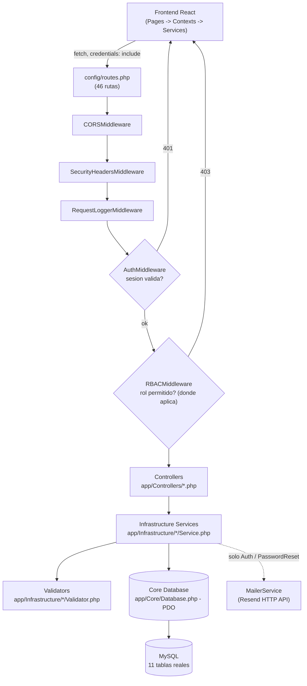

# UML 01 — Arquitectura general (AS-BUILT)

**Propósito:** mostrar el flujo real de una petición desde el frontend hasta la base de datos, incluyendo todas las capas de middleware realmente registradas.

**Explicación breve:** el middleware global (`CORSMiddleware` → `SecurityHeadersMiddleware` → `RequestLoggerMiddleware`) se aplica a las 46 rutas sin excepción. `AuthMiddleware` y `RBACMiddleware` se aplican por ruta/grupo según lo declarado en `config/routes.php`. No hay capa Repository/DAO: los Services llaman directamente a `Database::`. No existe `app/Modules/`.

**Fuente:** `config/routes.php`, `app/Core/Router.php`, `app/Middleware/*.php`, `app/Core/Database.php`.
