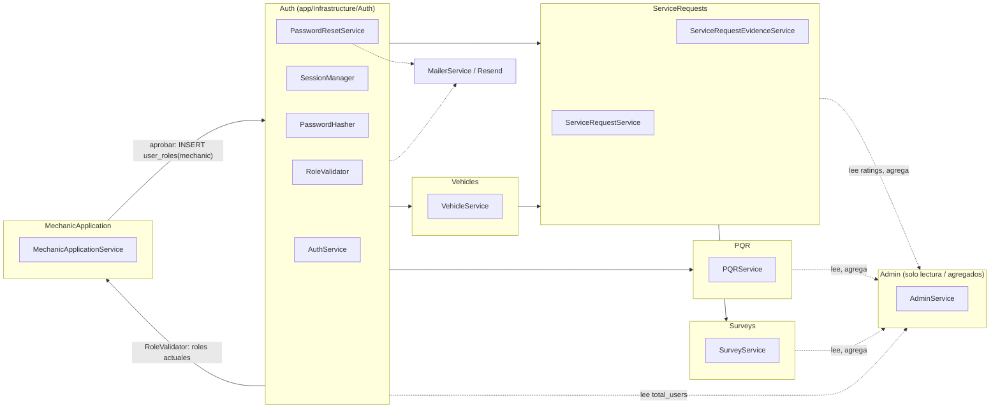

# UML 02 — Componentes principales (AS-BUILT)

**Propósito:** representar los dominios de negocio reales bajo `app/Infrastructure/` y sus dependencias verificadas (no asumidas).

**Explicación breve:** "Ratings" no es un componente propio — vive como columnas dentro de `ServiceRequests`. `Admin` no tiene lógica de negocio propia salvo `dashboard()`/`ratings()`; la gestión de PQR/Encuestas/solicitudes de mecánico desde rutas `/admin/*` llama directamente a `PQRService`/`SurveyService`/`MechanicApplicationService`. `MechanicApplication` (nuevo) reemplaza la autodeclaración del rol `mechanic` en el registro — no existen componentes `Mechanics` (perfil formal dedicado), `Documents`, `Notifications`, `Tracking`, `Payments`.

**Fuente:** inventario completo de `app/Infrastructure/*` y `app/Controllers/*`.
