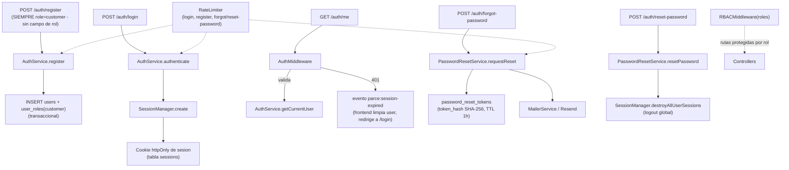
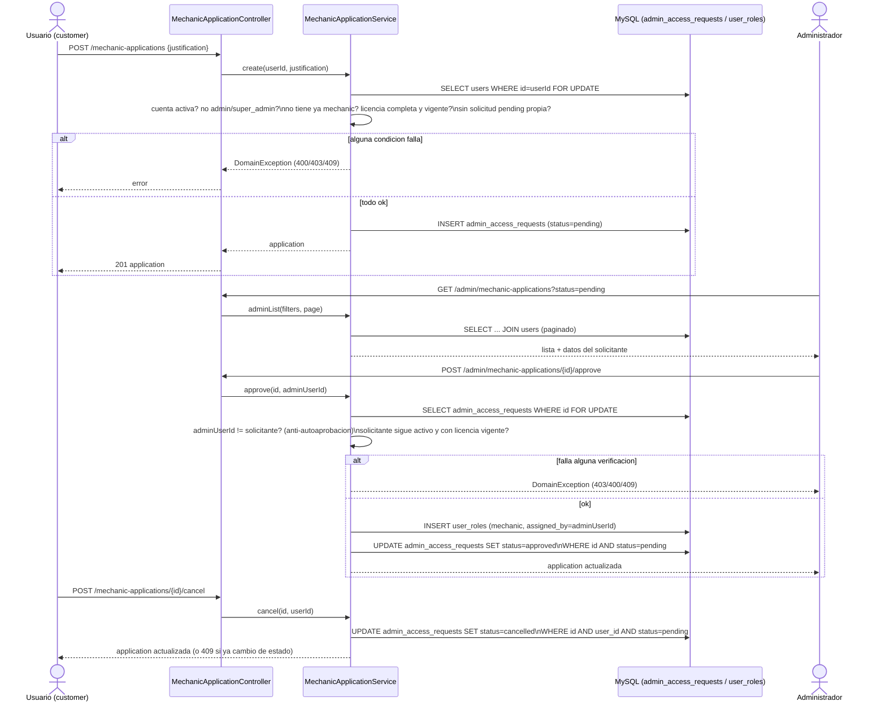

# UML 03 — Autenticación (AS-BUILT)

**Propósito:** representar el flujo real de registro, login, sesión, RBAC y recuperación de contraseña.

**Explicación breve:** no se usa JWT — todo es sesión de servidor + cookie httpOnly, respaldada por la tabla `sessions`. `password_reset_tokens` almacena solo el hash SHA-256 del token, nunca el valor en claro. Un reseteo exitoso destruye todas las sesiones activas del usuario. **El registro público ya solo crea el rol `customer`** — no existe ningún campo de rol en el formulario ni en `AuthService::register()`; el rol `mechanic` ya no se autodeclara (ver diagrama de solicitud de mecánico, abajo).

**Fuente:** `app/Infrastructure/Auth/Services/{AuthService,SessionManager,PasswordResetService}.php`, `app/Middleware/{AuthMiddleware,RBACMiddleware}.php`, `app/Infrastructure/Mail/MailerService.php`, `app/Infrastructure/Http/RateLimiter.php`, migraciones `2024_01_01_000001`, `2024_01_01_000002`, `2026_07_25_000017`.

---

## Solicitud de rol de mecánico (Mechanic Application)

**Propósito:** representar cómo se obtiene realmente el rol `mechanic` desde que se eliminó la autodeclaración — solicitud del usuario, revisión de un administrador, o cancelación por el propio solicitante.

**Explicación breve:** reutiliza `admin_access_requests` (existente desde la migración inicial) sin ninguna migración nueva. `user_id`, `assigned_by`, `reviewed_by`, `approved_by` siempre salen de la sesión autenticada, nunca del body. `create()` bloquea la fila del propio usuario; `approve()`/`reject()` bloquean la fila de la solicitud — mismo patrón `SELECT ... FOR UPDATE` + `UPDATE` condicionado al estado usado en el resto del codebase (`ServiceRequestService`, `PQRService`). Un `administrator`/`super_admin` no puede solicitar el rol (403), y un administrador no puede aprobar su propia solicitud (403, aunque en la práctica esto ya sería imposible por la regla anterior — se mantiene como segunda barrera).

**Fuente:** `app/Infrastructure/MechanicApplication/{MechanicApplicationService,MechanicApplicationValidator}.php`, `app/Controllers/MechanicApplicationController.php`, `config/routes.php`, `tests/Integration/MechanicApplicationFlowTest.php`.
