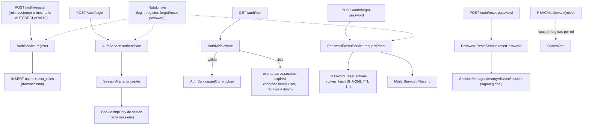

# UML 03 — Autenticación (AS-BUILT)

**Propósito:** representar el flujo real de registro, login, sesión, RBAC y recuperación de contraseña.

**Explicación breve:** no se usa JWT — todo es sesión de servidor + cookie httpOnly, respaldada por la tabla `sessions`. `password_reset_tokens` almacena solo el hash SHA-256 del token, nunca el valor en claro. Un reseteo exitoso destruye todas las sesiones activas del usuario. El rol (`customer`/`mechanic`) se elige libremente en el propio formulario de registro — no hay paso de aprobación administrativa (ver `AS_DESIGNED_VS_AS_BUILT.md`, fila "Admin Access").

**Fuente:** `app/Infrastructure/Auth/Services/{AuthService,SessionManager,PasswordResetService}.php`, `app/Middleware/{AuthMiddleware,RBACMiddleware}.php`, `app/Infrastructure/Mail/MailerService.php`, `app/Infrastructure/Http/RateLimiter.php`, migraciones `2024_01_01_000001`, `2024_01_01_000002`, `2026_07_25_000017`.
