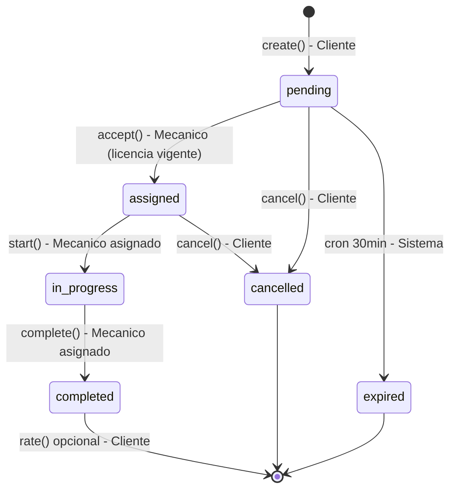

# UML 04 — Ciclo de vida de Service Request (AS-BUILT)

**Propósito:** representar los estados reales de `service_requests` y quién ejecuta cada transición, tal como está implementado — no el ciclo de vida de 9 estados del ERD histórico.

Estados reales (`ServiceRequestValidator::VALID_STATUSES`): `pending`, `assigned`, `in_progress`, `completed`, `cancelled`, `expired`.

| Transición | Método | Actor | Condición |
|---|---|---|---|
| → `pending` | `create()` | Cliente | Vehículo propio y `active`; sin otra solicitud activa del mismo cliente/vehículo |
| `pending` → `assigned` | `accept()` | Mecánico | Licencia de conducción vigente; UPDATE atómico (409 si ya la tomó otro) |
| `pending`/`assigned` → `cancelled` | `cancel()` | Cliente (dueño) | UPDATE atómico condicionado al estado actual |
| `pending` → `expired` | cron `expire_pending_requests.php` | Sistema | Sin respuesta en 30 min |
| `assigned` → `in_progress` | `start()` | Mecánico asignado | UPDATE atómico condicionado |
| `in_progress` → `completed` | `complete()` | Mecánico asignado | `final_cost >= 0` |
| *(sin transición)* | `rate()` | Cliente (dueño) | Solo si `completed` y sin calificación previa |

**Explicación breve:** no existen los estados `rejected`, `arrived` ni `mechanic_en_route` (presentes en el ERD histórico `docs/architecture/services-module-erd.md`) — fueron simplificados. No hay actor "Administrador" con capacidad de transicionar el ciclo de vida.

**Fuente:** `app/Infrastructure/ServiceRequest/ServiceRequestService.php`, `ServiceRequestValidator.php`, `scripts/maintenance/expire_pending_requests.php`.
