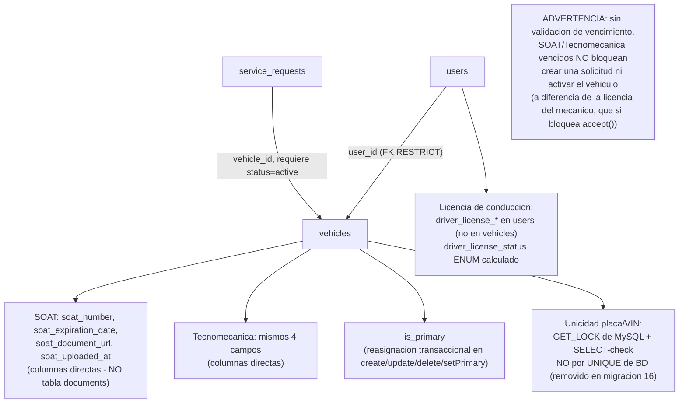

# UML 05 — Vehículos (AS-BUILT)

**Propósito:** representar la relación usuario-vehículo y los campos documentales reales, diferenciando explícitamente de la arquitectura documental histórica (`documents` polimórfico).

**Explicación breve:** el diseño histórico (`DOMAIN_MODEL_FINAL.md`) proponía una tabla `documents` polimórfica con workflow de verificación (`document_verifications`, estados pending/verified/rejected). La implementación real usa campos planos sin revisión administrativa — el dato se guarda tal como el usuario lo ingresa. La licencia de conducción vive en `users`, no en `vehicles` (es un atributo del mecánico, no del vehículo).

**Fuente:** `app/Infrastructure/Vehicle/{VehicleService,VehicleValidator}.php`, migraciones `2024_01_01_000003`, `2026_01_01_000005/000006`, `2026_07_10_000013/000015`, `2026_07_16_000016`.
