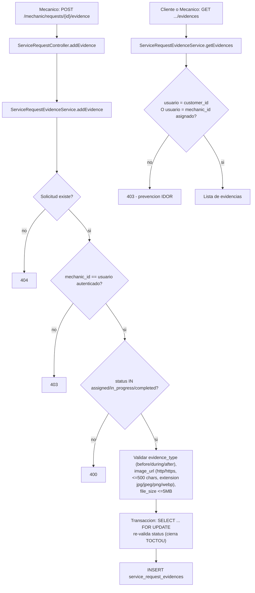

# UML 06 — Evidencias (AS-BUILT)

**Propósito:** representar el flujo real de subida y consulta de evidencia fotográfica de un servicio.

**Explicación breve:** `evidence_type` es un ENUM real a nivel de base de datos (`before`, `during`, `after`). La re-validación del estado dentro de una transacción con `SELECT ... FOR UPDATE` justo antes del `INSERT` cierra una condición de carrera (TOCTOU) donde la solicitud podría cancelarse entre la validación inicial y la escritura.

**Fuente:** `app/Infrastructure/ServiceRequest/ServiceRequestEvidenceService.php`, migraciones `2026_01_01_000008`, `2026_07_10_000014`.
