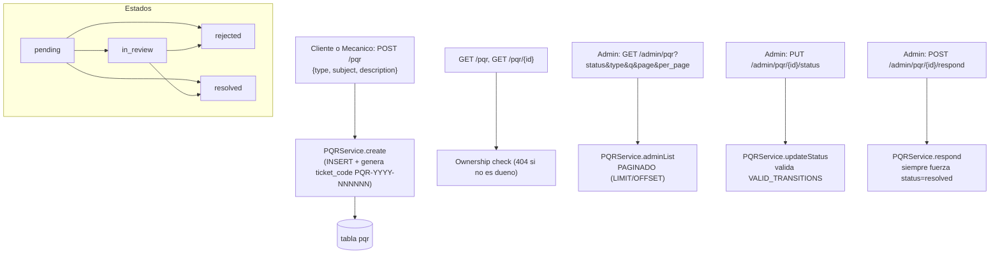

# UML 07 — PQR (AS-BUILT)

**Propósito:** reconstruir la arquitectura real del módulo PQR — no existe ningún documento de diseño previo para este módulo; este diagrama se generó 100% desde el código.

**Explicación breve:** `type` es ENUM real (`peticion`, `queja`, `reclamo`, `sugerencia`). `respond()` es una acción independiente de `updateStatus()`: siempre fija `resolved` directamente (guardado solo por "aún no respondido"), sin pasar por la matriz `VALID_TRANSITIONS`. El listado admin está paginado (LIMIT/OFFSET) y soporta filtro por `status`, `type` y búsqueda de texto (`q`).

**Fuente:** `app/Infrastructure/PQR/{PQRService,PQRValidator}.php`, `app/Controllers/PQRController.php`, migración `2026_07_10_000009`.
