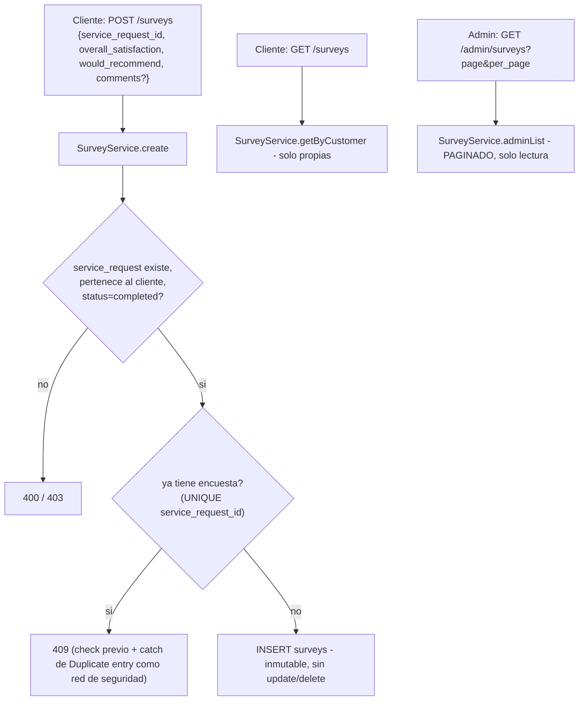

# UML 08 — Encuestas (AS-BUILT)

**Propósito:** reconstruir la arquitectura real del módulo de encuestas de satisfacción — sin documento de diseño previo.

**Explicación breve:** relación 1:1 estricta con `service_requests` (constraint UNIQUE real en `surveys.service_request_id`) — una solicitud completada admite como máximo una encuesta. No existen métodos de actualización/borrado: una encuesta creada es inmutable.

**Fuente:** `app/Infrastructure/Survey/{SurveyService,SurveyValidator}.php`, `app/Controllers/SurveyController.php`, migración `2026_07_10_000010`.
