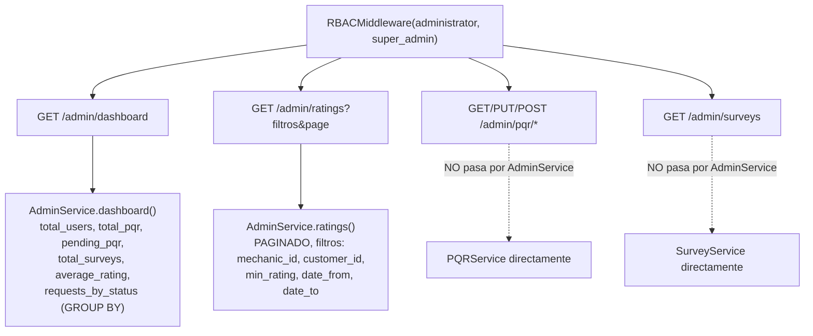

# UML 09 — Administración (AS-BUILT)

**Propósito:** representar el Admin Dashboard real — diferenciando explícitamente qué pasa por `AdminService` y qué no, frente al diseño histórico de un módulo RBAC de gestión de usuarios.

**Explicación breve:** `AdminService` expone únicamente `dashboard()` y `ratings()` — ambos de solo lectura/agregados. No hay gestión de usuarios ni roles en este módulo (a diferencia del diseño de `ADMIN_DOMAIN_ANALYSIS.md`, que proponía un módulo RBAC dedicado). Las rutas administrativas de PQR y Encuestas, aunque bajo el mismo prefijo `/admin/` y el mismo middleware RBAC, invocan directamente `PQRService`/`SurveyService`.

**Fuente:** `app/Infrastructure/Admin/AdminService.php`, `app/Controllers/AdminController.php`, `config/routes.php` (rutas `/api/admin/*`).
