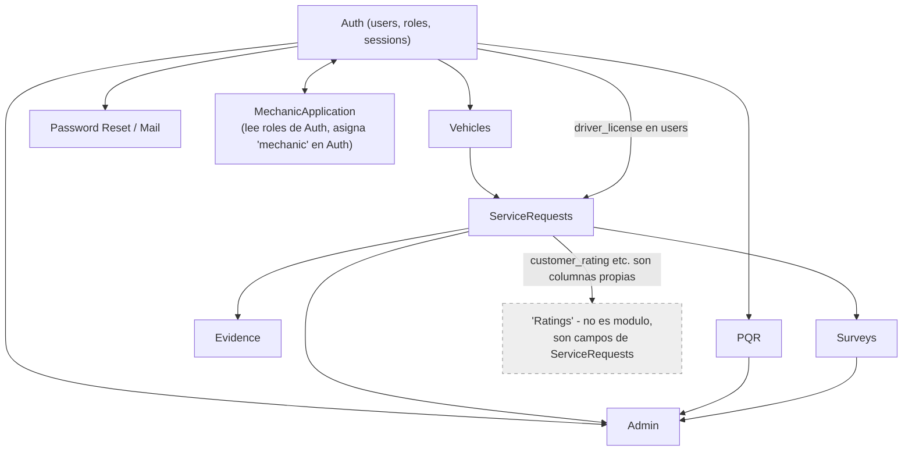

# UML 10 — Diagrama de dependencias (AS-BUILT)

**Propósito:** mapa de dependencias reales entre dominios, descubierto desde el código (no asumido por analogía de negocio).

**Explicación breve:** `PQR` **no depende** de `Vehicles` ni de `ServiceRequests` — es un módulo independiente que solo requiere un usuario autenticado con rol `customer` o `mechanic`, a diferencia de lo que sugeriría un orden "natural" de negocio. `Admin` depende de todos los demás dominios (los lee para agregarlos) pero ningún dominio depende de `Admin`. `Ratings` no es un nodo de dependencia real — está marcado en el diagrama como referencia porque son columnas de `ServiceRequests`, no un módulo separado. `MechanicApplication` es la única dependencia bidireccional real: lee los roles actuales del usuario desde `Auth` (`RoleValidator`) para decidir si puede solicitar, y al aprobar escribe de vuelta en `Auth` (`INSERT user_roles`) — es el único punto de todo el sistema donde se concede el rol `mechanic` fuera del registro original.

**Fuente:** cruce de `app/Infrastructure/*` (imports/usos de clases entre dominios) y `database/migrations/*` (FKs entre tablas).
